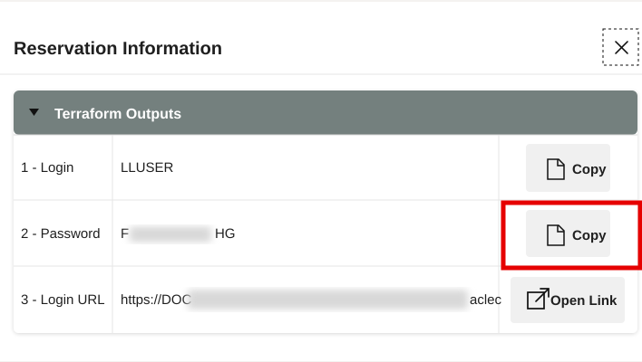
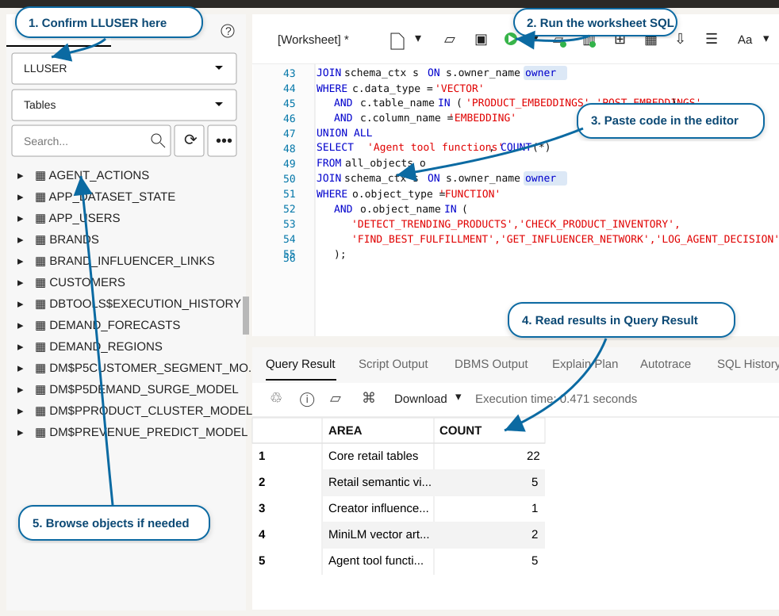

# Primeros pasos

## Introducción

Utilice este laboratorio para abrir la reserva de LiveLabs, acceder a la instancia provisionada de **Autonomous Database 26ai** y preparar SQL Worksheet para los ejercicios financieros prácticos. Piense en esto como preparar el escritorio, la credencial y el cuaderno antes de comenzar la investigación: cada consulta financiera se ejecuta como el usuario del taller contra el esquema financiero preparado.

<details>
<summary><strong>Términos clave: Database Actions, SQL Worksheet y LLUSER</strong></summary>

> - **Database Actions** es el espacio de trabajo de Oracle Database que utiliza en el navegador durante este taller. Le da acceso a herramientas como SQL Worksheet, exploración de objetos, carga de datos y utilidades de desarrollo sin instalar un cliente de base de datos de escritorio.
>
> - **SQL Worksheet** es la herramienta de Database Actions donde pega y ejecuta sentencias SQL. Muestra los resultados, la salida de scripts y los errores, por lo que es el lugar principal donde conecta las pantallas de la aplicación con la información de la base de datos.
>
> - `LLUSER` es el usuario y propietario del esquema de la base de datos del taller para los objetos financieros prácticos. Usar el usuario correcto es importante porque las tablas, vistas, modelos, objetos de grafos y funciones que consulta se crean en este esquema.

</details>

Tiempo estimado: **5 minutos**

### Objetivos

En este laboratorio podrá:

- Iniciar el entorno del taller de LiveLabs.
- Utilizar los datos de acceso de la reserva para abrir Database Actions.
- Confirmar que SQL Worksheet está listo para el esquema financiero.
- Confirmar que SQL Worksheet está conectado como el usuario del esquema del taller.

## Tarea 1: Iniciar el entorno de LiveLabs

Comience desde la reserva de LiveLabs para que Database Actions se abra con los recursos correctos del taller. El objetivo es entrar en el entorno que ya contiene la base de datos y los datos de acceso de este taller.

1. Inicie sesión en [LiveLabs](https://livelabs.oracle.com) con su cuenta de Oracle.

2. Abra este taller, seleccione **Start** y seleccione **Run on LiveLabs Sandbox**.

3. En **My Reservations**, seleccione **Launch Workshop** para esta reserva.

4. Seleccione **View Login Info** y mantenga disponibles las credenciales de la base de datos para la siguiente tarea.

    

    *Figura 1: El diálogo de información de la reserva muestra el usuario `LLUSER`, la contraseña y la URL de inicio de sesión de Database Actions.*

## Tarea 2: Abrir SQL Worksheet

Abra SQL Worksheet como el usuario del taller antes de ejecutar las consultas financieras. SQL Worksheet es el lugar donde hará cada pregunta a la base de datos y verá inmediatamente la información devuelta como una tabla.

1. En el diálogo **Reservation Information**, confirme que **1 - Login** muestra `LLUSER`.

2. Seleccione **Copy** para **2 - Password**.

    

    *Figura 2: Copie la contraseña de `LLUSER` en el diálogo de información de la reserva.*

3. Seleccione **Open Link** para **3 - Login URL**.

    

    *Figura 3: Utilice Open Link para abrir la URL de inicio de sesión y la contraseña copiada para iniciar sesión como `LLUSER`.*

4. En la página de inicio de sesión de Database Actions, confirme que **Username** muestra `LLUSER`, pegue la contraseña de la información de la reserva y seleccione **Sign in**.

    

    *Figura 4: Inicie sesión en Database Actions como `LLUSER` con la contraseña de la información de la reserva.*

5. Antes de que se abra SQL Worksheet, seleccione **Development** y después **SQL** en el menú de herramientas.

    

    *Figura 5: Abra SQL desde el menú de herramientas Development.*

6. Utilice el mismo patrón de SQL Worksheet durante todo el taller.

    

    *Figura 6: Utilice SQL Worksheet para confirmar el usuario activo, pegar cada bloque SQL del taller, ejecutar la sentencia y revisar la tabla de resultados.*

    - Confirme que el menú desplegable de usuario muestra el usuario principal del taller, normalmente `LLUSER`.
    - Pegue cada bloque SQL del taller en el editor.
    - Seleccione **Run Statement** o pulse **Ctrl+Enter** para ejecutar la sentencia SQL actual.
    - Revise la salida en **Query Result** o **Script Output**, según el paso.
    - Utilice **Navigator** solo cuando quiera inspeccionar tablas, vistas u otros objetos.

7. Ejecute esta comprobación.

    Esta comprobación confirma que SQL Worksheet está conectado como el usuario correcto antes de comenzar. `USER` muestra quién inició sesión, mientras que `SYS_CONTEXT('USERENV', 'CURRENT_SCHEMA')` muestra dónde se resuelven los nombres de las tablas. Los laboratorios financieros utilizan `LLUSER`, por lo que ambos valores deben apuntar al esquema del taller.

    ```sql
    <copy>
    SELECT USER AS "User",
           SYS_CONTEXT('USERENV', 'CURRENT_SCHEMA') AS "Schema",
           SYSTIMESTAMP AS "Checked At";
    </copy>
    ```

    **Salida esperada: sesión de SQL Worksheet conectada**

    | Usuario | Esquema | Comprobado en |
    | --- | --- | --- |
    | LLUSER | LLUSER | Marca de tiempo actual de SQL Worksheet |

8. Puede utilizar esta misma comprobación de conexión cuando quiera confirmar que SQL Worksheet sigue ejecutándose como `LLUSER`.

Ya puede continuar con los laboratorios financieros.

## Agradecimientos

* **Autor** - Pat Shepherd, Senior Principal Database Product Manager
* **Colaborador** - Linda Foinding, Principal Database Product Manager
* **Última actualización por/fecha** - Oracle Database Product Management, mayo de 2026
