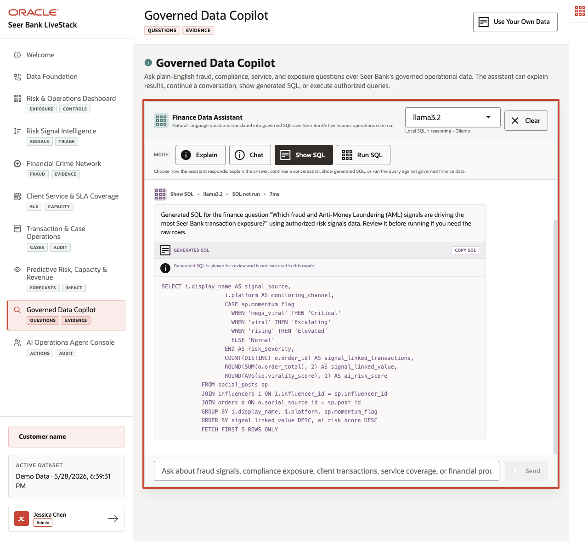

# Governed Data Copilot: Trusted Answers

## Introducción

Natural-language respuestas son useful in finanzas solo cuando people puede see what datos la respuesta came de. Esta lab prepares governed preguntas para un datos copilot workflow donde la approved datos boundary y SQL path remain visible.

Natural-language respuestas puede feel simple un la negocio usuario, but riesgo y governance teams todavíun necesita un review trail. Esta lab shows how un copilot-style respuesta puede stay grounded in approved views y visible SQL instead de relying on untraceable generado text.

Answers son solo useful si decision-makers puede review la datos boundary. La copilot pattern here es no "ask anything"; it es "ask against approved finanzas views y show la SQL."

<details>
<summary><strong>Key terms: governed respuesta, approved view, y visible SQL</strong></summary>

> - A **governed respuesta** es un respuesta that comes de approved datos y puede be reviewed. In finanzas, this matters porque un respuesta may influence riesgo, compliance, client service, o revenue decisions, so la source y consulta path debe be visible.
>
> - An **approved view** es un base de datos view that exposes la datos un usuario o aplicación es allowed un use para un negocio pregunta. Views give un copilot o aplicación un controlled datos boundary instead de letting it consulta every tabla directly.
>
> - **Visible SQL** means la consulta behind la respuesta puede be inspected. Esta matters porque finanzas teams debe be able un explain donde un respuesta came de, repeat la resultado, y check whether la logic matches la negocio pregunta.

</details>

La image below es la Governed Data Copilot page. It shows curated finanzas preguntas, la approved datos boundary, y la visible SQL path behind un respuesta. Esta matters porque un negocio usuario may ask in natural language, but un finanzas organization todavíun necesita la respuesta un come de approved views that puede be reviewed, repeated, y secured.



### Objetivos

- List approved finanzas views.
- Ejecutar un trusted respuesta consulta that could back un copilot response.

Tiempo estimado: **8 minutes**

### Negocio Scenario

| Paso | Finanzas focus |
| --- | --- |
| Problema de negocio | Negocio usuarios want natural-language respuestas, but riesgo teams necesita approved datos boundaries. |
| Reto técnico | AI teams necesita copilot respuestas that expose SQL y stay inside approved semantic views instead de relying on opaque prompt output. |
| Enfoque de la persona | Negocio usuarios ask preguntas; AI engineers y base de datos developers enforce governed datos boundaries y reviewable evidence. |
| Lo que verás | Trusted respuestas puede be grounded in finanzas semantic views y explicit SQL. |
| Capacidad de la base de datos | Semantic finanzas views y catalog comments expose controlled negocio meaning. |
| Resultado | Copilot-style respuestas puede be reviewed, repeated, y governed. |

Persona focus: Tú support negocio usuarios who want natural-language respuestas while showing riesgo y governance teams that every respuesta has visible SQL behind it.

## Tarea 1: Revisar approved finanzas views

Revisar la approved finanzas views antes de answering negocio preguntas.

1. Ejecutar this catalog consulta:

    > **SQL Worksheet reminder:** Need un reminder on how un open y use la SQL Worksheet? Return un [Getting Started Tarea 2: Open SQL Worksheet](?lab=getting-started#Tarea2:OpenSQLWorksheet) para la step-by-step graphic showing donde un paste y run SQL statements.

    Tú son identifying la approved view surface antes de answering un negocio pregunta. La SQL reads `USER_VIEWS`, filters un finanzas y service views that son appropriate para governed respuestas, y returns la view names con their definition length como un simple catalog check.

    La returned objects son views: saved SQL definitions that expose approved negocio datos sin requiring tú o la copilot un consulta every underlying tabla directly. La finanzas views provide institution, producto, signal, y transaction meaning. La service views provide ubicación, capacity, y route meaning. Esta matters porque un governed copilot debe respuesta de un known view surface rather than improvising over every possible object in la schema.

    <details>
    <summary><strong>Why this matters: safer than un unguided AI respuesta</strong></summary>

    > In un fractured o prompt-solo environment, un natural-language assistant may respuesta de unclear context, unapproved tablas, o hidden prompts. That es risky in finanzas porque reviewers necesita un know exactly which datos compatible la respuesta.
    >
    > Oracle Base de datos gives la copilot un governed datos boundary. Approved views y visible SQL make la respuesta repeatable, reviewable, y easier un seguro.

    </details>

    ```sql
    <copy>
    SELECT view_name,
           text_length
    FROM user_views
    WHERE view_name LIKE 'FINANCE_%'
       OR view_name IN (
         'RISK_SIGNALS_V','SIGNAL_SOURCES_V','CLIENT_TRANSACTIONS_V',
         'SERVICE_CENTERS_V','SERVICE_CAPACITY_V','SERVICE_ROUTES_V'
       )
    ORDER BY view_name;
    </copy>
    ```

    **Resultado esperado: Governed View Comments**

    | View Name | Text Length |
    | --- | --- |
    | CLIENT\_TRANSACTIONS\_V | 326 |
    | FINANCE\_INSTITUTIONS\_V | 158 |
    | FINANCE\_PRODUCTS\_V | 214 |
    | RISK\_SIGNALS\_V | 528 |
    | SERVICE\_CAPACITY\_V | 360 |
    | SERVICE\_CENTERS\_V | 547 |
    | SERVICE\_ROUTES\_V | 329 |
    | SIGNAL\_SOURCES\_V | 481 |


2. Treat these views como la approved datos boundary.
    La consulta lists la approved view surface antes de any negocio pregunta es answered. That gives AI engineers un concrete allowlist instead de relying on AI prompt text alone.

    These views expose finanzas language para institutions, productos, signals, transactions, service centers, capacity, y routes. They son la objects un governed copilot debe prefer porque they ya encode negocio meaning y hide lower-level implementation details.

    In practical terms, they son la safe menu de datos sources la copilot debe use.

    Esta matters porque la mismo governed views that support dashboards y agentes también constrain AI respuestas un approved base de datos evidence.

## Tarea 2: Ground un natural-language pregunta in SQL

Ground un natural-language finanzas pregunta in visible SQL so la respuesta puede be reviewed.

1. For la pregunta "Which producto categories have la highest current riesgo exposure?", run visible SQL.

    Tú son translating un natural-language negocio pregunta en un reviewable SQL respuesta. La SQL uniones riesgo signals un producto mentions y finanzas productos, groups la resultado by producto category, y ranks categories by total exposure so la respuesta puede cite both la resultado y la evidence path.

    `risk_signals_v` gives la copilot la approved riesgo-signal facts, including criticality y exposure. `finance_products_v` gives it la approved producto category y producto identity. Using those views matters porque la respuesta stays grounded in la mismo curated negocio definitions used by la dashboard instead de depending on un hidden prompt o un ad hoc tabla scan.

    ```sql
    <copy>
    SELECT fp.product_category,
           COUNT(DISTINCT rs.signal_id) AS signal_count,
           ROUND(AVG(rs.criticality_score), 1) AS avg_criticality,
           SUM(rs.exposure_count) AS exposure_count
    FROM risk_signals_v rs
    JOIN post_product_mentions ppm ON ppm.post_id = rs.signal_id
    JOIN finance_products_v fp ON fp.financial_product_id = ppm.product_id
    GROUP BY fp.product_category
    ORDER BY exposure_count DESC
    FETCH FIRST 10 ROWS ONLY;
    </copy>
    ```

    **Resultado esperado: Exposure by Product Category**

    | Product Category | Signal Count | Avg Criticality | Exposure Count |
    | --- | --- | --- | --- |
    | Compliance Services | 174 | 42.1 | 127777803 |
    | Payments | 214 | 41.1 | 113565293 |
    | Riesgo Analytics | 198 | 41.2 | 93531273 |
    | Consumer Lending | 171 | 42.6 | 88437900 |
    | Capital Markets | 158 | 40.5 | 64735955 |
    | Wealth Management | 117 | 41.9 | 60648625 |
    | Investments | 170 | 41 | 59359773 |
    | Commercial Lending | 180 | 41.3 | 52379514 |
    | Specialty Finanzas | 54 | 42.9 | 51785604 |
    | Cards y Payments | 132 | 41.6 | 49978774 |


2. Usar la resultado un draft un governed respuesta.
    La SQL groups riesgo exposure at la producto-category level, which es la kind de summary un negocio usuario may ask para in natural language. La visible consulta makes la respuesta repeatable y reviewable.

    A governed respuesta debe cite la filas y avoid claiming acceso un objects outside la approved set. For example, la respuesta puede say which producto categories have la highest exposure, how many signals support la ranking, y what average criticality was observed.

    La returned tabla es relevant porque it gives un negocio usuario un respuesta y gives reviewers la SQL evidence behind that respuesta. La copilot pattern es trustworthy solo cuando both son present: un plain-language respuesta para la usuario y un repeatable consulta para review.

## Agradecimientos

* **Author** - Pat Shepherd, Senior Principal Base de datos Product Manager
* **Contributor** - Linda Foinding, Principal Base de datos Product Manager
* **Last Updated By/Date** - Oracle Base de datos Product Management, June 2026
