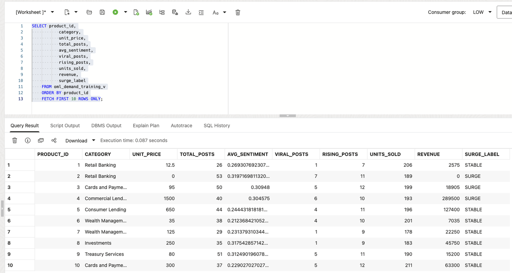
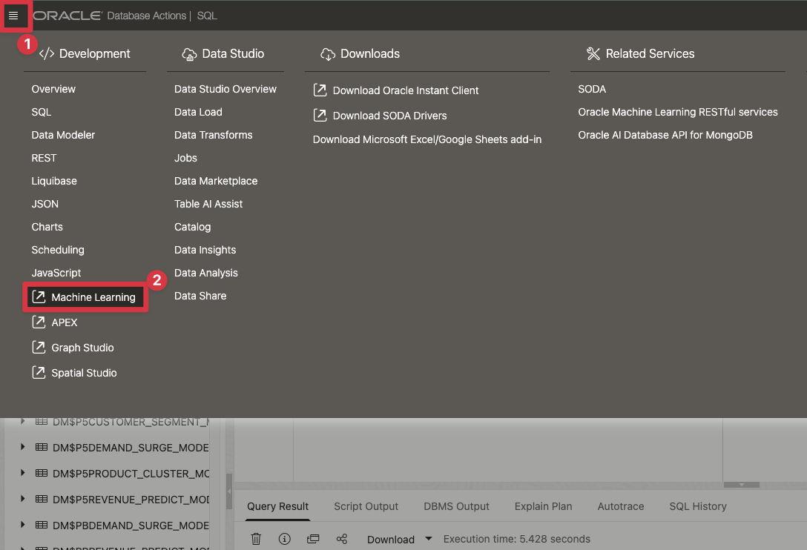
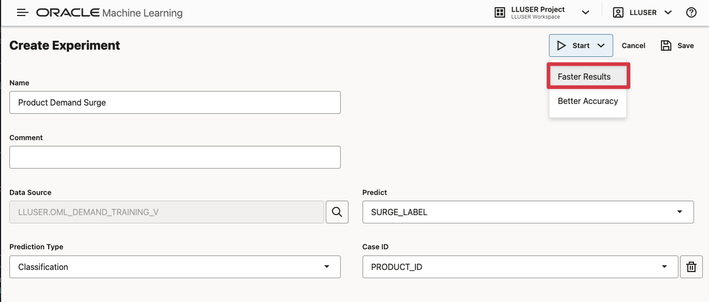
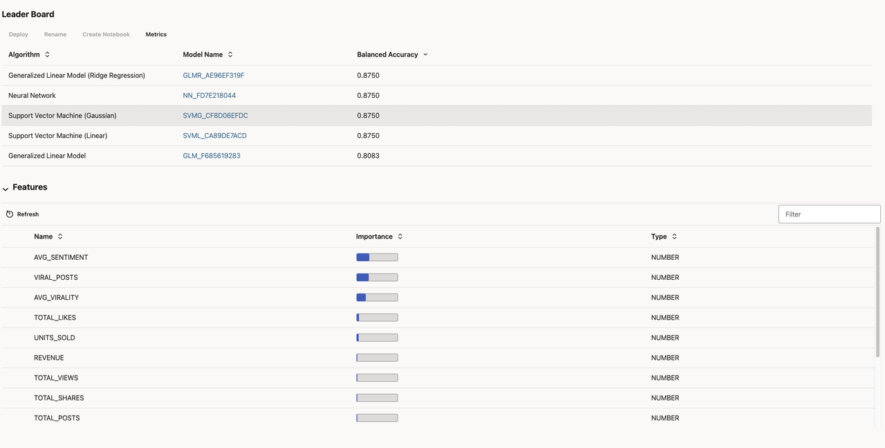
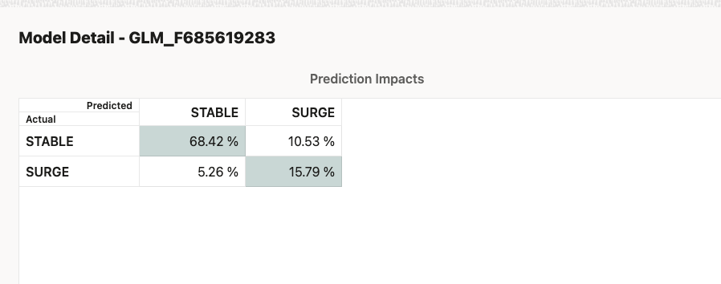
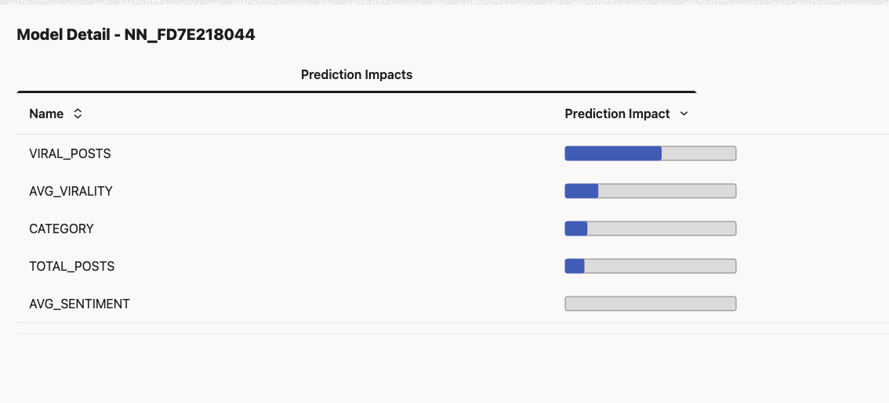
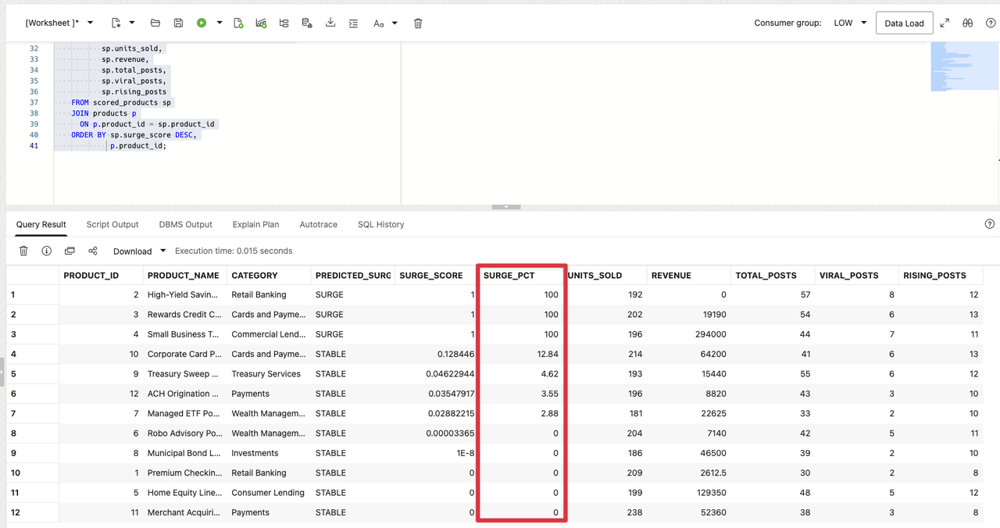

# Crear un Product Demand Watchlist con Oracle Machine Learning

## Introducción

Otto Spencer es Seer Bank's datos scientist. His equipo supplies la predictions used in analytics charts y dashboards.

La producto equipo wants un demand watchlist. A negocio usuario debe be able un see which productos may necesita more attention, why la modelo flagged them, y which productos son ya showing strong sales o cliente activity.

Otto has la producto, sales, y social activity datos in Oracle AI Base de datos. He could copy la datos un un separate machine learning platform, train un modelo there, y copy la scores back. That would create another copy de finanzas datos y another process para keeping scores current.

Instead, Otto builds y scores la modelo in la base de datos. La modelo uses producto activity un classify productos como `SURGE` o `STABLE`. SQL then uniones la prediction un la producto name, sales, y engagement valores that un dashboard necesita.

En este laboratorio, tú build Otto's demand-surge modelo y turn its output en un review list para un negocio usuario.

<details>
<summary><strong>Key terms: modelo, feature, classification, probability, y in-base de datos machine learning</strong></summary>

> - A **modelo** es un set de learned rules that turns input datos en un prediction.
>
> - A **feature** es un input valor used by la modelo. En este laboratorio, features include producto category, price, social activity, y sales.
>
> - **Classification** predicts un label. Otto's modelo predicts either `SURGE` o `STABLE`.
>
> - A **probability** es la modelo's valor para un class. En este laboratorio, la valor es displayed como un `SURGE_SCORE` un rank productos para review. It es no un guarantee.
>
> - **In-base de datos machine learning** means la modelo es trained o scored donde la source datos ya lives. La SQL resultado puede include la prediction y la datos used un explain it.

</details>


### Objetivos

- Leer la prepared training datos y identify la modelo target.
- Optionally use AutoML un compare classification modelos y inspect their predictions.
- Crear la selected Generalized Linear Model inside Oracle AI Base de datos.
- Score productos con `PREDICTION` y `PREDICTION_PROBABILITY`.
- Combine modelo output con producto, sales, y engagement datos para un dashboard resultado.

Tiempo estimado: **10 minutes**

### Escenario práctico

| Paso                | Finanzas focus                                                                                                        |
| ---------------------| ----------------------------------------------------------------------------------------------------------------------|
| Problema de negocio    | A negocio usuario necesita un short list de productos that may require attention.                                           |
| Reto técnico | Otto necesita un train y score un modelo sin copying producto activity un another machine learning system.           |
| Enfoque de la persona       | Tú follow Otto como he builds la modelo y checks la resultado antes de it reaches un dashboard.                          |
| Lo que verás   | Optionally compare modelos con AutoML, then use SQL Developer Web un create y score la selected modelo.             |
| Capacidad de la base de datos | AutoML, `DBMS_DATA_MINING`, `PREDICTION`, y `PREDICTION_PROBABILITY` support machine learning inside la base de datos. |
| Resultado             | A watchlist para un dashboard combines la modelo resultado con la producto y activity datos behind it.                  |

> **SQL Worksheet reminder:** Need un reminder on how un open y use la SQL Worksheet? Return un [Getting Started Tarea 2: Open SQL Worksheet](?lab=getting-started#Tarea2:OpenSQLWorksheet) para la step-by-step graphic showing donde un paste y run SQL statements.

## Tarea 1: Leer la training datos

Before Otto creates un modelo, he checks la datos that va un teach it. La workshop ya provides `OML_DEMAND_TRAINING_V`, un view that combines producto, social activity, y sales datos en one fila per active producto.

La view también contains `SURGE_LABEL`. Esta es la known label used during training. La demo datos assigns each producto `SURGE` o `STABLE` de its activity valores so la SQL pattern puede be tested sin waiting para new negocio outcomes.

1. Ejecutar la training-datos consulta:

    ```sql
    <copy>
    SELECT product_id,
           category,
           unit_price,
           total_posts,
           avg_sentiment,
           viral_posts,
           rising_posts,
           units_sold,
           revenue,
           surge_label
    FROM oml_demand_training_v
    ORDER BY product_id
    FETCH FIRST 10 ROWS ONLY;
    </copy>
    ```

2. Identify la parts de each fila.

    La numeric y category columnas son la modelo inputs. `SURGE_LABEL` es la respuesta la modelo learns un predict. `PRODUCT_ID` identifies la producto but es no un negocio feature para this example.

    

    Otto es checking that la training datos ya brings together la valores he necesita. He does no have un export social activity, sales, y producto datos en separate files antes de training.

## Tarea 2: Comparar modelos con AutoML (optional)

Otto first uses la Oracle Machine Learning AutoML interface un compare candidate modelos. AutoML puede select algorithms, tune them, y show how well each modelo identifies la two labels.

Esta shows how un datos scientist chooses un modelo: la leaderboard es un starting point, but Otto también checks whether la modelo identifies la negocio outcome he cares about.

Esta task es optional. AutoML puede take several minutes un complete, so tú puede continue con Tarea 3 si tú want un focus on creating y using la modelo in SQL Developer Web.

1. Open **Machine Learning** de Base de datos Actions.

  Open **Base de datos Actions**, select **Machine Learning**. Usar la username y password tú puede find on la **View Login Info screen**.
    
  
    
2. Click **AutoML**.

   

3. Crear un new experiment con these settings:
  
  | Setting         | Value                   |
  | -----------------| -------------------------|
  | Experiment name | `Product Demand Surge`  |
  | Data source     | `OML_DEMAND_TRAINING_V` |
  | Predict         | `SURGE_LABEL`           |
  | Prediction type | `Classification`        |
  | Case ID         | `PRODUCT_ID`            |
  
  Start la experiment y wait para la modelo leaderboard (this puede take between 5-10 minutes).

  

4. Revisar la leaderboard y modelo details.

  
  
  La leaderboard may show several modelos con un higher balanced-accuracy valor than la Generalized Linear Model. Otto does no choose de that number alone. Open la different modelo details y inspect la confusion matrix.

  In la workshop resultados, la Neural Network scores every producto como `STABLE`. It never predicts `SURGE`, so it cannot build la watchlist Otto necesita. Si every fila receives la mismo label, la modelo cannot help Otto prioritize productos para review.
  
  La Generalized Linear Model es la useful choice porque its confusion matrix contains both `STABLE` y `SURGE` predictions. It identifies most de la actual surge cases while accepting some false positives para negocio review.

  Here es un example de la confusion matrix para la Generalized Linear Model:

  

  La modelo details también show prediction impact. `VIRAL_POSTS`, `AVG_VIRALITY`, `CATEGORY`, y `TOTAL_POSTS` have la strongest impact para la selected modelo. These valores give Otto un starting point para explaining la resultado un la producto equipo. They show which inputs influenced la prediction; they do no prove that one input causes demand.

  Here es un example:

  

  Esta es Otto's decision: **select la Generalized Linear Model porque it puede identify la negocio outcome that matters**. A modelo that predicts every producto como `STABLE` es no useful.

## Tarea 3: Crear la selected modelo in SQL Developer Web

AutoML helped Otto compare modelos. He now moves un SQL Developer Web un create un named modelo that un SQL consulta puede call repeatedly. La modelo es stored in Oracle AI Base de datos under la name `OTTO_DEMAND_SURGE_MODEL`.

La settings tabla tells Oracle un use la **Generalized Linear Model** that Otto selected in AutoML. `PREP_AUTO` lets la base de datos handle standard preparation de la input columnas.

Si tú skipped la optional AutoML task, use this setting como la modelo selected para la workshop.

1. Crear la settings tabla y train la modelo:

    ```sql
    <copy>
    
    DROP TABLE IF EXISTS otto_demand_settings;
    
    CREATE TABLE otto_demand_settings (
          setting_name  VARCHAR2(30),
          setting_value VARCHAR2(4000)
        );

    INSERT INTO otto_demand_settings (setting_name, setting_value)
    VALUES ('ALGO_NAME', 'ALGO_GENERALIZED_LINEAR_MODEL');

    INSERT INTO otto_demand_settings (setting_name, setting_value)
    VALUES ('PREP_AUTO', 'ON');

    INSERT INTO otto_demand_settings (setting_name, setting_value)
    VALUES ('ODMS_RANDOM_SEED', '20260604');

    COMMIT;

    DECLARE
      l_model_count NUMBER;
    BEGIN
      SELECT COUNT(*)
      INTO l_model_count
      FROM user_mining_models
      WHERE model_name = 'OTTO_DEMAND_SURGE_MODEL';

      IF l_model_count > 0 THEN
        DBMS_DATA_MINING.DROP_MODEL('OTTO_DEMAND_SURGE_MODEL');
      END IF;
    END;
    /

    BEGIN
      DBMS_DATA_MINING.CREATE_MODEL(
        model_name           => 'OTTO_DEMAND_SURGE_MODEL',
        mining_function      => DBMS_DATA_MINING.CLASSIFICATION,
        data_table_name      => 'OML_DEMAND_TRAINING_V',
        case_id_column_name  => 'PRODUCT_ID',
        target_column_name   => 'SURGE_LABEL',
        settings_table_name  => 'OTTO_DEMAND_SETTINGS'
      );
    END;
    /
    </copy>
    ```

    La modelo reads la training view, learns la relationship between la features y `SURGE_LABEL`, y stores la trained modelo in la base de datos. No producto o social datos leaves Oracle Base de datos during training.

2. Confirmar that Oracle created la modelo:

    ```sql
    <copy>
    SELECT model_name,
           mining_function,
           algorithm
    FROM user_mining_models
    WHERE model_name = 'OTTO_DEMAND_SURGE_MODEL';
    </copy>
    ```

    La resultado debe show `CLASSIFICATION` y `GENERALIZED_LINEAR_MODEL`. Otto now has un base de datos modelo that SQL puede call.

## Tarea 4: Score new producto activity in SQL

Otto now receives un new activity snapshot para la next reporting period. He stores it in un separate scoring tabla. La modelo was trained con historical filas de `OML_DEMAND_TRAINING_V`; it va un now score filas it did no see during training.

1. Crear la scoring tabla y add la new activity snapshot:

    ```sql
    <copy>
    
    DROP TABLE IF EXISTS otto_demand_scoring_data;

    CREATE TABLE otto_demand_scoring_data (
      product_id    NUMBER,
      category      VARCHAR2(100),
      unit_price    NUMBER,
      total_posts   NUMBER,
      avg_sentiment NUMBER,
      total_likes   NUMBER,
      total_shares  NUMBER,
      total_views   NUMBER,
      avg_virality  NUMBER,
      viral_posts   NUMBER,
      rising_posts  NUMBER,
      units_sold    NUMBER,
      revenue       NUMBER
    );

    INSERT INTO otto_demand_scoring_data (
      product_id,
      category,
      unit_price,
      total_posts,
      avg_sentiment,
      total_likes,
      total_shares,
      total_views,
      avg_virality,
      viral_posts,
      rising_posts,
      units_sold,
      revenue
    )
    SELECT product_id,
           category,
           unit_price,
           total_posts + 4,
           avg_sentiment,
           total_likes + 25,
           total_shares + 10,
           total_views + 500,
           avg_virality + 0.05,
           viral_posts + 1,
           rising_posts + 1,
           units_sold + 3,
           revenue + (unit_price * 3)
    FROM (
      SELECT product_id,
             category,
             unit_price,
             total_posts,
             avg_sentiment,
             total_likes,
             total_shares,
             total_views,
             avg_virality,
             viral_posts,
             rising_posts,
             units_sold,
             revenue,
             ROW_NUMBER() OVER (ORDER BY product_id) AS row_num
      FROM oml_demand_training_v
    )
    WHERE row_num <= 12;

    COMMIT;
    </copy>
    ```

    Esta creates un small next-period snapshot de la workshop datos. 
    >Nota: La tabla has la modelo inputs, but it does no contain `SURGE_LABEL`. That label belongs un la historical training datos y debe no be passed un la modelo como un input.

2. Ejecutar la scoring consulta:

    ```sql
    <copy>
    WITH scored_products AS (
      SELECT product_id,
             category,
             units_sold,
             revenue,
             total_posts,
             viral_posts,
             rising_posts,
             PREDICTION(
               OTTO_DEMAND_SURGE_MODEL USING
               category, unit_price, total_posts, avg_sentiment,
               total_likes, total_shares, total_views, avg_virality,
               viral_posts, rising_posts, units_sold, revenue
             ) AS predicted_surge,
             ROUND(
               PREDICTION_PROBABILITY(
                 OTTO_DEMAND_SURGE_MODEL,
                 'SURGE' USING
                 category, unit_price, total_posts, avg_sentiment,
                 total_likes, total_shares, total_views, avg_virality,
                 viral_posts, rising_posts, units_sold, revenue
               ), 8
             ) AS surge_score
      FROM otto_demand_scoring_data
    )
    SELECT p.product_id,
           p.product_name,
           sp.category,
           sp.predicted_surge,
           sp.surge_score,
           ROUND(sp.surge_score * 100, 2) AS surge_pct,
           sp.units_sold,
           sp.revenue,
           sp.total_posts,
           sp.viral_posts,
           sp.rising_posts
    FROM scored_products sp
    JOIN products p
      ON p.product_id = sp.product_id
    ORDER BY sp.surge_score DESC,
             p.product_id;
    </copy>
    ```

3. Leer la resultado como un dashboard usuario.

  `PREDICTED_SURGE` tells la dashboard which label la modelo selected. `SURGE_SCORE` es la modelo valor between 0 y 1, while `SURGE_PCT` presents la mismo valor como un percentage para un dashboard usuario. La sales y activity columnas give la negocio usuario something un review alongside la prediction.

  Esta es la valor de in-base de datos machine learning. Otto puede return un prediction, la producto name, sales, y social activity in one SQL resultado. There es no necesita un move datos un un external machine learning platform.

  

## Conclusión: Poner la Prediction Beside la Negocio Data

Otto used AutoML un compare modelos, selected la Generalized Linear Model porque it identifies both classes, recreated it in SQL Developer Web, y scored un new activity snapshot. La consulta returns un watchlist that un dashboard puede show alongside la producto activity behind each score.

Esta es la negocio benefit de OML in la base de datos. La modelo, la training datos, la prediction, y la producto details stay together. Otto does no have un copy sensitive finanzas datos un un separate machine learning platform, y la dashboard does no have un combine scores de one system con negocio datos de another.

Oracle AI Base de datos makes la modelo part de la dashboard consulta. A negocio usuario puede read la watchlist, inspect la supporting valores, y repeat la consulta using la mismo acceso controles that protect la source datos.

## Agradecimientos

* **Author** - Kevin Lazarz
* **Contributor** - Eugenio Galiano
* **Last Updated By/Date** - Oracle Base de datos Product Management, August 2026
