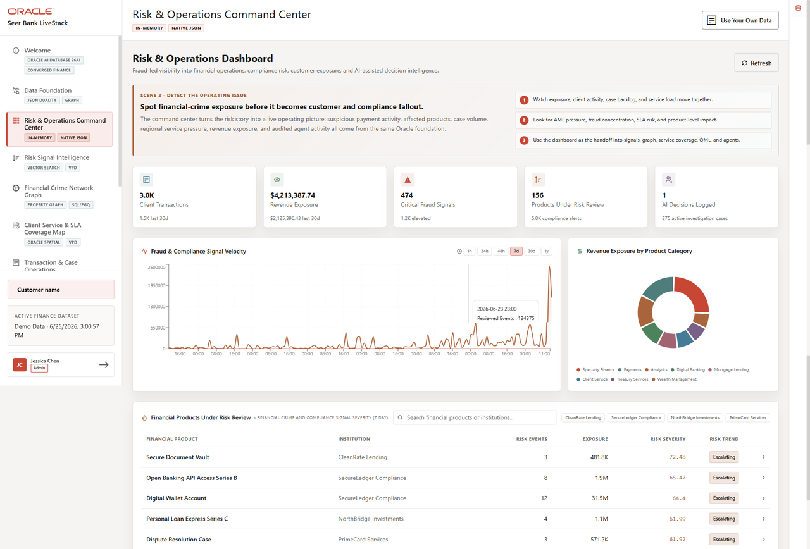

# Build a Converged Dashboard Query

## Introduction

Jessica Chan is the database administrator responsible for keeping Seer Bank's finance data reliable and useful. Every morning, the risk operations team asks her a familiar question: **which product needs attention first, and can the bank respond if the risk becomes operational work?**

Jessica can see the answer taking shape in the Risk and Operations Dashboard, but the supporting data is spread across different forms. Risk warnings and product exposure are relational rows. Transaction activity is available as JSON transaction documents. The AI engineering team has also prepared vector representations of product descriptions for another use case. Location information for service centers and demand regions is stored as GeoJSON. The data is connected by business meaning, but that does not automatically make the investigation easy to query.

In the past, Jessica might have had to maintain reporting extracts, coordinate a search index, ask an application team for transaction data, and reconcile a separate map or service-capacity system. That creates more copies of sensitive finance data, more security boundaries, and more opportunities for the dashboard answer and the operational detail to disagree. Her challenge is not simply finding another database feature. It is giving the risk team one answer they can trace back to the same governed data.

Jessica sees an opportunity in Oracle AI Database's converged architecture. A converged database lets one governed database support different data models and workloads together. Relational tables and views remain the foundation, while JSON documents, vectors, spatial geometry, graphs, machine-learning, and graph results can be queried alongside them. This means Jessica can answer a question that crosses those data types without complex and expensive integration across separate systems.

In this lab, you take Jessica's role as the DBA. You will write the converged SQL query behind the Risk and Operations Dashboard. It combines relational risk data, vector search, JSON transaction data, and spatial service data in one Oracle AI Database, without separate systems or data copies.

The image below shows the Risk and Operations Dashboard: a business-facing product built on the converged database. It gives business users one place to find risk, exposure, transaction, and service insights. In this lab, you will write the SQL behind that experience.



### Objectives

- Explain what Oracle AI Database convergence means in a finance decision workflow.
- Run one query that combines relational, vector, JSON, and spatial database capabilities.
- Modify the query to investigate a different risk question and explain the change in results.

Estimated Time: **10 minutes**

### Hands-on Scenario

| Step                | Finance focus                                                                                                  |
| ---------------------| ----------------------------------------------------------------------------------------------------------------|
| Business Problem    | Business users need a quick way to find product risk, exposure, transaction activity, and service information. |
| Technical Challenge | The answer crosses risk records, product meaning, transactions, and service geography.                         |
| Persona Focus       | Jessica Chan, the DBA, builds the query that gives business users this dashboard view.                         |
| What You Will Do    | Use a single SQL statement that combines several data types.                                                   |
| Database Capability | Relational SQL, AI Vector Search, JSON Relational Duality, and Oracle Spatial work together.                   |
| Outcome             | The learner can explain convergence through a useful business result rather than a feature list.               |

Persona focus: You are Jessica Chan, the DBA. Your job is to build one governed query that gives business users a connected view of product risk and operations.

> **SQL Worksheet reminder:** Need a reminder on how to open and use the SQL Worksheet? Return to [Getting Started Task 2: Open SQL Worksheet](?lab=getting-started#Task2:OpenSQLWorksheet) for the step-by-step guide showing how to run SQL statements.

## Task 1: Run a converged risk investigation

The dashboard is a starting point, not the whole decision. Run the query below to produce a compact investigation view for high-criticality products.

The query intentionally crosses four data models:

1. **Relational:** `RISK_SIGNALS_V`, product mentions, and finance views calculate product risk and exposure.
2. **Vector:** `PRODUCT_EMBEDDINGS` and `VECTOR_DISTANCE` find products related by meaning to the investigation phrase.
3. **JSON:** `ORDERS_DV` is read as a document, and `JSON_TABLE` projects its nested line items into rows so transaction activity can be counted.
4. **Spatial:** `SDO_GEOM.SDO_DISTANCE` finds the closest service center to the high-demand New York Metro region using latitude and longitude information stored as GeoJSON.

    These are four operations in one investigation. Every row combines product risk with transaction activity, semantic relevance, and service-routing context.

1. Open SQL Worksheet as `LLUSER`. 

2. Run the query (note the comments that help to locate the specific use of different data types):

    ```sql
    <copy>
    -- RELATIONAL DATA: aggregate high-criticality records and join them
    -- to governed product and institution views.
    WITH product_risk AS (
        SELECT fp.financial_product_id,
               fp.financial_product_name,
               fi.institution_name,
               fp.product_category,
               COUNT(DISTINCT rs.signal_id) AS high_risk_signals,
               ROUND(AVG(rs.criticality_score), 1) AS avg_criticality,
               SUM(rs.exposure_count) AS exposure_count,
               SUM(rs.cases_opened_count) AS cases_opened
        FROM risk_signals_v rs
        JOIN post_product_mentions ppm
          ON ppm.post_id = rs.signal_id
        JOIN finance_products_v fp
          ON fp.financial_product_id = ppm.product_id
        JOIN finance_institutions_v fi
          ON fi.institution_id = fp.institution_id
        WHERE rs.criticality_score >= 80
        GROUP BY fp.financial_product_id,
                 fp.financial_product_name,
                 fi.institution_name,
                 fp.product_category
    ),
    -- VECTOR DATA: compare the investigation question with stored
    -- product embeddings to rank products by meaning, not exact wording.
    semantic_match AS (
        SELECT p.product_id,
               ROUND(1 - VECTOR_DISTANCE(
               pe.embedding,
                   VECTOR_EMBEDDING(
                       ADMIN.ALL_MINILM_L12_V2
                       USING 'fraud and AML exposure requiring operational review' AS DATA
                   ),
                   COSINE
               ), 4) AS semantic_similarity
        FROM product_embeddings pe
        JOIN products p
          ON p.product_id = pe.product_id
    ),
    -- JSON DATA: read transaction documents from the duality view and
    -- project nested line items into relational rows with JSON_TABLE.
    transaction_activity AS (
        SELECT jt.product_id,
               COUNT(DISTINCT jt.transaction_id) AS active_transactions,
               SUM(jt.quantity) AS units_in_active_transactions
        FROM orders_dv od
        CROSS APPLY JSON_TABLE(
            od.data,
            '$'
            COLUMNS (
                transaction_id NUMBER PATH '$._id',
                transaction_status VARCHAR2(30) PATH '$.status',
                NESTED PATH '$.items[*]' COLUMNS (
                    product_id NUMBER PATH '$.productId',
                    quantity NUMBER PATH '$.quantity'
                )
            )
        ) jt
        WHERE jt.transaction_status IN ('pending', 'confirmed')
        GROUP BY jt.product_id
    ),
    -- SPATIAL DATA: calculate the distance from each service-center point
    -- to the New York Metro demand-region boundary.
    nearest_service_center AS (
        SELECT sc.service_center_name,
               sc.city,
               sc.state_province,
               dr.region_name,
               dr.demand_index,
               ROUND(
                   SDO_GEOM.SDO_DISTANCE(
                       fc.location,
                       dr.boundary,
                       0.005,
                       'unit=KM'
                   ),
                   2
               ) AS distance_to_demand_region_km
        FROM service_centers_v sc
        JOIN fulfillment_centers fc
          ON fc.center_id = sc.service_center_id
        CROSS JOIN demand_regions dr
        WHERE dr.region_name = 'New York Metro'
        ORDER BY SDO_GEOM.SDO_DISTANCE(
                     fc.location,
                     dr.boundary,
                     0.005,
                     'unit=KM'
                 )
        FETCH FIRST 1 ROW ONLY
    )
    -- CONVERGED RESULT: join the outputs of the four data-model operations
    -- into one dashboard investigation result.
    SELECT pr.financial_product_name,
           pr.institution_name,
           pr.product_category,
           pr.high_risk_signals,
           pr.avg_criticality,
           pr.exposure_count,
           pr.cases_opened,
           sm.semantic_similarity,
           NVL(ta.active_transactions, 0) AS active_transactions,
           NVL(ta.units_in_active_transactions, 0) AS active_transaction_units,
           nsc.service_center_name AS nearest_service_center,
           nsc.city || ', ' || nsc.state_province AS service_center_location,
           nsc.region_name AS demand_region,
           nsc.demand_index,
           nsc.distance_to_demand_region_km
    FROM product_risk pr
    LEFT JOIN semantic_match sm
      ON sm.product_id = pr.financial_product_id
    LEFT JOIN transaction_activity ta
      ON ta.product_id = pr.financial_product_id
    CROSS JOIN nearest_service_center nsc
    -- Put products closest to the investigation question first.
    -- Exposure breaks ties so the result still favors larger business impact.
    ORDER BY sm.semantic_similarity DESC NULLS LAST,
             pr.exposure_count DESC
    FETCH FIRST 10 ROWS ONLY;
    </copy>
    ```

3. Review the result as the product-level data behind Jessica's dashboard. Each row combines risk, semantic match, transaction activity, and service location. This gives the dashboard a ranked product table and the details a business user needs when deciding what to review.

    Your values may differ after the demo data is refreshed. Check that the result still combines all four data types in one row.

Use the first row to explain the business takeaway: the risk and transaction values show why the product needs attention, the semantic match explains why it fits the question, and the service location shows where follow-up could begin. Jessica now has the query behind the dashboard's ranked product table and detail view, combining relational risk data, vector search, JSON transaction data, and spatial distance in one result that a business user can inspect.

With separate systems, Jessica would need complex and expensive integration across a risk system, search service, document store, and mapping system before the dashboard could show this view. Oracle AI Database keeps these data types together, so she can build the dashboard with SQL. KPI cards and other dashboard components can use additional SQL over the same database.

## Task 2: Change the investigation question

Jessica meets with a risk analyst to review the results at the data level before she builds the dashboard. They start with products related to **fraud and AML exposure requiring operational review**. Change the embedded investigation phrase to:


```text
client service workload and transaction capacity
```


Run the query again and compare the top rows.

1. Which products moved into or out of the top ten?
2. Which products still have high relational exposure but a lower semantic similarity to the new question?
3. Does the transaction activity make you more or less concerned about the operational impact?

The result is ordered by semantic similarity first, so changing the question changes the review queue. Exposure breaks ties and keeps larger business impact near the top. The same governed query can answer a different business question without rebuilding a search index or moving the product data.


## Next Steps

Next, use JSON Relational Duality to expose the same transaction data as JSON for an application while keeping SQL access for the database team.

## Acknowledgements

* **Author** - Kevin Lazarz, Auguste 2026
* **Contributor** - Eugenio Galiano
* **Last Updated By/Date** - Oracle Database Product Management, August 2026
