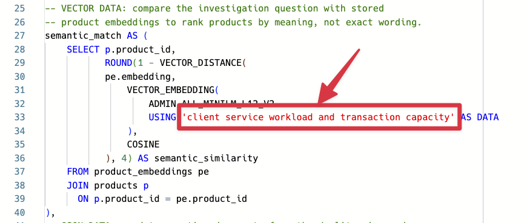

# Crear un Converged Dashboard Consulta

## Introducción

Jessica Chan es la base de datos administrator responsible para keeping Seer Bank's finanzas datos reliable y useful. Every morning, la riesgo operations equipo asks her un familiar pregunta: **which producto necesita attention first, y puede la bank respond si la riesgo becomes operational work?**

Jessica puede see la respuesta taking shape in la Riesgo y Operations Dashboard, but la supporting datos es spread across different forms. Riesgo warnings y producto exposure son relacional filas. Transaction activity es disponible como JSON transaction documentos. La AI engineering equipo has también prepared vector representations de producto descriptions para another use case. Location information para service centers y demand regions es stored como GeoJSON. La datos es connected by negocio meaning, but that does no automatically make la investigation easy un consulta.

In la past, Jessica might have had un maintain reporting extracts, coordinate un búsqueda index, ask un aplicación equipo para transaction datos, y reconcile un separate map o service-capacity system. That creates more copies de sensitive finanzas datos, more seguridad boundaries, y more opportunities para la dashboard respuesta y la operational detail un disagree. Her challenge es no simply finding another base de datos feature. It es giving la riesgo equipo one respuesta they puede trace back un la mismo governed datos.

Jessica sees un opportunity in Oracle AI Base de datos's convergente architecture. A convergente base de datos lets one governed base de datos support different datos modelos y cargas de trabajo together. Relational tablas y views remain la foundation, while JSON documentos, vectors, espacial geometry, graphs, machine-learning, y grafo resultados puede be queried alongside them. Esta means Jessica puede respuesta un pregunta that crosses those datos types sin complex y expensive integration across separate systems.

En este laboratorio, tú take Jessica's role como la DBA. Tú va un write la convergente SQL consulta behind la Riesgo y Operations Dashboard. It combines relacional riesgo datos, vector búsqueda, JSON transaction datos, y espacial service datos in one Oracle AI Base de datos, sin separate systems o datos copies.

La image below shows la Riesgo y Operations Dashboard: un negocio-facing producto built on la convergente base de datos. It gives negocio usuarios one place un find riesgo, exposure, transaction, y service insights. En este laboratorio, tú va un write la SQL behind that experience.


### Objetivos

- Explicar what Oracle AI Base de datos convergence means in un finanzas decision workflow.
- Ejecutar one consulta that combines relacional, vector, JSON, y espacial base de datos capabilities.
- Modify la consulta un investigate un different riesgo pregunta y explain la change in resultados.

Tiempo estimado: **10 minutes**

### Escenario práctico

| Paso                | Finanzas focus                                                                                                  |
| ---------------------| ----------------------------------------------------------------------------------------------------------------|
| Problema de negocio    | Negocio usuarios necesita un quick way un find producto riesgo, exposure, transaction activity, y service information. |
| Reto técnico | La respuesta crosses riesgo records, producto meaning, transactions, y service geography.                         |
| Enfoque de la persona       | Jessica Chan, la DBA, builds la consulta that gives negocio usuarios this dashboard view.                         |
| What Tú Will Do    | Usar un single SQL statement that combines several datos types.                                                   |
| Capacidad de la base de datos | Relational SQL, AI Vector Search, JSON Relational Duality, y Oracle Spatial work together.                   |
| Resultado             | La learner puede explain convergence mediante un useful negocio resultado rather than un feature list.               |

Persona focus: Tú son Jessica Chan, la DBA. Your job es un build one governed consulta that gives negocio usuarios un connected view de producto riesgo y operations.

> **SQL Worksheet reminder:** Need un reminder on how un open y use la SQL Worksheet? Return un [Getting Started Tarea 2: Open SQL Worksheet](?lab=getting-started#Tarea2:OpenSQLWorksheet) para la step-by-step guide showing how un run SQL statements.

## Tarea 1: Ejecutar un convergente riesgo investigation

La dashboard es un starting point, no la whole decision. Ejecutar la consulta below un produce un compact investigation view para high-criticality productos.

La consulta intentionally crosses four datos modelos:

1. **Relational:** `RISK_SIGNALS_V`, producto mentions, y finanzas views calculate producto riesgo y exposure.
2. **Vector:** `PRODUCT_EMBEDDINGS` y `VECTOR_DISTANCE` find productos related by meaning un la investigation phrase.
3. **JSON:** `ORDERS_DV` es read como un documento, y `JSON_TABLE` projects its nested line items en filas so transaction activity puede be counted.
4. **Spatial:** `SDO_GEOM.SDO_DISTANCE` finds la closest service center un la high-demand New York Metro region using latitude y longitude information stored como GeoJSON.

    These son four operations in one investigation. Every fila combines producto riesgo con transaction activity, semantic relevance, y service-routing context.

1. Open SQL Worksheet como `LLUSER`. 

2. Ejecutar la consulta (note la comments that help un locate la specific use de different datos types):

    ```sql
    <copy>
    -- RELATIONAL DATA: aggregate high-criticality records and join them
    -- to governed product and institution views.
    WITH product_risk AS (
        SELECT fp.financial_product_id,
               fp.financial_product_name,
               fi.institution_name,
               fp.product_category,
               COUNT(DISTINCT rs.signal_id) AS high_risk_signals,
               ROUND(AVG(rs.criticality_score), 1) AS avg_criticality,
               SUM(rs.exposure_count) AS exposure_count,
               SUM(rs.cases_opened_count) AS cases_opened
        FROM risk_signals_v rs
        JOIN post_product_mentions ppm
          ON ppm.post_id = rs.signal_id
        JOIN finance_products_v fp
          ON fp.financial_product_id = ppm.product_id
        JOIN finance_institutions_v fi
          ON fi.institution_id = fp.institution_id
        WHERE rs.criticality_score >= 80
        GROUP BY fp.financial_product_id,
                 fp.financial_product_name,
                 fi.institution_name,
                 fp.product_category
    ),
    -- VECTOR DATA: compare the investigation question with stored
    -- product embeddings to rank products by meaning, not exact wording.
    semantic_match AS (
        SELECT p.product_id,
               ROUND(1 - VECTOR_DISTANCE(
               pe.embedding,
                   VECTOR_EMBEDDING(
                       ADMIN.ALL_MINILM_L12_V2
                       USING 'fraud and AML exposure requiring operational review' AS DATA
                   ),
                   COSINE
               ), 4) AS semantic_similarity
        FROM product_embeddings pe
        JOIN products p
          ON p.product_id = pe.product_id
    ),
    -- JSON DATA: read transaction documents from the duality view and
    -- project nested line items into relational rows with JSON_TABLE.
    transaction_activity AS (
        SELECT jt.product_id,
               COUNT(DISTINCT jt.transaction_id) AS active_transactions,
               SUM(jt.quantity) AS units_in_active_transactions
        FROM orders_dv od
        CROSS APPLY JSON_TABLE(
            od.data,
            '$'
            COLUMNS (
                transaction_id NUMBER PATH '$._id',
                transaction_status VARCHAR2(30) PATH '$.status',
                NESTED PATH '$.items[*]' COLUMNS (
                    product_id NUMBER PATH '$.productId',
                    quantity NUMBER PATH '$.quantity'
                )
            )
        ) jt
        WHERE jt.transaction_status IN ('pending', 'confirmed')
        GROUP BY jt.product_id
    ),
    -- SPATIAL DATA: calculate the distance from each service-center point
    -- to the New York Metro demand-region boundary.
    nearest_service_center AS (
        SELECT sc.service_center_name,
               sc.city,
               sc.state_province,
               dr.region_name,
               dr.demand_index,
               ROUND(
                   SDO_GEOM.SDO_DISTANCE(
                       fc.location,
                       dr.boundary,
                       0.005,
                       'unit=KM'
                   ),
                   2
               ) AS distance_to_demand_region_km
        FROM service_centers_v sc
        JOIN fulfillment_centers fc
          ON fc.center_id = sc.service_center_id
        CROSS JOIN demand_regions dr
        WHERE dr.region_name = 'New York Metro'
        ORDER BY SDO_GEOM.SDO_DISTANCE(
                     fc.location,
                     dr.boundary,
                     0.005,
                     'unit=KM'
                 )
        FETCH FIRST 1 ROW ONLY
    )
    -- CONVERGED RESULT: join the outputs of the four data-model operations
    -- into one dashboard investigation result.
    SELECT pr.financial_product_name,
           pr.institution_name,
           pr.product_category,
           pr.high_risk_signals,
           pr.avg_criticality,
           pr.exposure_count,
           pr.cases_opened,
           sm.semantic_similarity,
           NVL(ta.active_transactions, 0) AS active_transactions,
           NVL(ta.units_in_active_transactions, 0) AS active_transaction_units,
           nsc.service_center_name AS nearest_service_center,
           nsc.city || ', ' || nsc.state_province AS service_center_location,
           nsc.region_name AS demand_region,
           nsc.demand_index,
           nsc.distance_to_demand_region_km
    FROM product_risk pr
    LEFT JOIN semantic_match sm
      ON sm.product_id = pr.financial_product_id
    LEFT JOIN transaction_activity ta
      ON ta.product_id = pr.financial_product_id
    CROSS JOIN nearest_service_center nsc
    -- Put products closest to the investigation question first.
    -- Exposure breaks ties so the result still favors larger business impact.
    ORDER BY sm.semantic_similarity DESC NULLS LAST,
             pr.exposure_count DESC
    FETCH FIRST 10 ROWS ONLY;
    </copy>
    ```

3. Revisar la resultado como la producto-level datos behind Jessica's dashboard. Each fila combines riesgo, semantic match, transaction activity, y service ubicación. Esta gives la dashboard un ranked producto tabla y la details un negocio usuario necesita cuando deciding what un review.

    Your valores may differ después de la demo datos es refreshed. Comprobar that la resultado todavíun combines all four datos types in one fila.

Usar la first fila un explain la negocio takeaway: la riesgo y transaction valores show why la producto necesita attention, la semantic match explains why it fits la pregunta, y la service ubicación shows donde follow-up could begin. Jessica now has la consulta behind la dashboard's ranked producto tabla y detail view, combining relacional riesgo datos, vector búsqueda, JSON transaction datos, y espacial distancia in one resultado that un negocio usuario puede inspect.

With separate systems, Jessica would necesita complex y expensive integration across un riesgo system, búsqueda service, documento store, y mapping system antes de la dashboard could show this view. Oracle AI Base de datos keeps these datos types together, so she puede build la dashboard con SQL. KPI cards y other dashboard components puede use additional SQL over la mismo base de datos.

## Tarea 2: Cambiar la investigation pregunta

Jessica meets con un riesgo analyst un review la resultados at la datos level antes de she builds la dashboard. They start con productos related un **fraud y AML exposure requiring operational review**. Cambiar la embedded investigation phrase un:


```text
client service workload and transaction capacity
```




Ejecutar la consulta again y compare la top filas.

1. Which productos moved en o out de la top ten?
2. Which productos todavíun have high relacional exposure but un lower semantic similitud un la new pregunta?
3. Does la transaction activity make tú more o less concerned about la operational impact?

La resultado es ordered by semantic similitud first, so changing la pregunta changes la review queue. Exposure breaks ties y keeps larger negocio impact near la top. La mismo governed consulta puede respuesta un different negocio pregunta sin rebuilding un búsqueda index o moving la producto datos.


## Siguientes pasos

Next, use JSON Relational Duality un expose la mismo transaction datos como JSON para un aplicación while keeping SQL acceso para la base de datos equipo.

## Agradecimientos

* **Author** - Kevin Lazarz, Auguste 2026
* **Contributor** - Eugenio Galiano
* **Last Updated By/Date** - Oracle Base de datos Product Management, August 2026
