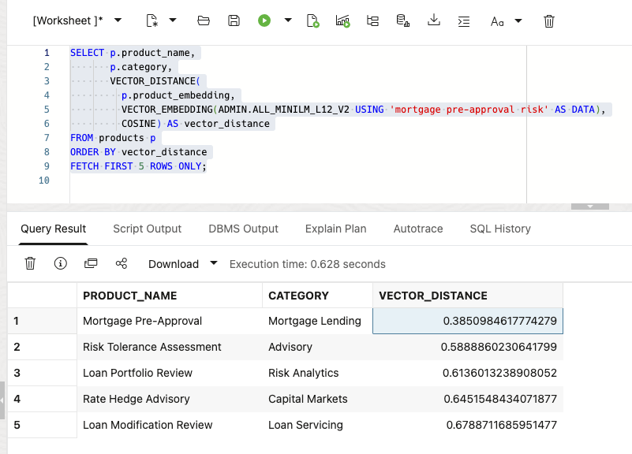
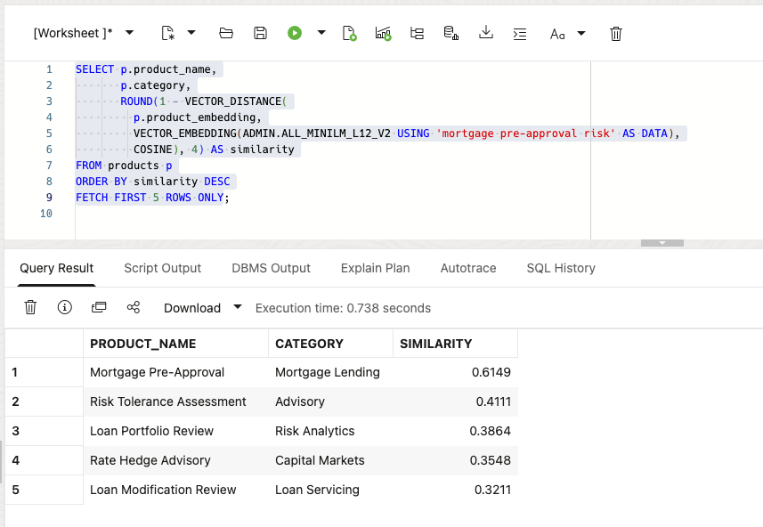
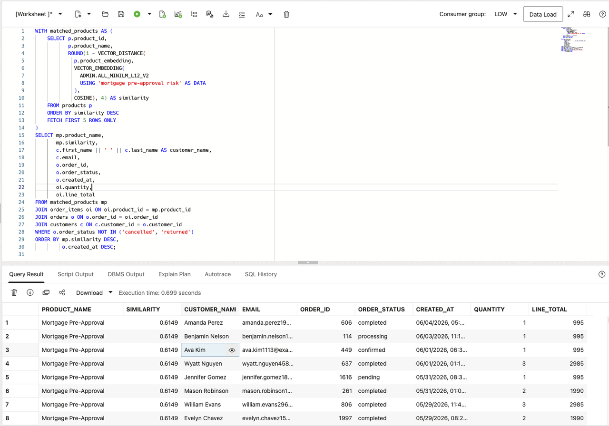

# Review a Semantic Risk Search

## Introduction

Gilly Bourne is an AI engineer at Seer Bank. Her team has built a search feature for the risk operations application. A business user can enter a question such as **which customers may be affected by a mortgage pre-approval concern?** The application should find the relevant products first, then show the customers who ordered them.

Gilly already has the product, order, and customer data in the database. Her design problem is connecting a plain-language question to those existing rows. She needs to turn product data into vectors, rank the closest products, and join those matches to orders and customers. A useful result must show more than a similarity score. It must give the service team a customer and order list they can act on.

She could export the text and embeddings to a separate vector service. That would add a second copy of sensitive finance language, another index to refresh, and another set of access rules to manage. Gilly wants the search to run where the underlying rows already live, so one SQL statement can compare meaning, join product data to orders and customers, and return a result for the application.

In this lab, you review Gilly's implementation from the embedding model to the final customer list. You see why Oracle AI Database fits the job: vector search finds the relevant products, and SQL joins connect them to exact order and customer data in the same database.

<details>
<summary><strong>Key terms: embedding, vector, vector distance, and semantic search</strong></summary>

> - An **embedding** is a numerical profile of what text means. In this lab, product data is embedded so similar finance ideas sit near each other mathematically, even when the wording is different.
>
> - A **vector** is the stored numerical form of an embedding. Oracle Database can store vectors beside the finance rows they describe, so the search stays connected to product names, exposure values, notice counts, and other business columns.
>
> - **Vector distance** measures how close two vectors are. A smaller distance means the meanings are more similar; a larger distance means they are farther apart. In this lab, distance helps rank which products or risk notices best match a business user's question.
>
> - **Semantic search** means searching by meaning instead of exact words. A search for "mortgage pre-approval risk" can find related lending products even when the product names use different wording.

</details>

Gilly has already built the Risk Signal Intelligence page. In this lab, you review how she built the product search. The search area lets a business user enter a concern in ordinary language and receive ranked products by meaning.

### Objectives

- Check the embedding model Gilly needs for semantic search.
- Create a vector from product data inside the database.
- Review a semantic product search for a business question.
- Turn product matches into a customer follow-up list.
- Explain why vector search belongs beside finance data and access controls.

Estimated Time: **10 minutes**

### Hands-on Scenario

| Step                | Finance focus                                                                                                                               |
| ---------------------| ---------------------------------------------------------------------------------------------------------------------------------------------|
| Business Problem    | Business users need to find relevant products without knowing the exact terms used in the product data.                                     |
| Technical Challenge | Gilly must search by meaning while keeping product data, vectors, orders, customers, and access controls together.                          |
| Persona Focus       | You review Gilly's implementation as she explains how the search connects a business question to products, orders, and customers.           |
| What You Will See   | Vector search ranks products by meaning, then SQL adds order and customer details.                                                          |
| Database Capability | `VECTOR_EMBEDDING`, vector columns, and `VECTOR_DISTANCE` run beside relational finance data.                                               |
| Outcome             | The application can turn a plain-language concern into a customer follow-up list without a separate vector database or copied finance text. |

Persona focus: You are reviewing the search tool Gilly built for risk operations.


> **SQL Worksheet reminder:** Need a reminder on how to open and use the SQL Worksheet? Return to [Getting Started Task 2: Open SQL Worksheet](?lab=getting-started#Task2:OpenSQLWorksheet) for the step-by-step guide showing how to run SQL statements.


## Task 1: Check the embedding model

Start with Gilly's first design question: **what does similarity search need?** It needs vectors for the text being searched and an embedding model that converts a question into a vector.

Gilly asks Jessica to load an ONNX embedding model into Oracle AI Database. Oracle AI Database can store and run the ONNX model inside the database, so it creates the question embedding where the product data already live. The application does not have to send finance text to a separate service and bring the vector back.

1. Run the following query to see which embedding models are available:

    ```sql
    <copy>
    SELECT owner,
           model_name,
           algorithm,
           mining_function
    FROM all_mining_models
    WHERE mining_function = 'EMBEDDING'
    ORDER BY owner, model_name;
    </copy>
    ```

    **Expected output: Available Embedding Models**

    

    The result should include an embedding model owned by `ADMIN`, such as `ALL_MINILM_L12_V2`. This compact model turns text into 384-number vectors. The `EMBEDDING` value confirms that the model can turn text into vectors for similarity search.

2. Review what this means for Gilly's application.

    Gilly can call the model from SQL with `VECTOR_EMBEDDING(...)`. Jessica manages the model inside the database, while Gilly uses it in her search query. The product data, vectors, and access controls stay in the same database.

    > **Note:** This is the key Oracle AI Database differentiator in this lab. The embedding model runs inside the database, so Gilly does not need a separate embedding service or a data pipeline to move finance text between systems.

## Task 2: Create a product vector

Gilly decides that one vector per product is enough. Each product record is short and describes one product, so she combines its name, category, and subcategory into one text value before creating the vector.

1. Review the text Gilly will embed:

    ```sql
    <copy>
    SELECT product_id,
           product_name,
           category,
           subcategory,
           product_name || '. Category: ' || category ||
             '. Subcategory: ' || subcategory AS embedding_text
    FROM products
    FETCH FIRST 5 ROWS ONLY;
    </copy>
    ```

    The combined text gives the model the product name and its business classification. Gilly does not need to embed price, dates, or other values that do not describe what the product is.

2. Add a vector column to `PRODUCTS`:

    ```sql
    <copy>
    ALTER TABLE products ADD (product_embedding VECTOR(384));
    </copy>
    ```

    The column has 384 dimensions because `ALL_MINILM_L12_V2` produces 384-dimensional vectors.

3. Create the product vectors inside Oracle Database:

    ```sql
    <copy>
    UPDATE products
    SET product_embedding = VECTOR_EMBEDDING(
      ADMIN.ALL_MINILM_L12_V2 USING
        product_name || '. Category: ' || category ||
        '. Subcategory: ' || subcategory AS DATA)
    WHERE product_embedding IS NULL;

    COMMIT;
    </copy>
    ```

    The model reads the text in each row and writes the vector back to that same row. No product text leaves the database.

4. Verify the new column and its data:

    ```sql
    <copy>
    SELECT product_id,
           product_name,
           product_embedding
    FROM products;
    </copy>
    ```

    

    Each product now has its own 384-dimensional vector. Gilly can use this column directly when the application searches for products by meaning.

    > **Note:** Chunking is not relevant for this data. Each row describes one short product, so splitting it would create several vectors for one product without adding useful detail. Chunking becomes useful for long documents, such as policies or regulatory bulletins, where each section may answer a different question.

## Task 3: Test the product vector

Now Gilly tests the new column with a simple vector query. She asks for products related to mortgage pre-approval risk and lets the database rank them by meaning.

1. Run the following query:

    The SQL creates an embedding for the phrase `mortgage pre-approval risk`, compares it with the vectors in `PRODUCTS.PRODUCT_EMBEDDING`, and returns the cosine distance. A smaller distance means the two vectors are closer in meaning, so the query orders the smallest distance first.

    <details>
    <summary><strong>Why this matters to Gilly</strong></summary>

    > Gilly could export the text to an external embedding pipeline or search service. That would create extra copies of sensitive finance text and make it harder to show which data the application searched.
    >
    > Oracle AI Vector Search keeps the product data, vectors, SQL query, and vector distance with the finance data. Gilly can check the search and use the result in the application without adding another data store.

    </details>

    ```sql
    <copy>
    SELECT p.product_name,
           p.category,
           VECTOR_DISTANCE(
             p.product_embedding,
             VECTOR_EMBEDDING(ADMIN.ALL_MINILM_L12_V2 USING 'mortgage pre-approval risk' AS DATA),
             COSINE) AS vector_distance
    FROM products p
    ORDER BY vector_distance
    FETCH FIRST 5 ROWS ONLY;
    </copy>
    ```

    **Expected output: Mortgage Product Matches**

    

2. Review the ranked products.
    The query embeds the analyst phrase at runtime and compares it to the `PRODUCTS.PRODUCT_EMBEDDING` column. `VECTOR_DISTANCE` calculates the distance between the two vectors using the `COSINE` metric. A lower value means a closer match.

    In the broader workflow, these ranked products can become the next filter for dashboard review and product exposure analysis.

3. Show the result as a similarity score:

    Vector distance is useful for checking the search, but business users may not know what a cosine distance means. Gilly changes the display to a similarity score. She subtracts the distance from `1`, so a higher score means a closer match, and rounds the result to four decimal places.

    ```sql
    <copy>
    SELECT p.product_name,
           p.category,
           ROUND(1 - VECTOR_DISTANCE(
             p.product_embedding,
             VECTOR_EMBEDDING(ADMIN.ALL_MINILM_L12_V2 USING 'mortgage pre-approval risk' AS DATA),
             COSINE), 4) AS similarity
    FROM products p
    ORDER BY similarity DESC
    FETCH FIRST 5 ROWS ONLY;
    </copy>
    ```

    The query uses the same vectors and the same cosine calculation. It only changes how the result is shown to the person using the application.

    

## Task 4: Find customers affected by a product concern

Gilly now has the business requirement for the application. A business user should be able to enter a concern and find customers who ordered related products. The result gives the customer-service team a short list for follow-up, with the product match, order status, order date, and customer contact details.

1. Run the following query for the concern `mortgage pre-approval risk`:

    ```sql
    <copy>
    WITH matched_products AS (
        SELECT p.product_id,
               p.product_name,
               ROUND(1 - VECTOR_DISTANCE(
                 p.product_embedding,
                 VECTOR_EMBEDDING(
                   ADMIN.ALL_MINILM_L12_V2
                   USING 'mortgage pre-approval risk' AS DATA
                 ),
                 COSINE), 4) AS similarity
        FROM products p
        ORDER BY similarity DESC
        FETCH FIRST 5 ROWS ONLY
    )
    SELECT mp.product_name,
           mp.similarity,
           c.first_name || ' ' || c.last_name AS customer_name,
           c.email,
           o.order_id,
           o.order_status,
           o.created_at,
           oi.quantity,
           oi.line_total
    FROM matched_products mp
    JOIN order_items oi ON oi.product_id = mp.product_id
    JOIN orders o ON o.order_id = oi.order_id
    JOIN customers c ON c.customer_id = o.customer_id
    WHERE o.order_status NOT IN ('cancelled', 'returned')
    ORDER BY mp.similarity DESC,
             o.created_at DESC;
    </copy>
    ```

    The first part ranks products by meaning. The remaining joins use ordinary relational keys to find the matching order items, orders, and customers.

    **Expected output: Customer Follow-up List**

    The result shows customers who ordered products related to the concern. The similarity score explains why the product was included, while the order and customer columns give the service team enough information to decide what to do next.


    

2. Review the business result.

    Gilly does not vectorize every order or customer. She vectorizes the product data once, then builds a converged query that combines vector search with SQL joins for exact transaction and contact details. This keeps the search flexible while the final customer list remains precise and easy to act on.

## Conclusion

Gilly has built the search behind the application and connected it to a business action. A plain-language concern can produce ranked products and a customer follow-up list using vectors, relational joins, and SQL in Oracle AI Database. 

## Acknowledgements

* **Author** - Kevin Lazarz
* **Contributor** - Eugenio Galiano
* **Last Updated By/Date** - Oracle Database Product Management, August 2026
