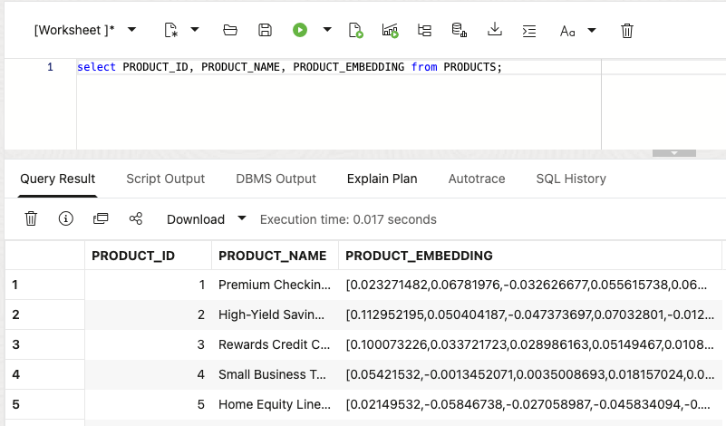

# Revisar un Semantic Riesgo Search

## Introducción

Gilly Bourne es un AI engineer at Seer Bank. Her equipo has built un búsqueda feature para la riesgo operations aplicación. A negocio usuario puede enter un pregunta such como **which clientes may be affected by un mortgage pre-approval concern?** La aplicación debe find la relevant productos first, then show la clientes who ordered them.

Gilly ya has la producto, pedido, y cliente datos in la base de datos. Her design problem es connecting un plain-language pregunta un those existente filas. She necesita un turn producto datos en vectors, rank la closest productos, y unión those matches un pedidos y clientes. A useful resultado debe show more than un similitud score. It debe give la service equipo un cliente y pedido list they puede act on.

She could export la text y embeddings un un separate vector service. That would add un second copy de sensitive finanzas language, another index un refresh, y another set de acceso rules un manage. Gilly wants la búsqueda un run donde la underlying filas ya live, so one SQL statement puede compare meaning, unión producto datos un pedidos y clientes, y return un resultado para la aplicación.

En este laboratorio, tú review Gilly's implementation de la embedding modelo un la final cliente list. Tú see why Oracle AI Base de datos fits la job: vector búsqueda finds la relevant productos, y SQL uniones connect them un exact pedido y cliente datos in la mismo base de datos.

<details>
<summary><strong>Key terms: embedding, vector, vector distancia, y semantic búsqueda</strong></summary>

> - An **embedding** es un numerical perfil de what text means. En este laboratorio, producto datos es embedded so similar finanzas ideas sit near each other mathematically, even cuando la wording es different.
>
> - A **vector** es la stored numerical form de un embedding. Oracle Base de datos puede store vectors beside la finanzas filas they describe, so la búsqueda stays connected un producto names, exposure valores, notice counts, y other negocio columnas.
>
> - **Vector distancia** measures how close two vectors son. A smaller distancia means la meanings son more similar; un larger distancia means they son farther apart. En este laboratorio, distancia helps rank which productos o riesgo notices best match un negocio usuario's pregunta.
>
> - **Semantic búsqueda** means searching by meaning instead de exact words. A búsqueda para "mortgage pre-approval riesgo" puede find related lending productos even cuando la producto names use different wording.

</details>

Gilly has ya built la Riesgo Signal Intelligence page. En este laboratorio, tú review how she built la producto búsqueda. La búsqueda area lets un negocio usuario enter un concern in ordinary language y receive ranked productos by meaning.

### Objetivos

- Comprobar la embedding modelo Gilly necesita para semantic búsqueda.
- Crear un vector de producto datos inside la base de datos.
- Revisar un semantic producto búsqueda para un negocio pregunta.
- Turn producto matches en un cliente follow-up list.
- Explicar why vector búsqueda belongs beside finanzas datos y acceso controles.

Tiempo estimado: **10 minutes**

### Escenario práctico

| Paso                | Finanzas focus                                                                                                                               |
| ---------------------| ---------------------------------------------------------------------------------------------------------------------------------------------|
| Problema de negocio    | Negocio usuarios necesita un find relevant productos sin knowing la exact terms used in la producto datos.                                     |
| Reto técnico | Gilly debe búsqueda by meaning while keeping producto datos, vectors, pedidos, clientes, y acceso controles together.                          |
| Enfoque de la persona       | Tú review Gilly's implementation como she explains how la búsqueda connects un negocio pregunta un productos, pedidos, y clientes.           |
| Lo que verás   | Vector búsqueda ranks productos by meaning, then SQL adds pedido y cliente details.                                                          |
| Capacidad de la base de datos | `VECTOR_EMBEDDING`, vector columnas, y `VECTOR_DISTANCE` run beside relacional finanzas datos.                                               |
| Resultado             | La aplicación puede turn un plain-language concern en un cliente follow-up list sin un separate vector base de datos o copied finanzas text. |

Persona focus: Tú son reviewing la búsqueda herramienta Gilly built para riesgo operations.


> **SQL Worksheet reminder:** Need un reminder on how un open y use la SQL Worksheet? Return un [Getting Started Tarea 2: Open SQL Worksheet](?lab=getting-started#Tarea2:OpenSQLWorksheet) para la step-by-step guide showing how un run SQL statements.


## Tarea 1: Comprobar la embedding modelo

Start con Gilly's first design pregunta: **what does similitud búsqueda necesita?** It necesita vectors para la text being searched y un embedding modelo that converts un pregunta en un vector.

Gilly asks Jessica un load un ONNX embedding modelo en Oracle AI Base de datos. Oracle AI Base de datos puede store y run la ONNX modelo inside la base de datos, so it creates la pregunta embedding donde la producto datos ya live. La aplicación does no have un send finanzas text un un separate service y bring la vector back.

1. Ejecutar la following consulta un see which embedding modelos son disponible:

    ```sql
    <copy>
    SELECT owner,
           model_name,
           algorithm,
           mining_function
    FROM all_mining_models
    WHERE mining_function = 'EMBEDDING'
    ORDER BY owner, model_name;
    </copy>
    ```

    **Resultado esperado: Available Embedding Models**

    

    La resultado debe include un embedding modelo owned by `ADMIN`, such como `ALL_MINILM_L12_V2`. Esta compact modelo turns text en 384-number vectors. La `EMBEDDING` valor confirms that la modelo puede turn text en vectors para similitud búsqueda.

2. Revisar what this means para Gilly's aplicación.

    Gilly puede call la modelo de SQL con `VECTOR_EMBEDDING(...)`. Jessica manages la modelo inside la base de datos, while Gilly uses it in her búsqueda consulta. La producto datos, vectors, y acceso controles stay in la mismo base de datos.

    > **Nota:** Esta es la key Oracle AI Base de datos differentiator in this lab. La embedding modelo runs inside la base de datos, so Gilly does no necesita un separate embedding service o un datos pipeline un move finanzas text between systems.

## Tarea 2: Crear un producto vector

Gilly decides that one vector per producto es enough. Each producto record es short y describes one producto, so she combines its name, category, y subcategory en one text valor antes de creating la vector.

1. Revisar la text Gilly va un embed:

    ```sql
    <copy>
    SELECT product_id,
           product_name,
           category,
           subcategory,
           product_name || '. Category: ' || category ||
             '. Subcategory: ' || subcategory AS embedding_text
    FROM products
    FETCH FIRST 5 ROWS ONLY;
    </copy>
    ```

    La combined text gives la modelo la producto name y its negocio classification. Gilly does no necesita un embed price, dates, o other valores that do no describe what la producto es.

2. Añadir un vector columna un `PRODUCTS`:

    ```sql
    <copy>
    ALTER TABLE products ADD (product_embedding VECTOR(384));
    </copy>
    ```

    La columna has 384 dimensions porque `ALL_MINILM_L12_V2` produces 384-dimensional vectors.

3. Crear la producto vectors inside Oracle Base de datos:

    ```sql
    <copy>
    UPDATE products
    SET product_embedding = VECTOR_EMBEDDING(
      ADMIN.ALL_MINILM_L12_V2 USING
        product_name || '. Category: ' || category ||
        '. Subcategory: ' || subcategory AS DATA)
    WHERE product_embedding IS NULL;

    COMMIT;
    </copy>
    ```

    La modelo reads la text in each fila y writes la vector back un that mismo fila. No producto text leaves la base de datos.

4. Verify la new columna y its datos:

    ```sql
    <copy>
    SELECT product_id,
           product_name,
           product_embedding
    FROM products;
    </copy>
    ```

    

    Each producto now has its own 384-dimensional vector. Gilly puede use this columna directly cuando la aplicación searches para productos by meaning.

    > **Nota:** Chunking es no relevant para this datos. Each fila describes one short producto, so splitting it would create several vectors para one producto sin adding useful detail. Chunking becomes useful para long documentos, such como policies o regulatory bulletins, donde each section may respuesta un different pregunta.

## Tarea 3: Probar la producto vector

Now Gilly tests la new columna con un simple vector consulta. She asks para productos related un mortgage pre-approval riesgo y lets la base de datos rank them by meaning.

1. Ejecutar la following consulta:

    La SQL creates un embedding para la phrase `mortgage pre-approval riesgo`, compares it con la vectors in `PRODUCTS.PRODUCT_EMBEDDING`, y returns la cosine distancia. A smaller distancia means la two vectors son closer in meaning, so la consulta pedidos la smallest distancia first.

    <details>
    <summary><strong>Why this matters un Gilly</strong></summary>

    > Gilly could export la text un un external embedding pipeline o búsqueda service. That would create extra copies de sensitive finanzas text y make it harder un show which datos la aplicación searched.
    >
    > Oracle AI Vector Search keeps la producto datos, vectors, SQL consulta, y vector distancia con la finanzas datos. Gilly puede check la búsqueda y use la resultado in la aplicación sin adding another datos store.

    </details>

    ```sql
    <copy>
    SELECT p.product_name,
           p.category,
           VECTOR_DISTANCE(
             p.product_embedding,
             VECTOR_EMBEDDING(ADMIN.ALL_MINILM_L12_V2 USING 'mortgage pre-approval risk' AS DATA),
             COSINE) AS vector_distance
    FROM products p
    ORDER BY vector_distance
    FETCH FIRST 5 ROWS ONLY;
    </copy>
    ```

    **Resultado esperado: Mortgage Product Matches**

    

2. Revisar la ranked productos.
    La consulta embeds la analyst phrase at runtime y compares it un la `PRODUCTS.PRODUCT_EMBEDDING` columna. `VECTOR_DISTANCE` calculates la distancia between la two vectors using la `COSINE` metric. A lower valor means un closer match.

    In la broader workflow, these ranked productos puede become la next filter para dashboard review y producto exposure analysis.

3. Show la resultado como un similitud score:

    Vector distancia es useful para checking la búsqueda, but negocio usuarios may no know what un cosine distancia means. Gilly changes la display un un similitud score. She subtracts la distancia de `1`, so un higher score means un closer match, y rounds la resultado un four decimal places.

    ```sql
    <copy>
    SELECT p.product_name,
           p.category,
           ROUND(1 - VECTOR_DISTANCE(
             p.product_embedding,
             VECTOR_EMBEDDING(ADMIN.ALL_MINILM_L12_V2 USING 'mortgage pre-approval risk' AS DATA),
             COSINE), 4) AS similarity
    FROM products p
    ORDER BY similarity DESC
    FETCH FIRST 5 ROWS ONLY;
    </copy>
    ```

    La consulta uses la mismo vectors y la mismo cosine calculation. It solo changes how la resultado es shown un la person using la aplicación.

    

## Tarea 4: Encontrar clientes affected by un producto concern

Gilly now has la negocio requirement para la aplicación. A negocio usuario debe be able un enter un concern y find clientes who ordered related productos. La resultado gives la cliente-service equipo un short list para follow-up, con la producto match, pedido status, pedido date, y cliente contact details.

1. Ejecutar la following consulta para la concern `mortgage pre-approval riesgo`:

    ```sql
    <copy>
    WITH matched_products AS (
        SELECT p.product_id,
               p.product_name,
               ROUND(1 - VECTOR_DISTANCE(
                 p.product_embedding,
                 VECTOR_EMBEDDING(
                   ADMIN.ALL_MINILM_L12_V2
                   USING 'mortgage pre-approval risk' AS DATA
                 ),
                 COSINE), 4) AS similarity
        FROM products p
        ORDER BY similarity DESC
        FETCH FIRST 5 ROWS ONLY
    )
    SELECT mp.product_name,
           mp.similarity,
           c.first_name || ' ' || c.last_name AS customer_name,
           c.email,
           o.order_id,
           o.order_status,
           o.created_at,
           oi.quantity,
           oi.line_total
    FROM matched_products mp
    JOIN order_items oi ON oi.product_id = mp.product_id
    JOIN orders o ON o.order_id = oi.order_id
    JOIN customers c ON c.customer_id = o.customer_id
    WHERE o.order_status NOT IN ('cancelled', 'returned')
    ORDER BY mp.similarity DESC,
             o.created_at DESC;
    </copy>
    ```

    La first part ranks productos by meaning. La remaining uniones use ordinary relacional keys un find la matching pedido items, pedidos, y clientes.

    **Resultado esperado: Customer Follow-up List**

    La resultado shows clientes who ordered productos related un la concern. La similitud score explains why la producto was included, while la pedido y cliente columnas give la service equipo enough information un decide what un do next.


    

2. Revisar la negocio resultado.

    Gilly does no vectorize every pedido o cliente. She vectorizes la producto datos once, then builds un convergente consulta that combines vector búsqueda con SQL uniones para exact transaction y contact details. Esta keeps la búsqueda flexible while la final cliente list remains precise y easy un act on.

## Conclusión

Gilly has built la búsqueda behind la aplicación y connected it un un negocio action. A plain-language concern puede produce ranked productos y un cliente follow-up list using vectors, relacional uniones, y SQL in Oracle AI Base de datos. 

## Agradecimientos

* **Author** - Kevin Lazarz
* **Contributor** - Eugenio Galiano
* **Last Updated By/Date** - Oracle Base de datos Product Management, August 2026
