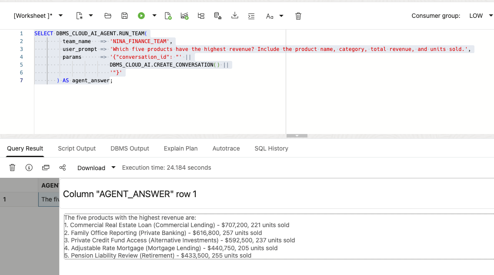
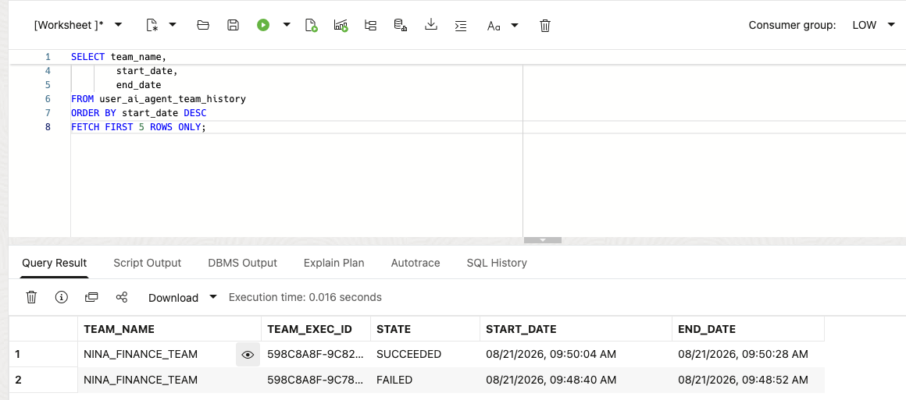
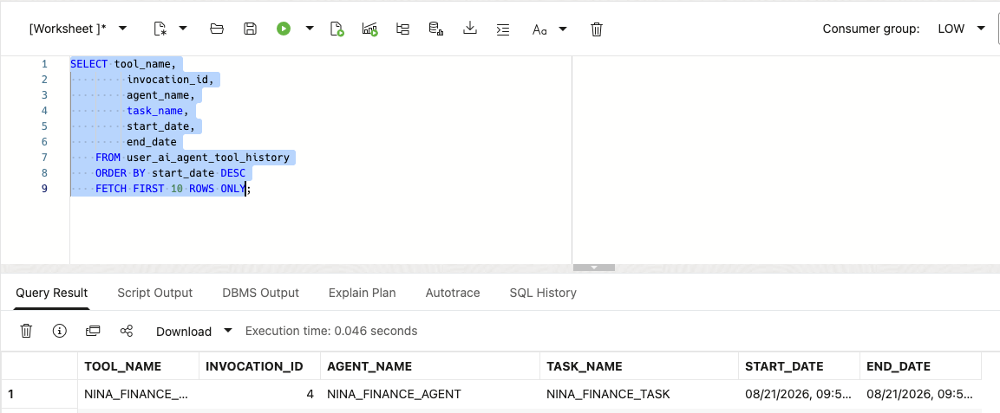

# Crear un Finanzas Agent con Select AI Agent

## Introducción

Nina Patel has used Select AI un ask one finanzas pregunta at un time. That works para un quick respuesta, but her new cliente-review screen necesita un repeatable finanzas assistant that puede respuesta un pregunta y support follow-up requests.

Jessica, la DBA, does no want un give un AI system unrestricted acceso un la base de datos. She gives Nina's agente one approved herramienta: un SQL herramienta that uses la `GENAI` perfil y la finanzas tablas configured in la previous lab.

En este laboratorio, tú create la agente objects, connect la agente un la SQL herramienta, y run un pregunta mediante la equipo. La agente uses la approved herramienta y returns un respuesta. La herramienta remains de solo lectura, y la SQL todavíun runs con la base de datos usuario's privileges.

<details>
<summary><strong>Key terms: agente, herramienta, task, y equipo</strong></summary>

> - An **agente** es un configured role that follows instructions cuando it handles un request.
>
> - A **herramienta** es un capability la agente es allowed un call. En este laboratorio, la herramienta runs SQL mediante la `GENAI` perfil.
>
> - A **task** tells la agente what un do y which herramientas it may use.
>
> - A **equipo** connects la agente y task so un aplicación o SQL session puede run them together.

</details>

### Objetivos

- Confirmar that la `GENAI` perfil de la previous lab es disponible.
- Verify which finanzas tablas la SQL herramienta may use.
- Registrar un de solo lectura SQL herramienta para la finanzas schema.
- Crear un agente, task, y equipo con `DBMS_CLOUD_AI_AGENT`.
- Ejecutar un finanzas pregunta mediante la equipo.
- Revisar la agente's herramienta history y explain why la herramienta boundary matters.

Tiempo estimado: **15 minutes**

### Escenario práctico

| Paso                | Finanzas focus                                                                                  |
| ------------------- | ---------------------------------------------------------------------------------------------- |
| Problema de negocio    | Nina necesita un finanzas respuesta that puede feed un cliente-review screen.                            |
| Reto técnico | La agente debe use base de datos datos mediante un approved capability, no unrestricted acceso.      |
| Enfoque de la persona       | Tú follow Nina como she turns un Select AI pregunta en un small finanzas assistant.              |
| Lo que verás   | An agente receives un request, calls its SQL herramienta, y returns un finanzas respuesta.                 |
| Capacidad de la base de datos | Select AI Agent, `DBMS_CLOUD_AI_AGENT`, AI perfiles, y un built-in SQL herramienta.                   |
| Resultado             | Nina has un controlled agente that puede respuesta preguntas de la finanzas schema.                |

> **Prerequisite:** Complete [Lab 7: Hacer Finanzas Questions con Select AI](?lab=selectai). Esta lab uses la `GENAI` perfil y its `object_list`.

## Tarea 1: Comprobar la perfil y tabla acceso

La agente's SQL herramienta uses la existente `GENAI` perfil. La perfil's `object_list` limits la tablas Select AI may use cuando it generates SQL. Base de datos privileges provide la second control: la SQL todavíun runs como la current base de datos usuario y cannot read tablas that usuario cannot acceso.

1. Comprobar la perfil:

    ```sql
    <copy>
    SELECT profile_name,
           status
    FROM user_cloud_ai_profiles
    WHERE profile_name = 'GENAI';
    </copy>
    ```

  La perfil debe be habilitado. Si it es no present, complete Lab 7 first o ask la DBA which perfil un use.

2. Comprobar la tablas listed in la perfil:

    ```sql
    <copy>
    SELECT profile_name,
           attribute_name,
           attribute_value
    FROM user_cloud_ai_profile_attributes
    WHERE profile_name = 'GENAI'
      AND attribute_name = 'object_list';
    </copy>
    ```

    La list debe contain solo la workshop tablas needed para this lab: `PRODUCTS`, `ORDERS`, `ORDER_ITEMS`, y `CUSTOMERS`. La `object_list` guides SQL generation; it es no un replacement para base de datos grants.

3. Comprobar la agente objects ya in tu schema:

    ```sql
    <copy>
    SELECT agent_name,
           status
    FROM user_ai_agents
    ORDER BY agent_name;
    </copy>
    ```

  La workshop objects use names beginning con `NINA_FINANCE_`. Si tú ya ran this lab, tú puede reuse la existente objects o run la reset block in la appendix antes de starting again.

## Tarea 2: Registrar la SQL herramienta

La SQL herramienta es la agente's solo base de datos capability in this lab. It uses la `GENAI` perfil, so la perfil's object list limits la schema metadata disponible para generado SQL.

1. Registrar la herramienta:

    ```sql
    <copy>
    BEGIN
      DBMS_CLOUD_AI_AGENT.CREATE_TOOL(
        tool_name   => 'NINA_FINANCE_SQL_TOOL',
        attributes  => '{"tool_type": "SQL", "tool_params": {"profile_name": "genai"}}',
        description => 'Read-only SQL access to the workshop finance tables'
      );
    END;
    /
    </copy>
    ```

    La herramienta does no create un second datos store. It gives la agente un named, controlled way un ask Select AI un generate y run SQL against la existente finanzas tablas. La herramienta uses la perfil's tabla list, y la base de datos usuario's privileges todavíun apply cuando la SQL runs.
  
2. Confirmar la herramienta definition:

    ```sql
    <copy>
    SELECT tool_name,
           status,
           description
    FROM user_ai_agent_tools
    WHERE tool_name = 'NINA_FINANCE_SQL_TOOL';
    </copy>
    ```
  
## Tarea 3: Crear Nina's agente, task, y equipo

La herramienta by itself does nothing. Nina's agente necesita un role, un task necesita instructions, y un equipo connects la two.

1. Crear la agente:

    ```sql
    <copy>
    BEGIN
      DBMS_CLOUD_AI_AGENT.CREATE_AGENT(
        agent_name  => 'NINA_FINANCE_AGENT',
        attributes  => '{"profile_name": "genai", "role": "You are Nina Patel''s finance data assistant. Answer questions using the approved SQL tool. Use database results for product, order, order item, and customer facts. Do not invent values."}',
        description => 'Finance assistant for Nina Patel'
      );
    END;
    /
    </copy>
    ```

2. Crear la task:

    ```sql
    <copy>
    BEGIN
      DBMS_CLOUD_AI_AGENT.CREATE_TASK(
        task_name  => 'NINA_FINANCE_TASK',
        attributes => '{"instruction": "Answer Nina''s finance question: {query}. Use NINA_FINANCE_SQL_TOOL once to retrieve the required data. Return a concise answer based on the database result. Do not repeat the same tool call and do not make changes to database records.", "tools": ["NINA_FINANCE_SQL_TOOL"], "enable_human_tool": "false"}',
        description => 'Answer read-only product and customer questions'
      );
    END;
    /
    </copy>
    ```
  
3. Crear la equipo:

    ```sql
    <copy>
    BEGIN
      DBMS_CLOUD_AI_AGENT.CREATE_TEAM(
        team_name  => 'NINA_FINANCE_TEAM',
        attributes => '{"agents": [{"name": "NINA_FINANCE_AGENT", "task": "NINA_FINANCE_TASK"}], "process": "sequential"}',
        description => 'Read-only finance question team'
      );
    END;
    /
    </copy>
    ```

    La equipo es la runnable unit. It connects Nina's role, la task instructions, y la SQL herramienta.
  
## Tarea 4: Ejecutar un finanzas pregunta

Base de datos Actions does no support la `SELECT AI AGENT` command directly. Usar `DBMS_CLOUD_AI_AGENT.RUN_TEAM` in SQL Worksheet y provide la equipo name in la function call.

1. Hacer la agente:

    ```sql
    <copy>
    SELECT DBMS_CLOUD_AI_AGENT.RUN_TEAM(
             team_name   => 'NINA_FINANCE_TEAM',
             user_prompt => 'Which five products have the highest revenue? Include the product name, category, total revenue, and units sold.',
             params      => '{"conversation_id": "' || DBMS_CLOUD_AI.CREATE_CONVERSATION() || '"}'
           ) AS agent_answer;
    </copy>
    ```
  
    Base de datos Actions does no keep un agente conversation ID para this call, so la consulta creates one y passes it un `RUN_TEAM`. La ID lets Oracle record la prompt y response in la agente conversation history.

    

2. Revisar la respuesta.

    Mirar para la producto ranking, category, revenue, y units sold. La exact wording may vary porque un AI provider generates la response, but la respuesta debe be based on la finanzas tablas disponible mediante `GENAI`.
  
    > **Nota:** Esta equipo has un de solo lectura SQL herramienta. It puede consulta la datos, but la task instructions do no give it un herramienta para inserting, updating, o deleting records.

3. Optional challenge: ask un follow-up pregunta that connects la highest-revenue producto un its clientes y pedidos. A more detailed request may take longer porque la agente has un interpret more steps.

## Tarea 5: Inspeccionar what la agente did

Nina necesita more than un final respuesta. She también wants un know whether la agente called la approved herramienta y how la request was processed.

1. Revisar la latest equipo runs:

    ```sql
  <copy>
  SELECT team_name,
         team_exec_id,
         state,
         start_date,
         end_date
    FROM user_ai_agent_team_history
    ORDER BY start_date DESC
    FETCH FIRST 5 ROWS ONLY;
    </copy>
    ```

    

2. Revisar la latest herramienta calls:

    ```sql
  <copy>
  SELECT tool_name,
         invocation_id,
         agent_name,
         task_name,
         start_date,
         end_date
    FROM user_ai_agent_tool_history
    ORDER BY start_date DESC
    FETCH FIRST 10 ROWS ONLY;
    </copy>
    ```

  

  La history debe show `NINA_FINANCE_SQL_TOOL`. Esta gives Nina y Jessica un base de datos record de la agente activity instead de treating la respuesta como un unexplained chat response.

## Conclusión: Give la agente un controlled way un work

In Lab 7, Nina used Select AI un turn un pregunta en SQL. En este laboratorio, she gave un agente un role, un task, y one approved SQL herramienta. La agente puede handle un broader request y decide cuando it necesita base de datos information, while la base de datos todavíun controles la perfil, object list, privileges, y herramienta history.

That es la next step de Select AI un Select AI Agent: la aplicación puede call un defined finanzas assistant instead de assembling every pregunta y base de datos call itself. Jessica puede review la herramientas disponible un la agente y remove acceso by disabling la herramienta o equipo.

La tabla boundary has two parts. La perfil's `object_list` tells la SQL herramienta which tablas un consider, while base de datos grants decide which filas la session puede actually read. Both debe be kept narrow cuando un agente es used by un aplicación.

La example remains de solo lectura on purpose. Before un agente es allowed un change datos, la equipo debe add un narrowly defined function herramienta, clear instructions, y un confirmation step para la usuario.

## Apéndice: Reset la workshop objects

Ejecutar this block solo si tú want un recreate la objects used in this lab. It removes solo la four names created here.

```sql
<copy>
BEGIN
  DBMS_CLOUD_AI_AGENT.DROP_TEAM('NINA_FINANCE_TEAM', TRUE);
  DBMS_CLOUD_AI_AGENT.DROP_TASK('NINA_FINANCE_TASK', TRUE);
  DBMS_CLOUD_AI_AGENT.DROP_AGENT('NINA_FINANCE_AGENT', TRUE);
  DBMS_CLOUD_AI_AGENT.DROP_TOOL('NINA_FINANCE_SQL_TOOL', TRUE);
END;
/
</copy>
```

## Siguientes pasos

Leer la [Oracle AI Base de datos Select AI Agent documentation](https://docs.oracle.com/en/base de datos/oracle/oracle-base de datos/26/selai/).

## Agradecimientos

* **Author** - Kevin Lazarz
* **Contributor** - Eugenio Galiano
* **Last Updated By/Date** - Oracle Base de datos Product Management, August 2026
