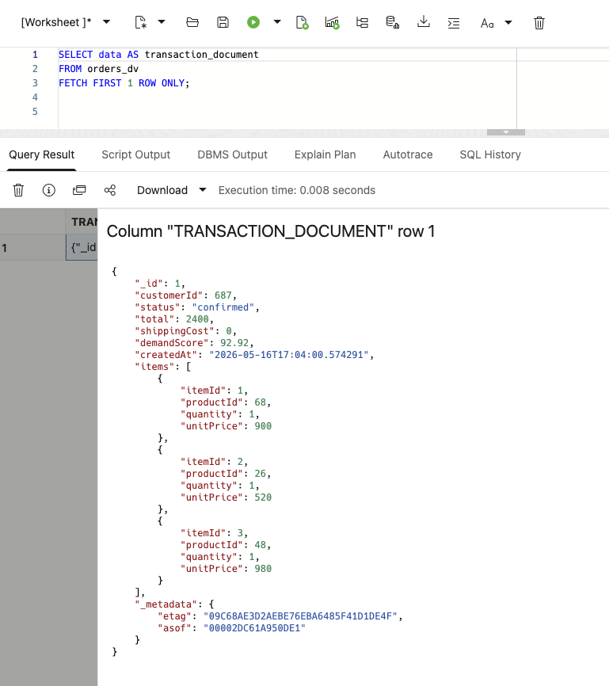
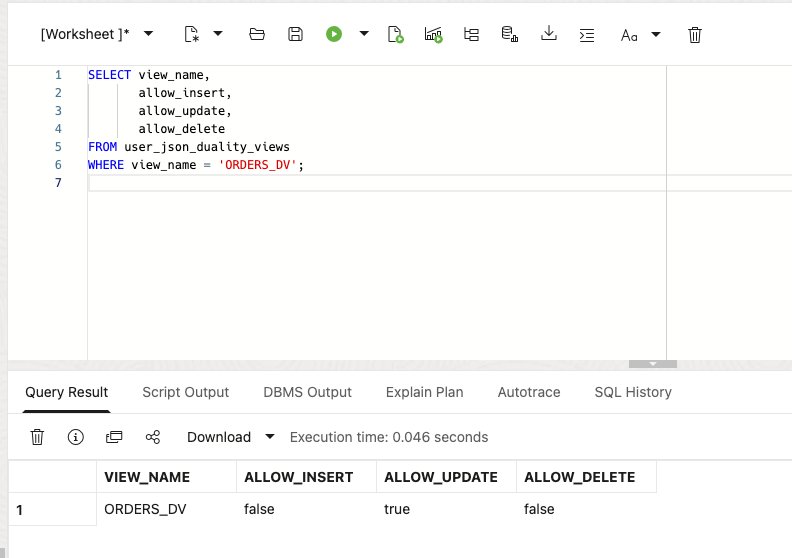
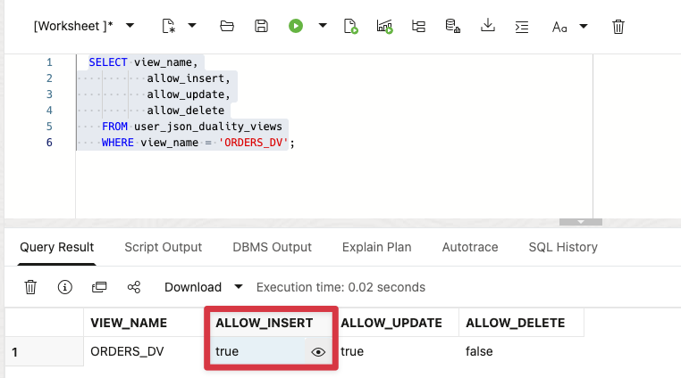
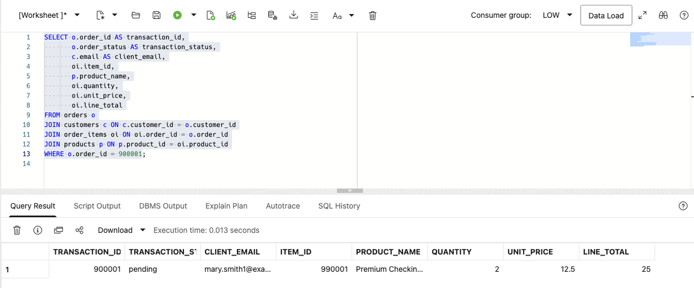
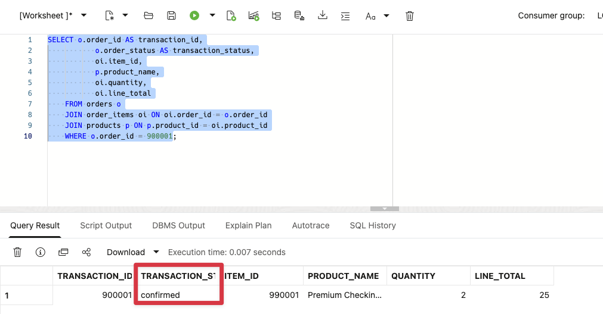
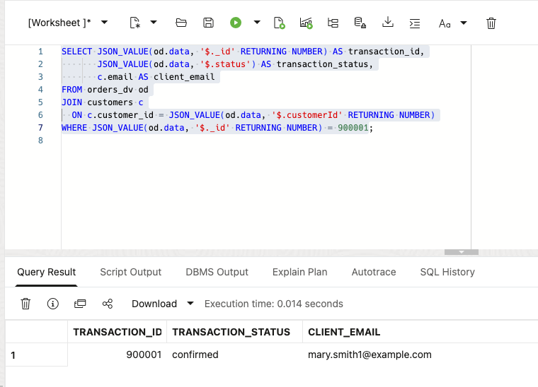
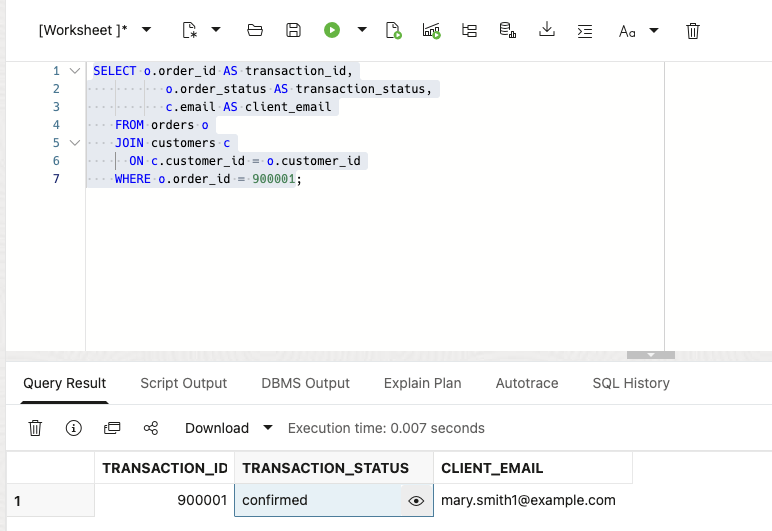

# Crear un JSON Application Model

## Introducción

Thomas Brune es un aplicación developer at Seer Bank. He y his equipo son building un new web y mobile aplicación para clientes. La equipo wants un faster cliente experience, con fewer round trips y payloads that match la screens y services they son building.

La aplicación requirements son documento-shaped. A cliente view may contain account details, transaction status, line items, y optional app-specific attributes. JSON gives Thomas la flexibility un evolve that shape como la producto changes. La datos ya lives in Oracle AI Base de datos, so his pregunta es how un use JSON sin giving up relacional keys, SQL, transactions, y base de datos controles.

Thomas asks Jessica, la DBA, un walk mediante three ways un work con JSON in Oracle AI Base de datos. They start con un JSON valor in un relacional tabla, then un collection de JSON documentos, y finally un JSON Relational Duality View over existente relacional filas. La goal es un choose la right approach para each aplicación feature sin creating un second copy de cliente datos.

<details>
<summary><strong>Key terms: JSON columnas, JSON collections, y JSON Relational Duality</strong></summary>

> - A **JSON columna** stores un JSON valor in un relacional tabla alongside normal typed columnas, keys, y constraints. Thomas puede use it para optional o changing aplicación attributes sin turning every new attribute en un schema change.
>
> - A **JSON collection** es un special tabla o view that provides un set de JSON documentos mediante one `JSON`-typed `DATA` columna. Each documento puede have un top-level `_id` used un identify it.
>
> - **JSON Relational Duality** lets Oracle Base de datos expose relacional datos como JSON documentos sin copying it en un separate documento base de datos. La aplicación gets la documento shape Thomas wants para its API. La base de datos keeps la relacional filas y controles.
>

</details>

Thomas's aplicación necesita un payload con la transaction y its line items together, such como this:

```json
{
  "_id": 513063,
  "customerId": 687,
  "status": "confirmed",
  "items": [
    { "productId": 1, "quantity": 2, "unitPrice": 12.50 }
  ]
}
```

La aplicación uses this documento shape, while la base de datos keeps la transaction y line items in relacional form. En este laboratorio, tú build y read this type de payload in three ways.

### Objetivos

- Store flexible aplicación attributes como JSON in un relacional tabla.
- Crear y consulta un JSON Collection Table de transaction documentos.
- Leer y update relacional transaction datos mediante `ORDERS_DV`.
- Comparar la three JSON approaches y choose la right one para un aplicación feature.

Tiempo estimado: **10 minutes**

### Escenario práctico

| Paso | Finanzas focus |
| --- | --- |
| Problema de negocio | Thomas's equipo necesita flexible JSON payloads para un new cliente web y mobile aplicación. |
| Reto técnico | La equipo necesita aplicación-friendly documentos while la base de datos keeps relacional keys, uniones, y controles. |
| Enfoque de la persona | Thomas tests JSON storage, collections, y duality con Jessica's base de datos guidance. |
| Lo que verás | One Oracle AI Base de datos supports several JSON acceso patterns over la finanzas datos. |
| Capacidad de la base de datos | Native JSON, SQL/JSON functions, y JSON Relational Duality work together. |
| Resultado | Thomas puede choose un aplicación shape sin creating un second cliente-datos store. |

Persona focus: Tú son Thomas, working con Jessica un decide how la new aplicación debe store, assemble, y read cliente transaction datos.

### Thomas's three JSON choices

Thomas does no necesita one JSON pattern para every feature. A JSON columna holds optional aplicación attributes in un relacional tabla. A JSON Collection Table holds documentos owned by la aplicación. A duality view assembles un documento de existente relacional tablas. Thomas uses la documento shape in la aplicación, while Jessica works con la underlying filas using SQL.

Esta keeps la transaction in one base de datos y avoids complex, expensive integration between separate systems. Thomas gets la documento shape his aplicación necesita, y Jessica keeps la relacional filas, SQL acceso, y base de datos controles.

> **SQL Worksheet reminder:** Need un reminder on how un open y use la SQL Worksheet? Return un [Getting Started Tarea 2: Open SQL Worksheet](?lab=getting-started#Tarea2:OpenSQLWorksheet) para la step-by-step guide on how un run SQL statements.

## Tarea 1: Store flexible aplicación datos como JSON

Thomas starts con datos that belongs un la aplicación but does no necesita its own relacional columnas. La workshop base de datos ya contains la transaction filas. He adds un small aplicación-datos tabla con un native `JSON` columna para optional screen y cliente-experience settings.

1. Crear la aplicación-datos tabla y add one sample payload.

    ```sql
    <copy>
    CREATE TABLE thomas_app_data (
        order_id  NUMBER PRIMARY KEY,
        app_data  JSON NOT NULL
    );

    INSERT INTO thomas_app_data (order_id, app_data)
    SELECT order_id,
           JSON_OBJECT(
               'screen'    VALUE 'transaction-detail',
               'showTotal' VALUE 'true' FORMAT JSON,
               'features'  VALUE JSON_ARRAY('live-status', 'saved-recipient')
               RETURNING JSON
           )
    FROM (
        SELECT order_id
        FROM orders
        ORDER BY order_id
        FETCH FIRST 1 ROW ONLY
    );

    COMMIT;
    </copy>
    ```

2. Leer valores de la JSON columna.

    ```sql
    <copy>
    SELECT order_id,
           JSON_VALUE(app_data, '$.screen') AS screen_name,
           JSON_VALUE(app_data, '$.showTotal' RETURNING BOOLEAN) AS show_total,
           JSON_QUERY(app_data, '$.features') AS app_features
    FROM thomas_app_data;
    </copy>
    ```

    `ORDER_ID` remains un relacional key. `APP_DATA` puede change como la aplicación changes. Thomas puede consulta both con SQL in one tabla.

## Tarea 2: Crear un JSON Collection Table

Thomas now necesita un collection de aplicación documentos. Unlike la JSON columna in Tarea 1, this object es un JSON Collection Table: each fila es un documento, la documento es stored in `DATA`, y `_id` identifies la documento.

1. Crear la collection y add la sample transaction documento.

    ```sql
    <copy>
    CREATE JSON COLLECTION TABLE thomas_transaction_docs
    WITH ETAG;

    INSERT INTO thomas_transaction_docs (data)
    SELECT JSON_OBJECT(
               '_id'        VALUE o.order_id,
               'customerId' VALUE o.customer_id,
               'status'     VALUE o.order_status,
               'items'      VALUE (
                   SELECT JSON_ARRAYAGG(
                              JSON_OBJECT(
                                  'itemId'    VALUE oi.item_id,
                                  'productId' VALUE oi.product_id,
                                  'quantity'  VALUE oi.quantity,
                                  'unitPrice' VALUE oi.unit_price
                                  RETURNING JSON
                              ) ORDER BY oi.item_id RETURNING JSON
                          )
                   FROM order_items oi
                   WHERE oi.order_id = o.order_id
               ) FORMAT JSON
               RETURNING JSON
           )
    FROM orders o
    JOIN thomas_app_data t ON t.order_id = o.order_id;

    COMMIT;
    </copy>
    ```

    `WITH ETAG` adds un `_metadata.etag` valor un each documento. Oracle changes la tag whenever la documento changes. Thomas's aplicación puede send la tag it last read cuando it updates un documento. Si la tag no longer matches, la aplicación knows that someone else changed la documento first y puede avoid overwriting la newer version. Esta protects cliente datos cuando web y mobile requests try updating la mismo documento at la mismo time.

2. Consulta la collection como documentos.

    ```sql
    <copy>
    SELECT JSON_SERIALIZE(data PRETTY) AS transaction_document
    FROM thomas_transaction_docs
    WHERE JSON_VALUE(data, '$._id' RETURNING NUMBER) =
          (SELECT order_id FROM thomas_app_data);
    </copy>
    ```

    Thomas now has un documento collection that un documento API puede acceso, y SQL puede consulta la mismo `DATA` columna. La collection stores la documentos; it es separate de la relacional `ORDERS` y `ORDER_ITEMS` tablas.

## Tarea 3: Leer un cliente documento de relacional datos

Thomas now tests la documento shape his aplicación puede consume directly.

1. Ejecutar this consulta:


    Esta consulta selects la JSON `DATA` columna de `ORDERS_DV` so Thomas puede inspect la documento shape in SQL Worksheet.

    <details>
    <summary><strong>Why this matters un Thomas</strong></summary>

    > Thomas puede use un JSON Collection Table cuando la aplicación owns la documento. But la transaction ya has relacional tablas that Jessica y other teams rely on.
    > La duality view gives Thomas un documento over those existente filas. He puede choose la aplicación shape sin copying la transaction en another store.

    </details>

    ```sql
    <copy>
    SELECT data AS transaction_document
    FROM orders_dv
    FETCH FIRST 1 ROW ONLY;
    </copy>
    ```

    **Resultado esperado:**

    

2. Expand la documento in SQL Worksheet.
    La consulta reads la duality view como un documento source. Oracle constructs la JSON shape de relacional datos, so la aplicación gets un transaction payload sin un second copy de la transaction record.

    La \_id valor appears in la JSON documento while la source datos remains relacional. La payload includes `customerId`, `status`, totals, timestamps, y line items. La aplicación gets these fields sin un second transaction store.

    La mismo transaction now has two useful forms: API-ready JSON para la aplicación y relacional filas para analysis.

    > **Nota:** Mirar para `_metadata.etag` in la documento. La ETAG changes cuando la documento changes, so Thomas's aplicación puede detect un newer version antes de updating la transaction y avoid overwriting another request.

## Tarea 4: Enable documento inserts y updates

La existente `ORDERS_DV` lets un aplicación update un existente transaction documento. In this task, tú extend that contract so la aplicación puede también create one. La base de datos continues un control la relacional tablas, keys, y constraints. La duality view puede también act como un seguridad boundary. Thomas's aplicación receives solo la documento fields y write operations exposed by la view, sin direct acceso un la underlying tablas.

1. Comprobar la current documento-write capabilities.

    ```sql
    <copy>
    SELECT view_name,
           allow_insert,
           allow_update,
           allow_delete
    FROM user_json_duality_views
    WHERE view_name = 'ORDERS_DV';
    </copy>
    ```

    **Resultado esperado: Current Document Capabilities**

    

    La view currently allows updates but no new top-level documentos. La root `ORDERS` tabla controles documento insertion. La nested `ORDER_ITEMS` filas debe también allow inserts so la documento puede include line items.

2. Enable insert y update para la documento y its line items.

    Tú son changing la duality-view definition, no creating un second API store. La two `WITH INSERT UPDATE` clauses allow developers un create y update la JSON documento. Oracle todavíun enforces la relacional keys y datos types.

    ```sql
    <copy>
    CREATE OR REPLACE JSON RELATIONAL DUALITY VIEW orders_dv AS
    SELECT JSON {
        '_id'         : o.order_id,
        'customerId'  : o.customer_id,
        'status'      : o.order_status,
        'total'       : o.order_total,
        'shippingCost': o.shipping_cost,
        'demandScore' : o.demand_score,
        'createdAt'   : o.created_at,
        'items' : [
            SELECT JSON {
                'itemId'    : oi.item_id,
                'productId' : oi.product_id,
                'quantity'  : oi.quantity,
                'unitPrice' : oi.unit_price
            }
            FROM order_items oi WITH INSERT UPDATE
            WHERE oi.order_id = o.order_id
        ]
    }
    FROM orders o WITH INSERT UPDATE;
    </copy>
    ```

    Esta duality view uses two relacional tablas. `ORDERS` provides la documento root. Related `ORDER_ITEMS` filas become la nested `items` collection. La `WITH INSERT UPDATE` clauses let Thomas write la complete JSON documento while Oracle maintains la filas y relationships.

    **Resultado esperado: View Definition Updated**

    Oracle created o replaced la duality view. Verify la new capabilities in la next step.

2. Ejecutar la capability consulta again.

    ```sql
    <copy>
    SELECT view_name,
           allow_insert,
           allow_update,
           allow_delete
    FROM user_json_duality_views
    WHERE view_name = 'ORDERS_DV';
    </copy>
    ```

    **Resultado esperado: Document Capabilities Enabled**

    

    La view puede now receive un new JSON transaction documento y apply un documento update. Thomas has un documento API over la existente relacional transaction datos. He puede use it para un cliente feature such como submitting un new pedido. La aplicación sends one documento, y la base de datos writes la pedido y its line items un la relacional tablas.

## Tarea 5: Crear y update un JSON transaction

Thomas now tests un complete cliente transaction. He creates it como one nested JSON documento, then confirms that Jessica puede immediately see la mismo datos como structured relacional filas.

1. Insert la supplied workshop transaction documento.

    La `INSERT` targets `ORDERS_DV`, la JSON Relational Duality View, rather than la underlying `ORDERS` o `ORDER_ITEMS` tablas. La base de datos uses la view definition un write la documento un those relacional tablas. La documento uses transaction ID `900001`, cliente `1`, y producto `1`. It includes one nested line item. La statement es safe un run again: después de la transaction exists, it inserts zero filas y preserves la existente record. On la first run, la new transaction has status `pending`.

    ```sql
    <copy>
    INSERT INTO orders_dv (data)
    SELECT JSON(
      '{
        "_id": 900001,
        "customerId": 1,
        "status": "pending",
        "total": 25.00,
        "shippingCost": 0,
        "items": [
          {
            "itemId": 990001,
            "productId": 1,
            "quantity": 2,
            "unitPrice": 12.50
          }
        ]
      }'
    )
    WHERE NOT EXISTS (
      SELECT 1
      FROM orders
      WHERE order_id = 900001
    );

    COMMIT;
    </copy>
    ```

    **Resultado esperado: Transaction Document Created**

    On la first run, tú insert one documento. On later runs, la `NOT EXISTS` check returns zero filas porque la workshop transaction es ya present.

2. Confirmar la JSON documento became relacional filas.

    >**Nota**: We son querying here la relacional tablas `ORDERS` y `ORDER_ITEMS`!

    ```sql
    <copy>
    SELECT o.order_id AS transaction_id,
           o.order_status AS transaction_status,
           c.email AS client_email,
           oi.item_id,
           p.product_name,
           oi.quantity,
           oi.unit_price,
           oi.line_total
    FROM orders o
    JOIN customers c ON c.customer_id = o.customer_id
    JOIN order_items oi ON oi.order_id = o.order_id
    JOIN products p ON p.product_id = oi.product_id
    WHERE o.order_id = 900001;
    </copy>
    ```

    **Resultado esperado: Created Transaction Rows**

    

3. Update la documento status mediante la duality view.

    Esta update changes JSON datos mediante `ORDERS_DV`. La allowed modification here es la documento's `status` field, which Oracle maps un `ORDERS.ORDER_STATUS`; Thomas's aplicación es no given unrestricted updates un la underlying tablas. He does no necesita aplicación-side parsing o un second transaction store.

    ```sql
    <copy>
    UPDATE orders_dv
    SET data = JSON_TRANSFORM(data, SET '$.status' = 'confirmed')
    WHERE JSON_VALUE(data, '$._id' RETURNING NUMBER) = 900001;

    COMMIT;
    </copy>
    ```

    **Resultado esperado: Transaction Status Updated**

    Oracle updates one documento. La following consulta confirms that la relacional pedido fila now has status `confirmed`.

4. Verify la updated relacional status.

    ```sql
    <copy>
    SELECT o.order_id AS transaction_id,
           o.order_status AS transaction_status,
           oi.item_id,
           p.product_name,
           oi.quantity,
           oi.line_total
    FROM orders o
    JOIN order_items oi ON oi.order_id = o.order_id
    JOIN products p ON p.product_id = oi.product_id
    WHERE o.order_id = 900001;
    </copy>
    ```

    **Resultado esperado: Updated Transaction Rows**

    

## Tarea 6: Project JSON fields con SQL

Thomas has confirmed that la aplicación puede display y update la documento. Jessica now checks la mismo transaction con SQL antes de la feature goes live. She uses la relacional tablas para normal reporting y analysis. Here, she consultas `ORDERS_DV` un verify la exact JSON contract that Thomas's aplicación receives. She puede también project fields de la documento un test cliente-service searches y status filters. In this context, "project" means pulling selected valores out de la JSON documento y displaying them como SQL resultado columnas.

1. Ejecutar this SQL/JSON projection consulta:

    Thomas's documento es todavíun disponible para SQL analysis. La mismo transaction shape puede be queried, filtered, y joined un relacional cliente datos.

    La SQL uses `JSON_VALUE` un extract transaction fields de la duality documento. That es la projection step. It returns la transaction ID y status, reads la embedded cliente identifier, uniones that identifier un `CUSTOMERS`, y pedidos la resultado para review.

    Thomas does no necesita un hand-build this documento in la aplicación o copy la transaction un un separate documento store. La aplicación gets JSON, while Jessica todavíun has SQL acceso un la mismo transaction filas.

    ```sql
    <copy>
    SELECT JSON_VALUE(od.data, '$._id' RETURNING NUMBER) AS transaction_id,
           JSON_VALUE(od.data, '$.status') AS transaction_status,
           c.email AS client_email
    FROM orders_dv od
    JOIN customers c
      ON c.customer_id = JSON_VALUE(od.data, '$.customerId' RETURNING NUMBER)
    WHERE JSON_VALUE(od.data, '$._id' RETURNING NUMBER) = 900001;
    </copy>
    ```

    **Resultado esperado: JSON Field Projection**

    

2. Ejecutar la equivalent consulta against la relacional tablas.

    ```sql
    <copy>
    SELECT o.order_id AS transaction_id,
           o.order_status AS transaction_status,
           c.email AS client_email
    FROM orders o
    JOIN customers c
      ON c.customer_id = o.customer_id
    WHERE o.order_id = 900001;
    </copy>
    ```

    

    Comparar la resultado con la previous consulta. La transaction ID, status, y client email debe match. Thomas's aplicación es reading la JSON documento, while Jessica's relacional consulta reads la underlying filas.

## Conclusión: Choose la right JSON approach

Thomas does no have un choose one JSON modelo para la whole aplicación. He puede choose based on who owns la datos y whether la aplicación necesita un documento over existente relacional filas.

| Approach                          | Usar it cuando                                                                                 | Example in Thomas's aplicación                                                                            | Where la datos lives                                                                                           |
| -----------------------------------| ---------------------------------------------------------------------------------------------| ------------------------------------------------------------------------------------------------------------| ----------------------------------------------------------------------------------------------------------------|
| JSON columna in un relacional tabla | A relacional record necesita optional o changing attributes.                                  | Store screen settings o cliente experience options alongside un transaction key.                          | A normal relacional tabla con un native `JSON` columna.                                                         |
| JSON Collection Table             | La aplicación owns un set de JSON documentos y necesita documento-style acceso.               | Store saved checkout drafts that may change como clientes add o remove items.                              | A JSON Collection Table con one documento in each `DATA` fila.                                                  |
| JSON Relational Duality View      | La datos ya belongs in relacional tablas, but la aplicación necesita one JSON documento. | Return un cliente transaction con its status y line items, o accept un new pedido documento de la app. | Relational tablas such como `ORDERS` y `ORDER_ITEMS`; la duality view defines la JSON shape para Thomas' app. |

For Thomas, `ORDERS_DV` es la right choice para la transaction feature porque `ORDERS` y `ORDER_ITEMS` ya hold governed finanzas datos. La aplicación gets la JSON payload it necesita, while Jessica keeps SQL, relacional constraints, y controlled acceso un la mismo datos.


## Agradecimientos

* **Author** - Kevin Lazarz
* **Contributor** - Eugenio Galiano
* **Last Updated By/Date** - Oracle Base de datos Product Management, August 2026
