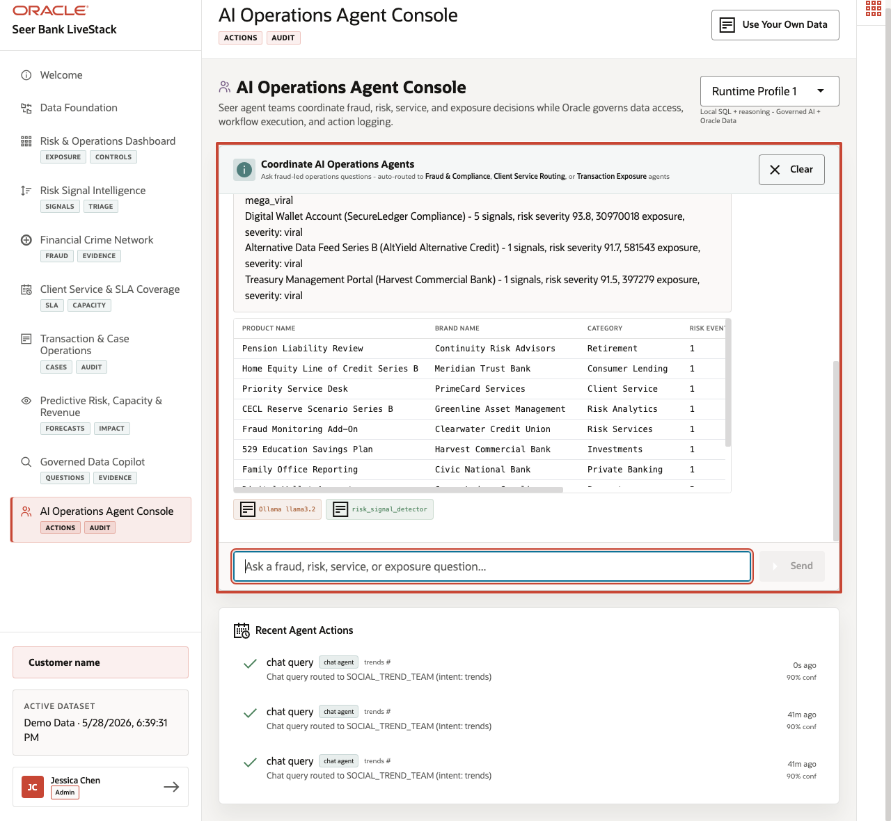

# AI Operations Agent Console: Trusted Actions

## Introduction

This lab uses database-backed helper functions behind the agent console pattern. You call a function that summarizes current risk signals, log an agent decision, and review the audit trail.

The final operating step is controlled action. An AI-assisted workflow should not only summarize risk; it should use approved tools and leave a durable record of what action was proposed or taken.

This is the last step in the story: after evidence is found, ranked, investigated, and governed, the bank needs an action record. The lab shows that an AI-assisted workflow can use approved database tools and leave an audit row.



### Objectives

- Call the risk signal helper function.
- Log and inspect an agent decision.

Estimated Time: **8 minutes**

### Operating Story

| Step | Finance focus |
| --- | --- |
| Business Problem | AI-assisted operations need a record of what was decided, why, and when. |
| Technical Challenge | Agent workflows need controlled tools and durable audit rows instead of untracked chat actions. |
| Persona Focus | Operations leaders review actions; AI engineers and database developers expose approved PL/SQL tools and audit records. |
| What You Will Prove | PL/SQL tools can return grounded summaries and write auditable action history. |
| Database Capability | Stored functions and AGENT\_ACTIONS provide controlled tool execution and audit records. |
| Outcome | Agent workflows become reviewable database events instead of untracked chat output. |

Persona focus: You support the operations leader by turning an AI-assisted action into a database event that can be inspected and governed.

## Task 1: Call the trend detection function

1. Run the approved PL/SQL helper function.

    ```sql
    <copy>
    SELECT detect_trending_products(48, 50) AS risk_signal_summary
    FROM dual;
    </copy>
    ```

    Expected output: Risk Signal Tool Summary

    | Risk Signal Summary |
    | --- |
    | Found 10 critical financial products (last 48h): Options Trading Enablement (Civic National Bank) - 1 signals, risk severity 72.3, 512667 exposure,... |


2. Review the summary text.
    The function packages query logic behind a controlled tool interface. That gives an agent a safe way to summarize current risk without generating unsupported text from outside the database.

    Expected output starts with a phrase like `Found 10 critical financial products`. The function turns current signal data into an operations-ready summary that an agent or analyst can use to decide what needs escalation.

    This matters because the summary is produced by an approved database function, not by free-form interpretation outside the governed data boundary.

## Task 2: Log an auditable agent action

1. Log a validation action.

    ```sql
    <copy>
    SELECT log_agent_decision(
             'RISK_SIGNAL_TEAM',
             'ESCALATE',
             'RISK_SIGNAL',
             'Workshop validation escalation based on critical signal exposure'
           ) AS result
    FROM dual;
    </copy>
    ```

    Expected output: Agent Decision Result

    | Result |
    | --- |
    | Decision logged: ESCALATE by RISK\_SIGNAL\_TEAM |


2. Inspect the latest audit rows.

    ```sql
    <copy>
    SELECT agent_name,
           action_type,
           entity_type,
           execution_status,
           executed_at
    FROM agent_actions
    ORDER BY action_id DESC
    FETCH FIRST 5 ROWS ONLY;
    </copy>
    ```

    Expected output: Agent Action Audit Trail

    | Agent Name | Action Type | Entity Type | Execution Status | Executed At |
    | --- | --- | --- | --- | --- |
    | RISK\_SIGNAL\_TEAM | ESCALATE | RISK\_SIGNAL | completed | timestamp varies |
    | RISK\_SIGNAL\_TEAM | ESCALATE | RISK\_SIGNAL | completed | timestamp varies |
    | RISK\_SIGNAL\_TEAM | ESCALATE | RISK\_SIGNAL | completed | timestamp varies |
    | RISK\_SIGNAL\_TEAM | ESCALATE | RISK\_SIGNAL | completed | timestamp varies |
    | RISK\_SIGNAL\_TEAM | ESCALATE | RISK\_SIGNAL | completed | timestamp varies |


3. Confirm the action is recorded.
    The first query writes the action; the second proves the write is visible in the audit trail. Together they show the difference between an AI suggestion and an operational action the bank can review.

    The audit row is the database evidence that the action occurred. It records who the agent acted as, what action was requested, what entity type was affected, the execution status, and the timestamp.

    This closes the workshop story: the same database foundation that produced risk evidence also records the AI-assisted operational response for later review.


## Acknowledgements

* **Author** - Pat Shepherd, Senior Principal Database Product Manager
* **Contributor** - Linda Foinding, Principal Database Product Manager
* **Last Updated By/Date** - Oracle Database Product Management, June 2026
