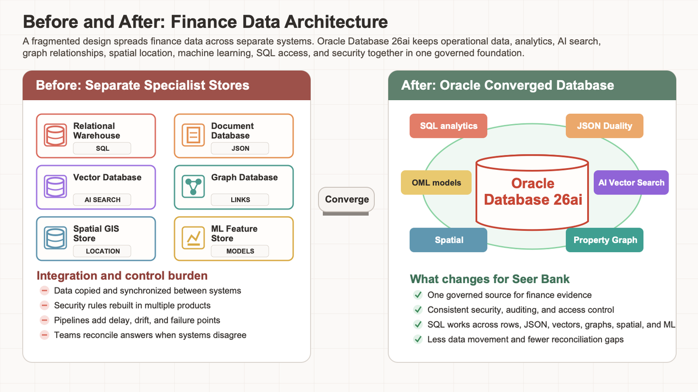

# Finance Data Foundation

## Introduction

This lab confirms that the current Seer Bank data foundation is present before any finance result is trusted. Learners inspect semantic views, core data groups, JSON duality, vectors, graphs, spatial objects, and Oracle Machine Learning (OML) models as the shared evidence base for the rest of the workshop.

The goal is simple: see how different finance decisions connect to one database before you start using the data.

The point is to understand what is available before you start asking business questions. Dashboard metrics, JSON documents, vector matches, graph paths, spatial distances, and OML scores all connect back to this shared database foundation.

Think of this lab as the map of the finance environment. The same schema supports the risk dashboard, transaction API, semantic search, financial-crime graph, service coverage, and prediction.

Oracle Database 26ai is a converged database: it lets these different finance workloads use one governed database foundation instead of forcing each data type into a separate specialist system.



<details>
<summary><strong>Key terms: schema, view, JSON duality view, vector, graph, spatial, and Oracle Machine Learning (OML)</strong></summary>

> - A **schema** is a named workspace inside the database. It owns objects such as tables, views, models, vectors, spatial metadata, and graph definitions. In this workshop, `LLUSER` is the schema you use, so it is the place where the finance evidence is organized and secured.
>
> - A **view** is a saved SQL query that presents data in a useful shape. A semantic finance view gives you business-friendly columns, such as products, institutions, transactions, or signals, without making you understand every underlying table. Views help application and analytics teams use consistent definitions instead of rebuilding the same joins in many places.
>
> - A **JSON duality view** exposes relational rows as JSON documents without copying the data into a separate document store. In this workshop, `ORDERS_DV` gives applications a transaction document while analysts keep SQL access to the governed relational source.
>
> - A **vector** is a numerical representation of meaning. In this workshop, finance product descriptions and risk-signal text can be converted into vectors so the database can compare ideas, not only exact words. That is what lets a search for one phrase find related finance language.
>
> - A **property graph** represents entities and relationships. Entities can be accounts, devices, phone numbers, IP addresses, payees, or cases. Relationships explain how those entities are connected, which is essential when a fraud pattern is visible only through shared devices, shared contact details, or multi-hop account links.
>
> - **Spatial** data stores location and shape information. A service center can be a point, a demand region can be a boundary, and an SLA zone can be a service area. Oracle Spatial lets you calculate distance and coverage with SQL instead of exporting location data to a separate mapping system.
>
> - **Oracle Machine Learning (OML)** lets you build, store, and score models inside Oracle Database, where the finance records already live. That keeps predictions closer to the governed data that produced them.

</details>

The image below is the Data Foundation page from the Seer Bank application. It shows the shared finance data domains that support the rest of the experience: financial products, clients, transactions, cases, regulatory signals, service geography, vectors, and machine learning outputs. In this lab, you use SQL to inspect that foundation directly instead of treating the application screen as a black box.


### Objectives

- Review the finance semantic views.
- Check the scale of the current data.
- Map each application page to the Oracle Database 26ai capability that supports the related finance decision.

Estimated Time: **10 minutes**

### Business Scenario

| Step | Finance focus |
| --- | --- |
| Business Problem | Risk, fraud, service, and prediction workflows need a shared view of the finance data they use to make decisions. |
| Technical Challenge | Platform teams must show how the same schema supports semantic views, JSON duality, vectors, graphs, spatial data, and OML models. |
| Persona Focus | Database developers and platform engineers map the foundation that business users rely on for downstream evidence. |
| What You Will See | The current Finance LiveStack application uses connected views and object families in one database schema. |
| Database Capability | Oracle catalog views and finance semantic views expose the governed object inventory. |
| Outcome | Each finance result can be traced back to the same queryable data foundation. |

Persona focus: You are the database developer showing how Seer Bank's shared foundation supports risk, fraud, service, and prediction workflows.

## Task 1: Inventory the finance object families

Perform the following set of steps to inventory the semantic views and database capabilities used later in the workshop:

1. Run this inventory query:

    > **SQL Worksheet reminder:** Need a reminder on how to open and use the SQL Worksheet? Return to [Getting Started Task 2: Open SQL Worksheet](/workshops/sandbox/index.html?lab=getting-started#Task2:OpenSQLWorksheet) for the step-by-step graphic showing where to paste and run SQL statements.

    You are building a simple capability map before making any finance decisions. You do not need to memorize this catalog SQL. The purpose is to ask Oracle Database, "What finance capabilities are available in this schema?"

    Each section counts one kind of capability used by the active workshop labs: approved finance views for reporting, JSON duality for transaction documents, the fraud property graph for relationship analysis, vector columns for meaning-based search, spatial metadata for service coverage, and OML models for prediction. The `UNION ALL` lines stack those counts into one easy-to-read table.

    The names ending in `_V` are database views. A view is a saved SQL query that presents governed data in a business-ready shape. In this lesson, `FINANCE_INSTITUTIONS_V` and `FINANCE_PRODUCTS_V` describe the finance catalog, `RISK_SIGNALS_V` and `SIGNAL_SOURCES_V` organize risk evidence, `CLIENT_TRANSACTIONS_V` exposes transaction activity, and the `SERVICE_*_V` views support service-center, capacity, and route analysis. The `ORDERS_DV` duality view supports the transaction document lab. Counting these objects matters because later labs use them as trusted access points instead of asking you to rebuild the same joins or document shape each time.

    <details>
    <summary><strong>Why this matters: easier in a converged database</strong></summary>

    > In a fractured environment, you might look in one system for reporting views, another for JSON documents, another for graph objects, another for vector indexes, another for spatial metadata, and another for machine learning models. Each system can have its own security, metadata, and operational rules.
    >
    > Oracle Database lets you inspect these object families from one schema using SQL catalog views. That makes it easier to understand what is available before you start making finance decisions.

    </details>

    ```sql
    <copy>
    SELECT 'Finance semantic views' AS "Area", COUNT(*) AS "Count"
    FROM user_views
    WHERE view_name IN (
      'FINANCE_INSTITUTIONS_V','FINANCE_PRODUCTS_V','RISK_SIGNALS_V',
      'SIGNAL_SOURCES_V','CLIENT_TRANSACTIONS_V','SERVICE_CENTERS_V',
      'SERVICE_CAPACITY_V','SERVICE_ROUTES_V'
    )
    UNION ALL
    SELECT 'JSON duality views', COUNT(*)
    FROM user_json_duality_views
    WHERE view_name = 'ORDERS_DV'
    UNION ALL
    SELECT 'Finance property graphs', COUNT(*)
    FROM user_property_graphs
    WHERE graph_name = 'FRAUD_NETWORK'
    UNION ALL
    SELECT 'MiniLM vector columns', COUNT(*)
    FROM user_tab_cols
    WHERE data_type = 'VECTOR'
      AND table_name IN ('PRODUCT_EMBEDDINGS','SIGNAL_EMBEDDINGS')
    UNION ALL
    SELECT 'Spatial metadata layers', COUNT(*)
    FROM user_sdo_geom_metadata
    WHERE table_name IN ('FULFILLMENT_CENTERS','FULFILLMENT_ZONES','DEMAND_REGIONS')
    UNION ALL
    SELECT 'OML mining models', COUNT(*)
    FROM user_mining_models
    WHERE model_name IN (
      'DEMAND_SURGE_MODEL','CUSTOMER_SEGMENT_MODEL',
      'REVENUE_PREDICT_MODEL','PRODUCT_CLUSTER_MODEL'
    );
    </copy>
    ```

    **Expected output: Foundation Object Inventory**

    | Area | Count |
    | --- | --- |
    | Finance semantic views | 8 |
    | JSON duality views | 1 |
    | Finance property graphs | 1 |
    | MiniLM vector columns | 2 |
    | Spatial metadata layers | 3 |
    | OML mining models | 4 |


2. Review the counts.
    Read the result as a capability checklist. The query reads Oracle catalog views instead of application tables, so it tells you what kinds of database objects are available before you start using them.

    If you are looking at risk metrics, the semantic views are where trusted finance data comes from. If an application needs transaction documents, the duality view provides that shape without a separate document copy. If you are investigating fraud, the property graph is what lets you follow relationships. If you need meaning-based search, vector columns support that. If you need service coverage, spatial metadata tells Oracle how to interpret geometry columns. If you need predictions, OML models are available.

    Treat this as the capability map for the finance application. Each row points to a business use you will work with in SQL.

**Note:** Sample values may change after data refreshes or rebuilds. Focus on the expected result pattern and the business takeaway, not the exact values.    

## Task 2: Count the current finance data groups

The next query shows the scale of the finance scenario behind the application pages.

1. Run this data group count query:

    You are sizing the finance scenario so later dashboard, graph, search, spatial, and prediction results have context. The SQL counts rows from the business-facing finance views and core tables, then combines those counts into one table with `UNION ALL`.

    The `_v` objects in this query are the lowercase SQL references to the same finance views you inventoried earlier. `finance_institutions_v` and `finance_products_v` give you the business catalog, `risk_signals_v` and `signal_sources_v` give you monitored risk evidence, `client_transactions_v` gives you transaction activity, and `service_centers_v` gives you the service locations used later for spatial analysis. Their value here is consistency: the counts come from the same governed access layer later labs query for business evidence.

    Each row tells you how much data exists for one part of the finance environment.

    ```sql
    <copy>
    SELECT 'Institutions' AS "Data Group", COUNT(*) AS "Rows" FROM finance_institutions_v
    UNION ALL SELECT 'Financial products', COUNT(*) FROM finance_products_v
    UNION ALL SELECT 'Risk signals', COUNT(*) FROM risk_signals_v
    UNION ALL SELECT 'Signal sources', COUNT(*) FROM signal_sources_v
    UNION ALL SELECT 'Client transactions', COUNT(*) FROM client_transactions_v
    UNION ALL SELECT 'Service centers', COUNT(*) FROM service_centers_v
    UNION ALL SELECT 'SLA zones', COUNT(*) FROM fulfillment_zones
    UNION ALL SELECT 'Demand regions', COUNT(*) FROM demand_regions
    UNION ALL SELECT 'Fraud entities', COUNT(*) FROM fraud_entities
    UNION ALL SELECT 'Fraud relationships', COUNT(*) FROM fraud_relationships;
    </copy>
    ```

    **Expected output: Finance Row Counts**

    | Data Group | Rows |
    | --- | --- |
    | Institutions | 50 |
    | Financial products | 79 |
    | Risk signals | 5000 |
    | Signal sources | 463 |
    | Client transactions | 3000 |
    | Service centers | 30 |
    | SLA zones | 120 |
    | Demand regions | 20 |
    | Fraud entities | 25 |
    | Fraud relationships | 35 |


2. Use the counts as the baseline for later analysis.
    This query reads the business-facing finance views and core tables that you will aggregate, search, traverse, score, or audit. It gives you a concrete sense of the data population before you inspect specific risk and operations results.

    These counts establish the scale of the finance scenario: products and institutions provide the business catalog, risk signals and transactions drive the dashboard, service centers and SLA zones support operations, and fraud entities plus relationships support the graph investigation.

    The baseline helps you interpret focused results. When a query returns only a few rows, you can understand why: the SQL is filtering, ranking, scoring, or following relationships from this larger population.

## Acknowledgements

* **Author** - Pat Shepherd, Senior Principal Database Product Manager
* **Contributor** - Linda Foinding, Principal Database Product Manager
* **Last Updated By/Date** - Oracle Database Product Management, June 2026
