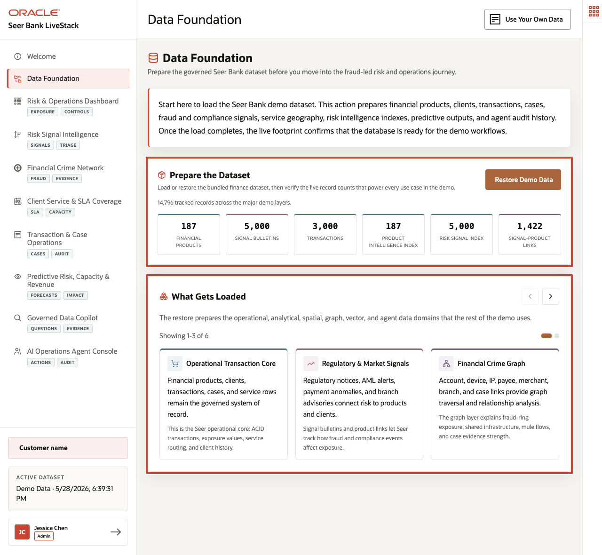

# Finance Data Foundation

## Introduction

This lab confirms that the current Seer Bank data foundation is present. You inspect finance semantic views, core data groups, vectors, graphs, spatial objects, OML models, and agent functions before relying on later results.

The rest of the workshop depends on this foundation. If these views and object families are missing, later dashboard metrics, vector matches, graph paths, spatial distances, OML scores, copilot answers, and agent audit rows cannot be trusted as one connected operating story.

Think of this lab as the readiness checkpoint before any business decision. The goal is to prove that the same schema can support the risk dashboard, transaction API, semantic search, financial-crime graph, service coverage, prediction, governed answers, and agent action history.



### Objectives

- Confirm the finance semantic views are present.
- Check the scale of the current data.
- Map application pages to Oracle Database 26ai capabilities.

Estimated Time: **10 minutes**

### Operating Story

| Step | Finance focus |
| --- | --- |
| Business Problem | Later risk, prediction, and agent outputs are not trustworthy unless the shared finance data foundation is complete. |
| Technical Challenge | Platform teams must confirm that the same schema supports semantic views, vectors, graphs, spatial data, OML models, and PL/SQL tools. |
| Persona Focus | Database developers and platform engineers validate the foundation before business users rely on downstream evidence. |
| What You Will Prove | The schema contains the views and object families used by the current Finance LiveStack application. |
| Database Capability | Oracle catalog views and finance semantic views expose the governed object inventory. |
| Outcome | Every later lab starts from a known and queryable finance foundation. |

Persona focus: You are the database developer proving that Seer Bank's shared foundation is ready for risk, operations, prediction, and AI workflows.

## Task 1: Inventory the finance object families

1. Run this inventory query to check the semantic views and database features used later in the workshop.

    ```sql
    <copy>
    SELECT 'Finance semantic views' AS "Area", COUNT(*) AS "Count"
    FROM user_views
    WHERE view_name IN (
      'FINANCE_INSTITUTIONS_V','FINANCE_PRODUCTS_V','RISK_SIGNALS_V',
      'SIGNAL_SOURCES_V','CLIENT_TRANSACTIONS_V','SERVICE_CENTERS_V',
      'SERVICE_CAPACITY_V','SERVICE_ROUTES_V'
    )
    UNION ALL
    SELECT 'Finance property graphs', COUNT(*)
    FROM user_property_graphs
    WHERE graph_name IN ('FRAUD_NETWORK','INFLUENCER_NETWORK')
    UNION ALL
    SELECT 'MiniLM vector columns', COUNT(*)
    FROM user_tab_cols
    WHERE data_type = 'VECTOR'
      AND table_name IN ('PRODUCT_EMBEDDINGS','SIGNAL_EMBEDDINGS')
    UNION ALL
    SELECT 'OML mining models', COUNT(*)
    FROM user_mining_models
    WHERE model_name IN (
      'DEMAND_SURGE_MODEL','CUSTOMER_SEGMENT_MODEL',
      'REVENUE_PREDICT_MODEL','PRODUCT_CLUSTER_MODEL'
    )
    UNION ALL
    SELECT 'Agent helper functions', COUNT(*)
    FROM user_objects
    WHERE object_type = 'FUNCTION'
      AND object_name IN (
        'DETECT_TRENDING_PRODUCTS','CHECK_PRODUCT_INVENTORY',
        'FIND_BEST_FULFILLMENT','GET_INFLUENCER_NETWORK','LOG_AGENT_DECISION'
      );
    </copy>
    ```

    Expected output: Foundation Object Inventory

    | Area | Count |
    | --- | --- |
    | Finance semantic views | 8 |
    | Finance property graphs | 2 |
    | MiniLM vector columns | 2 |
    | OML mining models | 4 |
    | Agent helper functions | 5 |


2. Review the counts.
    The query reads Oracle catalog views instead of application tables. That is intentional: before trusting any business output, the platform team needs proof that the database objects behind each later lab exist in the learner schema.

    The rows confirm that the workshop schema contains every major capability used later: semantic views for governed SQL, property graphs for fraud reach, vector columns for semantic search, OML models for prediction, and helper functions for controlled agent actions.

    Treat this as a readiness check. A zero or lower-than-expected count tells you which later lab would fail or lose business context.

## Task 2: Count the current finance data groups

1. Run this data group count query.

    ```sql
    <copy>
    SELECT 'Institutions' AS "Data Group", COUNT(*) AS "Rows" FROM finance_institutions_v
    UNION ALL SELECT 'Financial products', COUNT(*) FROM finance_products_v
    UNION ALL SELECT 'Risk signals', COUNT(*) FROM risk_signals_v
    UNION ALL SELECT 'Signal sources', COUNT(*) FROM signal_sources_v
    UNION ALL SELECT 'Client transactions', COUNT(*) FROM client_transactions_v
    UNION ALL SELECT 'Service centers', COUNT(*) FROM service_centers_v
    UNION ALL SELECT 'SLA zones', COUNT(*) FROM fulfillment_zones
    UNION ALL SELECT 'Demand regions', COUNT(*) FROM demand_regions
    UNION ALL SELECT 'Fraud entities', COUNT(*) FROM fraud_entities
    UNION ALL SELECT 'Fraud relationships', COUNT(*) FROM fraud_relationships;
    </copy>
    ```

    Expected output: Finance Row Counts

    | Data Group | Rows |
    | --- | --- |
    | Institutions | 50 |
    | Financial products | 79 |
    | Risk signals | 5000 |
    | Signal sources | 463 |
    | Client transactions | 3000 |
    | Service centers | 30 |
    | SLA zones | 120 |
    | Demand regions | 20 |
    | Fraud entities | 25 |
    | Fraud relationships | 35 |


2. Use the counts as the baseline for later labs.
    This query reads the business-facing finance views and core tables that later labs aggregate, search, traverse, score, or audit. It gives learners a concrete sense of the population behind the story before they inspect specific risk and operations results.

    These counts establish the scale of the finance scenario: products and institutions provide the business catalog, risk signals and transactions drive the dashboard, service centers and SLA zones support operations, and fraud entities plus relationships support the graph investigation.

    The exact number matters because later results are aggregates over this same foundation. When a dashboard count, graph path, or spatial summary looks surprising, this baseline helps you decide whether the issue is data volume, filtering, or business logic.


## Acknowledgements

* **Author** - Pat Shepherd, Senior Principal Database Product Manager
* **Contributor** - Linda Foinding, Principal Database Product Manager
* **Last Updated By/Date** - Oracle Database Product Management, June 2026
