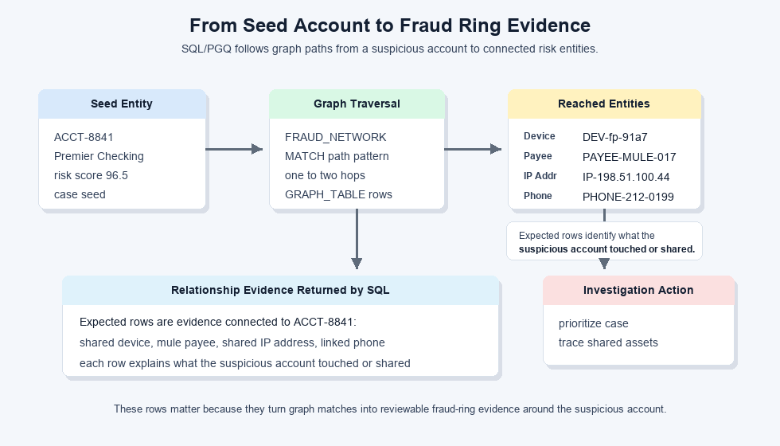
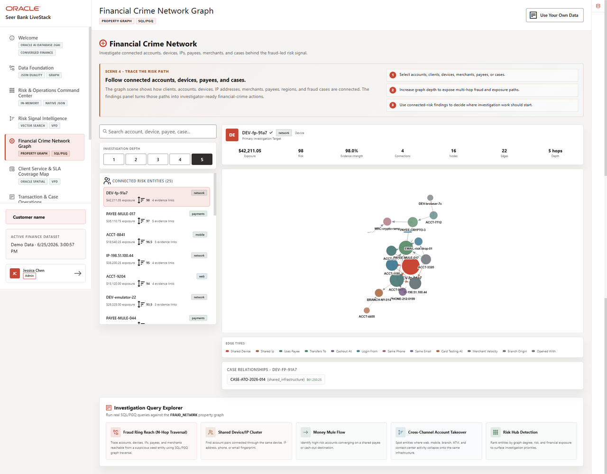

# Financial Crime Network with Property Graph

## Introduction

Fraud patterns often hide in relationships rather than in a single transaction row. This lab uses Oracle Property Graph and SQL/PGQ to start from suspicious account ACCT-8841 and trace connected devices, IP addresses, payees, phones, and other entities.

You will help a fraud analyst move from a suspicious account to relationship evidence without writing long chains of joins.

Fraud patterns often hide in relationships rather than in a single transaction row. One account may not reveal the full picture, but a shared device, reused phone number, mule payee, or repeated IP address can reveal coordinated activity.

A suspicious signal often leads to the question, "Who or what else is connected?" The graph lets you move from a risky account to relationship evidence that can support escalation.

<details>
<summary><strong>Key terms: property graph, entity, relationship, and SQL Property Graph Queries (SQL/PGQ)</strong></summary>

> - A **property graph** represents things and how they are connected. In this lab, things include accounts, devices, IP addresses, phone numbers, payees, branches, and cases. The value of the graph is that it can show relationship patterns that are hard to see in a flat table.
>
> - An **entity** is a graph node that represents something investigators care about, such as an account, device, IP address, payee, phone number, or case. An entity can carry properties, such as a risk score, channel, location, or exposure amount.
>
> - A **relationship** is a connection between entities, such as an account using a device, sharing a phone number, sending funds to a payee, or opening activity from an IP address. Relationships let investigators ask who or what is connected to a suspicious account.
>
> - **SQL Property Graph Queries (SQL/PGQ)** let you describe graph patterns in SQL, such as "start with this account and follow related entities." That makes relationship investigation queryable without moving fraud evidence into a separate graph-only database.

</details>

The first image below is a concept graphic for the financial-crime graph pattern. It shows the idea behind the lab: a suspicious account becomes more meaningful when you can follow its relationships to devices, IP addresses, payees, phone numbers, branches, and cases.



The second image is the Financial Crime Network application workspace. The left side ranks connected risk entities, while the graph area shows how a selected account connects through shared infrastructure and mule-payment relationships. The SQL/PGQ queries in this lab reproduce that investigation path so you can see how the visual network is backed by queryable graph evidence.



### Objectives

- Traverse fraud ring reach from a seed account.
- Find shared device and IP clusters.

Estimated Time: **12 minutes**

### Business Scenario

| Step | Finance focus |
| --- | --- |
| Business Problem | Fraud teams need to see relationships that are hard to detect from transaction tables alone. |
| Technical Challenge | Investigators need path-based relationship analysis without writing and maintaining long chains of self-joins. |
| Persona Focus | Fraud analysts interpret the network; database developers provide the graph pattern that explains why entities are connected. |
| What You Will See | A property graph exposes fraud ring reach and shared entity clusters with SQL. |
| Database Capability | FRAUD\_NETWORK and GRAPH\_TABLE support SQL/PGQ traversal. |
| Outcome | Investigators can explain why entities are related and prioritize high-risk nodes. |

## Task 1: Trace two-hop fraud reach

Perform the following set of steps to trace connected entities within two relationship hops of suspicious account `ACCT-8841`:

1. Run this SQL/PGQ query:

    > **SQL Worksheet reminder:** Need a reminder on how to open and use the SQL Worksheet? Return to [Getting Started Task 2: Open SQL Worksheet](/workshops/sandbox/index.html?lab=getting-started#Task2:OpenSQLWorksheet) for the step-by-step graphic showing where to paste and run SQL statements.

    This query starts with account `ACCT-8841` and looks for other things connected to it in the fraud graph. A graph has entities, such as accounts and devices, and relationships, such as an account using a device or sending funds to a payee.

    In order to understand this query, read the `MATCH` pattern in three parts.

    1. `(seed IS entity)` sets the starting point. `seed` is just a nickname for the starting entity. It is called `seed` because the search grows outward from that account, like a seed growing into branches.

    2. `-[e IS related_to]->{1,2}` tells Oracle to follow `related_to` connections one or two steps away from the seed account.

    3. `(reached IS entity)` means find each connected entity reached by following those steps. A reached entity might be a device, payee, IP address, phone number, branch, or another fraud evidence item.

    The `WHERE` line makes sure the seed is the specific account `ACCT-8841`. The `COLUMNS` clause turns the connected graph items back into normal table rows.

    This is much easier than writing the same logic with ordinary joins. Without SQL/PGQ graph pattern matching, you would need separate self-joins for one-hop and two-hop paths, extra union logic for each relationship depth, and more code every time investigators want to follow another type of relationship.

    In plain terms, the graph pattern says: start with this account, follow the relationships, return the connected items as rows, and list the riskiest ones first.

    <details>
    <summary><strong>Why this matters: graph belongs with the transaction data</strong></summary>

    > Fraud investigation often starts with transactions but quickly becomes a relationship problem. If graph data lives in a separate graph-only system, teams must move or copy account, device, and transaction evidence before they can investigate it.
    >
    > Oracle Database keeps relational transaction data and property graph analysis close together. You can use SQL to move from account evidence to relationship evidence without changing databases.

    </details>

    ```sql
    <copy>
    SELECT DISTINCT entity_key, display_name, entity_type,
           risk_score, risk_level, total_amount, channel
    FROM GRAPH_TABLE ( fraud_network
      MATCH (seed IS entity) -[e IS related_to]->{1,2} (reached IS entity)
      WHERE seed.entity_key = 'ACCT-8841'
      COLUMNS (
        reached.entity_key AS entity_key,
        reached.display_name AS display_name,
        reached.entity_type AS entity_type,
        reached.risk_score AS risk_score,
        reached.risk_level AS risk_level,
        reached.total_amount AS total_amount,
        reached.channel AS channel
      )
    )
    ORDER BY risk_score DESC
    FETCH FIRST 25 ROWS ONLY;
    </copy>
    ```

    **Expected output: High Risk Fraud Entities**

    | Entity Key | Display Name | Entity Type | Risk Score | Risk Level | Total Amount | Channel |
    | --- | --- | --- | --- | --- | --- | --- |
    | DEV-fp-91a7 | Mobile Fingerprint 91a7 | device | 98.0 | critical | 42211.05 | network |
    | PAYEE-MULE-017 | Mule Payee 017 | payee | 97.0 | critical | 36110.75 | payments |
    | IP-198.51.100.44 | Residential Proxy 198.51.100.44 | ip\_address | 95.0 | critical | 38200.25 | network |
    | PHONE-212-0199 | Reused VOIP 212-0199 | phone | 90.0 | critical | 25110.25 | contact\_center |
    | PAYEE-CRYPTO-3 | Crypto Ramp Wallet 3 | payee | 87.0 | high | 14325.5 | payments |
    | BRANCH-NY-014 | NY Midtown Branch 014 | branch | 49.0 | medium | 2800.0 | branch |


2. Review the high-risk entities.
    The query returns connected entities as a prioritized table, not as an abstract graph picture. That makes the graph result usable in the same SQL review workflow as the dashboard, vector search, and transaction labs.

    The expected rows show the evidence connected to suspicious account `ACCT-8841`.
    For example:
    * `DEV-fp-91a7` is a device
    * `PAYEE-MULE-017` is a payee
    * `IP-198.51.100.44` is an IP address
    * `PHONE-212-0199` is a phone number

    These rows matter because they show what the suspicious account touched or shared.

    The result gives investigators a prioritized reach map. Instead of starting with a large network picture, the analyst gets a table sorted by risk. High risk scores and large amounts point to entities that may require account holds, case escalation, or deeper review.

**Note:** Sample values may change after data refreshes or rebuilds. Focus on the expected result pattern and the business takeaway, not the exact values.

## Task 2: Find accounts sharing device, IP, phone, or email

Perform the following set of steps to find account pairs that share identifying evidence such as device, IP address, phone, or email:

1. Run this shared-entity graph query.

    This query looks for two accounts that share the same identifying evidence. In fraud analysis, that shared evidence can be a device, IP address, phone number, or email.

    In order to understand this query, read the `MATCH` pattern in three parts.

    1. `(a IS entity)` is the first account.

    2. `-[e1 IS related_to]-> (shared IS entity)` follows a relationship from the first account to a shared item, such as a device or IP address.

    3. `<-[e2 IS related_to]- (b IS entity)` finds a second account that points to that same shared item.

    The `a.entity_id < b.entity_id` filter prevents the same account pair from appearing twice. The risk filter keeps the result focused on pairs where at least one account already looks concerning.

    This is where SQL/PGQ is useful. A relational version would need multiple joins back to the same entity and relationship tables. The graph query stays close to the fraud question: "Which risky accounts share the same identifying evidence?"

    ```sql
    <copy>
    SELECT account_a, shared_entity, shared_type, account_b,
           a_risk, b_risk,
           ROUND((a_risk + b_risk) / 2, 1) AS combined_risk,
           e1_type, e2_type
    FROM GRAPH_TABLE ( fraud_network
      MATCH (a IS entity) -[e1 IS related_to]-> (shared IS entity) <-[e2 IS related_to]- (b IS entity)
      WHERE a.entity_type = 'account'
        AND b.entity_type = 'account'
        AND a.entity_id < b.entity_id
        AND shared.entity_type IN ('device','ip_address','phone','email')
        AND (a.risk_score >= 70 OR b.risk_score >= 70)
      COLUMNS (
        a.entity_key AS account_a,
        shared.entity_key AS shared_entity,
        shared.entity_type AS shared_type,
        b.entity_key AS account_b,
        a.risk_score AS a_risk,
        b.risk_score AS b_risk,
        e1.relationship_type AS e1_type,
        e2.relationship_type AS e2_type
      )
    )
    ORDER BY combined_risk DESC, shared_entity
    FETCH FIRST 25 ROWS ONLY;
    </copy>
    ```

    **Expected output: Shared Entity Connections**

    | Account A | Shared Entity | Shared Type | Account B | A Risk | B Risk | Combined Risk | E1 Type | E2 Type |
    | --- | --- | --- | --- | --- | --- | --- | --- | --- |
    | ACCT-8841 | DEV-fp-91a7 | device | ACCT-1190 | 96.5 | 91.0 | 93.8 | shared\_device | shared\_device |
    | ACCT-8841 | IP-198.51.100.44 | ip\_address | ACCT-1190 | 96.5 | 91.0 | 93.8 | shared\_ip | shared\_ip |
    | ACCT-8841 | PHONE-212-0199 | phone | ACCT-1190 | 96.5 | 91.0 | 93.8 | same\_phone | same\_phone |
    | ACCT-8841 | DEV-fp-91a7 | device | ACCT-5077 | 96.5 | 88.0 | 92.3 | shared\_device | shared\_device |
    | ACCT-9204 | DEV-emulator-22 | device | ACCT-2188 | 94.0 | 86.0 | 90 | shared\_device | shared\_device |
    | ACCT-9204 | IP-203.0.113.17 | ip\_address | ACCT-2188 | 94.0 | 86.0 | 90 | shared\_ip | shared\_ip |
    | ACCT-1190 | DEV-fp-91a7 | device | ACCT-5077 | 91.0 | 88.0 | 89.5 | shared\_device | shared\_device |
    | ACCT-8841 | IP-198.51.100.44 | ip\_address | ACCT-3320 | 96.5 | 81.5 | 89 | shared\_ip | shared\_ip |
    | ACCT-1190 | IP-198.51.100.44 | ip\_address | ACCT-3320 | 91.0 | 81.5 | 86.3 | shared\_ip | shared\_ip |
    | ACCT-5077 | EMAIL-risk-drop-01 | email | ACCT-3320 | 88.0 | 81.5 | 84.8 | same\_email | same\_email |

    **Note:** Sample values may change after data refreshes or rebuilds. Focus on the expected result pattern and the business takeaway, not the exact values.


2. Use the result to explain investigation priority.
    This query moves from reach to shared evidence. It identifies account pairs that reuse the same identifiers, which is stronger investigative evidence than a single high-risk score.

    A shared device, IP address, phone, or email can connect accounts that look separate in transaction tables. That is why shared evidence matters: two accounts may look unrelated until the same phone, device, or network shows up in both histories. The combined risk score helps prioritize pairs where both sides of the relationship are risky, not just connected.

    This turns dashboard suspicion into explainable relationship evidence. The fraud analyst can say which accounts are connected, what they share, and why that connection matters.


## Next Steps

Congratulations on completing the property graph lab. You used graph queries to move from a suspicious account to connected evidence such as shared devices, IP addresses, phone numbers, and related accounts. For a deeper hands-on workshop focused on graph analysis in Oracle Database, open the [Property Graph LiveLabs workshop](https://livelabs.oracle.com/ords/r/dbpm/livelabs/view-workshop?clear=RR,180&wid=3978).

## Acknowledgements

* **Author** - Pat Shepherd, Senior Principal Database Product Manager
* **Contributor** - Linda Foinding, Principal Database Product Manager
* **Last Updated By/Date** - Oracle Database Product Management, June 2026
