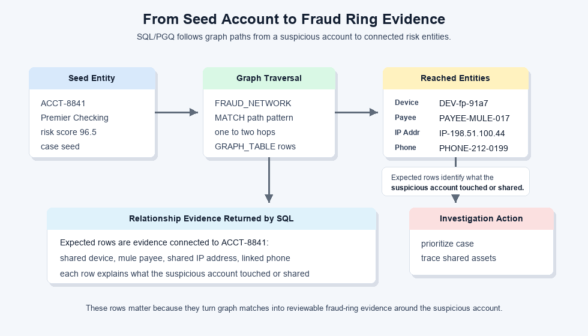
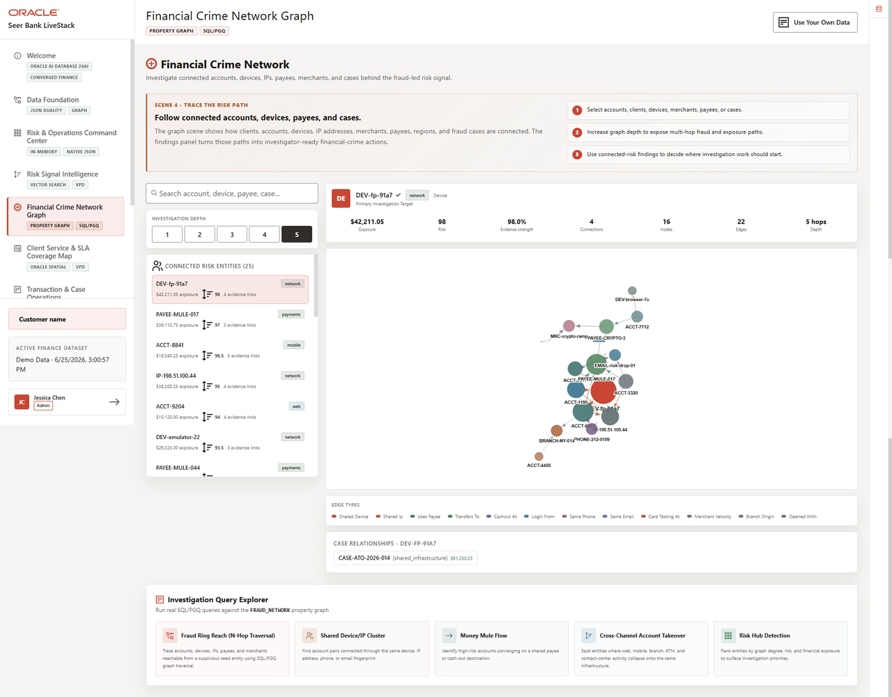
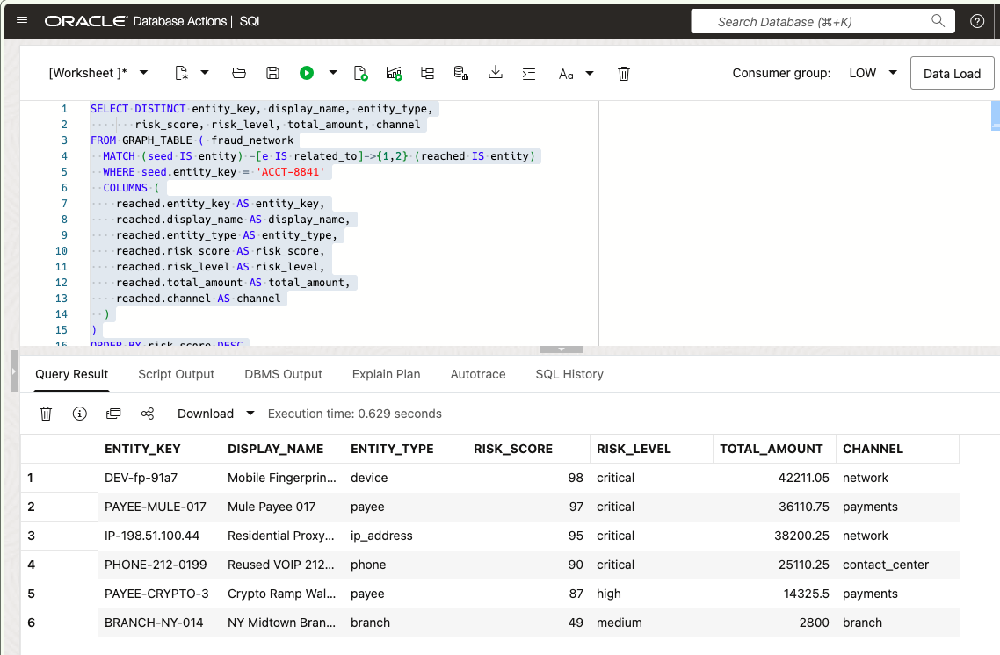
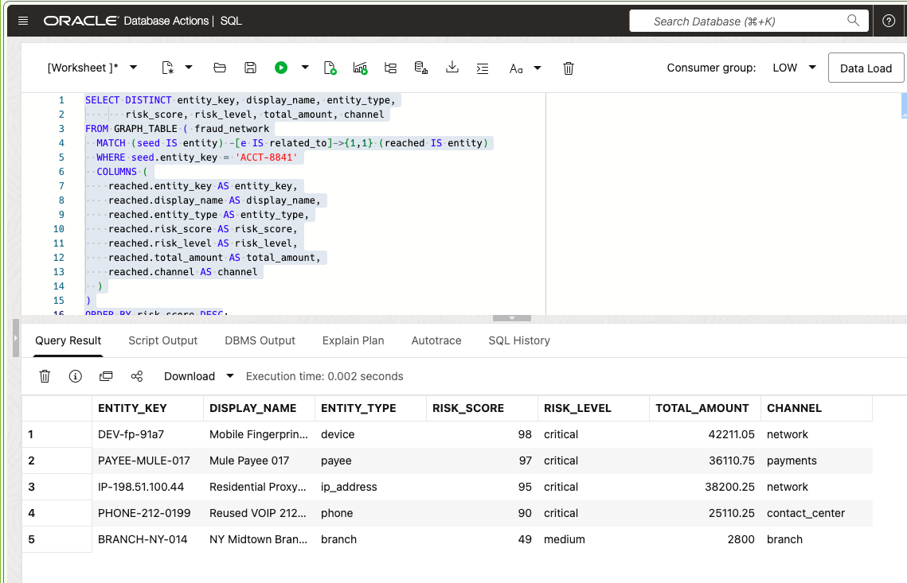
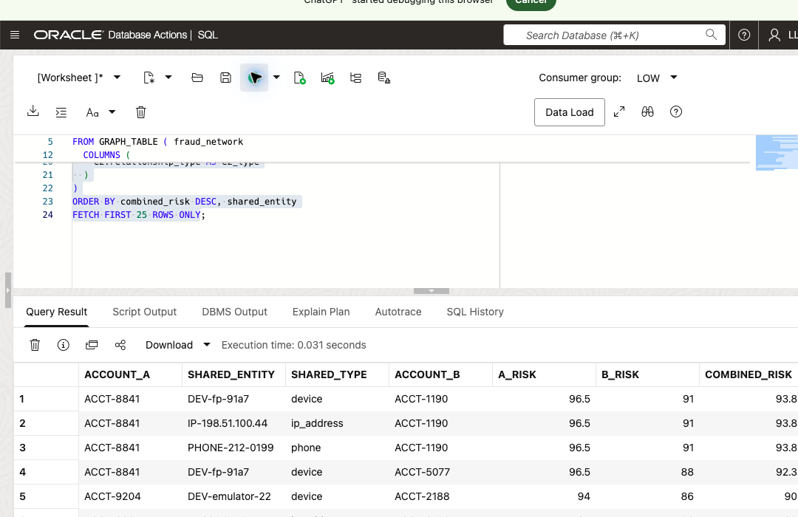
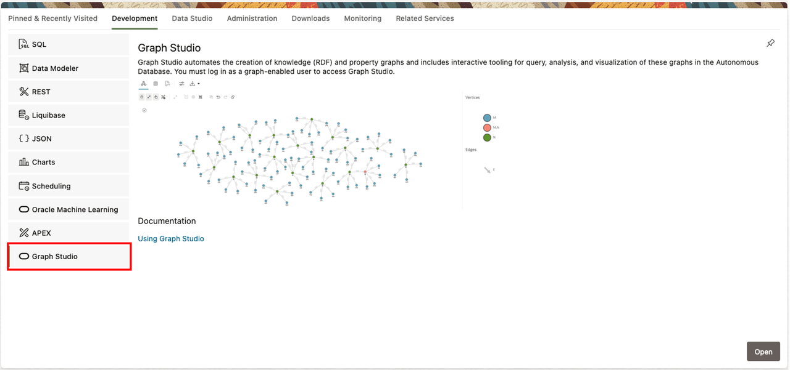
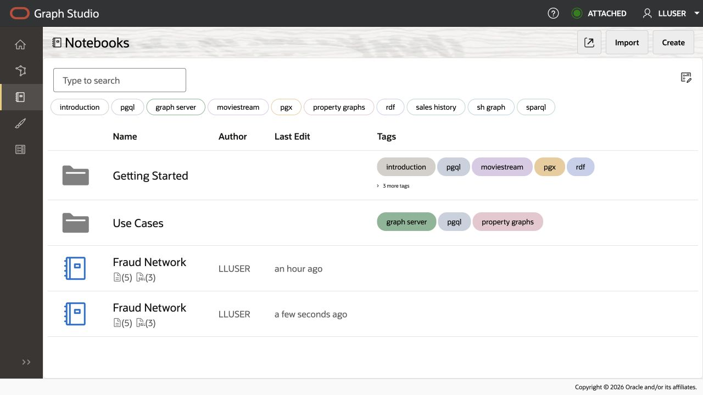
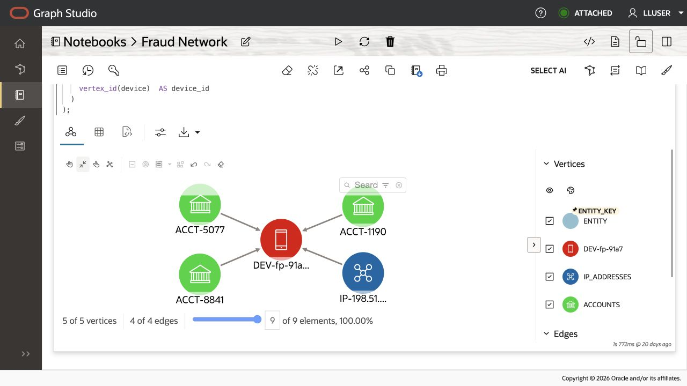

# Financial Crime Network with Property Graph

## Introduction

Once an account looks suspicious, investigators need to know what other accounts, devices, IP addresses, payees, phones, or emails are connected to it. This lab investigates that fraud network with **Oracle Property Graph** and **SQL Property Graph Queries (SQL/PGQ)**.

Jessica follows a suspicious account to see whether it shares devices, contact details, payees, or other connections with risky activity. Jordan keeps those relationships available as governed database evidence, so Jessica can investigate the pattern without relying on a separate graph system.

Fraud patterns often hide in relationships rather than in a single transaction row. One account may not reveal the full picture, but a shared device, reused phone number, mule payee, or repeated IP address can reveal coordinated activity.

A suspicious signal often leads to the question, "Who or what else is connected?" The graph lets you move from a risky account to relationship evidence that can support escalation.

The business value is faster, more explainable investigation without copying relationship data to a separate graph system. Investigators can follow an alert to the shared device, payee, phone, or IP evidence that merits human review.

Oracle Property Graph models business things as nodes and their connections as edges, while SQL/PGQ lets you query those paths with familiar SQL syntax. Graph Studio is Oracle Database's visual workspace for exploring the same graph: SQL/PGQ provides exact, repeatable evidence, and Graph Studio lets an investigator see and explain the connected paths as a network map.

<details>
<summary><strong>Key terms: property graph, entity, relationship, and SQL Property Graph Queries (SQL/PGQ)</strong></summary>

> - A **property graph** represents things and how they are connected. In this lab, things include accounts, devices, IP addresses, phone numbers, payees, branches, and cases. The value of the graph is that it can show relationship patterns that are hard to see in a flat table.
>
> - An **entity** is a graph node that represents something investigators care about, such as an account, device, IP address, payee, phone number, or case. An entity can carry properties, such as a risk score, channel, location, or exposure amount.
>
> - A **relationship** is a connection between entities, such as an account using a device, sharing a phone number, sending funds to a payee, or opening activity from an IP address. Relationships let investigators ask who or what is connected to a suspicious account.
>
> - **SQL Property Graph Queries (SQL/PGQ)** let you describe graph patterns in SQL, such as "start with this account and follow related entities." That makes relationship investigation queryable without moving fraud evidence into a separate graph-only database.

</details>

The first image below is a concept graphic for the financial-crime graph pattern. It shows the idea behind the lab: a suspicious account becomes more meaningful when you can follow its relationships to devices, IP addresses, payees, phone numbers, branches, and cases.



The second image is the Financial Crime Network application workspace. The left side ranks connected risk entities, while the graph area shows how a selected account connects through shared infrastructure and mule-payment relationships. The SQL/PGQ queries in this lab reproduce that investigation path so you can see how the visual network is backed by queryable graph evidence.



### Objectives

- Run SQL/PGQ queries for fraud network analysis.
- Interpret the relationship evidence behind suspicious accounts.
- Open Graph Studio from Database Actions.
- Import and run the finance fraud-network notebook.
- Compare SQL results with graph visualizations.

Estimated Time: **25 minutes**

### Business Scenario

| Step | Finance focus |
| --- | --- |
| Business Problem | Fraud teams need to see relationships that are hard to detect from transaction tables alone. |
| Technical Challenge | Investigators need path-based relationship analysis without writing and maintaining long chains of self-joins. |
| Persona Focus | Jessica interprets the network; Jordan provides the graph pattern that explains why entities are connected. |
| What You Will See | A property graph exposes fraud ring reach and shared entity clusters with SQL. |
| Database Capability | FRAUD\_NETWORK and GRAPH\_TABLE support SQL/PGQ traversal. |
| Outcome | Investigators can explain why entities are related and prioritize high-risk nodes. |

Persona focus: You join Jessica and Jordan as they move from a suspicious account to explainable relationship evidence without turning the investigation into fragile join logic.

## Task 1: Trace two-hop fraud reach

In this lab, you will investigate the fraud network in two views. First, you will run the SQL/PGQ queries in SQL Worksheet so you can see exactly how Oracle AI Database traces connected accounts, devices, IP addresses, phone numbers, and emails. Then you will open Graph Studio and run the same investigation as a visual graph, where the relationships become easier to explore and explain. Think of the SQL as the evidence trail and Graph Studio as the investigator’s map.

Start from suspicious account `ACCT-8841` and trace the connected entities within two relationship hops.

1. Run the SQL/PGQ traversal from `ACCT-8841`.

    > **SQL Worksheet reminder:** Need a reminder on how to open and use the SQL Worksheet? Return to [Getting Started Task 2: Open SQL Worksheet](?lab=getting-started#Task2:OpenSQLWorksheet) for the step-by-step graphic showing where to paste and run SQL statements.

    This query treats the fraud data as a graph. In the `MATCH` pattern, `(seed IS entity)` is the starting account, `-[e IS related_to]->{1,2}` means follow one or two relationship hops, and `(reached IS entity)` is every entity reached from that starting point.

    The `WHERE` clause anchors the search on `ACCT-8841`, and the `COLUMNS` clause returns graph properties in a normal SQL result table.

    This is much easier than writing the same logic with ordinary joins. Without SQL/PGQ graph pattern matching, you would need separate self-joins for one-hop and two-hop paths, extra union logic for each relationship depth, and more code every time investigators want to follow another type of relationship.

    The graph pattern says the investigation in plain terms: start with this account, follow the relationships, and show what is connected.

    <details>
    <summary><strong>Why this matters: graph belongs with the transaction data</strong></summary>

    > Fraud investigation often starts with transactions but quickly becomes a relationship problem. If graph data lives in a separate graph-only system, teams must move or copy account, device, and transaction evidence before they can investigate it.
    >
    > Oracle AI Database keeps relational transaction data and property graph analysis close together. You can use SQL to move from account evidence to relationship evidence without changing databases.

    </details>

    ```sql
    <copy>
    SELECT DISTINCT entity_key, display_name, entity_type,
           risk_score, risk_level, total_amount, channel
    FROM GRAPH_TABLE ( fraud_network
      MATCH (seed IS entity) -[e IS related_to]->{1,2} (reached IS entity)
      WHERE seed.entity_key = 'ACCT-8841'
      COLUMNS (
        reached.entity_key AS entity_key,
        reached.display_name AS display_name,
        reached.entity_type AS entity_type,
        reached.risk_score AS risk_score,
        reached.risk_level AS risk_level,
        reached.total_amount AS total_amount,
        reached.channel AS channel
      )
    )
    ORDER BY risk_score DESC
    FETCH FIRST 25 ROWS ONLY;
    </copy>
    ```

    **Expected output: High Risk Fraud Entities**

    


2. Review the high-risk entities.
    The query returns connected entities as a prioritized table, not as an abstract graph picture. That makes the graph result usable in the same SQL review workflow as the dashboard, vector search, and transaction labs.

    The expected rows show the evidence connected to suspicious account `ACCT-8841`. 
    For example:
    * `DEV-fp-91a7` is a device 
    * `PAYEE-MULE-017` is a payee
    * `IP-198.51.100.44` is an IP address
    * `PHONE-212-0199` is a phone number
    
    These rows matter because they show what the suspicious account touched or shared.

    The result gives investigators a prioritized reach map. Instead of staring at a tangle of connections, the analyst gets a table sorted by risk. High risk scores and large amounts point to entities that may require account holds, case escalation, or deeper review before looking at lower-risk branches of the network.

3. 🎯 **Interactive challenge: compare direct and indirect evidence.**

    Starting with the two-hop traversal above, change only `{1,2}` to `{1,1}` so you see entities directly connected to `ACCT-8841`. Run your revised query.

    **Expected output: Direct Fraud Connections**

    The current data returns the device, mule payee, IP address, phone, and branch directly connected to `ACCT-8841`. Restore the two-hop traversal mentally and identify the entity that appears only through an indirect path.

    <details>
    <summary><strong>Challenge answer: two hops add investigative context</strong></summary>

    > `PAYEE-CRYPTO-3`, Crypto Ramp Wallet 3, appears only after the second hop. It is indirect evidence that warrants follow-up, not an automatic action. Oracle Property Graph keeps this relationship evidence connected to the same governed finance data used for risk review.

    If you need the runnable solution, use this one-hop traversal:

    

    ```sql
    <copy>
    SELECT DISTINCT entity_key, display_name, entity_type,
           risk_score, risk_level, total_amount, channel
    FROM GRAPH_TABLE ( fraud_network
      MATCH (seed IS entity) -[e IS related_to]->{1,1} (reached IS entity)
      WHERE seed.entity_key = 'ACCT-8841'
      COLUMNS (
        reached.entity_key AS entity_key,
        reached.display_name AS display_name,
        reached.entity_type AS entity_type,
        reached.risk_score AS risk_score,
        reached.risk_level AS risk_level,
        reached.total_amount AS total_amount,
        reached.channel AS channel
      )
    )
    ORDER BY risk_score DESC;
    </copy>
    ```

    </details>

## Task 2: Find accounts sharing device, IP, phone, or email

Next, find account pairs that share identifying evidence such as device, IP address, phone, or email.

1. Run this shared-entity graph query.

    This query looks for an account-to-shared-entity-to-account pattern. In graph terms, it finds `(a) -> (shared) <- (b)`: two accounts connected through the same device, IP address, phone, or email.

    The `a.entity_id < b.entity_id` filter prevents returning the same account pair twice, and the risk filter keeps the result focused on relationships where at least one account is already concerning.

    This is where SQL/PGQ is especially useful. A relational version would need multiple joins back to the same entity and relationship tables, separate conditions for each shared entity type, and careful duplicate handling for account pairs. The graph query is shorter and closer to the fraud question: "Which risky accounts share the same identifying evidence?"

    ```sql
    <copy>
    SELECT account_a, shared_entity, shared_type, account_b,
           a_risk, b_risk,
           ROUND((a_risk + b_risk) / 2, 1) AS combined_risk,
           e1_type, e2_type
    FROM GRAPH_TABLE ( fraud_network
      MATCH (a IS entity) -[e1 IS related_to]-> (shared IS entity) <-[e2 IS related_to]- (b IS entity)
      WHERE a.entity_type = 'account'
        AND b.entity_type = 'account'
        AND a.entity_id < b.entity_id
        AND shared.entity_type IN ('device','ip_address','phone','email')
        AND (a.risk_score >= 70 OR b.risk_score >= 70)
      COLUMNS (
        a.entity_key AS account_a,
        shared.entity_key AS shared_entity,
        shared.entity_type AS shared_type,
        b.entity_key AS account_b,
        a.risk_score AS a_risk,
        b.risk_score AS b_risk,
        e1.relationship_type AS e1_type,
        e2.relationship_type AS e2_type
      )
    )
    ORDER BY combined_risk DESC, shared_entity
    FETCH FIRST 25 ROWS ONLY;
    </copy>
    ```

    **Expected output: Shared Entity Connections**

    


2. Use the result to explain investigation priority.
    This query moves from reach to shared evidence. It identifies account pairs that reuse the same identifiers, which is stronger investigative evidence than a single high-risk score.

    A shared device, IP address, phone, or email can connect accounts that look separate in transaction tables. That is why shared evidence matters: two accounts may look unrelated until the same phone, device, or network shows up in both histories. The combined risk score helps prioritize pairs where both sides of the relationship are risky, not just connected.

    This turns dashboard suspicion into explainable relationship evidence. The fraud analyst can say which accounts are connected, what they share, and why that connection matters.

3. 🎯 **Interactive challenge: choose the human-review priority.**

    Which pair has the strongest basis for human review: `ACCT-8841` and `ACCT-1190`, or `ACCT-8841` and `ACCT-5077`? Record the evidence you would include in the case.

    <details>
    <summary><strong>Challenge answer: corroboration is stronger than one connection</strong></summary>

    > Choose `ACCT-8841` and `ACCT-1190`. The result contains three separate corroborating rows for that pair: a shared device, IP address, and phone, each with combined risk `93.8`. `ACCT-8841` and `ACCT-5077` share only a device. The graph supports a human review recommendation; it does not make an automatic enforcement decision.

    </details>

## Task 3: Open Graph Studio

The SQL showed which accounts and identifiers are connected. Now open Graph Studio so you can see those connections as a map and explain them to another investigator.

Graph Studio is Oracle Database's visual workspace for property graphs. It lets an investigator see nodes, edges, and paths as an interactive network while keeping the graph backed by the same governed database data. Use SQL/PGQ when you need a precise, repeatable result set, such as a ranked list of entities or a filtered path count. Use Graph Studio when you need to explore a network visually, select a node, follow adjacent relationships, and explain a fraud ring to another reviewer. In this workshop, you use it to turn the SQL evidence for `ACCT-8841` into an investigation map; it complements SQL rather than replacing it.

Start from the Database Actions Launchpad. You will use the `LLUSER` database user and password supplied for the workshop.

1. If the dark-theme message appears, click **Done**.

2. Confirm that the upper-right corner shows `LLUSER`.

    

3. On the **Development** tab, select **Graph Studio** from the left-side tool list and click **Open**.

    

4. If prompted, sign in with `LLUSER` and the workshop password.

5. Confirm that the Graph Studio home page opens. The left navigation provides **Graphs**, **Notebooks**, **Templates**, and **Jobs**.

    

## Task 4: Download and import the finance notebook

The supplied `.dsnb` file is a native Graph Studio notebook: a reusable, runnable investigation guide that combines Markdown explanation with SQL/PGQ paragraphs and graph visualizations. You use it so every learner runs the same documented fraud patterns against the governed Finance graph, then can inspect the visual result without rebuilding the investigation from scratch.

1. Download [finance-fraud-network-graph-studio.dsnb](files/finance-fraud-network-graph-studio.dsnb).

    If the notebook opens in your browser instead of downloading, right-click the link and select **Save Link As**.

2. In Graph Studio, click **Notebooks** in the left navigation.

3. Click **Import** in the upper-right corner.

    

4. The import window opens.

    

5. Drag & drop the `finance-fraud-network-graph-studio.dsnb` file from your local computer into the import window, or browse to the file on your computer. Review the selected filename and click **Import**. Open **Fraud Network** after the import completes.

## Task 5: Run and interpret the Graph Studio notebook

You already ran the SQL/PGQ patterns in SQL Worksheet. Now run selected parts of that investigation in Graph Studio so you can compare the query results with the visual graph experience. The notebook shows the `ACCT-8841` path and the `DEV-fp-91a7` shared-device view; it does not repeat the full Task 2 shared-entity query exactly. The advantage is investigative context: a table ranks the connected entities, while the visual graph reveals the paths and shared infrastructure that explain why they are connected.

1. Start at the top of the **Fraud Network** notebook and read the opening paragraph, **Financial Crime Network with Property Graph**.

    

2. Read the explanation for the `ACCT-8841` traversal, then run the SQL paragraph that starts with `SELECT DISTINCT`.

    This is the same first investigation pattern you ran in SQL Worksheet: start from `ACCT-8841`, follow one or two relationship hops, and return the connected entities as a prioritized table.

3. Continue through the notebook and review these results:

    | Paragraph | Result | Investigation purpose |
    | --- | --- | --- |
    | `SELECT DISTINCT ... WHERE seed.entity_key = 'ACCT-8841'` | Table | Ranks entities reached within one or two hops of `ACCT-8841`. |
    | `Graph Visualization of previous query` | Markdown label | Introduces the visual version of the first traversal. |
    | `SELECT * ... WHERE src.entity_key = 'ACCT-8841'` | Graph visualization | Draws the one-hop and two-hop path from the suspicious account. |
    | `Shared Entity Connections` | Markdown label and explanation | Introduces the device-centered relationship view. |
    | `SELECT * ... WHERE device.entity_key = 'DEV-fp-91a7'` | Graph visualization | Centers on `DEV-fp-91a7` and draws its directly connected accounts. |

4. Under **Graph Visualization of previous query**, run the SQL paragraph that starts with `SELECT *` and anchors on `ACCT-8841`. Review the graph visualization that appears below the paragraph.

    

5. Under **Shared Entity Connections**, read the device-centered explanation, then run the final SQL paragraph that anchors on `DEV-fp-91a7`. Review the graph visualization that appears below the paragraph.

    

6. For the two visualization paragraphs, select the graph visualization if Graph Studio initially displays a table. Select a node to inspect its properties and follow the relationship evidence back to the seed account or device.

7. Compare the notebook results with the SQL Worksheet results you ran earlier. The SQL showed the evidence trail; Graph Studio shows the same relationships as a visual investigation map.

> **Generated result note:** Graph layouts and node positions can vary between runs. Entity keys, relationship evidence, and query results remain the evidence to compare.

## Business Outcome

You traced connections that are difficult to recognize when accounts, devices, addresses, and counterparties are reviewed separately. This pattern can help investigators focus their next review and explain how entities are connected.

Organizations can evaluate this pattern by tracking investigation cycle time, manual relationship searches, analyst handoffs, and the number of useful connections identified for review. A graph connection is an investigative lead, not a confirmed fraud outcome.

## Next Steps

Congratulations on completing the property graph lab. You used SQL/PGQ patterns to move from a suspicious account to connected evidence such as shared devices, IP addresses, phone numbers, and related accounts, then compared the same investigation in Graph Studio.

For more property graph practice, try these follow-up resources:

* Open the [Oracle Graph LiveLabs workshop](https://livelabs.oracle.com/ords/r/dbpm/livelabs/run-workshop?p210_wid=770&p210_wec=&session=112325984461564&P0_REDIRECT=Y) for a deeper hands-on introduction to property graph concepts and Graph Studio.
* Download [getting-started-bank-graph.dsnb](files/getting-started-bank-graph.dsnb) and import it into Graph Studio for an additional bank graph exercise.

## Acknowledgements

* **Authors** - Linda Foinding, Principal Database Product Manager
* **Contributors** - Ramu Murakami Gutierrez, Pat Shepherd,
* **Last Updated By/Date** - Oracle AI Database Product Management, September 2026
