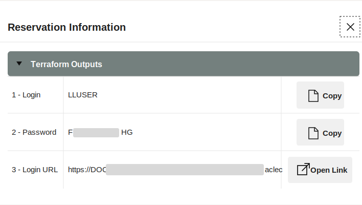
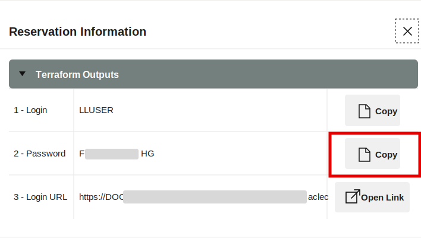
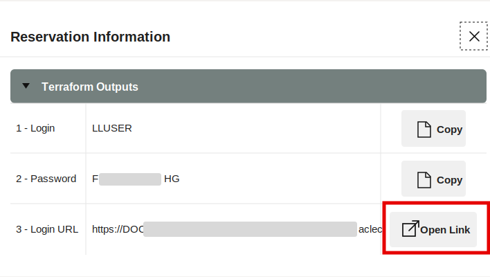
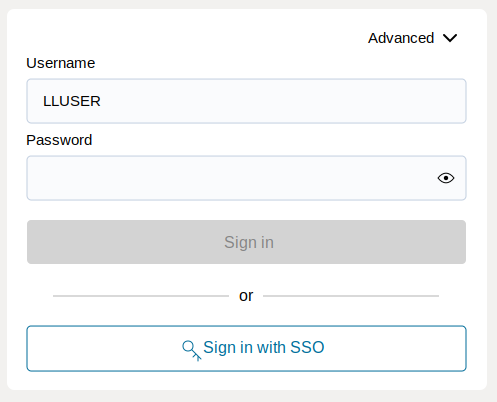
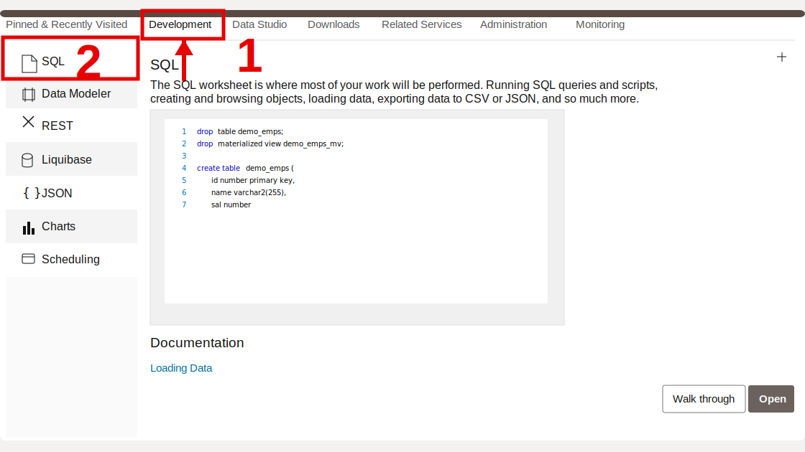
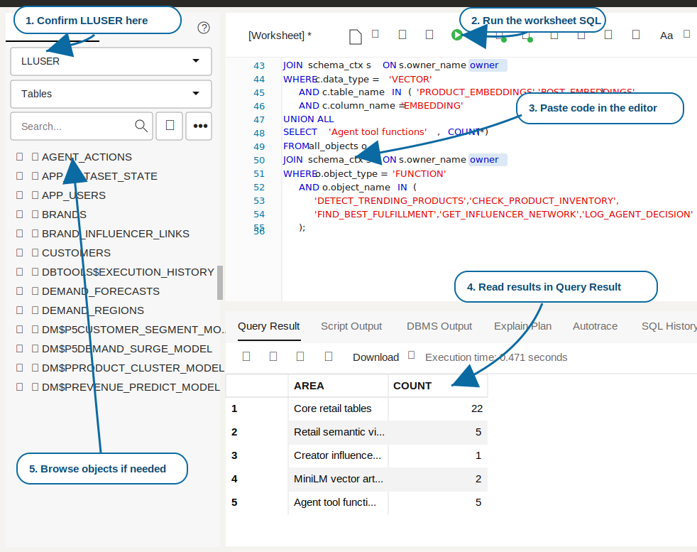

# Getting Started

## Introduction

Use this lab to open the LiveLabs reservation, access the provisioned **Autonomous Database 26ai** instance, and prepare SQL Worksheet for the hands-on finance exercises. Think of this as getting the right desk, badge, and notebook before the investigation starts: each finance query runs as the workshop user against the prepared finance schema.

<details>
<summary><strong>Key terms: Database Actions, SQL Worksheet, and LLUSER</strong></summary>

> - **Database Actions** is the browser-based Oracle Database workspace you use in this workshop. It gives you access to tools such as SQL Worksheet, object browsing, data loading, and development utilities without installing a desktop database client.
>
> - **SQL Worksheet** is the tool inside Database Actions where you paste and run SQL statements. It shows query results, script output, and errors, so it becomes the main place where you connect the application screens in this workshop to database evidence.
>
> - `LLUSER` is the workshop database user and schema owner for the hands-on finance objects. Using the right user matters because the tables, views, models, graph objects, and functions you query are created under this schema.

</details>

Estimated Time: **5 minutes**

### Objectives

In this lab, you will:

- Launch the LiveLabs workshop environment.
- Use the reservation login information to open Database Actions.
- Confirm that SQL Worksheet is ready for the finance schema.
- Confirm that SQL Worksheet is connected as the workshop schema user.

## Task 1: Launch the LiveLabs environment

Start from the LiveLabs reservation so Database Actions opens with the correct workshop resources. The goal is simply to get into the environment that already contains the database and sign-in details for this workshop.

1. Sign in to [LiveLabs](https://livelabs.oracle.com) with your Oracle account.

2. Open this workshop, select **Start**, and select **Run on LiveLabs Sandbox**.

3. In **My Reservations**, select **Launch Workshop** for this reservation.

4. Select **View Login Info** and keep the database credentials available for the next task.

    

    *Figure 1: The Reservation Information dialog shows the `LLUSER` login, password, and Login URL for Database Actions.*

## Task 2: Open SQL Worksheet

Open SQL Worksheet as the workshop user before running the finance queries. SQL Worksheet is where you will ask the database each question and immediately see the evidence returned as a table.

1. In the **Reservation Information** dialog, confirm that **1 - Login** shows `LLUSER`.

2. Select **Copy** for **2 - Password**.

    

    *Figure 2: Copy the `LLUSER` password from the Reservation Information dialog.*

3. Select **Open Link** for **3 - Login URL**.

    

    *Figure 3: Use Open Link for the Login URL, then use the copied password to sign in as `LLUSER`.*

4. On the Database Actions sign-in page, confirm that **Username** shows `LLUSER`, paste the password from the reservation information, and select **Sign in**.

    

    *Figure 4: Sign in to Database Actions as `LLUSER` with the password from the reservation information.*

5. Before SQL Worksheet opens, select **Development**, then select **SQL** from the tools menu.

    

    *Figure 5: Open SQL from the Development tools menu.*

6. Use the same SQL Worksheet pattern throughout the workshop.

    

    *Figure 6: Use SQL Worksheet to confirm the active user, paste each workshop SQL block, run the statement, and review the result table.*

    - Confirm the user dropdown shows the main workshop user, usually `LLUSER`.
    - Paste each workshop SQL block into the editor.
    - Select **Run Statement** or press **Ctrl+Enter** to run the current SQL statement.
    - Review the output in **Query Result** or **Script Output**, depending on the step.
    - Use **Navigator** only when you want to inspect tables, views, or other objects.

7. Run this check.

    This check makes sure SQL Worksheet is connected as the right user before you start. `USER` shows who signed in, while `SYS_CONTEXT('USERENV', 'CURRENT_SCHEMA')` shows where table names resolve. The finance labs use `LLUSER`, so both values should point to the workshop schema.

    ```sql
    <copy>
    SELECT USER AS "User",
           SYS_CONTEXT('USERENV', 'CURRENT_SCHEMA') AS "Schema",
           SYSTIMESTAMP AS "Checked At";
    </copy>
    ```

    **Expected output: Connected SQL Worksheet Session**

    | User | Schema | Checked At |
    | --- | --- | --- |
    | LLUSER | LLUSER | 19-MAY-26 10.30.00.000000 AM UTC |


8. You can use this same connection check whenever you want to confirm that SQL Worksheet is still running as `LLUSER`.

You can now continue to the finance labs.

## Acknowledgements

* **Author** - Pat Shepherd, Senior Principal Database Product Manager
* **Contributor** - Linda Foinding, Principal Database Product Manager
* **Last Updated By/Date** - Oracle Database Product Management, May 2026
