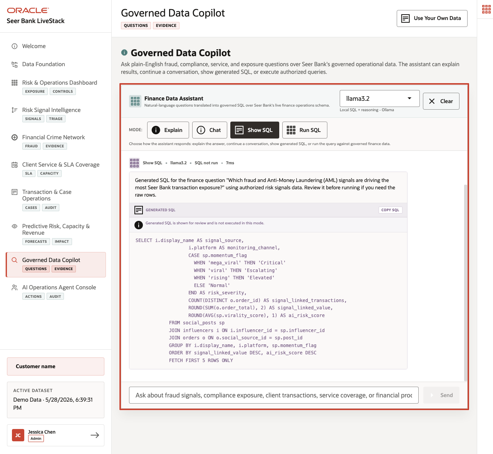

# Governed Data Copilot: Trusted Answers

## Introduction

Natural-language answers are useful in finance only when people can see what data the answer came from. This lab prepares governed questions for a data copilot workflow where the approved data boundary and SQL path remain visible.

Natural-language answers can feel simple to the business user, but risk and governance teams still need a review trail. This lab shows how a copilot-style answer can stay grounded in approved views and visible SQL instead of relying on untraceable generated text.

Answers are only useful if decision-makers can review the data boundary. The copilot pattern here is not "ask anything"; it is "ask against approved finance views and show the SQL."

<details>
<summary><strong>Key terms: governed answer, approved view, and visible SQL</strong></summary>

> - A **governed answer** is an answer that comes from approved data and can be reviewed. In finance, this matters because an answer may influence risk, compliance, client service, or revenue decisions, so the source and query path must be visible.
>
> - An **approved view** is a database view that exposes the data a user or application is allowed to use for a business question. Views give a copilot or application a controlled data boundary instead of letting it query every table directly.
>
> - **Visible SQL** means the query behind the answer can be inspected. This matters because finance teams must be able to explain where an answer came from, repeat the result, and check whether the logic matches the business question.

</details>

The image below is the Governed Data Copilot page. It shows curated finance questions, the approved data boundary, and the visible SQL path behind an answer. This matters because a business user may ask in natural language, but a finance organization still needs the answer to come from approved views that can be reviewed, repeated, and secured.



### Objectives

- List approved finance views.
- Run a trusted answer query that could back a copilot response.

Estimated Time: **8 minutes**

### Business Scenario

| Step | Finance focus |
| --- | --- |
| Business Problem | Business users want natural-language answers, but risk teams need approved data boundaries. |
| Technical Challenge | AI teams need copilot answers that expose SQL and stay inside approved semantic views instead of relying on opaque prompt output. |
| Persona Focus | Business users ask questions; AI engineers and database developers enforce governed data boundaries and reviewable evidence. |
| What You Will See | Trusted answers can be grounded in finance semantic views and explicit SQL. |
| Database Capability | Semantic finance views and catalog comments expose controlled business meaning. |
| Outcome | Copilot-style answers can be reviewed, repeated, and governed. |

Persona focus: You support business users who want natural-language answers while showing risk and governance teams that every answer has visible SQL behind it.

## Task 1: Review approved finance views

Review the approved finance views before answering business questions.

1. Run this catalog query:

    > **SQL Worksheet reminder:** Need a reminder on how to open and use the SQL Worksheet? Return to [Getting Started Task 2: Open SQL Worksheet](/workshops/sandbox/index.html?lab=getting-started#Task2:OpenSQLWorksheet) for the step-by-step graphic showing where to paste and run SQL statements.

    You are identifying the approved view surface before answering a business question. The SQL reads `USER_VIEWS`, filters to finance and service views that are appropriate for governed answers, and returns the view names with their definition length as a simple catalog check.

    The returned objects are views: saved SQL definitions that expose approved business data without requiring you or the copilot to query every underlying table directly. The finance views provide institution, product, signal, and transaction meaning. The service views provide location, capacity, and route meaning. This matters because a governed copilot should answer from a known view surface rather than improvising over every possible object in the schema.

    <details>
    <summary><strong>Why this matters: safer than an unguided AI answer</strong></summary>

    > In a fractured or prompt-only environment, a natural-language assistant may answer from unclear context, unapproved tables, or hidden prompts. That is risky in finance because reviewers need to know exactly which data supported the answer.
    >
    > Oracle Database gives the copilot a governed data boundary. Approved views and visible SQL make the answer repeatable, reviewable, and easier to secure.

    </details>

    ```sql
    <copy>
    SELECT view_name,
           text_length
    FROM user_views
    WHERE view_name LIKE 'FINANCE_%'
       OR view_name IN (
         'RISK_SIGNALS_V','SIGNAL_SOURCES_V','CLIENT_TRANSACTIONS_V',
         'SERVICE_CENTERS_V','SERVICE_CAPACITY_V','SERVICE_ROUTES_V'
       )
    ORDER BY view_name;
    </copy>
    ```

    **Expected output: Governed View Comments**

    | View Name | Text Length |
    | --- | --- |
    | CLIENT\_TRANSACTIONS\_V | 326 |
    | FINANCE\_INSTITUTIONS\_V | 158 |
    | FINANCE\_PRODUCTS\_V | 214 |
    | RISK\_SIGNALS\_V | 528 |
    | SERVICE\_CAPACITY\_V | 360 |
    | SERVICE\_CENTERS\_V | 547 |
    | SERVICE\_ROUTES\_V | 329 |
    | SIGNAL\_SOURCES\_V | 481 |


2. Treat these views as the approved data boundary.
    The query lists the approved view surface before any business question is answered. That gives AI engineers a concrete allowlist instead of relying on AI prompt text alone.

    These views expose finance language for institutions, products, signals, transactions, service centers, capacity, and routes. They are the objects a governed copilot should prefer because they already encode business meaning and hide lower-level implementation details.

    In practical terms, they are the safe menu of data sources the copilot should use.

    This matters because the same governed views that support dashboards and agents also constrain AI answers to approved database evidence.

## Task 2: Ground a natural-language question in SQL

Ground a natural-language finance question in visible SQL so the answer can be reviewed.

1. For the question "Which product categories have the highest current risk exposure?", run visible SQL.

    You are translating a natural-language business question into a reviewable SQL answer. The SQL joins risk signals to product mentions and finance products, groups the result by product category, and ranks categories by total exposure so the answer can cite both the result and the evidence path.

    `risk_signals_v` gives the copilot the approved risk-signal facts, including criticality and exposure. `finance_products_v` gives it the approved product category and product identity. Using those views matters because the answer stays grounded in the same curated business definitions used by the dashboard instead of depending on a hidden prompt or an ad hoc table scan.

    ```sql
    <copy>
    SELECT fp.product_category,
           COUNT(DISTINCT rs.signal_id) AS signal_count,
           ROUND(AVG(rs.criticality_score), 1) AS avg_criticality,
           SUM(rs.exposure_count) AS exposure_count
    FROM risk_signals_v rs
    JOIN post_product_mentions ppm ON ppm.post_id = rs.signal_id
    JOIN finance_products_v fp ON fp.financial_product_id = ppm.product_id
    GROUP BY fp.product_category
    ORDER BY exposure_count DESC
    FETCH FIRST 10 ROWS ONLY;
    </copy>
    ```

    **Expected output: Exposure by Product Category**

    | Product Category | Signal Count | Avg Criticality | Exposure Count |
    | --- | --- | --- | --- |
    | Compliance Services | 174 | 42.1 | 127777803 |
    | Payments | 214 | 41.1 | 113565293 |
    | Risk Analytics | 198 | 41.2 | 93531273 |
    | Consumer Lending | 171 | 42.6 | 88437900 |
    | Capital Markets | 158 | 40.5 | 64735955 |
    | Wealth Management | 117 | 41.9 | 60648625 |
    | Investments | 170 | 41 | 59359773 |
    | Commercial Lending | 180 | 41.3 | 52379514 |
    | Specialty Finance | 54 | 42.9 | 51785604 |
    | Cards and Payments | 132 | 41.6 | 49978774 |


2. Use the result to draft a governed answer.
    The SQL groups risk exposure at the product-category level, which is the kind of summary a business user may ask for in natural language. The visible query makes the answer repeatable and reviewable.

    A governed answer should cite the rows and avoid claiming access to objects outside the approved set. For example, the answer can say which product categories have the highest exposure, how many signals support the ranking, and what average criticality was observed.

    The returned table is relevant because it gives a business user an answer and gives reviewers the SQL evidence behind that answer. The copilot pattern is trustworthy only when both are present: a plain-language answer for the user and a repeatable query for review.

## Acknowledgements

* **Author** - Pat Shepherd, Senior Principal Database Product Manager
* **Contributor** - Linda Foinding, Principal Database Product Manager
* **Last Updated By/Date** - Oracle Database Product Management, June 2026
