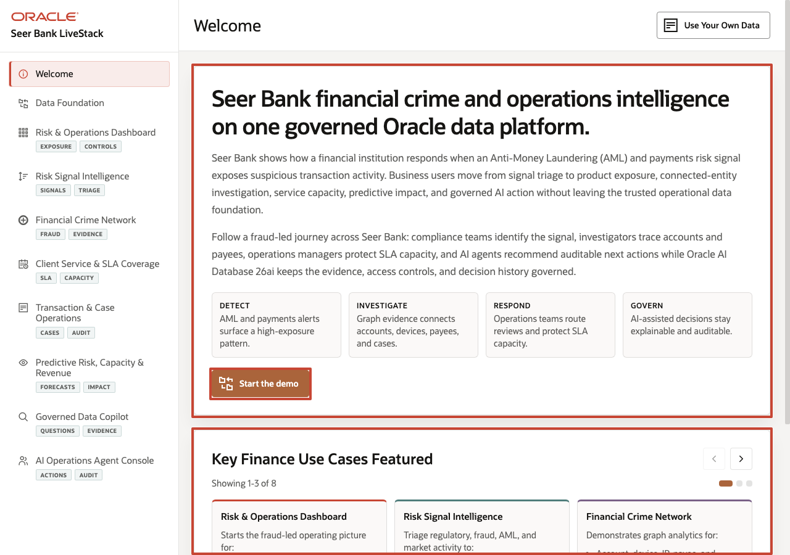

# Build Financial Intelligence with Oracle Database 26ai

## Introduction

Financial institutions are under pressure to spot emerging risk, investigate fraud, meet regulatory obligations, protect customer trust, and keep service operations moving. That work becomes harder when evidence is fragmented across core banking systems, transaction platforms, fraud tools, compliance workflows, service applications, analytics environments, and AI services. Each copy or pipeline adds latency, reconciliation work, security exposure, and room for a business decision to drift away from governed facts.

In this workshop, Seer Bank uses Oracle Database 26ai as a converged financial-intelligence foundation. Relational transactions, JSON documents, vector search, property graph relationships, spatial service coverage, in-database machine learning, governed SQL answers, PL/SQL tools, and audit records all operate against connected finance data. The goal is not to show separate features in isolation; it is to show why keeping these capabilities together changes the operating model.

The journey follows one decision flow. First, you prove the data foundation is present. Then you turn that foundation into dashboard evidence, inspect transaction documents, search risk language by meaning, follow fraud relationships, evaluate service coverage, score predictive models, ground a copilot-style answer, and record an AI-assisted action. Each lab starts from a finance decision and then shows the SQL evidence that makes the decision explainable.

As you move through the labs, treat every query as part of the same operating record. The dashboard numbers are not isolated metrics; they point to products, transactions, signals, relationships, service capacity, predictions, governed answers, and audit rows that all remain inside Oracle Database.

### Objectives

- Query the current Seer Bank finance data foundation.
- Use SQL, JSON Relational Duality, AI Vector Search, Property Graph, Oracle Spatial, OML, and PL/SQL in one workflow.
- Explain why a converged Oracle Database foundation is critical for risk, operations, analytics, governed AI, and auditability.
- Connect the application pages to repeatable database evidence.

Estimated Workshop Time: **95 minutes**

### Operating Story

| Step | Finance focus |
| --- | --- |
| Business Problem | Seer Bank needs faster risk, fraud, compliance, service, and AI-assisted decisions without spreading evidence across disconnected systems. |
| Technical Challenge | Application, data, and AI teams otherwise stitch together separate stores, services, indexes, pipelines, and governance controls for each data type. |
| Persona Focus | Database developers, application developers, risk analysts, operations leaders, and AI engineers share one evidence path. |
| What You Will Prove | One Oracle Database 26ai foundation can support the finance decision loop from awareness to action. |
| Database Capability | Relational SQL, JSON, vectors, graphs, spatial, OML, semantic views, PL/SQL tools, and audit records work together under one governed data model. |
| Outcome | Risk, operations, and engineering teams can observe, investigate, decide, act, and review from database-backed evidence instead of reconciling disconnected outputs. |

Persona focus: You act as the technical team supporting finance business users who need timely, explainable decisions without fragmented integration work. Your job is to prove that the business story and the technical architecture are the same story: trusted finance decisions depend on connected, governed data.

## Acknowledgements

* **Author** - Pat Shepherd, Senior Principal Database Product Manager
* **Contributor** - Linda Foinding, Principal Database Product Manager
* **Last Updated By/Date** - Oracle Database Product Management, June 2026
