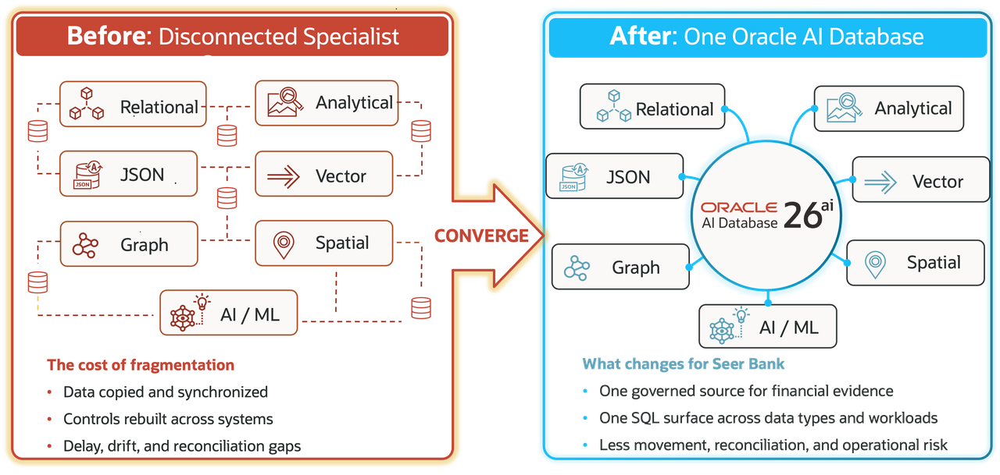
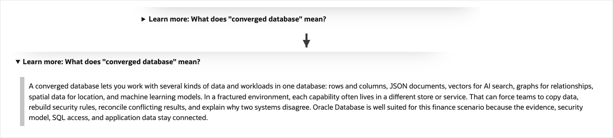
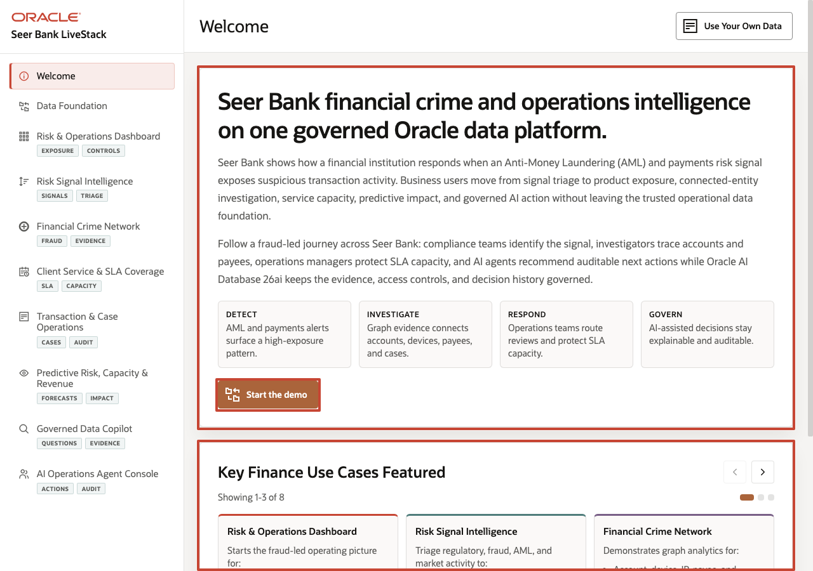

# Build Financial Intelligence with Oracle AI Database

## Introduction

Financial institutions need timely decisions that protect customers, manage risk, and keep service operations on track. The people making those decisions need the right information quickly, but they also need to know it comes from a secure, governed platform where the decision and the facts behind it can be reviewed later.

At **Seer Bank**, risk, fraud, compliance, service, analytics, application, and AI teams need to turn the same finance facts into timely, well-supported decisions. Their goal is to move from an emerging question to a review priority or service response without copying sensitive information between disconnected systems or losing the context behind the decision.

You join the Seer Bank team as they follow the same steps from a risk question to a recorded review action. Jessica, the risk analyst, investigates and recommends a review step. Jordan, the database administrator, keeps the shared database and its access controls ready. Sam, the application developer, makes transaction information useful to applications. Priya, the AI engineer, adds controlled AI assistance. Maya, the service operations leader, uses the findings to plan a response.

A **risk signal** is information that may need a closer look, such as an alert, a regulatory bulletin, unusual activity, or a service issue. It is not proof of fraud or harm; it prompts people to investigate.

In this workshop, **Seer Bank** uses **Oracle AI Database** as a converged financial-intelligence foundation. Relational transactions, JSON documents, vector search, property graph relationships, spatial service coverage, and in-database machine learning all operate against connected finance data.

This workshop is your guided look behind the companion Seer Bank Finance LiveStack demo. You will see how Oracle AI Database and the connected finance data set produce the dashboard, investigation, and operational results shown in the application.

You will also step beyond observation. Several labs include 🎯 interactive challenges where you change an investigation question, compare the rows returned by a query, or make a review recommendation using the same shared finance records. These moments show how relational, JSON, vector, graph, spatial, and machine-learning features work together for one finance question.

This workshop shows the sequence from a risk question to a recorded review action. When you want to go deeper on a specific topic, such as JSON Relational Duality, AI Vector Search, Property Graph, Oracle Spatial, Oracle Machine Learning, Select AI, or Select AI Agents, use the related deep-dive LiveLabs links in each lab's **Next Steps** section.

### Follow the Team's Investigation

- **Jordan starts with the finance foundation.** He confirms that the relational, JSON, graph, spatial, and AI-ready data used throughout the workshop remain connected and governed in one database.
- **Jessica turns a dashboard signal into questions.** She moves from a summary number to the products, transactions, and query results behind it.
- **Sam prepares a transaction for an application.** He shows how an application can use a JSON document while the underlying relational records remain available for SQL review.
- **Priya adds AI assistance with controls.** She uses vector search, in-database models, Select AI, and approved agent tools so results stay connected to the evidence.
- **Maya turns findings into operational response.** She compares location, demand, and service commitments to decide where the bank can respond.
- **Jessica closes the loop.** She uses the team's evidence to recommend a controlled review action and inspect its audit history.

Throughout the workshop, you will see small arrows next to expandable sections. Select the arrow when you want extra context about a term, concept, or Oracle AI Database capability. These sections are closed by default so the main lab stays focused, but you can expand them whenever you want more explanation.

The example below shows an expandable section before and after it is opened.

<strong>Learn more: What does "converged database" mean?</strong>

> A converged database lets you work with several kinds of data and workloads in one database: rows and columns, JSON documents, vectors for AI search, graphs for relationships, spatial data for location, and machine learning models.
>
> In a fractured environment, each capability often lives in a different store or service. That can force teams to copy data, rebuild security rules, reconcile conflicting results, and explain why two systems disagree. Oracle AI Database is well suited for this finance scenario because the evidence, security model, SQL access, and application data stay connected.

The hands-on work follows one finance sequence. You can start with an optional orientation to the available database objects, then turn dashboard metrics into SQL results, inspect transaction documents, search risk language by meaning, follow fraud relationships, evaluate service coverage, compare predictive models, ask Select AI questions over an approved list of views, and review a controlled agent triage workflow.

Each lab starts with a practical finance question and then shows the SQL query and returned rows behind the answer.

### Follow One Question from Risk to Action

Start with a risk question. Check the transaction, text, relationships, locations, and predictions behind it. Ask the database for a reviewable answer. Then use a controlled agent action to record the next step.

The final two labs complete that flow. In **Lab 8**, you ask a database question with Select AI and review the SQL it produces over approved finance views. In **Lab 9**, you let a Select AI Agent carry out a controlled review action through approved database tools, then inspect the recorded action and its history.

As you move through the labs, treat every query as part of the same operating record. The dashboard numbers are not isolated metrics. They point to products, transactions, signals, relationships, service coverage, predictions, and governed AI interactions that all remain connected inside Oracle Database.

The image below is the Seer Bank Finance LiveStack welcome page. It introduces one connected financial-intelligence journey: monitor risk, investigate exposure, add service context, anticipate what may happen next, ask questions, and take a controlled action. The workshop exposes the database evidence behind those application pages.

### Objectives

- Query the current Seer Bank finance data foundation.
- Use SQL, JSON Relational Duality, AI Vector Search, Property Graph, Oracle Spatial, Oracle Machine Learning (OML), Select AI, and Select AI Agents to support one connected finance decision workflow.
- Explain why a converged Oracle Database foundation is critical for risk, operations, application development, investigation, and analytics.
- Connect the application pages to repeatable database evidence.

### What have I achieved when the lab ends?

You can explain and demonstrate one connected finance decision path: begin with a risk question, inspect the transaction, text, relationships, locations, and predictions behind it, ask the database for a reviewable answer, and use a controlled agent action to record the next step. You can also show the database evidence and history that make that action reviewable.

Estimated Workshop Time: **95 minutes**

### Business Scenario

| Step | Finance focus |
| --- | --- |
| Business Problem | Seer Bank needs faster risk, fraud, compliance, service, and predictive decisions without spreading evidence across disconnected systems. |
| Technical Challenge | Application, data, and AI teams otherwise stitch together separate stores, services, indexes, pipelines, and governance controls for each data type. |
| Persona Focus | Jessica, Jordan, Sam, Priya, and Maya use the same database records from a risk signal to a controlled response. |
| What You Will See | One Oracle AI Database can support the steps from risk question to action record. |
| Database Capability | Relational SQL, JSON, vectors, graphs, spatial, Oracle Machine Learning (OML), and saved finance views work together with database access controls. |
| Outcome | Risk, operations, and engineering teams can inspect query results, choose a next step, record an action, and review it later without reconciling disconnected outputs. |

**Persona focus:** You join Jessica, Jordan, Sam, Priya, and Maya as they connect business decisions to governed database evidence that can be reviewed and repeated.

## Acknowledgements

* **Author** - Pat Shepherd, Senior Principal Database Product Manager
* **Contributor** - Linda Foinding, Principal Database Product Manager
* **Last Updated By/Date** - Oracle Database Product Management, September 2026
