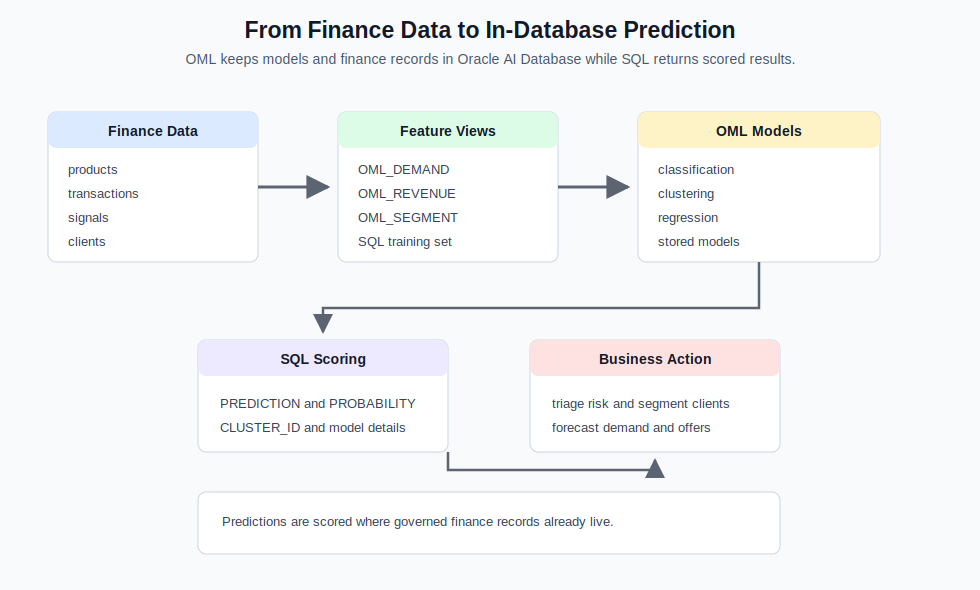
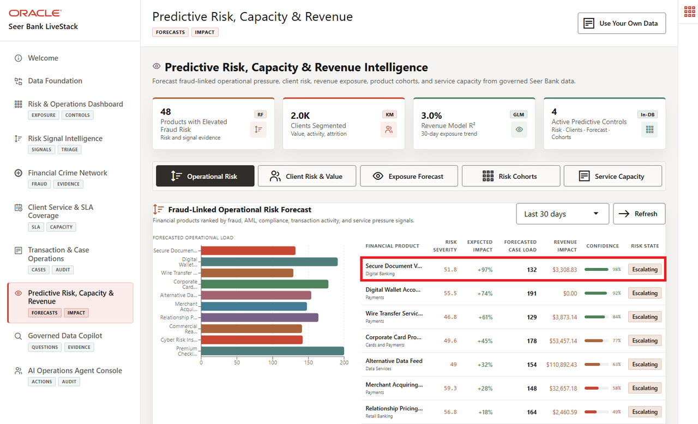

# Predictive Risk, Capacity, and Revenue with OML

## Introduction

This lab scores persisted **Oracle Machine Learning** models created by the finance stack. Make the business bridge clearer: predictions become useful when risk, capacity, revenue, and customer signals can be scored where governed finance data already lives.

Prediction adds forward-looking evidence to the operating flow. Instead of only describing current risk and service pressure, the database can score demand surge, customer segments, product clusters, and revenue expectations where the governed data already lives.

This lab shifts the story from current evidence to forward-looking evidence. The same database records used for dashboard, service, and transaction review become model features scored in place.





### Objectives

- Inventory the four OML models.
- Score classification, clustering, and regression models.

Estimated Time: **12 minutes**

### Operating Story

| Step | Finance focus |
| --- | --- |
| Business Problem | Finance teams need prediction without exporting sensitive operating data. |
| Technical Challenge | Data science and application teams need deployed models that can be scored from SQL without copying governed finance records elsewhere. |
| Persona Focus | Risk and revenue leaders use predictions; database developers and ML engineers prove the models score inside the database. |
| What You Will Prove | Persisted OML models can be inventoried and scored directly in SQL. |
| Database Capability | DBMS\_DATA\_MINING, PREDICTION, PREDICTION\_PROBABILITY, CLUSTER\_ID, and CLUSTER\_PROBABILITY support in-database ML. |
| Outcome | Risk, segmentation, revenue, and product grouping outputs are explainable from SQL. |

Persona focus: You bridge the ML engineer and finance decision-maker by showing how deployed models produce reviewable scores where the data already lives.

## Task 1: Inventory persisted OML models

Perform the following set of steps to inventory persisted OML models before trusting predictive output:

1. Run this model inventory query:

    ```sql
    <copy>
    SELECT model_name,
           mining_function,
           algorithm
    FROM user_mining_models
    ORDER BY model_name;
    </copy>
    ```

    Expected output: OML Model Inventory

    | Model Name | Mining Function | Algorithm |
    | --- | --- | --- |
    | CUSTOMER\_SEGMENT\_MODEL | CLUSTERING | KMEANS |
    | DEMAND\_SURGE\_MODEL | CLASSIFICATION | RANDOM\_FOREST |
    | PRODUCT\_CLUSTER\_MODEL | CLUSTERING | KMEANS |
    | REVENUE\_PREDICT\_MODEL | REGRESSION | GENERALIZED\_LINEAR\_MODEL |


2. Confirm the model list.
    The query reads the model catalog, so it proves deployed model readiness before any prediction is trusted. That mirrors the foundation lab, but for the predictive layer.

    Expected models are CUSTOMER\_SEGMENT\_MODEL, DEMAND\_SURGE\_MODEL, PRODUCT\_CLUSTER\_MODEL, and REVENUE\_PREDICT\_MODEL. The list proves that the database contains deployed models for several finance decisions, not just one isolated prediction.

    This inventory is important because a prediction is only operationally useful when teams can verify which model exists, what mining function it performs, and whether it can be scored from SQL.

**Note:** Sample values may change after data refreshes or rebuilds. Focus on the expected result pattern and the business takeaway, not the exact values.

## Task 2: Score demand risk and revenue in SQL

The prediction labels are the most important part of this task. The confidence and predicted revenue values are model scores, so your workshop environment may show small decimal differences from the examples. Focus on whether the results tell the same business story: which products are predicted as `SURGE` or `STABLE`, which predictions are stronger or weaker, and whether predicted revenue is directionally close to the target revenue.

1. Run the demand surge classification query.

    ```sql
    <copy>
    SELECT s.product_id,
           p.product_name,
           s.training_label,
           s.predicted_surge,
           s.confidence
    FROM (
      SELECT product_id,
             surge_label AS training_label,
             PREDICTION(DEMAND_SURGE_MODEL USING *) AS predicted_surge,
             ROUND(PREDICTION_PROBABILITY(DEMAND_SURGE_MODEL USING *), 4) AS confidence
      FROM oml_demand_training_v
    ) s
    JOIN products p ON p.product_id = s.product_id
    ORDER BY s.product_id
    FETCH FIRST 10 ROWS ONLY;
    </copy>
    ```

    **Expected output: Surge Prediction Results**

    | Product Id | Product Name | Training Label | Predicted Surge | Confidence |
    | --- | --- | --- | --- | --- |
    | 1 | Premium Checking Bundle | STABLE | STABLE | 0.9674 |
    | 2 | High-Yield Savings Account | SURGE | STABLE | 0.6139 |
    | 3 | Rewards Credit Card | SURGE | STABLE | 0.6128 |
    | 4 | Small Business Term Loan | SURGE | SURGE | 0.5831 |
    | 5 | Home Equity Line of Credit | STABLE | STABLE | 0.8716 |
    | 6 | Robo Advisory Portfolio | STABLE | STABLE | 0.9361 |
    | 7 | Managed ETF Portfolio | STABLE | STABLE | 0.6684 |
    | 8 | Municipal Bond Ladder | STABLE | STABLE | 0.9435 |
    | 9 | Treasury Sweep Account | STABLE | STABLE | 0.6597 |
    | 10 | Corporate Card Program | STABLE | STABLE | 0.5252 |

    The inline query scores the same model inputs as the training view, then joins to `PRODUCTS` to show the learner-facing financial product name. The `ORDER BY product_id` clause makes the displayed sample rows stable. The `Confidence` values are OML model scores, not stored source data.


2. Run revenue regression.

    ```sql
    <copy>
    SELECT order_id,
           target_revenue,
           ROUND(PREDICTION(REVENUE_PREDICT_MODEL USING *), 2) AS predicted_revenue
    FROM oml_revenue_training_v
    FETCH FIRST 10 ROWS ONLY;
    </copy>
    ```

    **Expected output: Revenue Prediction Results**

    | Order Id | Target Revenue | Predicted Revenue |
    | --- | --- | --- |
    | 534 | 10035 | 8122.69 |
    | 578 | 5280 | 7385.46 |
    | 579 | 1050 | 802.92 |
    | 6 | 5830 | 5460.79 |
    | 14 | 5400 | 6105.85 |
    | 27 | 2900 | 3772.87 |
    | 50 | 2815 | 4198.3 |
    | 124 | 10390 | 8707.78 |
    | 158 | 2900 | 4522.79 |
    | 173 | 5390 | 7872.1 |


3. Compare actual target revenue to predicted revenue.
    The demand query classifies product pressure from stored finance features, and the revenue query estimates a transaction outcome from customer, order, and fulfillment attributes.

    The demand query returns predicted surge labels with confidence, which helps product and operations teams decide where to watch capacity or risk pressure. The revenue query compares known target revenue to predicted revenue, which helps reviewers understand whether the model is directionally useful for planning.

    Both queries score persisted models without leaving Oracle Database. That keeps sensitive finance records close to the models and gives technical teams SQL evidence for each prediction.

**Note:** Sample values may change after data refreshes or rebuilds. Focus on the expected result pattern and the business takeaway, not the exact values.

## Acknowledgements

* **Author** - Pat Shepherd, Senior Principal Database Product Manager
* **Contributor** - Linda Foinding, Principal Database Product Manager
* **Last Updated By/Date** - Oracle Database Product Management, June 2026
