# Predictive Risk, Capacity, and Revenue with Oracle Machine Learning (OML)

## Introduction

Finance teams use dashboards to understand what has already happened, but they also need predictions that help them plan what to do next. Those predictions are more useful when analysts can see which model produced the score, which business record was scored, and how the result connects back to product, revenue, or risk decisions.

Priya, Seer Bank's AI engineer, prepares the models that help the team plan ahead. Jessica and Maya need results they can review, explain, and use for risk and service planning. Priya needs to show that deployed **Oracle Machine Learning (OML)** models can be scored consistently inside Oracle Database.

You will inventory persisted OML models, score demand-surge and revenue-prediction models in SQL, and review the results next to finance data that business users recognize. By the end of the lab, you will see how in-database machine learning keeps the model, the score, and the supporting finance evidence together.

Oracle Machine Learning (OML) is the database capability for building, storing, scoring, and comparing machine-learning models where the finance records already live. The SQL tasks show established models as reviewable results; the later AutoML workbench helps you compare candidate demand-surge models without first exporting Finance data to a separate ML environment.

<details>
<summary><strong>Key terms: OML model, feature, classification, regression, clustering, and confidence</strong></summary>

> - A **model** is a trained pattern that can score new or current data. In this lab, OML models estimate demand surge, revenue impact, or product grouping from finance records in Oracle Database.
>
> - A **feature** is an input value used by a model. Features can come from product activity, risk severity, transaction attributes, customer behavior, case-processing capacity, or revenue history. Good features translate raw finance records into signals the model can learn from.
>
> - **Classification** predicts a category or label, such as `SURGE` or `STABLE`. This helps teams choose between states, such as whether a product may need more review capacity.
>
> - **Regression** predicts a number, such as expected revenue, forecasted load, or estimated impact. This is useful when planners need a measurable value rather than a yes/no label.
>
> - **Clustering** groups similar records together without requiring a preassigned label. In finance, clustering can compare products, identify cohorts, or find groups that behave alike.
>
> - **Confidence** is the estimated strength of a prediction. It helps you compare stronger and weaker predictions. It is not a guaranteed outcome. Treat confidence as decision support that still needs business review.

</details>

The first image below explains the Oracle Machine Learning (OML) scoring flow. Product, transaction, risk, client, revenue, and capacity data become model features. Oracle Machine Learning scores the models inside the database. The results return to SQL as labels, clusters, forecasts, probabilities, and operational risk signals.

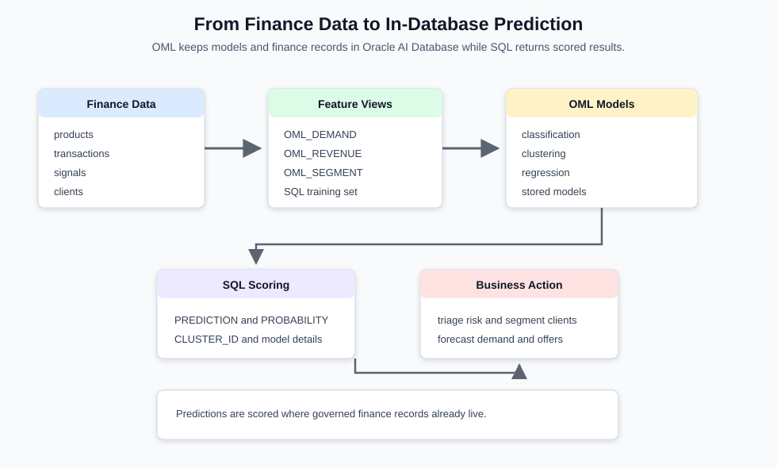

The second image is the Predictive Risk, Capacity and Revenue page. It gives finance teams a business view of product risk, client segments, forecast quality, product cohorts, and case pressure. In this lab, capacity means the ability of teams or service centers to handle review, support, onboarding, dispute, fraud, or AML work. The SQL shows how Oracle Database inventories and scores these predictive results.

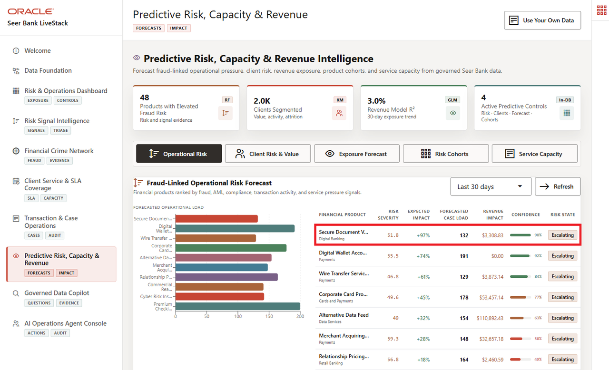

### Objectives

- Inventory the four OML models.
- Score classification and regression models.
- Review a simple model quality check.
- Use the OML AutoML UI to compare candidate demand-surge models without deploying one.

Estimated Time: **27 minutes**

### Business Scenario

| Step | Finance focus |
| --- | --- |
| Business Problem | Finance teams need prediction without exporting sensitive operating data. |
| Technical Challenge | Data science and application teams need deployed models that can be scored from SQL without copying finance records elsewhere. |
| Persona Focus | Priya connects deployed ML models to Jessica's risk review and Maya's operations planning. |
| What You Will See | Persisted OML models can be inventoried and scored directly in SQL. |
| Database Capability | The Oracle Machine Learning model catalog, `PREDICTION`, and `PREDICTION_PROBABILITY` support in-database ML scoring. |
| Outcome | Risk, segmentation, revenue, and product grouping outputs are explainable from SQL. |

## Task 1: Inventory persisted OML models

Begin by reviewing the persisted OML models available for scoring.

1. Run this model inventory query:

    > **SQL Worksheet reminder:** Need a reminder on how to open and use the SQL Worksheet? Return to [Getting Started Task 2: Open SQL Worksheet](?lab=getting-started#Task2:OpenSQLWorksheet) for the step-by-step graphic showing where to paste and run SQL statements.

    You are confirming which predictive models are available before using them in finance decisions.

    In order to understand this query, you need to read it in three parts.

    1. `USER_MINING_MODELS` is the database catalog view for OML models owned by your schema.
    2. `MODEL_NAME` tells you which deployed model is available to score.
    3. `MINING_FUNCTION` and `ALGORITHM` tell you what kind of prediction the model makes and how it was trained.

    <details>
    <summary><strong>Why this matters: in-database machine learning</strong></summary>

    > In a fractured environment, data teams often export sensitive finance records to a separate machine learning platform, score the data there, and then send results back to the application or dashboard. That creates copies, governance questions, and extra movement of sensitive data.
    >
    > Oracle Machine Learning lets you score models inside Oracle Database. The model, data, SQL evidence, and business context stay close together, which is better for explainability and governance.

    </details>

    ```sql
    <copy>
    SELECT model_name,
           mining_function,
           algorithm
    FROM user_mining_models
    WHERE model_name IN (
      'CUSTOMER_SEGMENT_MODEL',
      'DEMAND_SURGE_MODEL',
      'PRODUCT_CLUSTER_MODEL',
      'REVENUE_PREDICT_MODEL'
    )
    ORDER BY model_name;
    </copy>
    ```

    Expected output: OML Model Inventory

    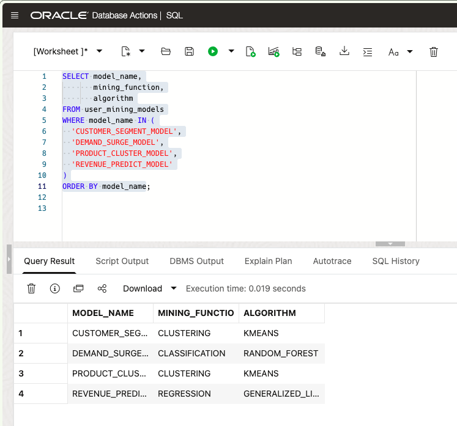


2. Confirm the model list.
    The query reads the model catalog so you can see which predictive functions are available for finance decisions.

    Expected models are CUSTOMER\_SEGMENT\_MODEL, DEMAND\_SURGE\_MODEL, PRODUCT\_CLUSTER\_MODEL, and REVENUE\_PREDICT\_MODEL. The list shows that the database contains deployed models for several finance decisions, not just one isolated prediction. In this lab, you score the demand and revenue models.

    This matters because a prediction is easier to trust when teams know which model produced it. The inventory gives the learner a simple checkpoint before scoring: what model exists, what it predicts, and whether it can be called from SQL.

## Task 2: Score demand risk and revenue in SQL

Now score demand risk and revenue directly in SQL so learners can see how deployed OML models support finance decisions without moving finance records out of the database.

1. Run the demand surge classification query:

    You are scoring product demand pressure and showing the product names behind the model output.

    In order to understand this query, you need to read it in four parts.

    1. `OML_DEMAND_TRAINING_V` gives the model a repeatable set of product and risk inputs.
    2. `PREDICTION(DEMAND_SURGE_MODEL USING *)` asks the deployed model to classify each row as `SURGE` or `STABLE`.
    3. `PREDICTION_PROBABILITY(DEMAND_SURGE_MODEL USING *)` returns confidence for that prediction. The `ROUND` function makes the score easier to read.
    4. The outer query joins to `PRODUCTS` so the learner sees a product name, not just a product id.

    ```sql
    <copy>
    SELECT s.product_id,
           p.product_name,
           s.training_label,
           s.predicted_surge,
           s.confidence
    FROM (
      SELECT product_id,
             surge_label AS training_label,
             PREDICTION(DEMAND_SURGE_MODEL USING *) AS predicted_surge,
             ROUND(PREDICTION_PROBABILITY(DEMAND_SURGE_MODEL USING *), 4) AS confidence
      FROM oml_demand_training_v
    ) s
    JOIN products p ON p.product_id = s.product_id
    ORDER BY s.product_id
    FETCH FIRST 10 ROWS ONLY;
    </copy>
    ```

    **Expected output: Surge Prediction Results**

    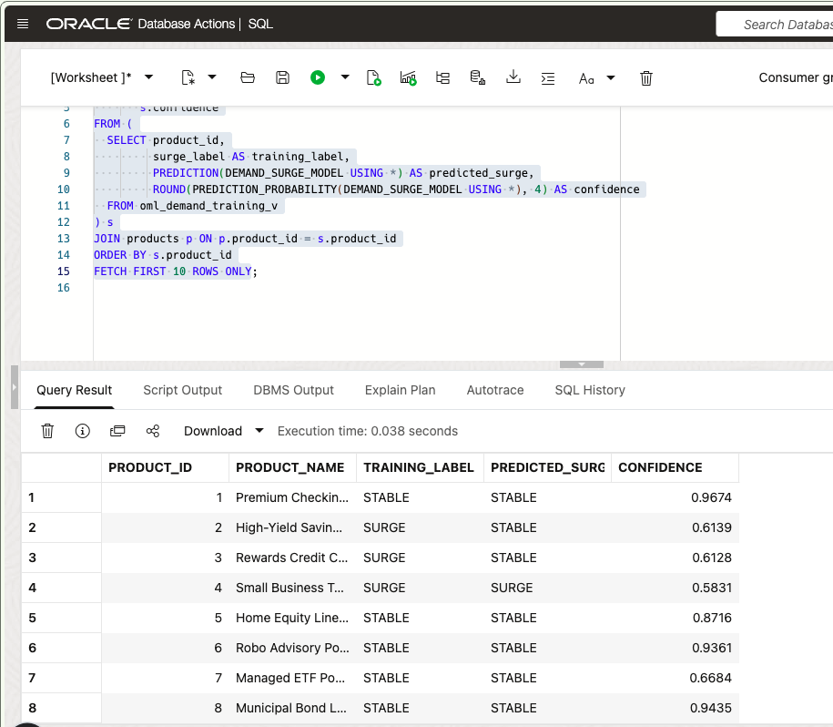

    Review the predicted surge and confidence together. A `SURGE` prediction can help an analyst decide which products may need more monitoring, outreach, or case-processing capacity. Confidence helps the analyst decide how strongly the model supports that prediction. It does not replace review; it helps rank where to look first.

    🎯 **Interactive challenge: choose a review candidate.** Among the results shown, which product would you review first, and why?

    <details>
    <summary><strong>Challenge answer: a confident mismatch needs context</strong></summary>

    > Review `High-Yield Savings Account` first. Its training label is `SURGE`, while the model predicts `STABLE` with confidence `0.6139`, slightly higher than the other visible mismatch. Confidence is probability for the predicted label, not business severity or certainty. The mismatch is a reason to investigate the governed evidence, not an automated decision.

    </details>


2. Check how often the demand model matches the known label.

    A model score is the result returned when a trained model evaluates a row of data. For a classification model, the score is the predicted label, such as `SURGE` or `STABLE`. The confidence value is the model probability for that prediction. It is not certainty, and it is not a guarantee that the outcome will happen.

    Before analysts use a model score, they need a quick check that the model is behaving reasonably on the workshop data. This query compares two values for each product: the known label in the training view and the label predicted by the model.

    ```sql
    <copy>
    SELECT actual_label,
           predicted_label,
           COUNT(*) AS product_count
    FROM (
      SELECT surge_label AS actual_label,
             PREDICTION(DEMAND_SURGE_MODEL USING *) AS predicted_label
      FROM oml_demand_training_v
    )
    GROUP BY actual_label,
             predicted_label
    ORDER BY actual_label,
             predicted_label;
    </copy>
    ```

    **Expected output: Demand Model Agreement Check**

    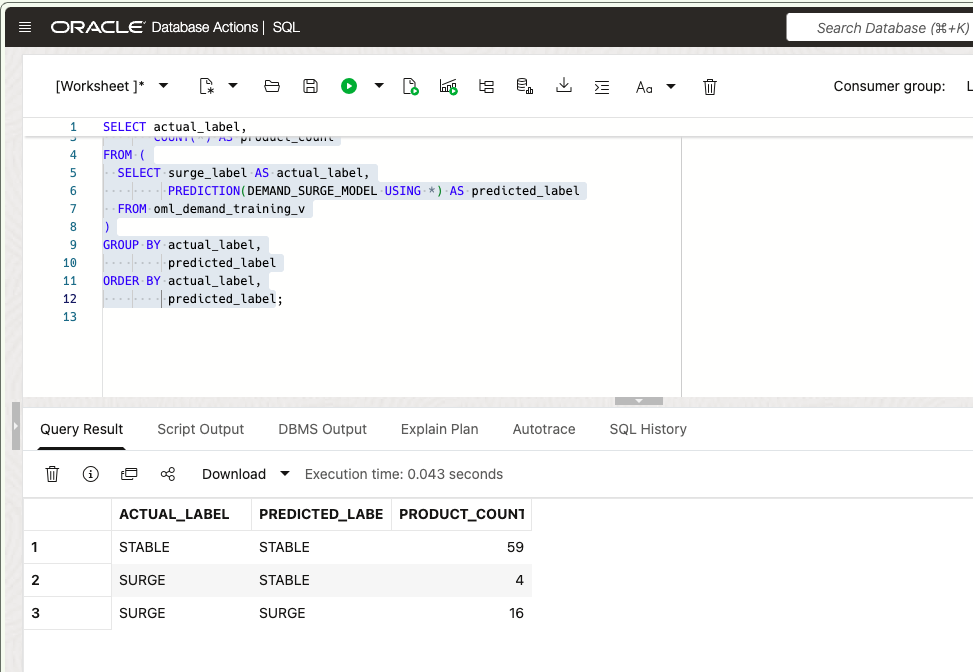

    In order to understand this query, you need to read it in three parts.

    1. `SURGE_LABEL` comes from `OML_DEMAND_TRAINING_V`. It marks each product as `SURGE` or `STABLE` in the demo data, so the query renames it `ACTUAL_LABEL`.
    2. `PREDICTION(DEMAND_SURGE_MODEL USING *)` asks the model to predict a label for the same row. In this query, it is renamed `PREDICTED_LABEL`.
    3. The outer query groups the results so you can count how often each actual and predicted combination appears.

    Rows where `ACTUAL_LABEL` and `PREDICTED_LABEL` are the same are matches. Rows where they are different show where the model prediction differs from the label stored in `OML_DEMAND_TRAINING_V`. This is a simple learning check, not a full production model evaluation.

    The workshop uses synthetic demo data to teach the SQL pattern. Do not interpret these scores as a production financial risk model.

3. Run revenue regression.

    You are estimating revenue outcomes from the persisted regression model.

    In order to understand this query, you need to read it in three parts.

    1. `OML_REVENUE_TRAINING_V` gives the model a consistent set of revenue-related inputs.
    2. `PREDICTION(REVENUE_PREDICT_MODEL USING *)` returns a numeric revenue estimate for each row.
    3. The query shows `TARGET_REVENUE` next to `PREDICTED_REVENUE` so the learner can compare the known business value with the model estimate.

    ```sql
    <copy>
    SELECT order_id,
           target_revenue,
           ROUND(PREDICTION(REVENUE_PREDICT_MODEL USING *), 2) AS predicted_revenue
    FROM oml_revenue_training_v
    ORDER BY order_id
    FETCH FIRST 10 ROWS ONLY;
    </copy>
    ```

    **Expected output: Revenue Prediction Results**

    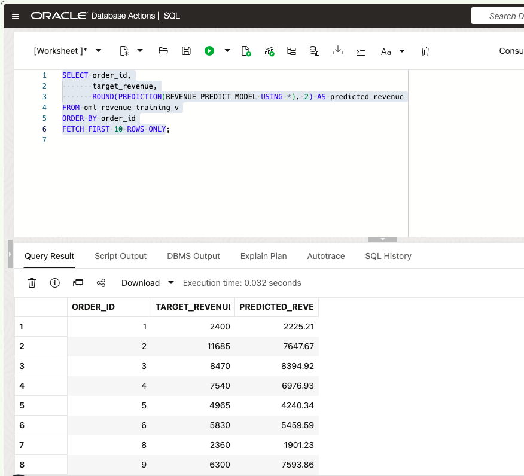


4. Compare actual target revenue to predicted revenue.
    Look for rows where predicted revenue is close to target revenue, then look for rows where the difference is larger. Close values show where the model estimate lines up with known outcomes. Larger gaps show where an analyst may want more context, such as unusual customer behavior, product mix, or fulfillment timing.

    The demand query helps teams decide which products may need attention. The revenue query helps teams see whether a model estimate is useful for planning. Both queries score persisted models without moving sensitive finance records out of Oracle Database.

    🎯 **Interactive challenge: surface the largest forecast gaps.** Starting with the revenue query above, add a `revenue_gap` column that uses `ABS` to calculate the difference between `target_revenue` and the prediction. Then change the sort so the largest gaps appear first and return only five rows. Which order now leads the review queue, and what additional context would you seek?

    **Expected output: Largest Revenue Forecast Gaps**

    The revised query examines the full training view rather than just the first ten order IDs. The top result can change if the model or workshop data is refreshed.

    <details>
    <summary><strong>Challenge answer: a gap is evidence, not proof</strong></summary>

    > In the current workshop data, order `2057` leads the full-data review queue with a revenue gap of `7636.72`. Review product mix, customer behavior, and timing before drawing a conclusion. A large gap is evidence to investigate, not proof that the model or business outcome is wrong. Oracle Machine Learning keeps the model score beside the finance evidence needed for that review, rather than sending sensitive data to a separate scoring platform.

    If you need the runnable solution, use this query:

    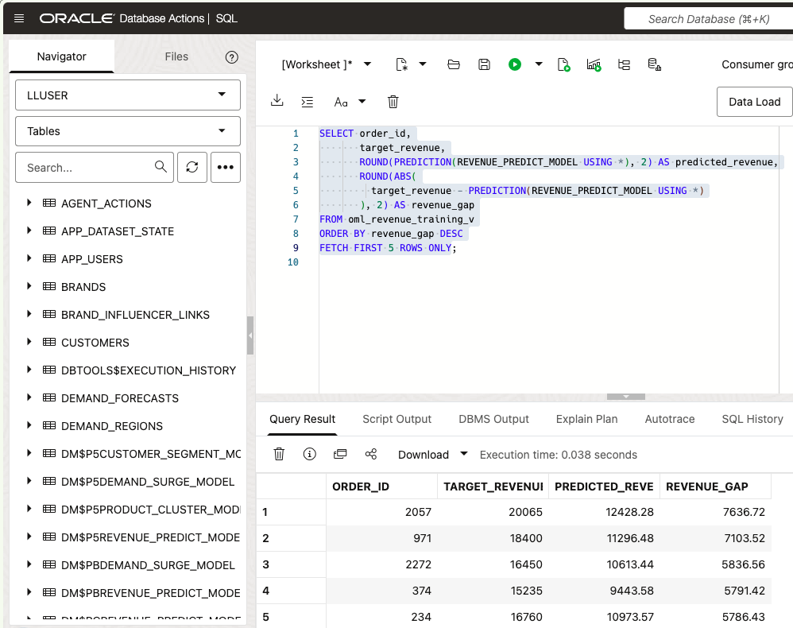

    ```sql
    <copy>
    SELECT order_id,
           target_revenue,
           ROUND(PREDICTION(REVENUE_PREDICT_MODEL USING *), 2) AS predicted_revenue,
           ROUND(ABS(
             target_revenue - PREDICTION(REVENUE_PREDICT_MODEL USING *)
           ), 2) AS revenue_gap
    FROM oml_revenue_training_v
    ORDER BY revenue_gap DESC
    FETCH FIRST 5 ROWS ONLY;
    </copy>
    ```

    </details>

## Task 3: Build and compare demand-surge models in the OML AutoML UI

The SQL tasks above score the workshop's existing demand model. In this task, you will use the Oracle Machine Learning AutoML UI to compare candidate models for predicting demand surge across financial products and services, such as checking accounts, savings accounts, loans, and credit cards. You will identify the model approach that best supports Jessica's capacity-planning decision. You are still working inside Oracle AI Database: the Finance data, experiment settings, candidate models, and results remain in one platform.

AutoML is the OML workspace for comparing multiple candidate model approaches from a saved view and a business target. It is useful here because the team can evaluate candidate models and feature importance for capacity planning without hand-building every experiment or moving Finance data outside the database.

Jessica is asking questions such as:

- Which financial products and services could create a demand surge before account openings or applications alone reveal it?
- Are changing customer sentiment and viral attention early signals, or just noise?
- Which model approach gives her the strongest basis for human capacity planning, and why?

Without AutoML, a data-science team would separately prepare the training data, select algorithms, test feature sets, tune model settings, measure candidates, and document the result before handing a model to the business. Here, you choose the saved Finance view, business target, and success metric. AutoML performs the repeatable candidate-model work so the team can focus on the Finance question, the leaderboard results, and which model approach fits the decision.

**Why this matters:** A validated candidate model can become a governed scoring service for Finance. After the team approves a model, it can deploy the model as an Oracle Machine Learning Services endpoint. Finance applications and dashboards can then request current demand-surge predictions and present them to Jessica for capacity planning and human review.

| What you learn | What the Finance business gets |
| --- | --- |
| How to turn a saved Finance view and a business label into a repeatable AutoML experiment. | A faster, repeatable way to compare models without exporting the data to a separate machine learning platform. |
| How the selected metric ranks candidate models and how feature importance explains the inputs used. | A clearer basis for choosing a model to support financial-product demand and capacity planning, with evidence that stays close to the Finance data. |

1. Open the AutoML UI.

    From your Autonomous Database landing page, select **Database Actions** and then **View all database actions**. Under **Development**, select **Machine Learning**. Sign in with your workshop database credentials, then select **AutoML** from the OML home page.

    The first screen shows where to open the full Database Actions launchpad from your Autonomous Database page.

    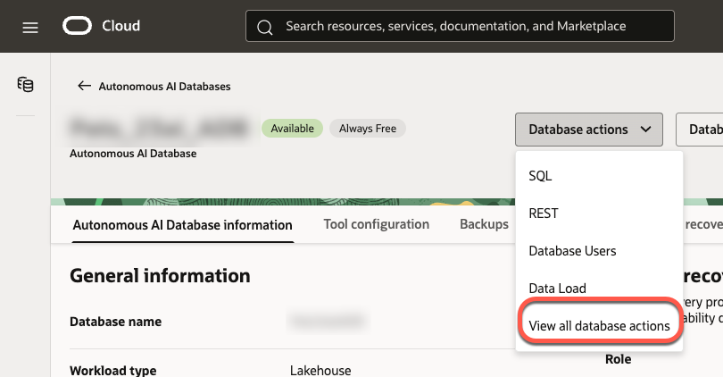

    In the launchpad, select **Machine Learning** from the **Development** section.

    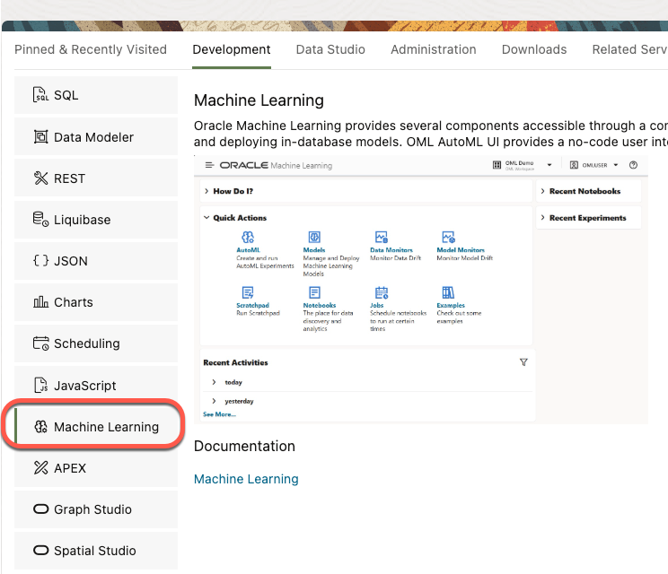

    On the Oracle Cloud sign-in screen, enter the workshop database username and password, then select **Sign in**.

    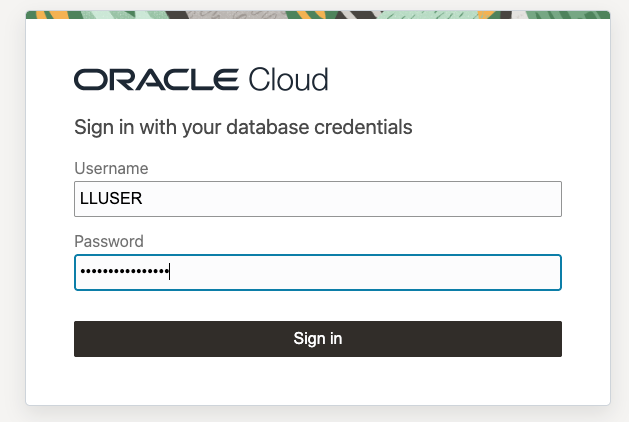

    The OML home page groups the tools you can use with the workshop schema. Select **AutoML** to open the experiment list.

    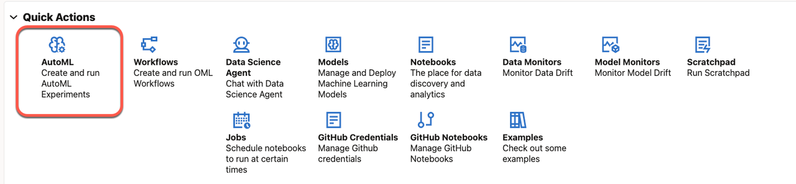

    The experiment list is where you create, rerun, or compare experiments. Select **Create**.

    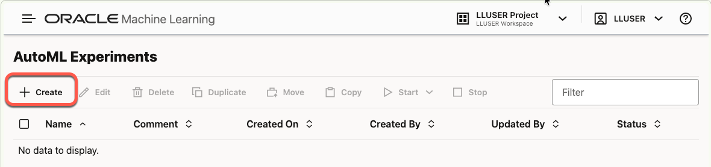

2. Create an experiment from the Finance demand-training view.

    Select **Create** and use the following settings. Add your initials to the experiment name so it is easy to recognize during this workshop.

    | Setting | Value |
    | --- | --- |
    | Name | `FIN_DEMAND_SURGE_AUTOML_<YOUR_INITIALS>` |
    | Data Source | Schema: `LLUSER`; View: `OML_DEMAND_TRAINING_V` |
    | Predict | `SURGE_LABEL` |
    | Prediction Type | `Classification` |
    | Case ID | `PRODUCT_ID` |

    `SURGE_LABEL` is the same synthetic demand label you compared with `DEMAND_SURGE_MODEL` in Task 2. `PRODUCT_ID` gives the experiment a stable case identifier for data sampling and split decisions.

    Confirm the experiment name, Finance view, `SURGE_LABEL` prediction target, classification type, and `PRODUCT_ID` case ID before you start.

    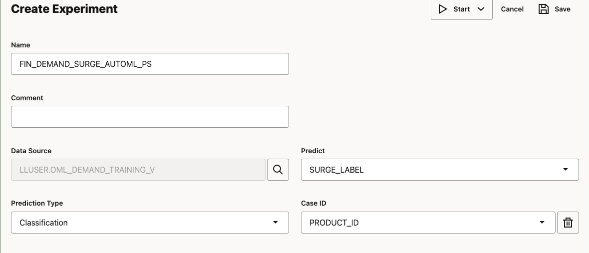

    When choosing the data source, select the `LLUSER` schema and then `OML_DEMAND_TRAINING_V`.

    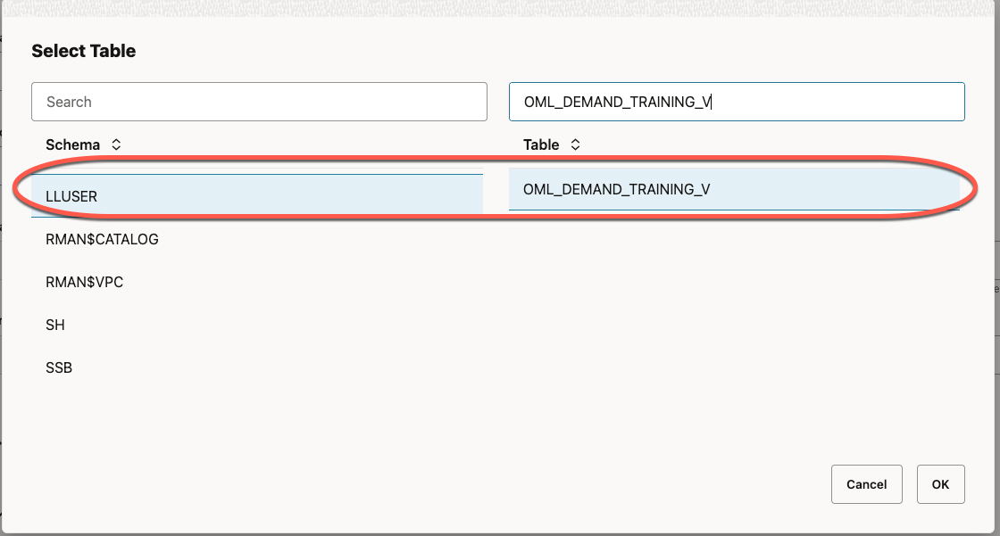

3. Set a short comparison run and start the experiment.

    On the same **Create Experiment** page, scroll down to **Additional Settings**. Set **Maximum Top Models** to `2` and choose **Balanced Accuracy** as the model metric. Keep the remaining settings at their defaults unless your sandbox guidance requires a different service level. Do not start the experiment yet; the next instruction shows how to choose **Faster Results**.

    These settings keep the comparison short while asking AutoML to rank two candidate models by balanced accuracy.

    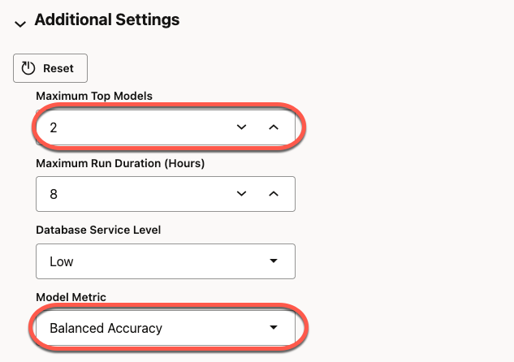

    Open the arrow beside **Start** and choose **Faster Results**.

    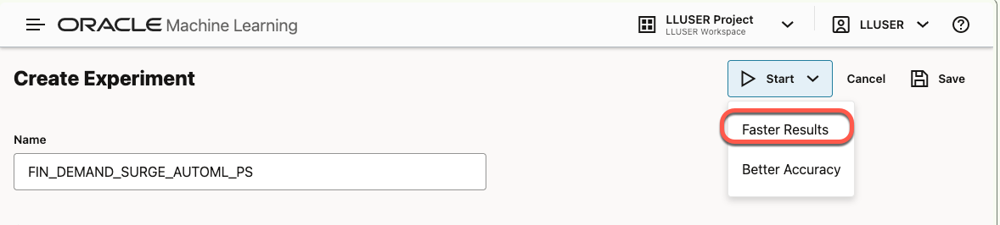

    The progress panel shows the experiment stages, such as sampling, feature selection, and model tuning. Wait for the run to complete before reviewing the results.

    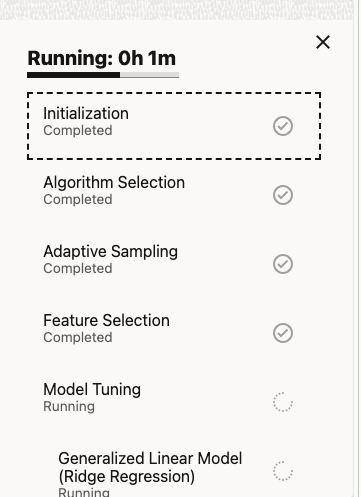

    When the run completes, inspect the ranked candidate-model list and expand the **Features** grid. The leaderboard does not identify which financial product or service will experience a demand surge. It compares candidate algorithms for predicting `SURGE_LABEL` and ranks them by the metric you selected. The first row is the best candidate in this experiment, not a final business decision. The winning algorithm, scores, and feature rankings are dynamic; do not expect a fixed result.

    For Finance, the result is a faster first assessment of which modeling approach best supports demand and capacity planning. Instead of manually running and documenting multiple candidate approaches, the team receives a ranked starting point for expert review before production deployment.

    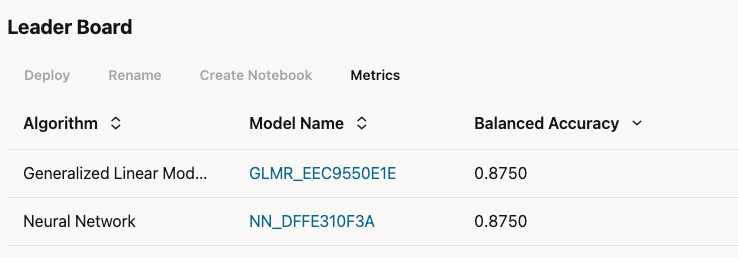

    The Features grid shows the relative sensitivity of the model to each Finance input. It helps the business ask better follow-up questions, such as which financial-product activity or customer-engagement signals deserve review when planning demand capacity. Importance does not prove causation, and it does not replace Finance judgment.

    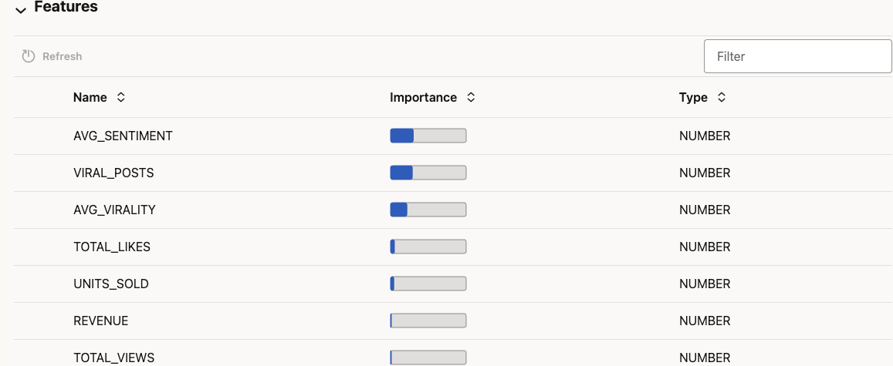

    **What this means for Jessica:** In the illustrated run, `AVG_SENTIMENT`, `VIRAL_POSTS`, and `AVG_VIRALITY` are the strongest visible inputs. Jessica should examine whether changing sentiment or unusually viral attention around a checking account, savings account, loan, or credit card is creating demand pressure, then pair that evidence with units sold and revenue before changing capacity plans.

    **What comes next:** Before using a candidate model for a real Finance decision, the data-science and Finance teams validate it on newer, unseen data; check the important features for quality and leakage; and agree how a `SURGE` prediction will trigger human review or capacity planning. They then select the approved model, assign its URI and version, and deploy it as an Oracle Machine Learning Services scoring endpoint. That endpoint enables a Finance application or dashboard to request predictions for current checking accounts, savings accounts, loans, and credit cards, then show Jessica a governed, reviewable demand-capacity queue.

    🎯 **Interactive challenge: compare the decision criterion.** Create a second experiment from the same view, name it `FIN_DEMAND_SURGE_F1_<YOUR_INITIALS>`, and change only the model metric to **F1 Macro**. Start it with **Faster Results**. Did the same candidate model lead both experiments? If not, which experiment's metric better fits a planning team that wants balanced treatment of both `SURGE` and `STABLE` financial products and services?

    <details>
    <summary><strong>Challenge answer: choose the metric that matches the planning question</strong></summary>

    > There is no fixed winning algorithm or score. If the candidate ranking changes, the comparison shows that model selection depends on the decision criterion, not only on a single headline score. For a planning team that needs `SURGE` and `STABLE` financial products and services to receive balanced attention, **Balanced Accuracy** is the clearer first comparison because it gives each class equal recall weight. Review the F1 Macro result as complementary evidence because it also considers false positives through precision. Oracle AI Database keeps those candidate-model results with the governed Finance features that explain the comparison.

    Select **F1** as the model metric and **Macro** as its weight option. Keep the two-model limit so the two experiments are comparable.

    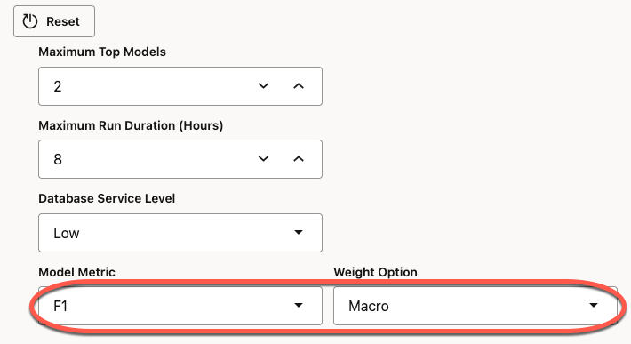

    **Expected output: Two AutoML experiment result sets**

    Both experiments should show ranked candidate models and feature importance after they finish. The ranking can change because **Balanced Accuracy** measures average recall across classes, while **F1 Macro** balances precision and recall equally across classes. Neither result is a production decision by itself; use the results to decide what deserves additional Finance review.

    Compare the F1 Macro leaderboard with the first leaderboard. The metric heading tells you which decision criterion is driving the rank.

    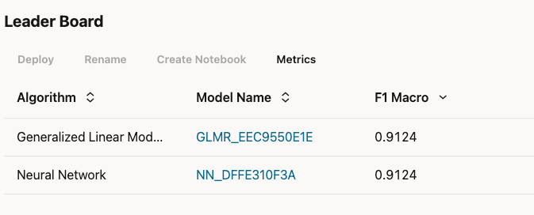

    Then review whether the feature-importance pattern remains consistent across the two experiments.

    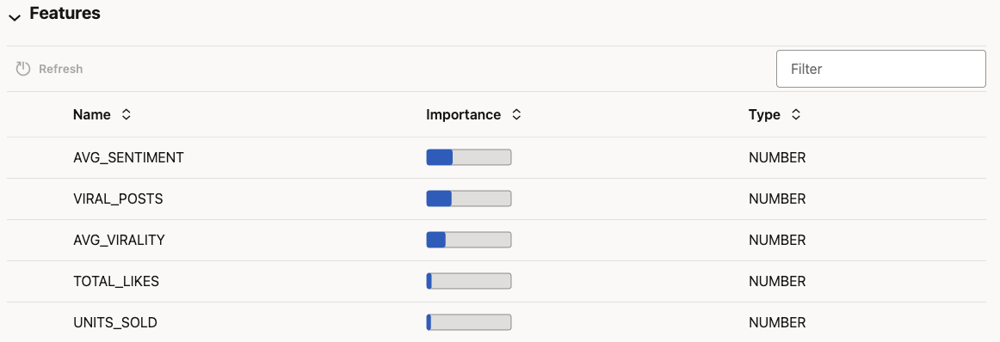

    </details>

## Next Steps

Congratulations on completing the Oracle Machine Learning lab. You inspected models, generated model scores, checked how often a prediction matched the demo label, and compared predicted revenue to target revenue. You also created a demand-surge AutoML experiment and compared candidate models by Balanced Accuracy and F1 Macro; use that comparison to select what deserves further review, not as an automatic staffing or capacity decision. For a deeper hands-on workshop focused on Oracle Machine Learning, open the [Oracle Machine Learning LiveLabs workshop](https://livelabs.oracle.com/ords/r/dbpm/livelabs/view-workshop?clear=RR,180&wid=922).

## Acknowledgements

* **Author** - Pat Shepherd, Senior Principal Database Product Manager
* **Contributor** - Linda Foinding, Principal Database Product Manager
* **Last Updated By/Date** - Oracle Database Product Management, August 2026
