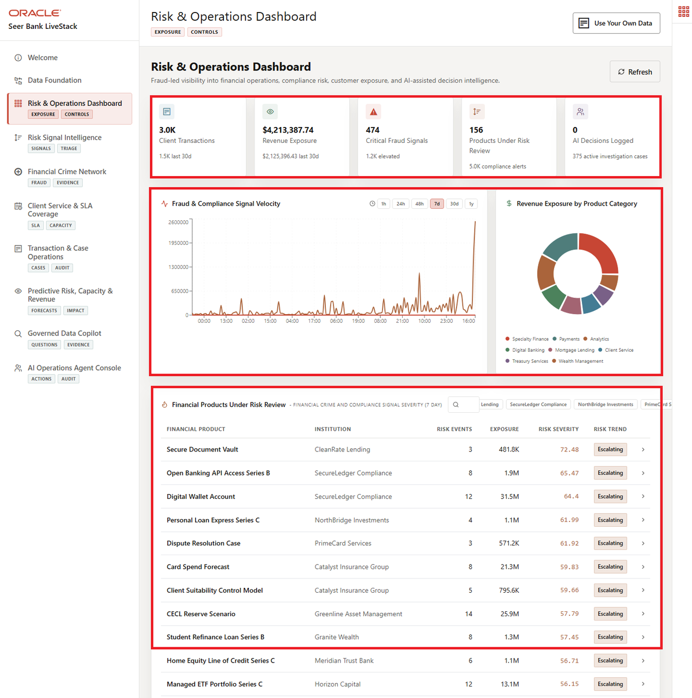

# Risk and Operations Dashboard

## Introduction

This lab recreates the evidence behind the application dashboard. You query critical risk signals, client exposure, transaction value, service pressure, and agent action history directly from the database.

The dashboard is the workshop's first decision surface. It turns the foundation from Lab 1 into operating measures that risk leaders can use to decide which signals, products, and client exposures need review first.

The key point is traceability. A dashboard can summarize the business, but the bank still needs to prove where the numbers came from. In this lab, each metric is reproducible with SQL over the same finance views and source tables used by the rest of the workshop.



### Objectives

- Calculate risk and exposure KPIs.
- Identify products with high signal exposure.

Estimated Time: **10 minutes**

### Operating Story

| Step | Finance focus |
| --- | --- |
| Business Problem | Risk teams need a shared view of exposure, transaction pressure, and service capacity. |
| Technical Challenge | App and data teams need one explainable query path instead of separate pipelines for signals, products, transactions, and service data. |
| Persona Focus | Risk operations leaders read the dashboard; database and application developers prove where the dashboard evidence comes from. |
| What You Will Prove | Dashboard metrics are database-backed and can be explained with SQL. |
| Database Capability | Converged SQL aggregates finance views, transaction data, service records, and audit tables. |
| Outcome | Operators can move from a dashboard KPI to trusted detail without changing systems. |

Persona focus: You support the risk operations leader by showing that one database query path can explain the dashboard instead of hiding work across integration layers.

## Task 1: Calculate risk signal KPIs

1. Run the dashboard aggregate query.

    ```sql
    <copy>
    SELECT COUNT(*) AS total_signals,
           ROUND(AVG(criticality_score), 1) AS avg_criticality,
           SUM(CASE WHEN criticality_score >= 80 THEN 1 ELSE 0 END) AS high_risk_signals,
           SUM(exposure_count) AS total_exposure,
           SUM(cases_opened_count) AS cases_opened
    FROM risk_signals_v;
    </copy>
    ```

    Expected output: Dashboard KPI Summary

    | Total Signals | Avg Criticality | High Risk Signals | Total Exposure | Cases Opened |
    | --- | --- | --- | --- | --- |
    | 5000 | 41.2 | 9 | 1602966769 | 5657933 |


2. Interpret the result.
    The query compresses 5,000 monitored signals into the headline measures a risk leader would scan first: volume, average severity, high-risk count, total exposure, and opened cases. These values explain the top row of the dashboard without requiring a separate reporting store.

    A risk signal is a monitored event that may require review. In this workshop, signals can come from product mentions, customer activity, transactions, service pressure, or other finance operations data. The total signal count shows how much activity the dashboard is watching, while average criticality shows the overall severity of that activity.

    The high-risk count is the number of signals with a criticality score of 80 or higher. A higher count means more issues may need immediate analyst review, case triage, or automated follow-up from the operations agent. It does not mean every item is confirmed fraud or a confirmed incident; it means the dashboard has found more items that cross the bank's review threshold.

## Task 2: Find top product exposure

1. Run this product exposure query.

    ```sql
    <copy>
    SELECT fp.financial_product_name,
           fi.institution_name,
           fp.product_category,
           COUNT(DISTINCT sp.post_id) AS signal_count,
           ROUND(AVG(sp.virality_score), 1) AS avg_criticality,
           SUM(sp.views_count) AS exposure_count
    FROM post_product_mentions ppm
    JOIN social_posts sp ON sp.post_id = ppm.post_id
    JOIN finance_products_v fp ON fp.financial_product_id = ppm.product_id
    JOIN finance_institutions_v fi ON fi.institution_id = fp.institution_id
    GROUP BY fp.financial_product_name, fi.institution_name, fp.product_category
    ORDER BY avg_criticality DESC, exposure_count DESC
    FETCH FIRST 10 ROWS ONLY;
    </copy>
    ```

    Expected output: Top Product Exposure

    | Financial Product Name | Institution Name | Product Category | Signal Count | Avg Criticality | Exposure Count |
    | --- | --- | --- | --- | --- | --- |
    | Carbon Credit Custody | IPA Direct Finance | Carbon Markets | 51 | 46 | 30212024 |
    | Auto Loan Digital Offer | NorthBridge Investments | Consumer Lending | 48 | 45.9 | 66064101 |
    | KYC Refresh Workflow | NorthBridge Investments | Compliance Services | 41 | 45.6 | 37993643 |
    | Managed ETF Portfolio | Horizon Capital | Wealth Management | 29 | 45.3 | 52445042 |
    | Loan Portfolio Review | LedgerGrade Connect | Risk Analytics | 45 | 45.1 | 42518770 |
    | 529 Education Savings Plan | Harvest Commercial Bank | Investments | 41 | 45 | 20763811 |
    | Small Business Term Loan | Meridian Trust Bank | Commercial Lending | 40 | 44.6 | 15504074 |
    | Corporate Card Program | Horizon Capital | Cards and Payments | 37 | 44 | 4680777 |
    | Mortgage Pre-Approval | NorthBridge Investments | Mortgage Lending | 46 | 43.9 | 23334598 |
    | Digital Wallet Account | SecureLedger Compliance | Payments | 48 | 43.8 | 37616607 |


2. Use the top rows to explain dashboard priority.
    This query joins signal events to financial products and institutions so the dashboard can move from "risk is rising" to "these products and institutions need attention." The grouping logic turns individual signal rows into a review queue that business users can understand.

    Each row shows a financial product associated with monitored risk signals. `Signal Count` is the number of distinct posts or events tied to the product. `Avg Criticality` shows how severe those signals are on average. `Exposure Count` estimates how many views or interactions those signals reached.

    A product with many signals, high average criticality, and high exposure should move to the top of the dashboard review queue. That combination means the issue is showing up repeatedly, scoring as more severe, and reaching more people. For a financial institution, that can raise client, regulatory, reputational, or operational risk.


## Acknowledgements

* **Author** - Pat Shepherd, Senior Principal Database Product Manager
* **Contributor** - Linda Foinding, Principal Database Product Manager
* **Last Updated By/Date** - Oracle Database Product Management, June 2026
