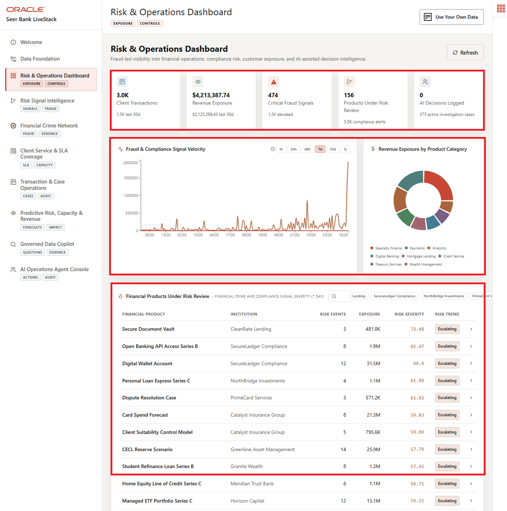
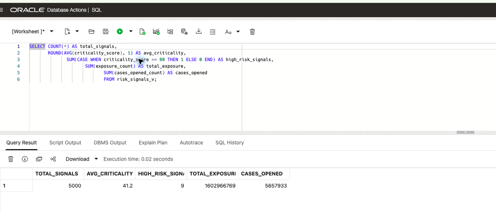
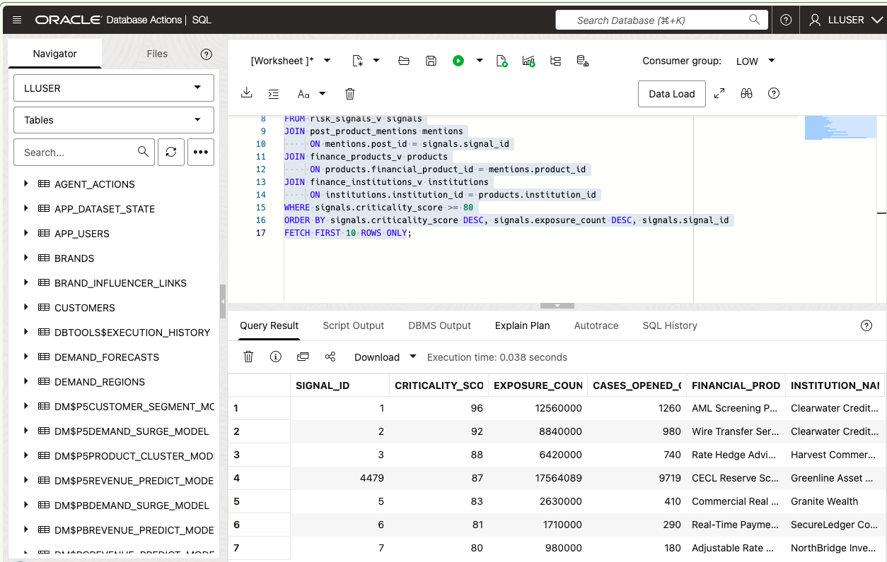
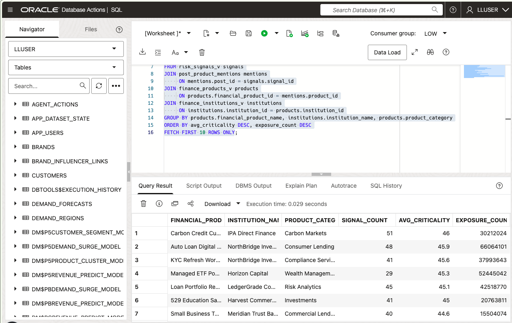

# Risk and Operations Dashboard

## Introduction

Risk leaders rarely have time to inspect every signal one by one. They need to know which signals, products, and client exposures deserve review first. This lab shows the SQL queries and returned rows behind each application-dashboard metric.

Jessica, Seer Bank's risk analyst, starts with the dashboard. She needs to understand which risk signals deserve attention and then trace each summary number back to the records behind it.

If you skipped the optional data-foundation lab, start here: this lab uses risk signals, product mentions, finance products, and finance institutions. The task introductions identify the views and tables as you use them; no separate catalog inventory is required.

The dashboard is the workshop's first business summary. It summarizes monitored risk signals, their exposure, and the products connected to them so risk leaders can prioritize review.

In this lab, **exposure** means the reach or scale of monitored risk signals. A signal with low exposure may still matter, but a signal with high exposure can affect more clients, products, channels, or public attention. Exposure helps answer a practical question: if the team can only review a few issues right now, which ones could have the widest impact?

The key point is traceability. A dashboard can summarize the business, but the bank still needs to show where the numbers came from. Here, each metric is reproducible with SQL over finance views and source tables.

<details>
<summary><strong>Key terms: KPI, signal, criticality, exposure, and case</strong></summary>

> - A **KPI** is a key performance indicator. It is a summary measure that helps leaders understand the current operating picture quickly, such as exposure, high-risk signal count, or product review pressure. A useful KPI should still be traceable to the rows behind it.
>
> - A **risk signal** is an event, bulletin, alert, or observation that may deserve review. It is not automatically confirmed fraud or confirmed harm; it is a prompt for investigation. In this workshop, signals help Seer Bank decide which products, institutions, or client activities need attention first.
>
> - **Criticality** is a severity measure for a risk signal. Higher criticality means the signal appears more urgent or consequential, so the team may review it before lower-severity activity. Criticality helps prioritize work when there are more signals than people can inspect manually.
>
> - **Exposure** is the reach or scale of a signal or product risk. A highly exposed issue may affect more clients, higher transaction value, more products, more channels, or more public attention. Exposure helps answer, "How wide could the impact be if this risk is real?"
>
> - A **case** is follow-up work opened for review, investigation, or action. Cases turn a signal into operational work, such as analyst review, compliance escalation, client outreach, document handling, or service routing.

</details>

The image below is the Risk and Operations Dashboard. It is the daily operating view for a risk leader or product portfolio manager: KPI cards summarize high-risk signals and exposure; charts show signal activity and exposure by product category; and the product table identifies where review should start. The SQL in this lab shows how those measures are calculated from risk-signal, product, and institution rows.



### Objectives

- Calculate risk and exposure KPIs.
- Identify products with high signal exposure.

Estimated Time: **10 minutes**

### Business Scenario

| Step | Finance focus |
| --- | --- |
| Business Problem | Risk teams need a shared view of serious signals, their exposure, and the products and institutions connected to them. |
| Technical Challenge | App and data teams need one explainable query path instead of separate pipelines for risk signals, product mentions, products, and institutions. |
| Persona Focus | Jessica reads the dashboard; Jordan shows where its database evidence comes from. |
| What You Will See | Dashboard metrics are database-backed and can be explained with SQL. |
| Database Capability | SQL aggregates governed risk-signal, product, and institution views. |
| Outcome | Operators can move from a dashboard KPI to the products and institutions that need review without changing systems. |

Persona focus: You join Jessica and Jordan as they use one database query path to explain the dashboard instead of hiding work across integration layers.

## Task 1: Calculate risk signal KPIs

Start with the KPI query that explains the top-level dashboard numbers.

1. Run the dashboard aggregate query:

    > **SQL Worksheet reminder:** Need a reminder on how to open and use the SQL Worksheet? Return to [Getting Started Task 2: Open SQL Worksheet](?lab=getting-started#Task2:OpenSQLWorksheet) for the step-by-step graphic showing where to paste and run SQL statements.

    You are recreating the dashboard's headline risk measures directly from governed signal data. The SQL aggregates all rows in `RISK_SIGNALS_V`, calculates the average criticality, counts signals above the high-risk threshold, and sums exposure and case counts into one KPI row.

    `RISK_SIGNALS_V` is a view, not a raw table. It gives the dashboard a clean risk-signal shape with the columns this lesson needs: severity, exposure, case counts, product context, and signal timing. That is valuable because you can focus on what the dashboard metric means instead of hunting through several lower-level tables to find the same business fields.

    The exposure total shows the overall reach of the monitored risk activity. That helps distinguish a small number of isolated alerts from risk signals that may have broad client, product, or reputational impact.

    <details>
    <summary><strong>Why this matters: better than a separate reporting pipeline</strong></summary>

    > In a fractured environment, the application may store events in one system, the dashboard may calculate metrics in another, and analysts may investigate details somewhere else. If the numbers do not match, teams must spend time reconciling them.
    >
    > With Oracle Database, the dashboard summary and the detail rows can come from the same finance records. You can move from the KPI to its SQL query without leaving the database.

    </details>

    ```sql
    <copy>
    SELECT COUNT(*) AS total_signals,
           ROUND(AVG(criticality_score), 1) AS avg_criticality,
           SUM(CASE WHEN criticality_score >= 80 THEN 1 ELSE 0 END) AS high_risk_signals,
           SUM(exposure_count) AS total_exposure,
           SUM(cases_opened_count) AS cases_opened
    FROM risk_signals_v;
    </copy>
    ```

    **Expected output: Dashboard KPI Summary**

    


2. Interpret the result.
    The query compresses 5,000 monitored signals into the headline measures a risk leader would scan first: volume, average severity, high-risk count, total exposure, and opened cases. These values explain the top row of the dashboard without requiring a separate reporting store.

    A risk signal is a monitored event that may require review. In this workshop, signals can come from product mentions, customer activity, transactions, service pressure, or other finance operations data. The total signal count shows how much activity the dashboard is watching, while average criticality shows the overall severity of that activity.

    Exposure adds scale to severity. Criticality tells you how serious a signal appears; exposure tells you how widely that signal may matter. A lower-severity issue with very high exposure may still deserve attention because it can affect many clients, generate more cases, or draw operational and regulatory scrutiny.

    The high-risk count is the number of signals with a criticality score of 80 or higher. A higher count means more issues may need immediate analyst review, case triage, or operational follow-up. It does not mean every item is confirmed fraud or a confirmed incident; it means the dashboard has found more items that cross the bank review threshold.

## Task 2: Review product-linked risk signal rows

Dashboard KPIs help show where risk is rising. Next, look at the product-linked signal rows an analyst would investigate first.

1. Run this product-linked signal query:

    This query starts with `RISK_SIGNALS_V`. It keeps signals with a score of 80 or higher, then joins to product and institution views. That threshold matches the high-risk count from Task 1.

    `POST_PRODUCT_MENTIONS` is a bridge table. It connects a signal to the financial products mentioned by that signal.

    The query uses readable aliases: `signals`, `mentions`, `products`, and `institutions`. It also uses `ORDER BY ... FETCH FIRST` so Oracle returns the same top-10 order each time.

    ```sql
    <copy>
    SELECT signals.signal_id,
           signals.criticality_score,
           signals.exposure_count,
           signals.cases_opened_count,
           products.financial_product_name,
           institutions.institution_name,
           products.product_category
    FROM risk_signals_v signals
    JOIN post_product_mentions mentions
         ON mentions.post_id = signals.signal_id
    JOIN finance_products_v products
         ON products.financial_product_id = mentions.product_id
    JOIN finance_institutions_v institutions
         ON institutions.institution_id = products.institution_id
    WHERE signals.criticality_score >= 80
    ORDER BY signals.criticality_score DESC, signals.exposure_count DESC, signals.signal_id
    FETCH FIRST 10 ROWS ONLY;
    </copy>
    ```

    **Expected output: Product-Linked Risk Signals**

    


2. Review the product-linked rows.
    Each row connects a risk signal to a financial product. Start with the first row. Ask three questions: which product is involved, which institution owns it, and what type of product is it?

    `Criticality Score` shows how serious the signal is. `Exposure Count` shows how widely the signal may affect customers, accounts, or operations. `Cases Opened Count` shows how much follow-up work already exists.

    An analyst usually starts with rows that combine high criticality, high exposure, and many opened cases. Those rows point to products that may need faster review, extra staffing, or closer monitoring.

## Task 3: Find top product exposure

Next, summarize the products tied to monitored exposure.

1. Run this product exposure query:

    You are grouping risk signals by financial product. The SQL joins risk-signal rows to product mentions, finance products, and institutions.

    This query uses `finance_products_v` and `finance_institutions_v` so the result shows business names and product categories, not just internal IDs.

    Each row shows signal volume, average criticality, and exposure for one financial product. The query uses `risk_signals_v.criticality_score` and `risk_signals_v.exposure_count`. That keeps the result in finance risk terms.

    ```sql
    <copy>
    SELECT products.financial_product_name,
           institutions.institution_name,
           products.product_category,
           COUNT(DISTINCT signals.signal_id) AS signal_count,
           ROUND(AVG(signals.criticality_score), 1) AS avg_criticality,
           SUM(signals.exposure_count) AS exposure_count
    FROM risk_signals_v signals
    JOIN post_product_mentions mentions
         ON mentions.post_id = signals.signal_id
    JOIN finance_products_v products
         ON products.financial_product_id = mentions.product_id
    JOIN finance_institutions_v institutions
         ON institutions.institution_id = products.institution_id
    GROUP BY products.financial_product_name, institutions.institution_name, products.product_category
    ORDER BY avg_criticality DESC, exposure_count DESC
    FETCH FIRST 10 ROWS ONLY;
    </copy>
    ```

    **Expected output: Top Product Exposure**

    


2. Review the product summary rows.
    Look at the first few rows in the result. The query orders products by average criticality first, then by exposure when criticality is tied; it does not calculate a combined score.

    `Signal Count` shows how many monitored signals are tied to the product. `Avg Criticality` shows how severe those signals are on average. `Exposure Count` shows the scale of the monitored exposure tied to those signals.

    Start with the products that have the highest average criticality, then use exposure to break ties. This helps the risk team identify serious signals and trace them to the products and institutions that need review first.

    Exposure is important when products have the same average criticality because it breaks the tie in the sort order. A product with higher exposure reaches more people, accounts, or operations, which can raise client, regulatory, reputational, or operational risk.

    For a production dashboard, review the execution plan for each KPI query. Useful indexes usually support the filter and join columns used here: `CRITICALITY_SCORE`, `SIGNAL_ID`, `POST_ID`, `PRODUCT_ID`, `FINANCIAL_PRODUCT_ID`, and `INSTITUTION_ID`.

    A materialized view may help when many users run the same dashboard totals. Product-level exposure totals by institution and category could be precomputed for faster dashboard response.

    This lab uses direct SQL instead of a materialized view so the calculation stays visible. KPI totals come from `RISK_SIGNALS_V`. Product-linked rows use the same signal view and join to product details. Product exposure joins back to product and institution context. In production, teams can keep the same logic and move repeated totals into indexed tables or materialized views.

    The risk team can now identify serious signals and trace them to the products and institutions that need review first.

## Acknowledgements

* **Author** - Pat Shepherd, Senior Principal Database Product Manager
* **Contributor** - Linda Foinding, Principal Database Product Manager
* **Last Updated By/Date** - Oracle Database Product Management, September 2026
