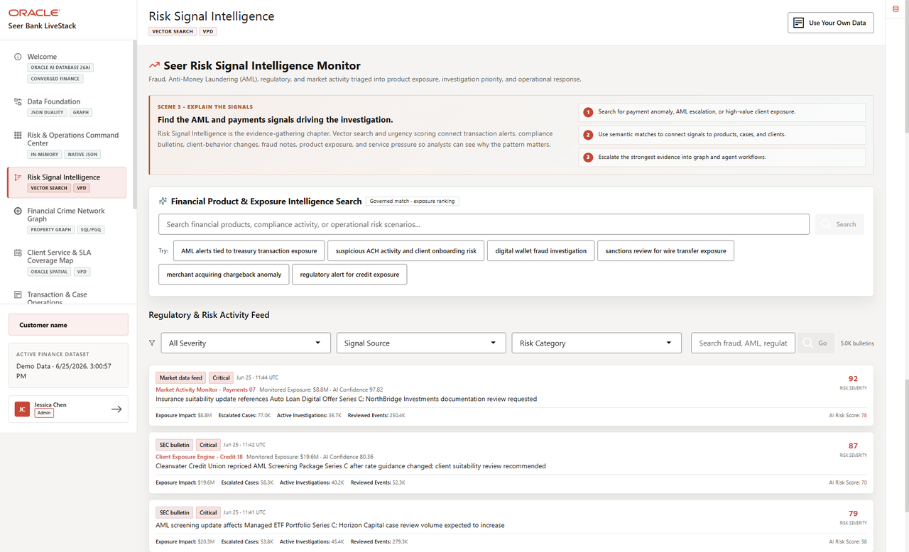

# Risk Signal Intelligence with AI Vector Search

## Introduction

This lab uses current finance embeddings to search by meaning instead of exact keywords. Add the analyst payoff up front: risk teams can find relevant products or signals even when the wording in the source data does not match the analyst's phrase exactly.

Risk analysts often know the intent of a question before they know the exact product name, signal phrase, or table value. Vector search helps them find relevant mortgage, AML, fraud, and exposure evidence even when the source text uses different wording.

This lab extends the dashboard story from numeric exposure to semantic investigation. Instead of only sorting by counts and scores, you ask the database to find products and signal text that mean roughly the same thing as the analyst's question.



### Objectives

- Run semantic product search.
- Run semantic risk signal search.

Estimated Time: **12 minutes**

### Operating Story

| Step | Finance focus |
| --- | --- |
| Business Problem | Risk analysts cannot rely only on keyword matching when signals use different words for similar exposure. |
| Technical Challenge | AI and data teams need semantic search without exporting governed finance text to an external embedding pipeline. |
| Persona Focus | Risk analysts ask by intent; AI engineers and database developers keep embedding and search work inside the database. |
| What You Will Prove | Vector search ranks finance products and risk signals by semantic similarity. |
| Database Capability | VECTOR\_EMBEDDING, vector columns, and VECTOR\_DISTANCE run inside Oracle AI Database. |
| Outcome | Analysts can find mortgage, AML, fraud, and exposure signals even when wording varies. |

Persona focus: You support the risk analyst with semantic search while keeping source text, embeddings, and similarity scoring in the governed database boundary.

## Task 1: Search products by meaning

Perform the following set of steps to search for financial products related to mortgage pre-approval risk by meaning:

1. Run the following query:

    ```sql
    <copy>
    SELECT p.product_name,
           p.category,
           ROUND(1 - VECTOR_DISTANCE(
             pe.embedding,
             VECTOR_EMBEDDING(ADMIN.ALL_MINILM_L12_V2 USING 'mortgage pre-approval risk' AS DATA),
             COSINE), 4) AS similarity
    FROM product_embeddings pe
    JOIN products p ON p.product_id = pe.product_id
    ORDER BY VECTOR_DISTANCE(
      pe.embedding,
      VECTOR_EMBEDDING(ADMIN.ALL_MINILM_L12_V2 USING 'mortgage pre-approval risk' AS DATA),
      COSINE)
    FETCH FIRST 5 ROWS ONLY;
    </copy>
    ```

    **Expected output: Mortgage Product Matches**

    | Product Name | Category | Similarity |
    | --- | --- | --- |
    | Mortgage Pre-Approval | Mortgage Lending | 0.6875 |
    | Loan Modification Review | Loan Servicing | 0.4409 |
    | Loan Portfolio Review | Risk Analytics | 0.4267 |
    | Risk Tolerance Assessment | Advisory | 0.4198 |
    | Adjustable Rate Mortgage | Mortgage Lending | 0.4161 |


2. Review the ranked products.
    The query embeds the analyst phrase at runtime and compares it to stored product embeddings. The `VECTOR_DISTANCE` order ranks products by semantic closeness, while the similarity score gives the analyst a way to compare the strength of each match.

    The expected top result is `Mortgage Pre-Approval`, followed by related lending and risk analytics products. The ranking matters because it proves the search is not a simple keyword lookup; it also finds products that are semantically close to the analyst's risk intent.

    In the broader workflow, these ranked products can become the next filter for dashboard review, product exposure analysis, or an operations agent action.

**Note:** Sample values may change after data refreshes or rebuilds. Focus on the expected result pattern and the business takeaway, not the exact values.

## Task 2: Search risk signals by meaning

Perform the following set of steps to search risk signals for fraud and AML exposure language by meaning:

1. Run the following query:

    ```sql
    <copy>
    SELECT sp.post_id AS signal_id,
           SUBSTR(sp.post_text, 1, 120) AS signal_excerpt,
           ROUND(1 - VECTOR_DISTANCE(
             se.embedding,
             VECTOR_EMBEDDING(ADMIN.ALL_MINILM_L12_V2 USING 'fraud signals aml exposure' AS DATA),
             COSINE), 4) AS similarity
    FROM signal_embeddings se
    JOIN social_posts sp ON sp.post_id = se.post_id
    ORDER BY VECTOR_DISTANCE(
      se.embedding,
      VECTOR_EMBEDDING(ADMIN.ALL_MINILM_L12_V2 USING 'fraud signals aml exposure' AS DATA),
      COSINE)
    FETCH FIRST 5 ROWS ONLY;
    </copy>
    ```

    **Expected output: AML Signal Matches**

    | Signal Id | Signal Excerpt | Similarity |
    | --- | --- | --- |
    | 2290 | AML screening update affects Liquidity Investment Sweep; FraudGuard Operations suspicious ACH and sanctions case review | 0.6478 |
    | 170 | AML screening update affects Deposit Attrition Alert; Catalyst Insurance Group suspicious ACH and sanctions case review | 0.6137 |
    | 1330 | AML screening update affects Deposit Attrition Alert; Catalyst Insurance Group suspicious ACH and sanctions case review | 0.6137 |
    | 1610 | AML screening update affects Deposit Attrition Alert; Catalyst Insurance Group suspicious ACH and sanctions case review | 0.6137 |
    | 3770 | AML screening update affects High-Yield Savings Account; Meridian Trust Bank suspicious ACH and sanctions case review vo | 0.6117 |


2. Compare the excerpts and scores.
    This query uses the same pattern against risk signal embeddings. It searches the language of monitored events, not just product metadata, so analysts can find signals that discuss fraud, AML, sanctions, or suspicious activity even when the wording is not identical to the search phrase.

    The returned excerpts contain AML, fraud, sanctions, and suspicious activity language even though the search phrase is short. The similarity score gives analysts a ranked review queue instead of an unordered pile of signal text.

    This supports the workshop story by connecting dashboard risk signals to semantic investigation. The source text, embeddings, query phrase, and similarity scoring all remain inside Oracle Database.

**Note:** Sample values may change after data refreshes or rebuilds. Focus on the expected result pattern and the business takeaway, not the exact values.

## Acknowledgements

* **Author** - Pat Shepherd, Senior Principal Database Product Manager
* **Contributor** - Linda Foinding, Principal Database Product Manager
* **Last Updated By/Date** - Oracle Database Product Management, June 2026
