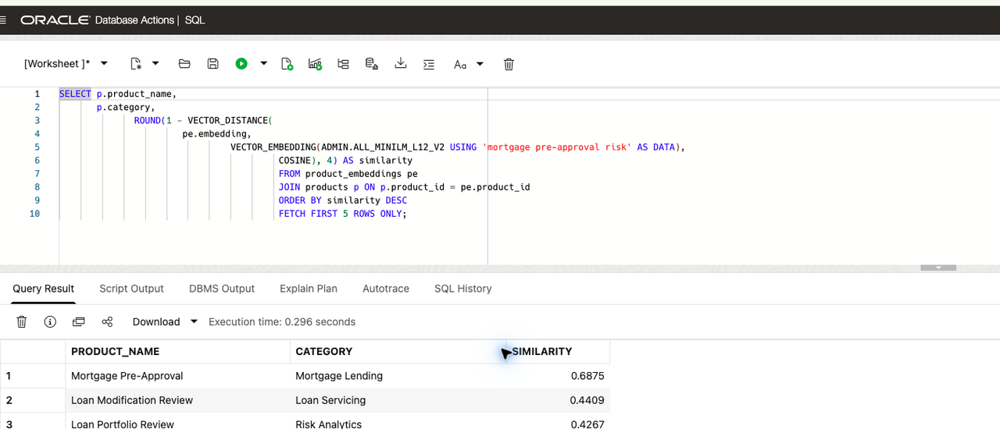
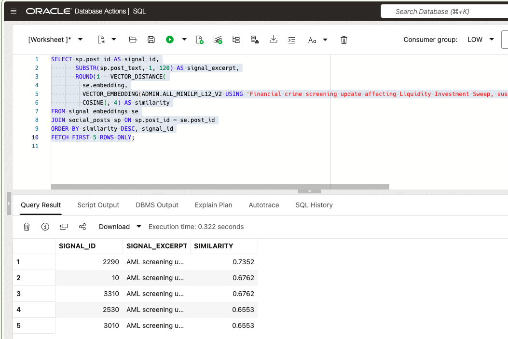

# Risk Signal Intelligence with AI Vector Search

## Introduction

Risk teams often know what they are looking for before they know the exact words used in the data. This lab uses current finance embeddings to search by meaning instead of exact keywords.

Jessica needs to find risk information even when the stored text uses different words from her question. Priya, Seer Bank's AI engineer, prepares the meaning-based search so Jessica can investigate without moving finance text outside the database.

That matters because a risk analyst may ask about "mortgage pre-approval risk" while the data uses related phrases such as loan review, lending exposure, or adjustable-rate mortgage. Vector search helps find the right neighborhood of meaning, not just exact text matches.

After reviewing numeric exposure, analysts often need to search the language behind the signals. Instead of only sorting by counts and scores, you ask the database to find products and signal text that mean roughly the same thing as the analyst's question.

<details>
<summary><strong>Key terms: embedding, vector, vector distance, and semantic search</strong></summary>

> - An **embedding** is a numerical profile of what text means. In this lab, product descriptions and risk-signal language can be embedded so similar finance ideas sit near each other mathematically, even when the wording is different.
>
> - A **vector** is the stored numerical form of an embedding. Oracle AI Database can store vectors beside the finance rows they describe, so the meaning-based search stays connected to product names, exposure values, signal counts, and other business columns.
>
> - **Vector distance** measures how close two vectors are. A smaller distance means the meanings are more similar; a larger distance means they are farther apart. In this lab, distance helps rank which products or signals best match a risk analyst's question.
>
> - **Semantic search** means searching by meaning instead of exact words. For example, a search for "financial crime screening update affecting Liquidity Investment Sweep, suspicious ACH activity, sanctions compliance, and case review" can find related text about suspicious ACH, sanctions, or AML review even when the wording is not identical. That is useful in finance because risk language often varies across regulatory notices, market bulletins, internal alerts, and product descriptions.
>
> - **ALL\_MINILM\_L12\_V2** is the embedding model used in this lab. A model is the trained pattern that turns text into embeddings. This model reads a phrase such as `mortgage pre-approval risk` and returns a vector that Oracle AI Database can compare with the stored finance vectors.

</details>

The image below is the Risk Signal Intelligence page. The top search area lets a risk analyst enter business language, such as mortgage pre-approval risk, and receive ranked financial products by meaning rather than exact keyword match. The activity feed below connects regulatory notices, market signals, fraud alerts, branch advisories, exposure, confidence, and severity so a vague risk concern can become a concrete product or signal review.


### Objectives

- Run semantic product search.
- Run semantic risk signal search.

Estimated Time: **12 minutes**

### Business Scenario

| Step | Finance focus |
| --- | --- |
| Business Problem | Risk analysts cannot rely only on keyword matching when signals use different words for similar exposure. |
| Technical Challenge | AI and data teams need meaning-based search without exporting finance text to an external embedding pipeline. |
| Persona Focus | Jessica asks by intent; Priya keeps embedding and search work inside the database. |
| What You Will See | Vector search ranks finance products and risk signals by semantic similarity. |
| Database Capability | VECTOR\_EMBEDDING, vector columns, and VECTOR\_DISTANCE run inside Oracle AI Database. |
| Outcome | Analysts can find mortgage, AML, fraud, and exposure signals even when wording varies. |

Persona focus: You join Jessica and Priya as they use meaning-based search while keeping source text, embeddings, and similarity scores in the same database.

## Task 1: Search products by meaning

Search for financial products related to mortgage pre-approval risk by meaning, not exact keyword match.

1. Run the following query:

    > **SQL Worksheet reminder:** Need a reminder on how to open and use the SQL Worksheet? Return to [Getting Started Task 2: Open SQL Worksheet](?lab=getting-started#Task2:OpenSQLWorksheet) for the step-by-step graphic showing where to paste and run SQL statements.

    You are asking the database to find products related to a risk concept, even when the product text does not use the exact same words. The SQL creates an embedding for the phrase `mortgage pre-approval risk`, compares it with stored product embeddings using cosine vector distance, and orders the result by closest semantic match. The closer the meaning, the higher the result should appear in the review list.

    <details>
    <summary><strong>Why this matters: better than exporting text to a separate AI search service</strong></summary>

    > In a fractured environment, teams often export text to an external embedding pipeline or search service. That can create extra copies of sensitive finance text and make it harder to explain which data was searched.
    >
    > Oracle AI Vector Search keeps the source text, vectors, SQL query, and similarity score in the same database as the finance records. That makes meaning-based search easier to review and safer to use.

    </details>

    <details>
    <summary><strong>Why does the model name include ADMIN?</strong></summary>

    > `ALL_MINILM_L12_V2` is the shared embedding model available in the workshop database. In this environment, the model is owned by `ADMIN`, so the SQL calls it as `ADMIN.ALL_MINILM_L12_V2`.
    >
    > The finance tables and views are in your `LLUSER` schema. Only the shared embedding model uses the `ADMIN.` prefix.

    </details>

    ```sql
    <copy>
    SELECT p.product_name,
           p.category,
           ROUND(1 - VECTOR_DISTANCE(
             pe.embedding,
             VECTOR_EMBEDDING(ADMIN.ALL_MINILM_L12_V2 USING 'mortgage pre-approval risk' AS DATA),
             COSINE), 4) AS similarity
    FROM product_embeddings pe
    JOIN products p ON p.product_id = pe.product_id
    ORDER BY similarity DESC
    FETCH FIRST 5 ROWS ONLY;
    </copy>
    ```

    **Expected output: Mortgage Product Matches**

    


2. Review the ranked products.
    The query embeds the analyst phrase at runtime and compares it to stored product embeddings. The `VECTOR_DISTANCE` order ranks products by semantic closeness, while the similarity score gives the analyst a way to compare the strength of each match.

    The expected top result is `Mortgage Pre-Approval`, followed by related lending and risk analytics products. The ranking matters because it acts like an analyst assistant: it brings likely matches to the top even when the search phrase and product name are not identical.

    In the broader workflow, these ranked products can become the next filter for dashboard review, product exposure analysis, or operational follow-up.

## Task 2: Search risk signals by meaning

Now apply the same semantic search pattern to risk signal language.

1. Run the following query:

    You are applying the same semantic-search pattern to monitored risk signal text. The SQL embeds the phrase `Financial crime screening update affecting Liquidity Investment Sweep, suspicious ACH activity, sanctions compliance, and case review`, compares it with stored signal embeddings, joins back to the source signal text, and returns the highest-scoring excerpts for analyst review.

    ```sql
    <copy>
    SELECT sp.post_id AS signal_id,
           SUBSTR(sp.post_text, 1, 120) AS signal_excerpt,
           ROUND(1 - VECTOR_DISTANCE(
             se.embedding,
             VECTOR_EMBEDDING(ADMIN.ALL_MINILM_L12_V2 USING 'Financial crime screening update affecting Liquidity Investment Sweep, suspicious ACH activity, sanctions compliance, and case review' AS DATA),
             COSINE), 4) AS similarity
    FROM signal_embeddings se
    JOIN social_posts sp ON sp.post_id = se.post_id
    ORDER BY similarity DESC, signal_id
    FETCH FIRST 5 ROWS ONLY;
    </copy>
    ```

    **Expected output: Financial Crime Signal Matches**

    


2. Compare the excerpts and scores.
    This query uses the same pattern against risk signal embeddings. It searches the language of monitored events, not just product metadata, so analysts can find signals that discuss fraud, AML, sanctions, or suspicious activity even when the wording is not identical to the search phrase.

    The returned excerpts contain AML, fraud, sanctions, and suspicious-activity language even though the search phrase does not use the AML abbreviation. The similarity score gives analysts a ranked review queue instead of an unordered pile of signal text.

    This connects dashboard risk signals to semantic investigation. The source text, embeddings, query phrase, and similarity scoring all remain inside Oracle Database, so the analyst can move from a KPI to the language behind the signal without leaving the approved database objects for this lab.

    🎯 **Review decision:** Choose one returned signal or product to investigate next. Consider the similarity score, the signal excerpt, and the potential product or institution impact. Your choice is a review priority, not proof of fraud or harm.

## Next Steps

The analyst can find related products and signals even when the wording differs, then choose what to investigate next. For a deeper hands-on workshop focused on AI Vector Search in Oracle Database, open the [AI Vector Search LiveLabs workshop](https://livelabs.oracle.com/ords/r/dbpm/livelabs/view-workshop?clear=RR,180&wid=4166).

## Acknowledgements

* **Authors** - Pat Shepherd, Linda Foinding
* **Contributors** - Teodor Nechita
* **Last Updated By/Date** - Oracle Database Product Management, September 2026
