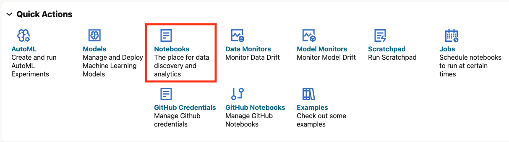
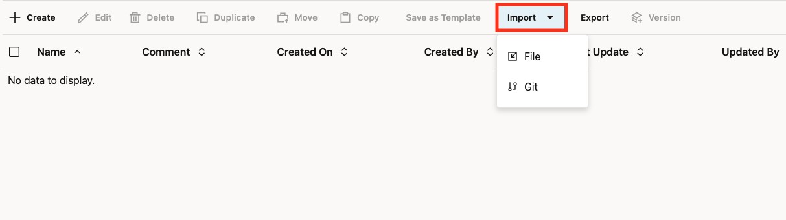
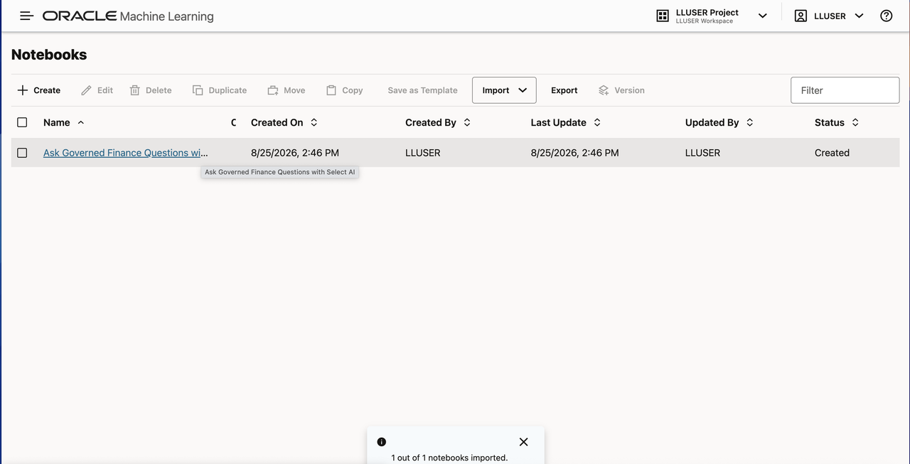

# Ask a Database Question with Select AI

## Introduction

Seer Bank analysts need quick answers, but they cannot accept guesses. A risk answer must come from approved database evidence. Reviewers must be able to inspect the SQL behind it.

Jessica needs a quick answer about the finance data without becoming a SQL expert first. Priya configures Select AI so Jessica's question stays within approved views and the team can inspect the SQL behind the answer.

The business value is faster analyst access to finance answers without losing the evidence trail: an analyst can ask in plain language, while a reviewer can inspect the generated SQL and its database result.

Oracle Select AI translates a natural-language question into SQL or a database-grounded response using a configured AI profile and approved database objects. It is not general-purpose chat over the open web; in this workshop, it uses the two saved Seer Bank views listed in Task 4.

In this lab, you run an Oracle Machine Learning notebook. It shows the difference between general AI chat and governed Select AI over Seer Bank data. You create AI-ready views, limit the `genai` profile to approved objects, review generated SQL, ask for a narrated answer, and confirm that the lab stays read-only.

An Oracle Machine Learning notebook is a runnable, ordered collection of explanation, SQL, and results that runs against your database schema. Here it gives every learner the same governed Select AI setup and makes the generated SQL easy to inspect. Select AI adds business value in a converged database because an analyst can ask a finance question in plain language while the answer remains grounded in approved database objects and reviewable SQL.

> **Important:** Select AI output is generated. Wording and aliases can vary. Review the generated SQL and database results before trusting the answer.

<details>
<summary><strong>Key terms: Select AI, GenAI profile, Select AI Chat, SHOWSQL, and NARRATE</strong></summary>

- **Select AI** lets you ask natural-language questions and use a database profile to turn those questions into SQL or grounded responses.
- A **GenAI profile** stores the model provider, credentials, and database grounding settings that Select AI uses for a session.
- **Select AI Chat** answers general questions with the model. It is useful for explanations, but it is not the same as asking Select AI to generate SQL over approved database objects.
- **SHOWSQL** shows the SQL that Select AI generated from your natural-language prompt, so you can review the database logic before trusting the answer.
- **NARRATE** returns a natural-language answer based on database evidence.

</details>

### Objectives

- Import and run the supplied finance Select AI notebook in Oracle Machine Learning.
- Ask governed natural-language questions over Seer Bank data.
- Review generated SQL before trusting an AI answer.
- Compare general chat with database-grounded Select AI responses.

Estimated Time: **18 minutes**

### Business Scenario

| Step | Finance focus |
| --- | --- |
| Business Problem | Seer Bank analysts need fast natural-language answers without losing the evidence trail. |
| Technical Challenge | Natural-language questions must stay inside an approved data boundary and produce reviewable SQL. |
| Persona Focus | Jessica asks the question; Priya controls the profile and approved objects. |
| What You Will See | Chat can explain finance concepts. Select AI can query approved Seer Bank data and show generated SQL. |
| Database Capability | Oracle Select AI, `DBMS_CLOUD_AI`, saved finance views, schema comments, and OML notebooks. |
| Outcome | Jessica receives a narrated answer while the team retains the SQL and database evidence. |

## Task 1: Import the Finance Select AI Notebook

In this lab, you run the hands-on steps from an Oracle Machine Learning notebook. Importing the notebook gives you a repeatable, guided Select AI session: its paragraphs create the approved context, run the questions, and show the SQL and database evidence that support each answer.

1. Download [finance-select-ai-notebook.json](files/finance-select-ai-notebook.json).

    If the notebook opens in your browser instead of downloading, right-click the link and select **Save Link As**.

2. From the Oracle Machine Learning home page, click **Notebooks**.

    

3. Click **Import** and select **From File**.

    

4. Choose `finance-select-ai-notebook.json` from your local computer.

    

5. After the import completes, open **Ask Governed Finance Questions with Select AI** from the Notebooks table.

    

Leave the notebook open. Tasks 2 through 9 run in this OML notebook. Each SQL paragraph is already included. Click the play button to run each paragraph in order.

## Task 2: Activate the Select AI Profile

Select AI uses the active profile for model access and schema grounding. Set `genai` for this OML session.

1. Run the profile setup paragraph.

    ```sql
    <copy>
    EXEC DBMS_CLOUD_AI.SET_PROFILE('genai');
    
    SELECT profile_name,
           status
    FROM user_cloud_ai_profiles
    WHERE LOWER(profile_name) = 'genai';
    </copy>
    ```

    > This command is already in your notebook. Click the play button to run it.

    **Expected result:** The profile query returns `GENAI` with status `ENABLED`.

## Task 3: Create AI-Ready Views

Select AI works best with clean business-facing objects. This paragraph creates views with clear names and comments. The natural-language prompts can then map to the right Seer Bank evidence.

1. Create the views and comments.

    ```sql
    <copy>
    CREATE OR REPLACE VIEW select_ai_product_risk_v AS
    SELECT fp.product_category,
           COUNT(DISTINCT rs.signal_id) AS signal_count,
           ROUND(AVG(rs.criticality_score), 1) AS avg_criticality,
           SUM(rs.exposure_count) AS exposure_count
    FROM risk_signals_v rs
    JOIN post_product_mentions ppm
      ON ppm.post_id = rs.signal_id
    JOIN finance_products_v fp
      ON fp.financial_product_id = ppm.product_id
    GROUP BY fp.product_category;
    
    CREATE OR REPLACE VIEW select_ai_top_signal_v AS
    SELECT signal_id,
           DBMS_LOB.SUBSTR(signal_text, 1000, 1) AS signal_text,
           criticality_score,
           severity_band,
           exposure_count,
           source_id
    FROM (
      SELECT signal_id,
             signal_text,
             criticality_score,
             severity_band,
             exposure_count,
             source_id
      FROM risk_signals_v
      ORDER BY criticality_score DESC,
               exposure_count DESC,
               signal_id
    )
    WHERE ROWNUM = 1;
    
    COMMENT ON TABLE select_ai_product_risk_v IS
      'AI-ready view of Seer Bank product categories ranked by current risk exposure.';
    COMMENT ON COLUMN select_ai_product_risk_v.product_category IS
      'Financial product category.';
    COMMENT ON COLUMN select_ai_product_risk_v.signal_count IS
      'Number of current risk signals linked to the product category.';
    COMMENT ON COLUMN select_ai_product_risk_v.avg_criticality IS
      'Average risk signal criticality score for the product category.';
    COMMENT ON COLUMN select_ai_product_risk_v.exposure_count IS
      'Total exposure count across risk signals for the product category.';
    
    COMMENT ON TABLE select_ai_top_signal_v IS
      'AI-ready view containing the single highest-priority current Seer Bank risk signal.';
    COMMENT ON COLUMN select_ai_top_signal_v.signal_id IS
      'Identifier of the highest-priority risk signal.';
    COMMENT ON COLUMN select_ai_top_signal_v.criticality_score IS
      'Criticality score for the risk signal.';
    COMMENT ON COLUMN select_ai_top_signal_v.severity_band IS
      'Severity band for the risk signal.';
    COMMENT ON COLUMN select_ai_top_signal_v.exposure_count IS
      'Exposure count for the risk signal.';
    
    SELECT object_name,
           status
    FROM user_objects
    WHERE object_name IN (
      'SELECT_AI_PRODUCT_RISK_V',
      'SELECT_AI_TOP_SIGNAL_V'
    )
    ORDER BY object_name;
    </copy>
    ```

    > This command is already in your notebook. Click the play button to run it.

    **Expected result:** The notebook returns `SELECT_AI_PRODUCT_RISK_V` and `SELECT_AI_TOP_SIGNAL_V` with status `VALID`.

## Task 4: Set the Governed Object Boundary

Now limit the profile to the two AI-ready views. This keeps questions focused on the approved Seer Bank evidence for this lab.

The approved object list names the only two views this exercise is designed to use. This notebook sets the list but does not set `enforce_object_list=true`, so it is a scoped prompt configuration rather than proof of a hard restriction. Review the generated SQL before relying on an answer.

1. Set the approved object list.

    ```sql
    <copy>
    BEGIN
      DBMS_CLOUD_AI.SET_ATTRIBUTE(
        profile_name    => 'genai',
        attribute_name  => 'object_list',
        attribute_value => '[{"owner": "' || USER || '", "name": "SELECT_AI_PRODUCT_RISK_V"},' ||
                           '{"owner": "' || USER || '", "name": "SELECT_AI_TOP_SIGNAL_V"}]'
      );
    END;
    /
    
    SELECT object_name,
           object_type
    FROM user_objects
    WHERE object_name IN (
      'SELECT_AI_PRODUCT_RISK_V',
      'SELECT_AI_TOP_SIGNAL_V'
    )
    ORDER BY object_name;
    </copy>
    ```

    > This command is already in your notebook. Click the play button to run it.

    **Expected result:** The notebook returns the two approved views used by this lab.

## Task 5: Verify the Product Risk Evidence with SQL

Before using natural language, run SQL so you know what evidence Select AI should find.

1. Run the product category baseline query.

    ```sql
    <copy>
    SELECT product_category,
           signal_count,
           avg_criticality,
           exposure_count
    FROM select_ai_product_risk_v
    ORDER BY exposure_count DESC
    FETCH FIRST 5 ROWS ONLY;
    </copy>
    ```

    > This command is already in your notebook. Click the play button to run it.

    **Expected result:** The query returns up to five product categories ordered by exposure.

## Task 6: Ask Select AI to Show the SQL

`SHOWSQL` turns a natural-language question into SQL without running the final answer. Reviewers can inspect the generated statement first.

1. Ask Select AI to generate SQL for the product exposure question.

    ```sql
    <copy>
    SELECT AI SHOWSQL
      Show product_category signal_count avg_criticality and exposure_count from select_ai_product_risk_v ordered by exposure_count descending;
    </copy>
    ```

    > This command is already in your notebook. Click the play button to run it.

    **Expected result:** Select AI generates a read-only statement over `SELECT_AI_PRODUCT_RISK_V`. Table aliases and SQL shape can vary.

2. Review the generated statement. Confirm that it does not contain `INSERT`, `UPDATE`, `DELETE`, `MERGE`, or DDL.

## Task 7: Ask Select AI to Narrate the Highest-Exposure Category

`NARRATE` runs a governed natural-language request over the approved view.

1. Ask for a short, fixed-format answer for the highest-exposure category.

    ```sql
    <copy>
    SELECT AI NARRATE
      Using select_ai_product_risk_v, find the row with the largest exposure_count. Reply only with the phrase Highest exposure category, then a colon, then the product_category value;
    </copy>
    ```

    > This command is already in your notebook. Click the play button to run it.

    **Expected result:** Select AI returns the highest-exposure product category in the requested format.

## Task 8: Optional: Ask a General Chat Question

`CHAT` uses model knowledge. It can explain general risk concepts, but it is not the database-evidence step.

1. Ask a general finance risk question.

    ```sql
    <copy>
    SELECT AI CHAT
      What business factors commonly increase fraud and compliance risk at a financial institution;
    </copy>
    ```

    > This command is already in your notebook. Click the play button to run it.

    **Expected result:** The answer explains common fraud and compliance risk factors. Wording can vary.

## Task 9: Confirm the Select AI Question Boundary

Tasks 3 and 4 set up the lab by creating AI-ready views and setting the profile's object list. The Select AI question path is different: it asks for and reviews database answers without requesting an agent action. Confirm that boundary before moving to the agent lab.

1. Return to the `SHOWSQL` output from Task 6. Confirm that the generated statement uses `SELECT_AI_PRODUCT_RISK_V` and does not contain `INSERT`, `UPDATE`, `DELETE`, `MERGE`, or DDL. This review is the evidence that the generated question is read-only before you rely on its answer.

2. Optionally check the current finance risk-agent action row count for context.

    ```sql
    <copy>
    SELECT COUNT(*) AS finance_risk_agent_actions
    FROM agent_actions
    WHERE agent_name = 'FINANCE_RISK_AGENT';
    </copy>
    ```

    > This command is already in your notebook. Click the play button to run it.

    **Expected result:** The count can be `0` or higher depending on whether the agent lab has already run. It is context only; it cannot prove whether this lab made changes. The evidence for the Select AI question boundary is the `SHOWSQL` review in Task 6. Tasks 5 through 8 do not use `SELECT AI AGENT` or call an agent-action tool.

You can now ask a database question with Select AI and review the SQL behind the answer before relying on it. The next lab lets a Select AI Agent use controlled database tools to record the next review step.

## Acknowledgements

* **Author** - Linda Foinding, Principal Database Product Manager
* **Last Updated By/Date** - Oracle Database Product Management, August 2026
