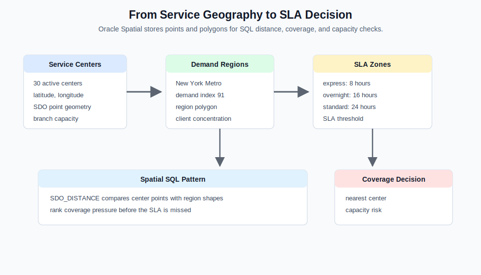
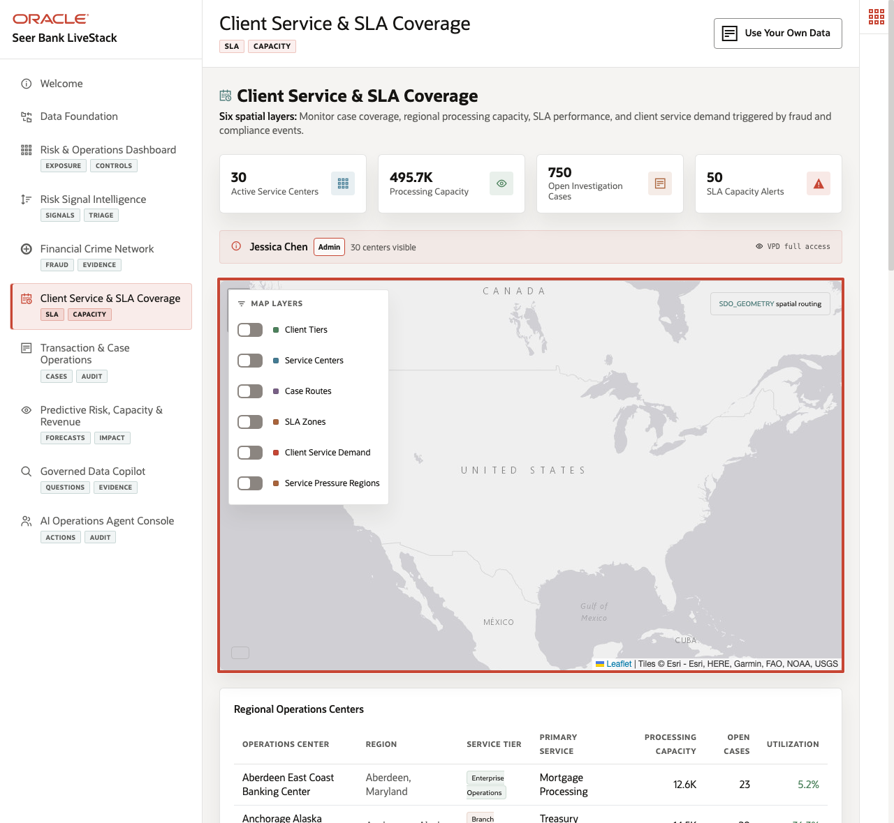

# Client Service and SLA Coverage with Oracle Spatial

## Introduction

This lab uses **Oracle Spatial** to reason about service centers, SLA zones, and demand regions. Consider making the operations decision explicit: after risk is identified, the bank needs to know whether service capacity is close enough to respond.

Risk and fraud decisions often create service work: client outreach, case routing, product review, and document handling. Spatial analysis helps operations leaders see whether service capacity is near the demand region that needs support.

This lab follows the investigation labs because every risk decision eventually creates operational work. The bank needs to know not only what is risky, but whether the service network can respond where demand is highest.





### Objectives

- Find service centers nearest to New York Metro.
- Inspect SLA zone coverage.

Estimated Time: **10 minutes**

### Operating Story

| Step | Finance focus |
| --- | --- |
| Business Problem | Service leaders need to know whether capacity is close enough to high-demand regions. |
| Technical Challenge | Operations teams need location-aware decisions without moving geography, service centers, and SLA zones into separate mapping systems. |
| Persona Focus | Service operations leaders evaluate coverage; database developers prove distance and SLA evidence with spatial SQL. |
| What You Will Prove | Spatial data can quantify distance and regional service pressure in SQL. |
| Database Capability | SDO\_GEOMETRY, SDO\_GEOM.SDO\_DISTANCE, regions, and SLA zones support coverage analysis. |
| Outcome | Operations teams can prioritize service capacity based on geography and demand. |

Persona focus: You support a service operations leader by turning location data into queryable coverage evidence for capacity and SLA decisions.

## Task 1: Calculate service center distance to New York Metro

Perform the following set of steps to calculate service-center distance to the New York Metro demand region:

1. Run this spatial distance query:

    ```sql
    <copy>
    SELECT sc.service_center_name,
           sc.city,
           sc.state_province,
           ROUND(SDO_GEOM.SDO_DISTANCE(fc.location, dr.boundary, 0.005, 'unit=KM'), 2) AS boundary_distance_km,
           dr.region_name,
           dr.demand_index
    FROM service_centers_v sc
    JOIN fulfillment_centers fc ON fc.center_id = sc.service_center_id
    CROSS JOIN demand_regions dr
    WHERE dr.region_name = 'New York Metro'
    ORDER BY SDO_GEOM.SDO_DISTANCE(fc.location, dr.boundary, 0.005, 'unit=KM')
    FETCH FIRST 10 ROWS ONLY;
    </copy>
    ```

    **Expected output: New York Service Coverage**

    | Service Center Name | City | State Province | Boundary Distance Km | Region Name | Demand Index |
    | --- | --- | --- | --- | --- | --- |
    | Edison Wealth Service Center | Edison | New Jersey | 9.48 | New York Metro | 91.0 |
    | Middletown Mid-Atlantic Branch Hub | Middletown | Delaware | 160.48 | New York Metro | 91.0 |
    | Aberdeen East Coast Banking Center | Aberdeen | Maryland | 187.21 | New York Metro | 91.0 |
    | Fall River Northeast Service Hub | Fall River | Massachusetts | 218.48 | New York Metro | 91.0 |
    | Etna Midwest Specialty Finance Desk | Etna | Ohio | 713.52 | New York Metro | 91.0 |
    | Romulus Great Lakes Mortgage Hub | Romulus | Michigan | 767.96 | New York Metro | 91.0 |
    | Concord Southeast Micro Branch | Concord | North Carolina | 781.6 | New York Metro | 91.0 |
    | Plainfield Heartland Banking Hub | Plainfield | Indiana | 1031.93 | New York Metro | 91.0 |
    | Lebanon Central Banking Center | Lebanon | Tennessee | 1144.17 | New York Metro | 91.0 |
    | Joliet Midwest Risk Desk | Joliet | Illinois | 1152.2 | New York Metro | 91.0 |


2. Review the nearest service centers.
    The SQL compares service-center point geometries with a demand-region boundary. That turns location data into a measurable routing signal instead of a static map observation.

    Expected nearest service center: Edison Wealth Service Center. New York Metro has demand index 91.

    The distance column tells operations which service centers can respond fastest to a high-demand region. The demand index explains why the region matters: a high-demand area may need more capacity, closer routing, or stricter monitoring when risk signals increase.

**Note:** Sample values may change after data refreshes or rebuilds. Focus on the expected result pattern and the business takeaway, not the exact values.

## Task 2: Summarize SLA zone coverage

Perform the following set of steps to summarize SLA zone coverage for service operations review:

1. Run this SLA zone summary:

    ```sql
    <copy>
    SELECT zone_type,
           COUNT(*) AS zones,
           MIN(max_delivery_hrs) AS min_delivery_hrs,
           MAX(max_delivery_hrs) AS max_delivery_hrs,
           ROUND(AVG(max_delivery_hrs), 1) AS avg_delivery_hrs
    FROM fulfillment_zones
    GROUP BY zone_type
    ORDER BY avg_delivery_hrs;
    </copy>
    ```

    **Expected output: SLA Zone Counts**

    | Zone Type | Zones | Min Delivery Hrs | Max Delivery Hrs | Avg Delivery Hrs |
    | --- | --- | --- | --- | --- |
    | express | 30 | 8 | 8 | 8 |
    | overnight | 30 | 16 | 16 | 16 |
    | standard | 30 | 24 | 24 | 24 |
    | economy | 30 | 72 | 72 | 72 |


2. Compare the service levels.
    This query summarizes all SLA zones into service promises that operations leaders can compare with case urgency. It connects spatial coverage to the practical question of how quickly the bank can respond.

    The result shows how zone type maps to delivery-hour commitments. Express and overnight zones represent faster response promises, while standard and economy zones represent longer service windows.

    This matters because risk operations are not finished when a signal is detected. The bank also needs to know whether the service network can meet the response time implied by the case priority.

**Note:** Sample values may change after data refreshes or rebuilds. Focus on the expected result pattern and the business takeaway, not the exact values.

## Acknowledgements

* **Author** - Pat Shepherd, Senior Principal Database Product Manager
* **Contributor** - Linda Foinding, Principal Database Product Manager
* **Last Updated By/Date** - Oracle Database Product Management, June 2026
