# Client Service and SLA Coverage with Oracle Spatial

## Introduction

After risk is identified, Seer Bank needs to know which service centers are close enough to respond. This lab uses **Oracle Spatial** to answer a practical operations question: where is demand, where are the service centers, and what response windows apply?

Maya, Seer Bank's service operations leader, receives the work created by Jessica's investigation. Maya needs to decide which service center can respond, how far away it is, and which response commitment applies.

You will help a service operations leader turn location data into coverage evidence for case routing, fraud follow-up, anti-money laundering (AML) review, and SLA planning.

The business value is a defensible routing conversation. Leaders can compare exact distance, regional demand, and promised response windows before assigning time-sensitive work.

Oracle Spatial stores locations and boundaries as database geometry, then lets SQL measure distance and coverage against the same operational records. Spatial Studio is Oracle Database's visual workspace for mapping those database-backed points and regions. SQL remains the repeatable source for precise distance and SLA comparisons; Spatial Studio makes the location and coverage pattern easier to understand and communicate.

Risk and fraud decisions often create service work: client outreach, case routing, AML or fraud review, product review, dispute follow-up, onboarding checks, and document handling. Spatial analysis helps operations leaders avoid guessing from a map and instead measure distance to the demand region that needs support.

Every risk decision can create operational work. The bank needs to know not only what is risky, but how far service centers are from the highest-demand regions and which response commitments apply.

<details>
<summary><strong>Key terms: spatial data, point, boundary, distance, GeoJSON, and SLA</strong></summary>

> - **Spatial data** describes location or shape. A service center can be stored as a point, a demand region can be stored as a boundary, and an SLA zone can be stored as an area. Spatial data lets operations teams ask location-aware questions with SQL.
>
> - A **point** is a precise map location, usually represented by longitude and latitude. In this lab, a service center point tells the database where work can be handled.
>
> - A **boundary** is a shape around an area, such as a metro region or service zone. Boundaries let the database compare where demand is located against service-center locations.
>
> - **Distance** tells you how far one location is from another location or boundary. In service planning, distance helps answer whether a center is close enough to respond and where routing pressure may appear.
>
> - **GeoJSON** is a JSON format for representing map features such as points, lines, and areas. Oracle can convert spatial objects into GeoJSON so the same governed geometry can support both SQL analysis and map-based application screens.
>
> - An **SLA**, or service-level agreement, is a response-time or service-level commitment. In this workshop, SLA coverage connects geography to operations: the question is not only whether a risk exists, but which response window applies to the region that needs help.
>

</details>

The first image below explains the spatial coverage pattern. Service centers are stored as points, demand regions are stored as boundaries, and Oracle Spatial can calculate distance and coverage so service decisions are based on measurable geography instead of visual guesswork.

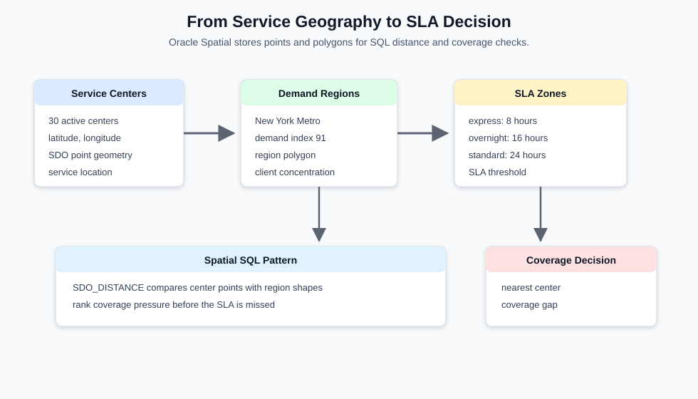

The second image is the Client Service and SLA Coverage page. It combines a map, service-center table, regional demand indicators, and response-window information so an operations leader can see where demand is building and which centers are nearby. The SQL in this lab queries the same location and SLA data behind that screen.

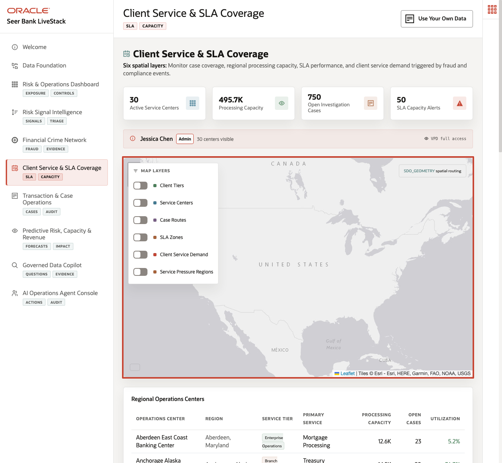

### Objectives

- Run spatial SQL that measures service-center distance to New York Metro.
- Summarize SLA response-zone commitments.
- Open Spatial Studio from Database Actions.
- Create database-backed datasets for service centers and demand regions.
- Build and save a New York Metro service coverage project.

Estimated Time: **25 minutes**

### Business Scenario

| Step | Finance focus |
| --- | --- |
| Business Problem | Service leaders need to know which service centers are closest to high-demand regions and which response windows apply. |
| Technical Challenge | Operations teams need location-aware decisions without moving geography, service centers, and SLA zones into separate mapping systems. |
| Persona Focus | Maya evaluates coverage; Jordan provides distance and SLA evidence with spatial SQL. |
| What You Will See | Spatial data can quantify distance and regional service pressure in SQL. |
| Database Capability | Oracle Spatial geometry objects (`SDO_GEOMETRY`), distance calculations (`SDO_GEOM.SDO_DISTANCE`), regions, and SLA zones support coverage analysis. |
| Outcome | Operations teams can compare distance, demand, and response windows before deciding where to route work. |

Persona focus: You join Maya and Jordan as they compare nearby service centers, regional demand, and response windows, then use Spatial Studio to see the New York Metro coverage story on a map.

## Task 1: Calculate service center distance to New York Metro

Start by comparing service-center locations to the New York Metro demand region.

1. Run this spatial distance query:

    > **SQL Worksheet reminder:** Need a reminder on how to open and use the SQL Worksheet? Return to [Getting Started Task 2: Open SQL Worksheet](?lab=getting-started#Task2:OpenSQLWorksheet) for the step-by-step graphic showing where to paste and run SQL statements.

    You are measuring which service centers are closest to a high-demand region so operations can reason about response coverage.

    In order to understand this query, read it in five parts.

    1. `fulfillment_centers` supplies both the service-center details and its stored location. The `location` column is an `SDO_GEOMETRY` point, which is how Oracle Spatial stores a map location.

    3. `demand_regions` supplies the New York Metro boundary. The `WHERE` clause keeps the query focused on that one demand region.

    4. `SDO_GEOM.SDO_DISTANCE(fc.location, dr.boundary, 0.005, 'unit=KM')` measures the distance in kilometers between each service center point and the New York Metro boundary.

    5. `SDO_UTIL.TO_GEOJSON(fc.location)` converts the service center point into GeoJSON so a map or application screen can display the same location.

    The query orders the result by nearest distance first. That lets an operations leader see which service centers are closest to the demand region before deciding where to route case work.

    <details>
    <summary><strong>Why this matters: spatial analysis is stronger inside the database</strong></summary>

    > In a fractured environment, teams might export service-center data to a mapping tool and separately maintain demand or SLA data somewhere else. That can make maps visually useful but hard to govern, audit, or join back to operational data.
    >
    > Oracle Spatial keeps location data, service data, demand regions, and SQL analysis together. You can calculate distance and still join the result to finance and operations data in the same query.

    </details>

    ```sql
    <copy>
    SELECT fc.center_name AS service_center_name,
           fc.city,
           fc.state_province,
           fc.latitude,
           fc.longitude,
           DBMS_LOB.SUBSTR(SDO_UTIL.TO_GEOJSON(fc.location), 120, 1) AS location_geojson,
           ROUND(SDO_GEOM.SDO_DISTANCE(fc.location, dr.boundary, 0.005, 'unit=KM'), 2) AS boundary_distance_km,
           dr.region_name,
           dr.demand_index
    FROM fulfillment_centers fc
    CROSS JOIN demand_regions dr
    WHERE dr.region_name = 'New York Metro'
    ORDER BY SDO_GEOM.SDO_DISTANCE(fc.location, dr.boundary, 0.005, 'unit=KM')
    FETCH FIRST 10 ROWS ONLY;
    </copy>
    ```

    **Expected output: New York Service Coverage**

    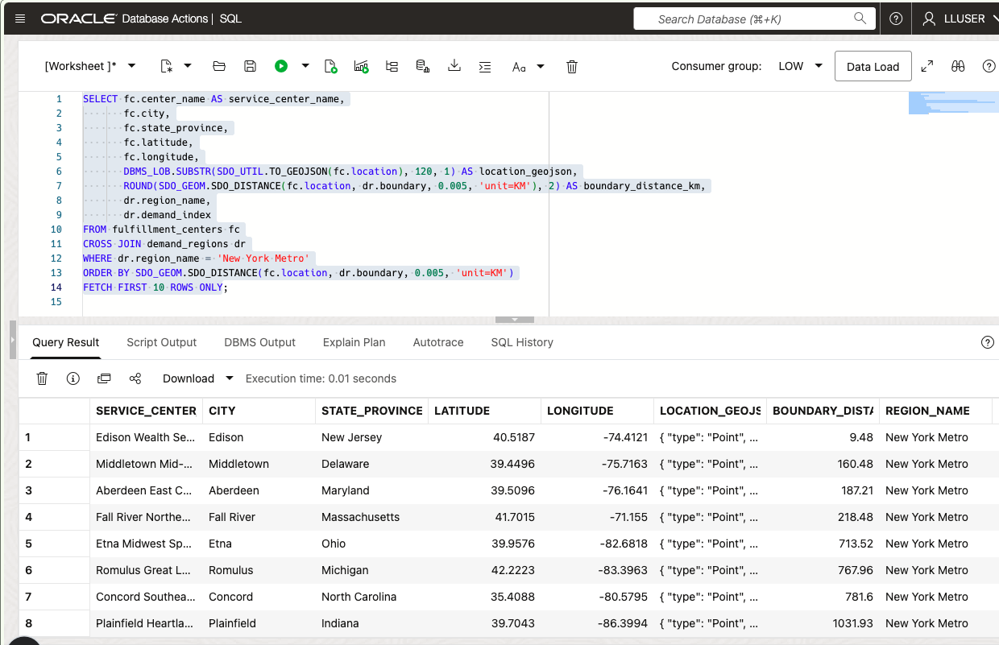

    Results can vary after a data refresh. Focus on the nearest-center order, boundary distance, and demand index.


2. Review the nearest service centers.
    Start with the first row. It shows the nearest service center to the New York Metro boundary: Edison Wealth Service Center in Edison, New Jersey.

    Read the result in three parts.

    1. `Boundary Distance Km` shows how far each service center is from the demand-region boundary. A smaller distance means the center is closer to the region that needs support.

    2. `Demand Index` shows how much service pressure exists in that region. New York Metro has demand index `91`, so it is a high-demand area.

    3. `Location Geojson` shows the same service-center point in a map-friendly format. For WGS84 map data, Oracle stores coordinates as longitude first, then latitude. That is why the GeoJSON point for Edison starts with `-74.4121` before `40.5187`.

    The so what: Edison is the closest center to a high-demand region, so it is the first location an operations leader would review when deciding where to route work. The next closest centers provide alternatives; the SLA summary in the next task supplies the response-window context.

## Task 2: Summarize SLA zone coverage

After locating nearby service centers, summarize the response commitments attached to SLA zones.

1. Run this SLA zone summary:

    You are summarizing the service commitments that operations teams must meet after risk work creates follow-up demand. The source column is named `max_delivery_hrs`, but in this finance lab you use it as the maximum response-hour commitment for each SLA zone.

    In order to understand this query, read it in three parts.

    1. `fulfillment_zones` stores the SLA zones used for service response planning.

    2. `GROUP BY zone_type` groups zones into service levels, such as express, overnight, standard, and economy.

    3. `MIN`, `MAX`, and `AVG` summarize the response-hour commitments for each service level.

    ```sql
    <copy>
    SELECT zone_type,
           COUNT(*) AS zones,
           MIN(max_delivery_hrs) AS min_response_hrs,
           MAX(max_delivery_hrs) AS max_response_hrs,
           ROUND(AVG(max_delivery_hrs), 1) AS avg_response_hrs
    FROM fulfillment_zones
    GROUP BY zone_type
    ORDER BY avg_response_hrs;
    </copy>
    ```

    **Expected output: SLA Zone Counts**

    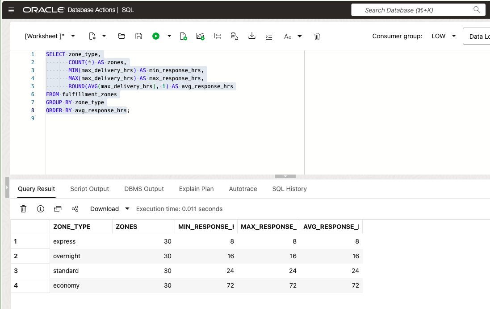


2. Compare the service levels.
    This query summarizes all SLA zones into service promises that operations leaders can compare with case urgency. It connects spatial coverage to the practical question of how quickly the bank can respond.

    The result shows how zone type maps to response-hour commitments. Express and overnight zones represent faster response promises, while standard and economy zones represent longer service windows.

    This matters because risk operations are not finished when a signal is detected. If a case requires outreach, document review, or service follow-up, the bank also needs to know whether the service network can meet the response time implied by the case priority.

3. 🎯 **Interactive challenge: compare a second service region.**

    Start with the New York Metro distance query in Task 1. Change only the `WHERE dr.region_name` value from `New York Metro` to `Chicago Metro`, then run your revised query. Compare the first row with the New York result: which center is now closest, what is its boundary distance, and how does Chicago's demand index change your routing conversation?

    **Expected output: Chicago Service Coverage**

    In the current workshop data, `Joliet Midwest Risk Desk` is the nearest center at `0` km because its location falls inside the Chicago Metro boundary. Chicago has demand index `78`, lower than New York Metro's `91`.

    <details>
    <summary><strong>Challenge answer: the region changes the routing evidence</strong></summary>

    > The first row is `Joliet Midwest Risk Desk` at `0` km, showing that it is inside the Chicago Metro boundary. Chicago's demand index is `78`, so it has less current pressure than New York Metro at `91`; operations should compare the applicable SLA response commitment before routing a time-sensitive case. Oracle Spatial keeps region, distance, demand, and service evidence together for that comparison.

    If you need the runnable solution, use the Task 1 query with this changed filter:

    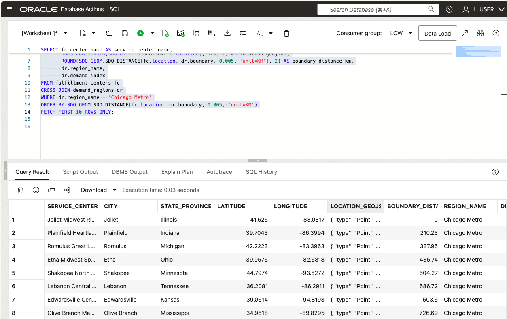

    ```sql
    <copy>
    SELECT fc.center_name AS service_center_name,
           fc.city,
           fc.state_province,
           fc.latitude,
           fc.longitude,
           DBMS_LOB.SUBSTR(SDO_UTIL.TO_GEOJSON(fc.location), 120, 1) AS location_geojson,
           ROUND(SDO_GEOM.SDO_DISTANCE(fc.location, dr.boundary, 0.005, 'unit=KM'), 2) AS boundary_distance_km,
           dr.region_name,
           dr.demand_index
    FROM fulfillment_centers fc
    CROSS JOIN demand_regions dr
    WHERE dr.region_name = 'Chicago Metro'
    ORDER BY SDO_GEOM.SDO_DISTANCE(fc.location, dr.boundary, 0.005, 'unit=KM')
    FETCH FIRST 10 ROWS ONLY;
    </copy>
    ```

    </details>

## Task 3: Open Spatial Studio from Database Actions

Spatial Studio is Oracle Database's visual workspace for spatial data. It maps the same database-backed points and boundaries used by the SQL queries, so an operations leader can see service centers relative to a demand region without exporting location data to a separate mapping system.

Use SQL when you need an exact, repeatable distance, ranking, filter, or SLA comparison. Use Spatial Studio when a map helps a reviewer understand location, coverage shape, and nearby-center context at a glance. In this workshop, it complements the New York Metro SQL result by showing the demand boundary and service-center points together; the SLA zones remain part of the SQL comparison rather than a layer in this project.

1. Return to the **Database Actions Launchpad**.

2. If the dark-theme message appears, click **Done**.

3. Confirm that the upper-right corner shows `LLUSER`.

    

4. On the **Development** tab, select **Spatial Studio** from the left-side tool list and click **Open**.

5. If prompted, sign in with `LLUSER` and the workshop password.

6. Confirm that Spatial Studio opens on the **Projects** page.

    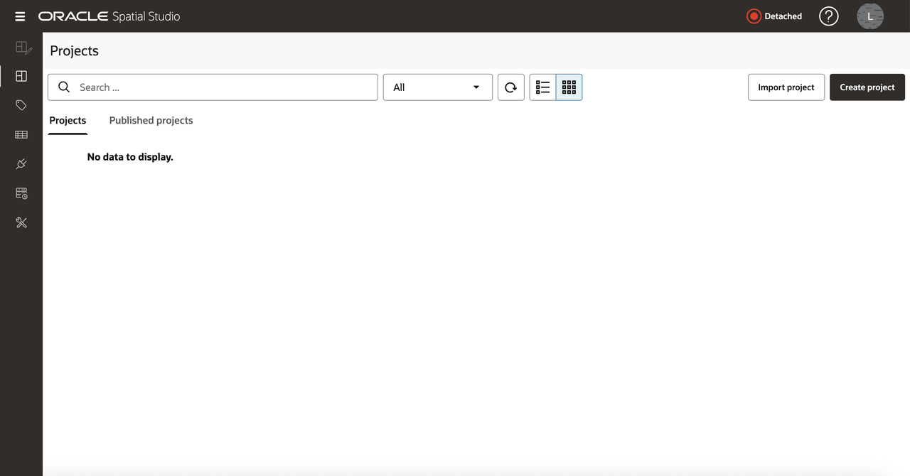

## Task 4: Create the New York Metro Service Coverage Project

In this task, you create two database-backed datasets, add them to a map, filter the demand layer to New York Metro, and run a distance analysis to find nearby fulfillment centers. The map makes the coverage story easier to communicate, while the SQL from earlier tasks remains the audit-friendly source for exact distances and service-level comparisons.

1. In Spatial Studio, click the **Datasets** icon in the left navigation, then click **Create dataset**.

    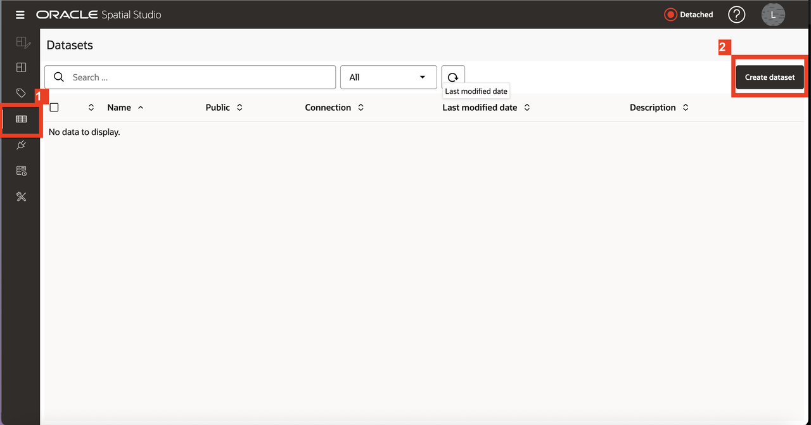

2. Select **Database table/view**. Keep `DEFAULT_CONNECTION` selected, then click **Create**.

    

3. Expand `DEFAULT_CONNECTION`, then expand **Tables**.

    

4. Select these tables, then click **OK**:

    - `DEMAND_REGIONS`
    - `FULFILLMENT_CENTERS`

    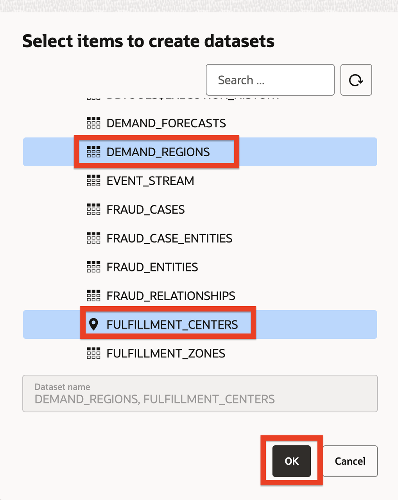

5. If Spatial Studio shows an issues page for `DEMAND_REGIONS`, click **Create Spatial Metadata and Index**, complete the prompt, then return to the dataset list. If you do not see this page, continue to the next step.

    

6. From the dataset list, open the actions menu for `DEMAND_REGIONS`, then click **Create project**.

    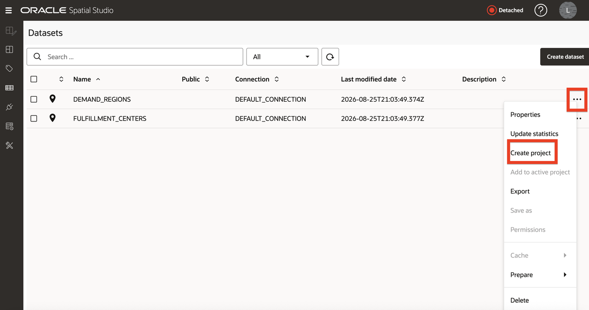

7. In the project, click **Add dataset**.

    

8. Select `FULFILLMENT_CENTERS`, then click **OK**.

    

9. Drag `DEMAND_REGIONS` and `FULFILLMENT_CENTERS` onto the map.

    Spatial Studio adds `DEMAND_REGIONS` as boundary shapes and `FULFILLMENT_CENTERS` as point locations.

    

10. In the left panel, open the actions menu for `DEMAND_REGIONS`, then select **Configure**.

11. In **Configure**, select **Filter**.

    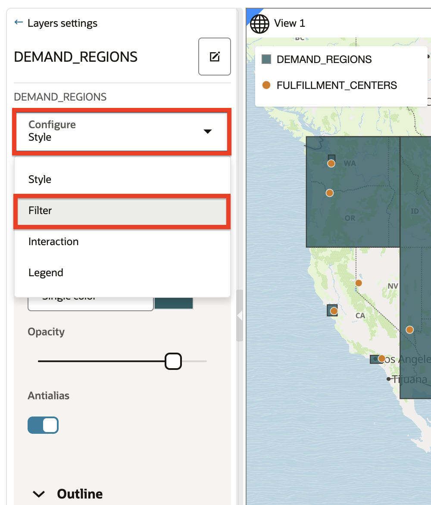

12. Create a filter for New York Metro:

    - Column: `REGION_NAME`
    - Value: `New York Metro`

13. Click **Apply**.

    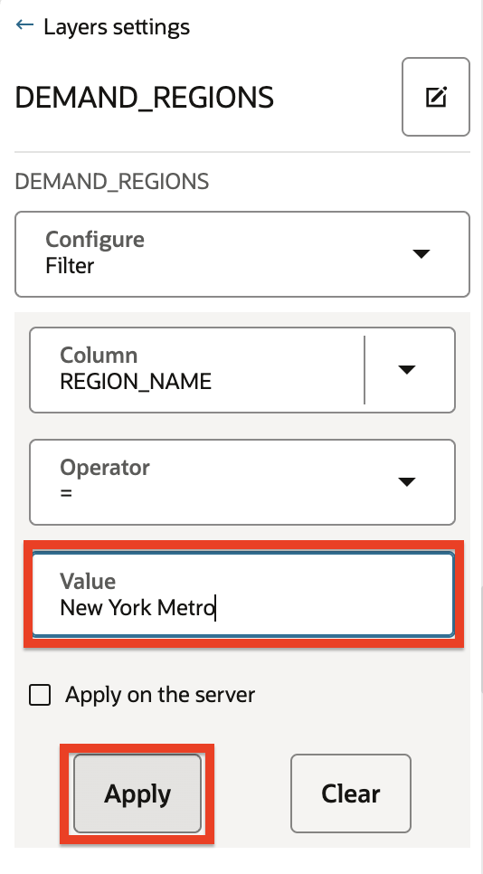

14. Select the New York Metro region on the map.

    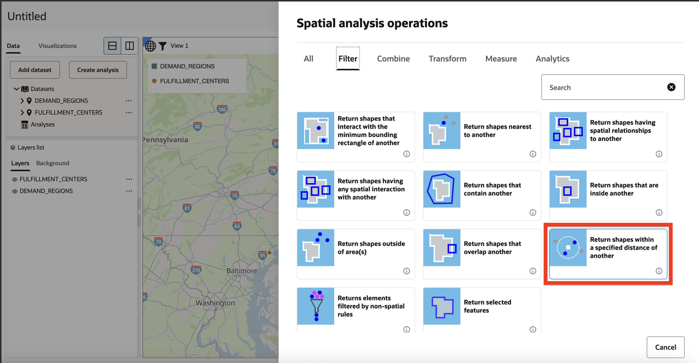

15. Click **Spatial analysis**, then select **Return shapes within a specific distance**.

16. Configure the analysis:

    - Analysis layer: `FULFILLMENT_CENTERS`
    - Location column: `FULFILLMENT_CENTERS.LOCATION`
    - Boundary layer: `DEMAND_REGIONS`
    - Boundary column: `DEMAND_REGIONS.BOUNDARY`
    - Boundary option: use the selected New York Metro region

    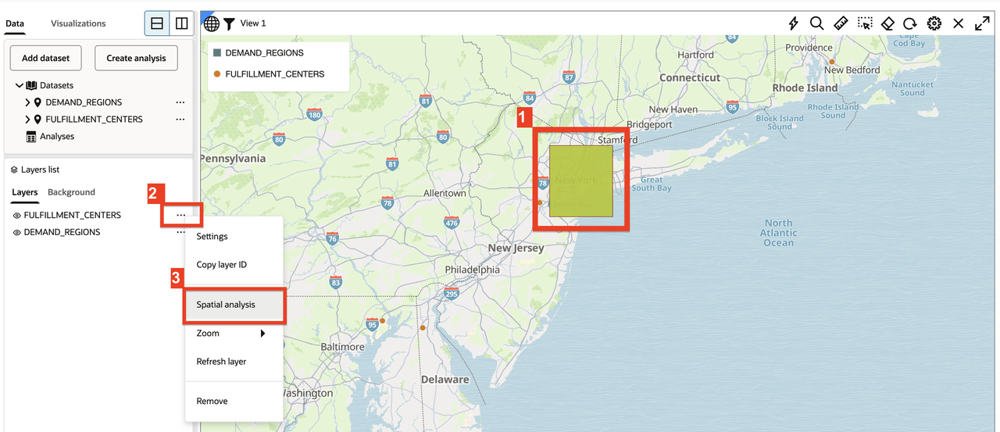

17. Set the distance to `250,000` meters.

    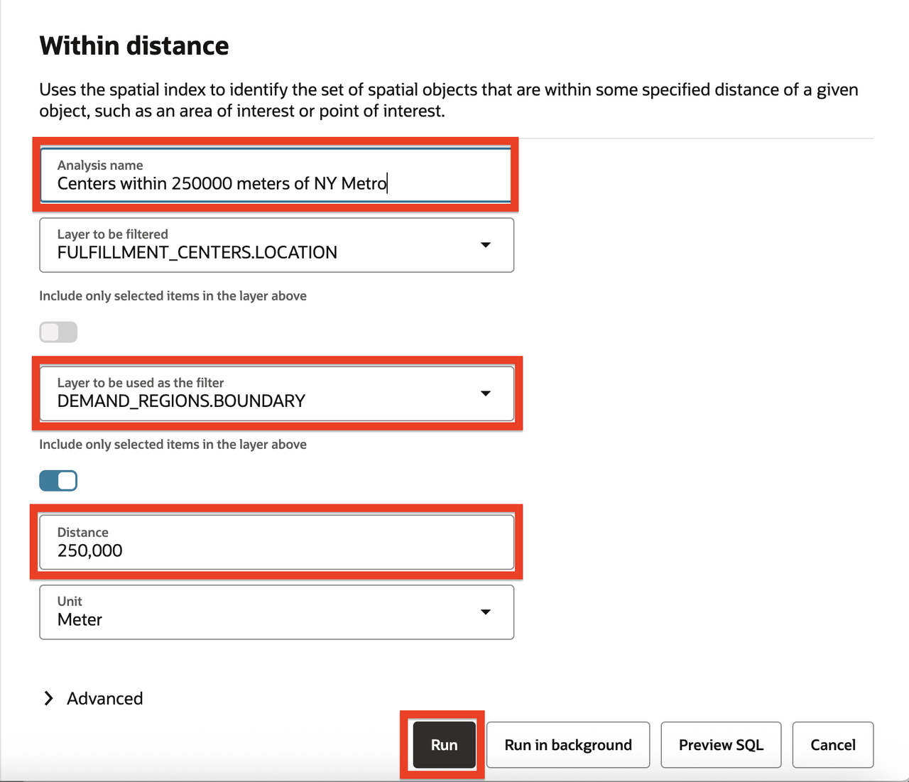

18. Rename the analysis layer to `Centers within 250,000 meters of New York Metro`.

19. Run the analysis.

20. Hide the original `FULFILLMENT_CENTERS` layer if needed so the analysis results are easier to see.

    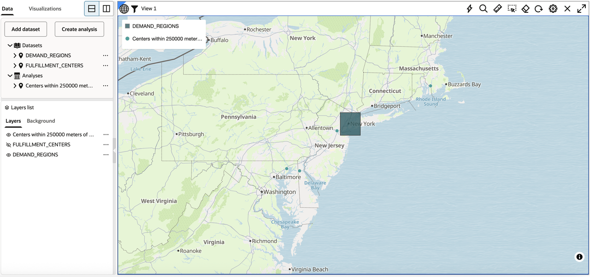

21. Open **Settings**, then select **Interactions**.

22. Configure the information window for the analysis results. Add these fields:

    - `CENTER_NAME`
    - `CITY`
    - `STATE_PROVINCE`

    If the points are hard to select, increase the point radius to `5` or `8`.

    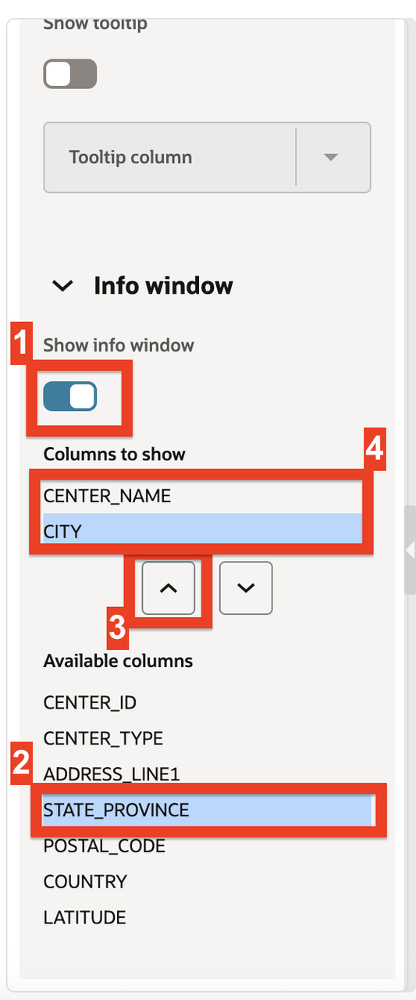

23. Right-click a result point to view the center details.

    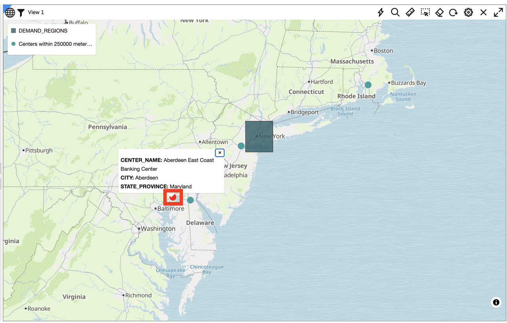

24. Click **Save**, then save the project as `New York Metro Service Coverage`.

    

## Next Steps

Congratulations on completing the spatial lab. You created a Spatial Studio coverage project and used spatial queries to compare demand regions, service centers, and response-time zones so operations teams can decide where to route work first. For a deeper hands-on workshop focused on Oracle Spatial, open the [Oracle Spatial LiveLabs workshop](https://livelabs.oracle.com/ords/r/dbpm/livelabs/view-workshop?clear=RR,180&wid=800).

## Acknowledgements

* **Authors** - Linda Foinding, Principal Database Product Manager
* **Contributors** - Ramu Murakami Gutierrez, Pat Shepherd, 
* **Last Updated By/Date** - Oracle Database Product Management, August 2026
