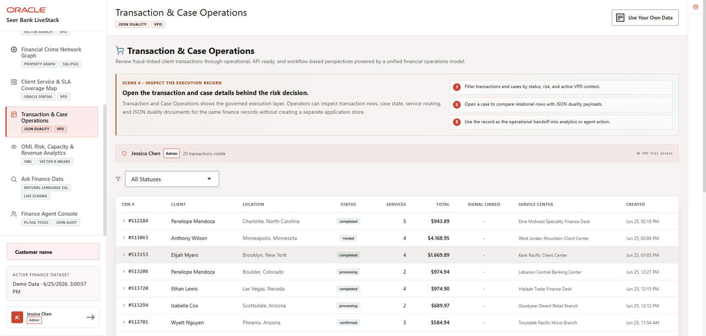

# Transaction and Case Documents with JSON Relational Duality

## Introduction

Applications often need transaction data as a clean JSON document, while analysts still need the same data in relational form for filtering, joining, and investigation. This lab uses **JSON Relational Duality** to satisfy both needs from the same data.

Think of this as one transaction wearing two useful forms. The application gets an API-friendly document. Analysts and database developers still get governed SQL access to the underlying facts.

This matters after the dashboard lab because a KPI is not enough for review. When an analyst or application needs a specific transaction, the database can return an API-shaped document and still preserve the relational joins needed for investigation.

<details>
<summary><strong>Key terms: JSON, relational tables, JSON Relational Duality, duality view, and projection</strong></summary>

> - **JSON** is a document format that application developers often prefer for APIs because it can represent a complete business object in one payload. A transaction document can hold the transaction ID, status, customer ID, totals, and line items together, which makes it natural for web and mobile applications to request, send, and display. JSON is flexible and developer-friendly, but by itself it is not as strong as a relational model for analytics, joining across many entities, enforcing shared business rules, or asking governed SQL questions across large data sets.
>
> - **Relational tables** store data in rows and columns with defined keys, relationships, constraints, and data types. That structure is excellent for analytics because SQL can filter, aggregate, join customers to transactions, enforce data quality rules, and answer questions such as which customers, products, or cases are driving risk. Relational data is less convenient as a direct application payload than JSON, but it is much stronger for governed analysis and operational reporting.
>
> - **JSON Relational Duality** lets Oracle Database expose relational data as JSON documents without copying it into a separate document database. The application gets the document shape developers want for APIs, while analysts keep SQL access to governed relational data. That matters because the API document and the analytic rows stay synchronized as two views of the same source.
>
> - **Duality view**, often shortened to **DV**, is the database object that defines that document shape. A duality view is created with `CREATE JSON RELATIONAL DUALITY VIEW`. The definition maps relational tables and columns into a JSON structure, so the database knows how to present the same rows as a document. In this lab, `ORDERS_DV` maps transaction rows from `ORDERS` and nested line-item rows from `ORDER_ITEMS` into one transaction document.
>
> - **Projection** means presenting the same centralized data in the shape a user, application, or service needs. Oracle Database can store governed data once, then let different consumers access it as relational rows, JSON documents, spatial objects, graph relationships, vectors, or model-ready columns without extracting or synchronizing separate copies. In this lab, SQL/JSON projection means taking fields from a JSON transaction document, such as transaction ID and status, and returning them as normal SQL columns that analysts can filter, sort, and join. The same transaction data can serve an application-friendly JSON API and an analyst-friendly SQL result without moving the data into a separate document store.

</details>

The image below shows the Transaction and Case Operations page in its API document view. The application can show the same transaction as a nested JSON document for API and partner integration use cases, while operations teams still rely on relational transaction, client, product, case, and service data. In this lab, you query the duality view behind that screen to see why developers can get a JSON payload without giving up relational analytics.



### Objectives

- Read application-friendly transaction documents from a duality view.
- Explain why JSON Relational Duality avoids a separate document copy.
- Use SQL/JSON projection to return document fields as SQL columns for investigation.

Estimated Time: **10 minutes**

### Business Scenario

| Step | Finance focus |
| --- | --- |
| Business Problem | Application teams want document-shaped transaction data, while risk teams need relational controls. |
| Technical Challenge | Developers need API-friendly JSON without copying transaction records into a separate document store. |
| Persona Focus | Application developers serve document payloads while database developers preserve relational governance and SQL access. |
| What You Will See | JSON Relational Duality exposes transaction documents without duplicating data. |
| Database Capability | Duality views and SQL/JSON functions expose JSON and relational access together. |
| Outcome | Transaction operations can serve application and analytics needs from one source. |

Persona focus: You are the application/database developer showing how Seer Bank can expose transaction documents while keeping governed relational evidence intact.

### What Is a Duality View?

A JSON Relational Duality View is a database view that defines how relational tables should appear as a JSON document. The data still lives in relational tables, with keys, constraints, SQL access, and governance. The duality view adds a document access path over that same data.

For this lab, the workshop database already includes `ORDERS_DV`. It was created with a statement shaped like this:

```sql
CREATE OR REPLACE JSON RELATIONAL DUALITY VIEW orders_dv AS
SELECT JSON {
    '_id'        : o.order_id,
    'customerId' : o.customer_id,
    'status'     : o.order_status,
    'items'      : [
        SELECT JSON {
            'itemId'    : oi.item_id,
            'productId' : oi.product_id,
            'quantity'  : oi.quantity
        }
        FROM order_items oi
        WHERE oi.order_id = o.order_id
    ]
}
FROM orders o;
```

That definition tells Oracle Database how to present an order row and its related line-item rows as one JSON transaction document. The application can read a transaction in the shape developers prefer for APIs, while analysts can still query the underlying rows with SQL.

This is better than common alternatives because it avoids splitting ownership of the same transaction across systems. If teams hand-build JSON in every application service, each service can drift into its own version of the transaction shape. If teams copy transactions into a separate document database, they must synchronize data, duplicate security rules, and resolve conflicts when the document copy and relational source disagree. A duality view keeps one governed source of truth while still giving each consumer the access shape it needs.

## Task 1: Inspect document-shaped transactions

First, inspect the transaction shape an application can consume directly.

1. Run this query:

    > **SQL Worksheet reminder:** Need a reminder on how to open and use the SQL Worksheet? Return to [Getting Started Task 2: Open SQL Worksheet](/workshops/sandbox/index.html?lab=getting-started#Task2:OpenSQLWorksheet) for the step-by-step graphic showing where to paste and run SQL statements.

    You are viewing a transaction the way an application can consume it: as a JSON document. The SQL selects from the JSON Relational Duality view `ORDERS_DV` and uses `JSON_SERIALIZE(... PRETTY)` so SQL Worksheet displays the document shape clearly.

    <details>
    <summary><strong>Why this matters: Oracle's converged approach helps here</strong></summary>

    > In a fractured environment, the application team might keep JSON documents in one system while analysts use relational tables in another. That creates a synchronization problem: which copy is current, which one is governed, and which one should an investigation trust?
    >
    > Oracle JSON Relational Duality avoids that split. The JSON document and the relational rows are two views of the same governed data.

    </details>

    ```sql
    <copy>
    SELECT JSON_SERIALIZE(data PRETTY) AS transaction_document
    FROM orders_dv
    FETCH FIRST 1 ROW ONLY;
    </copy>
    ```

    **Expected output: Transaction Document Excerpt**

    | Transaction Document |
    | --- |
    | { "\_id" : 519, "\_metadata" : { "etag" : "A373EE416A88F30340355B478ADC0179", "asof" : "00002AB7EFDA711D" }, "customerId" : 205, "status" : "cancelle... |


2. Expand the document in SQL Worksheet.
    The query reads the duality view as a document source. The database constructs the JSON shape from relational data, so the application gets a transaction payload without creating a second copy of the transaction record.

    The \_id value appears in the JSON document while the source data remains relational. Fields such as `customerId`, `status`, totals, timestamps, and line items give the application a document-shaped payload without copying the transaction to a separate document database.

    This is useful because risk and operations teams can inspect the same transaction from two angles: API-ready JSON for the application and governed relational rows for analysis.

## Task 2: Project JSON fields with SQL

Now use SQL to project document fields back into reviewable columns. In this context, "project" means pulling selected values out of the JSON document and displaying them as SQL result columns.

1. Run this SQL/JSON projection query:

    You are seeing the main advantage of JSON Relational Duality: the JSON document that works well for an application is still available for SQL analysis. The same transaction shape can be queried, filtered, and joined to governed relational data.

    The SQL uses `JSON_VALUE` to extract transaction fields from the duality document. That extraction is the projection step: it pulls out the transaction ID and status, reads the embedded customer identifier, joins that identifier to `CUSTOMERS`, and orders the result so the first transactions are easy to review.

    Without JSON Relational Duality, teams often have to choose between two awkward options. They can keep only relational tables and hand-build JSON for each application API, or they can copy transaction data into a separate document store and then worry about synchronization, security, lineage, and stale data. Duality avoids that split: the application gets JSON, while analysts still get SQL access to the same governed transaction record.

    ```sql
    <copy>
    SELECT JSON_VALUE(od.data, '$._id' RETURNING NUMBER) AS transaction_id,
           JSON_VALUE(od.data, '$.status') AS transaction_status,
           c.email AS client_email
    FROM orders_dv od
    JOIN customers c
      ON c.customer_id = JSON_VALUE(od.data, '$.customerId' RETURNING NUMBER)
    WHERE JSON_VALUE(od.data, '$._id' RETURNING NUMBER) IS NOT NULL
    ORDER BY transaction_id
    FETCH FIRST 10 ROWS ONLY;
    </copy>
    ```

    **Expected output: JSON Field Projection**

    The exact email values may differ by load, but `Transaction Status` and `Client Email` should not be blank.

    | Transaction Id | Transaction Status | Client Email |
    | --- | --- | --- |
    | 1 | confirmed | client@example.com |
    | 2 | processing | client@example.com |
    | 3 | routed | client@example.com |
    | 4 | completed | client@example.com |
    | 5 | completed | client@example.com |
    | 6 | completed | client@example.com |
    | 7 | cancelled | client@example.com |
    | 8 | pending | client@example.com |
    | 9 | confirmed | client@example.com |
    | 10 | processing | client@example.com |


2. Review the columns returned from the JSON document.
    This query shows the reverse path: SQL can project fields back out of the document, meaning it can return selected JSON values as SQL columns and join them to relational customer data. That lets analysts use the same application-facing document view without giving up relational filtering, ordering, and joins.

    `Transaction Id` and `Transaction Status` are projected from the JSON document into the result table. The document stores the client reference as `customerId`, so the query joins back to `CUSTOMERS` to return `Client Email`.

    The business value is consistency. A developer can serve a clean transaction document to an application, while a risk analyst can still ask normal SQL questions about transaction status and customer contact details. Both users are working from the same source of truth.

## Acknowledgements

* **Author** - Pat Shepherd, Senior Principal Database Product Manager
* **Contributor** - Linda Foinding, Principal Database Product Manager
* **Last Updated By/Date** - Oracle Database Product Management, June 2026
