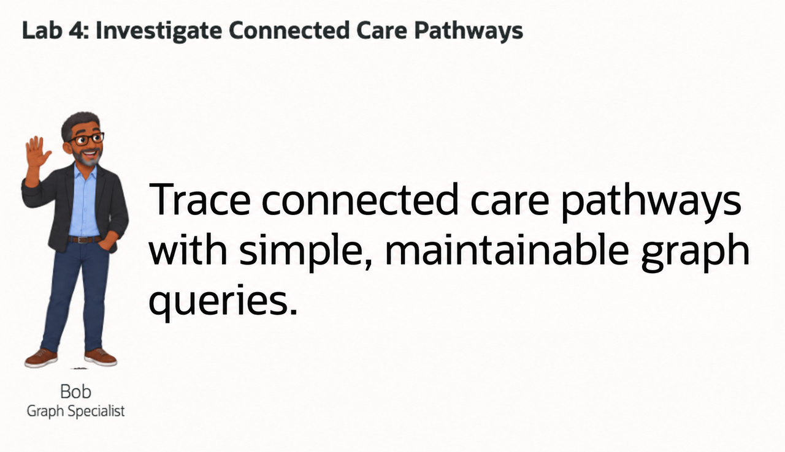
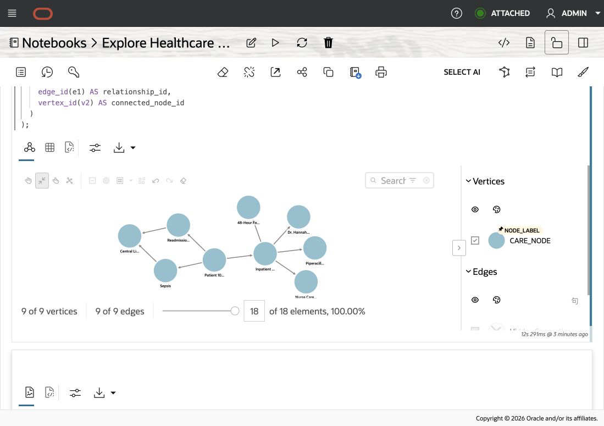
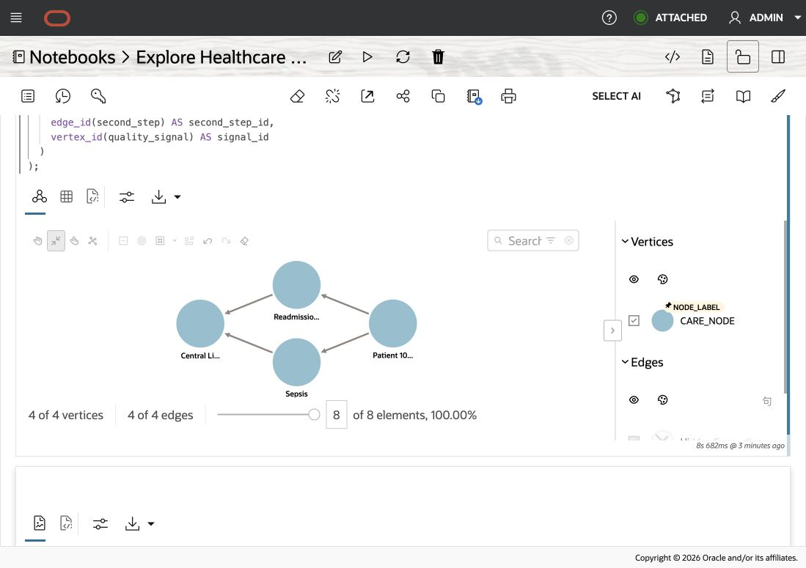

# Investigate Connected Care Pathways

## Introduction

Bob Green is a graph specialist at Seer Health Network. He helps care operations teams understand how patient journeys connect to encounters, conditions, care gaps, treatments, providers, care teams, and quality signals.

Bob’s starting point is simple: important healthcare context often appears in relationships, not in one row. A patient journey may connect directly to an encounter, condition, or care gap. That encounter can connect to a medication, provider, care team, or follow-up action. A condition and care gap may also lead to the same quality signal. Reviewing each record separately makes the complete pathway difficult to see and explain.

In this lab, you will use Bob’s approach to investigate those relationships in two ways. You will begin with ordinary relational SQL and see how additional relationship hops require more joins and path-handling logic. You will then use SQL Property Graph Queries, also called SQL/PGQ, to express the same investigation as a graph pattern. The result remains a normal SQL table that care operations teams can review, sort, and use in an application.

Bob also needs to communicate the pathway to reviewers who may not want to interpret SQL rows. Oracle Graph Studio lets him explore the same governed relationships as an interactive network. SQL/PGQ provides a precise, repeatable evidence trail, while Graph Studio makes it easier to follow the patient journey, inspect connected care facts, and explain how multiple paths lead to the same quality signal.



<details>
<summary><strong>Key terms: property graph, vertex, edge, hop, and SQL/PGQ</strong></summary>

> - A **property graph** represents things and the relationships between them. In this lab, those things include a patient journey, encounter, condition, care gap, medication, provider, care team, follow-up action, and quality signal.
>
> - A **vertex** is a graph node representing something the care operations team wants to review. Vertices in `CARE_PATHWAY_GRAPH` use the `care_node` label and include properties such as the node label, node type, risk score, and pathway volume.
>
> - An **edge** is a directed relationship between two vertices. Edges use the `care_relationship` label and describe connections such as `HAS_CONDITION`, `HAS_ENCOUNTER`, `SUPPORTED_BY`, and `ASSOCIATED_SIGNAL`.
>
> - A **hop** is one step across an edge. Moving from the patient journey to the encounter is one hop. Moving from the journey through the encounter to the care team is two hops.
>
> - **SQL Property Graph Queries**, or **SQL/PGQ**, let Bob describe relationship patterns directly in SQL. `GRAPH_TABLE` converts the matched vertices, edges, and properties into rows that can be filtered, sorted, joined, or displayed like other SQL results.

</details>

### Objectives

- Compare relational joins with SQL/PGQ traversal.
- Follow connected care facts within two hops.
- Trace the evidence behind a quality signal.
- Explore the care pathway in Graph Studio.

Estimated Time: **10 minutes**

### Operating Story

| Step | Healthcare focus |
| --- | --- |
| Business Problem | A care operations reviewer needs to understand how the facts in a patient journey connect. |
| Technical Challenge | Each additional relationship hop makes a conventional chain of relational joins longer and harder to maintain. |
| Persona Focus | Bob models the pathway as a graph while Jessica keeps the governed relational records as the source. |
| What You Will Prove | SQL/PGQ can follow the recorded care relationships and explain how two paths reach the same quality signal. |
| Database Capability | `CARE_PATHWAY_GRAPH` and `GRAPH_TABLE` support SQL/PGQ traversal over the healthcare tables. |
| Outcome | The reviewer gets a traceable table of connected care facts and an interactive pathway map. |

Persona focus: You are reviewing Bob's graph solution with a care operations reviewer.

> **SQL Worksheet reminder:** Need a reminder on how to open and use the SQL Worksheet? Return to [Getting Started Task 2: Open SQL Worksheet](?lab=getting-started#Task2:OpenSQLWorksheet) for the step-by-step graphic showing where to paste and run SQL statements.

## Task 1: Follow a Patient Journey with Relational SQL

Jessica begins with the workshop's relational tables. `HC_CARE_NODES` stores the care facts, and `HC_CARE_EDGES` stores the directed relationships between them. Her first query returns the facts directly connected to the patient journey.

In this lab, a **hop** means one relationship step. Moving from the patient journey to its encounter is one hop. Moving from the journey through that encounter to the care team is two hops.

1. Run Jessica's ordinary SQL query:

    ```sql
    <copy>
    SELECT journey.node_id AS journey_id,
           journey.node_label AS journey,
           connected.node_id AS connected_node_id,
           connected.node_label AS connected_node,
           connected.node_type AS connected_type,
           relationship.relationship_type,
           relationship.evidence_score,
           connected.risk_score AS connected_risk
    FROM hc_care_nodes journey
    JOIN hc_care_edges relationship
      ON relationship.source_node_id = journey.node_id
    JOIN hc_care_nodes connected
      ON connected.node_id = relationship.target_node_id
    WHERE journey.node_type = 'PATIENT_JOURNEY'
    ORDER BY relationship.evidence_score DESC,
             connected.node_id;
    </copy>
    ```

    The query joins `HC_CARE_NODES` twice: once for the patient journey and once for the connected care fact. `HC_CARE_EDGES` supplies the relationship between them.

    **Expected output: Direct care connections**

    | Journey ID | Connected Node ID | Connected Care Fact | Type | Relationship | Evidence Score | Risk Score |
    | ---: | ---: | --- | --- | --- | ---: | ---: |
    | 3 | 5 | Inpatient Encounter 4412 | ENCOUNTER | HAS\_ENCOUNTER | 0.99 | 0.71 |
    | 3 | 1 | Sepsis | CONDITION | HAS\_CONDITION | 0.96 | 0.82 |
    | 3 | 2 | Readmission Risk | CARE\_GAP | HAS\_CARE\_GAP | 0.94 | 0.91 |

    The three rows show the encounter, condition, and care gap recorded directly against the patient journey.

2. Extend Jessica's query to follow one or two hops without using a graph query:

    ```sql
    <copy>
    SELECT journey_id,
           connected_node_id,
           connected_node,
           connected_type,
           relationship_hops,
           relationship_path,
           connected_risk
    FROM (
      SELECT journey.node_id AS journey_id,
             connected.node_id AS connected_node_id,
             connected.node_label AS connected_node,
             connected.node_type AS connected_type,
             1 AS relationship_hops,
             first_step.relationship_type AS relationship_path,
             connected.risk_score AS connected_risk
      FROM hc_care_nodes journey
      JOIN hc_care_edges first_step
        ON first_step.source_node_id = journey.node_id
      JOIN hc_care_nodes connected
        ON connected.node_id = first_step.target_node_id
      WHERE journey.node_type = 'PATIENT_JOURNEY'
      UNION ALL
      SELECT journey.node_id,
             connected.node_id,
             connected.node_label,
             connected.node_type,
             2,
             first_step.relationship_type || ' -> ' ||
               second_step.relationship_type,
             connected.risk_score
      FROM hc_care_nodes journey
      JOIN hc_care_edges first_step
        ON first_step.source_node_id = journey.node_id
      JOIN hc_care_nodes intermediate
        ON intermediate.node_id = first_step.target_node_id
      JOIN hc_care_edges second_step
        ON second_step.source_node_id = intermediate.node_id
      JOIN hc_care_nodes connected
        ON connected.node_id = second_step.target_node_id
      WHERE journey.node_type = 'PATIENT_JOURNEY'
    )
    ORDER BY relationship_hops,
             connected_risk DESC,
             connected_node_id;
    </copy>
    ```

    Jessica now needs a separate query branch for each path length. The first branch follows one relationship; the second adds another relationship and another node join. `UNION ALL` preserves both recorded paths when different clinical contexts reach the same quality signal.

    **Expected output: One-hop and two-hop paths**

    | Hops | Connected Care Fact | Type | Relationship Path | Risk Score |
    | ---: | --- | --- | --- | ---: |
    | 1 | Readmission Risk | CARE\_GAP | HAS\_CARE\_GAP | 0.91 |
    | 1 | Sepsis | CONDITION | HAS\_CONDITION | 0.82 |
    | 1 | Inpatient Encounter 4412 | ENCOUNTER | HAS\_ENCOUNTER | 0.71 |
    | 2 | Central Line Infection Risk | QUALITY\_SIGNAL | HAS\_CARE\_GAP -> ASSOCIATED\_SIGNAL | 0.79 |
    | 2 | Central Line Infection Risk | QUALITY\_SIGNAL | HAS\_CONDITION -> ASSOCIATED\_SIGNAL | 0.79 |
    | 2 | 48-Hour Follow-Up | CARE\_GAP | HAS\_ENCOUNTER -> REQUIRES\_FOLLOW\_UP | 0.76 |
    | 2 | Piperacillin/Tazobactam | MEDICATION | HAS\_ENCOUNTER -> TREATED\_WITH | 0.35 |
    | 2 | Nurse Care Team | CARE\_TEAM | HAS\_ENCOUNTER -> SUPPORTED\_BY | 0.28 |
    | 2 | Dr. Hannah Lee - Hospitalist | PROVIDER | HAS\_ENCOUNTER -> ATTENDED\_BY | 0.24 |

    `Central Line Infection Risk` appears twice because two distinct recorded paths lead to it. Those rows preserve useful evidence; they are not accidental duplicates.

3. Review how the SQL grows more complex without a graph query.

    Jessica can add another relationship step, but each hop needs another edge join and another node join. Supporting several path lengths also needs more query branches and path-handling logic. The SQL becomes harder to read as the pathway grows.

    This is the problem Bob's graph approach addresses. The relationships remain in the relational tables, but SQL/PGQ can express the path directly.

## Task 2: Read the same connections as a graph

Bob has already created `CARE_PATHWAY_GRAPH` for this lab. You do not need to create it before running the queries. Its definition maps the existing `HC_CARE_NODES` and `HC_CARE_EDGES` tables to graph elements. Check the appendix to see that mapping.

In graph terms, the journey and connected care facts are **vertices**. Each row in `HC_CARE_EDGES` becomes an **edge**. `GRAPH_TABLE` lets Bob match those vertices and edges and return their properties as ordinary SQL columns.

1. Run Bob's SQL/PGQ query:

    ```sql
    <copy>
    SELECT journey_id,
           journey,
           connected_node_id,
           connected_node,
           connected_type,
           relationship_type,
           evidence_score,
           connected_risk
    FROM GRAPH_TABLE (
      care_pathway_graph
      MATCH (journey IS care_node)
            -[relationship IS care_relationship]->
            (connected IS care_node)
      WHERE journey.node_type = 'PATIENT_JOURNEY'
      COLUMNS (
        journey.node_id AS journey_id,
        journey.node_label AS journey,
        connected.node_id AS connected_node_id,
        connected.node_label AS connected_node,
        connected.node_type AS connected_type,
        relationship.relationship_type AS relationship_type,
        relationship.evidence_score AS evidence_score,
        connected.risk_score AS connected_risk
      )
    )
    ORDER BY evidence_score DESC,
             connected_node_id;
    </copy>
    ```

    In the `MATCH` pattern, `journey` and `connected` are vertices. `relationship` is the directed edge between them, so the pattern follows one hop. `IS care_node` and `IS care_relationship` refer to the labels defined in `CARE_PATHWAY_GRAPH`.

    The result has the same shape as Jessica's query. The difference is the way Bob describes the investigation: start at one vertex, follow one edge, and return the connected vertex.

    **Expected output: Direct connections with SQL/PGQ**

    | Journey ID | Connected Node ID | Connected Care Fact | Type | Relationship | Evidence Score | Risk Score |
    | ---: | ---: | --- | --- | --- | ---: | ---: |
    | 3 | 5 | Inpatient Encounter 4412 | ENCOUNTER | HAS\_ENCOUNTER | 0.99 | 0.71 |
    | 3 | 1 | Sepsis | CONDITION | HAS\_CONDITION | 0.96 | 0.82 |
    | 3 | 2 | Readmission Risk | CARE\_GAP | HAS\_CARE\_GAP | 0.94 | 0.91 |

## Task 3: Trace the Connected Care Pathway

Bob now follows every care fact within one or two hops of the patient journey. This reaches the direct condition, care gap, and encounter, then continues to the quality signal, follow-up action, care team, medication, and provider.

1. Run the SQL/PGQ traversal from the patient journey.

    In the `MATCH` pattern, `(journey IS care_node)` is the starting vertex, `-[relationship IS care_relationship]->{1,2}` follows one or two directed edges, and `(connected IS care_node)` is each reached care fact.

    The `WHERE` clause anchors the search on the `PATIENT_JOURNEY` node type. The `COLUMNS` clause projects the matched graph properties into a normal SQL result table.

    This is more concise than the relational version because one bounded path pattern replaces the separate one-hop and two-hop query branches.

    The graph pattern states the investigation directly: start with the patient journey, follow one or two care relationships, and return the connected facts.

    ```sql
    <copy>
    SELECT DISTINCT journey_id,
           connected_node_id,
           connected_node,
           connected_type,
           connected_risk
    FROM GRAPH_TABLE (
      care_pathway_graph
      MATCH (journey IS care_node)
            -[relationship IS care_relationship]->{1,2}
            (connected IS care_node)
      WHERE journey.node_type = 'PATIENT_JOURNEY'
      COLUMNS (
        journey.node_id AS journey_id,
        connected.node_id AS connected_node_id,
        connected.node_label AS connected_node,
        connected.node_type AS connected_type,
        connected.risk_score AS connected_risk
      )
    )
    ORDER BY connected_risk DESC,
             connected_node_id;
    </copy>
    ```

    `DISTINCT` returns each connected care fact once even when more than one path reaches it. The result therefore contains eight nodes, while the relational path query returned nine rows because it preserved both paths into the quality signal.

    **Expected output: Connected care facts**

    | Node ID | Connected Care Fact | Type | Risk Score |
    | ---: | --- | --- | ---: |
    | 2 | Readmission Risk | CARE\_GAP | 0.91 |
    | 1 | Sepsis | CONDITION | 0.82 |
    | 6 | Central Line Infection Risk | QUALITY\_SIGNAL | 0.79 |
    | 4 | 48-Hour Follow-Up | CARE\_GAP | 0.76 |
    | 5 | Inpatient Encounter 4412 | ENCOUNTER | 0.71 |
    | 8 | Piperacillin/Tazobactam | MEDICATION | 0.35 |
    | 7 | Nurse Care Team | CARE\_TEAM | 0.28 |
    | 9 | Dr. Hannah Lee - Hospitalist | PROVIDER | 0.24 |

2. Review the operational result.

    The risk-sorted table gives the care operations team one review list while preserving each fact's healthcare context. The scores are synthetic workshop values used to order the demonstration data; they are not clinical probabilities or recommendations.

## Task 4: Trace the Evidence Behind a Quality Signal

Bob narrows the pathway to one question: **which recorded paths connect the patient journey to Central Line Infection Risk?** The graph must preserve the clinical context and the relationship on each side of the path.

1. Run Bob's quality-signal evidence query:

    ```sql
    <copy>
    SELECT journey,
           clinical_context,
           context_type,
           quality_signal,
           first_relationship,
           second_relationship,
           first_evidence_score,
           second_evidence_score
    FROM GRAPH_TABLE (
      care_pathway_graph
      MATCH (journey IS care_node)
            -[first_step IS care_relationship]->
            (clinical_context IS care_node)
            -[second_step IS care_relationship]->
            (quality_signal IS care_node)
      WHERE journey.node_type = 'PATIENT_JOURNEY'
        AND quality_signal.node_type = 'QUALITY_SIGNAL'
      COLUMNS (
        journey.node_label AS journey,
        clinical_context.node_label AS clinical_context,
        clinical_context.node_type AS context_type,
        quality_signal.node_label AS quality_signal,
        first_step.relationship_type AS first_relationship,
        second_step.relationship_type AS second_relationship,
        first_step.evidence_score AS first_evidence_score,
        second_step.evidence_score AS second_evidence_score
      )
    )
    ORDER BY clinical_context;
    </copy>
    ```

    The pattern starts at the patient journey, follows one edge to a clinical-context vertex, and follows a second edge to a quality-signal vertex. The node-type filters keep the start and end of the pattern explicit.

2. Review the business result.

    **Expected output: Quality-signal evidence paths**

    | Clinical Context | Type | Quality Signal | First Relationship | Second Relationship | First Score | Second Score |
    | --- | --- | --- | --- | --- | ---: | ---: |
    | Readmission Risk | CARE\_GAP | Central Line Infection Risk | HAS\_CARE\_GAP | ASSOCIATED\_SIGNAL | 0.94 | 0.78 |
    | Sepsis | CONDITION | Central Line Infection Risk | HAS\_CONDITION | ASSOCIATED\_SIGNAL | 0.96 | 0.81 |

    The two rows show why the quality signal belongs in the same operational review: one recorded path reaches it through the care gap, and another reaches it through the condition. The query exposes those relationships without implying clinical causality.

## Task 5: Visualize the Care Pathway with Oracle Graph Studio

Bob’s SQL/PGQ queries showed which conditions, care gaps, encounters, treatments, providers, and quality signals connect to the patient journey. The results give him a precise evidence trail, but rows alone can make it difficult for a care operations reviewer to see how those facts form one connected pathway.

Bob now wants the team to explore those relationships visually. With Oracle Graph Studio, he can turn the same healthcare data into an interactive network. Reviewers can start with the patient journey, follow its connections through the encounter, and see how different clinical contexts lead to the same quality signal.

Graph Studio uses the same property graph and governed database records as the SQL queries. Bob does not need to move the healthcare data into a separate graph database or maintain another copy. SQL/PGQ gives him a repeatable result set, while Graph Studio helps him explore, explain, and communicate the relationships behind that result.

In the following tasks, you will open Graph Studio and turn Bob’s SQL evidence into an interactive care-pathway map.

1. Return to the Database Actions Launchpad. Confirm that the upper-right corner shows `LLUSER`. If the dark-theme message appears, click **Done**.

    

2. On the **Development** tab, select **Graph Studio** from the left-side tool list and click **Open**.

    

3. If prompted, sign in with `LLUSER` and the workshop password supplied.

4. Confirm that the Graph Studio home page opens. The landing page provides access to **Graphs**, **Notebooks**, and **Jobs**.

    

## Task 6: Download and import the healthcare notebook

The supplied `.dsnb` file is a native Graph Studio notebook. It combines explanatory paragraphs, SQL/PGQ result tables, and graph visualizations in one runnable care-pathway investigation.

1. Download [healthcare-care-pathways-graph-studio.dsnb](files/healthcare-care-pathways-graph-studio.dsnb).

    If the notebook opens in your browser instead of downloading, right-click the link and select **Save Link As**.

2. In Graph Studio, click **Notebooks** on the landing page.

    

3. Select **Import** in the upper-right corner.

    

4. In the import window, drag and drop `healthcare-care-pathways-graph-studio.dsnb`, or browse to the downloaded file.

5. Confirm that the selected filename is `healthcare-care-pathways-graph-studio.dsnb`, and then click **Import**.

6. When the import completes, open **Explore Healthcare Care Pathways**.

## Task 7: Run and interpret the Graph Studio notebook

You already used SQL/PGQ in SQL Worksheet to return connected care facts as rows. The notebook now presents the same investigation in two forms: a result table that can be reviewed or passed to an application, and a visual graph that makes the relationship paths easier to follow and explain.

Run the notebook paragraphs from top to bottom. Use the triangle **Run** button on each SQL paragraph and wait for its result before continuing.

1. Under **Exercise 1: Trace a patient journey through connected care**, run the first SQL paragraph.

    The query starts with **Patient 1001 - Sepsis Readmission Risk**, follows one or two outgoing relationships, and returns eight distinct connected care facts. The result includes the condition, care gaps, encounter, quality signal, care team, medication, and provider.

    **Expected output: Connected care facts**

    | Result | What to verify |
    | --- | --- |
    | 8 connected nodes | The table includes Sepsis, Readmission Risk, Inpatient Encounter 4412, Central Line Infection Risk, 48-Hour Follow-Up, Nurse Care Team, Piperacillin/Tazobactam, and Dr. Hannah Lee - Hospitalist. |

2. Under **Visualize the same pathway**, run the next SQL paragraph.

    Graph Studio draws the patient journey and every relationship used to reach those care facts. The result should contain **9 vertices** and **9 edges**. Select a vertex to inspect its `NODE_LABEL`, `NODE_TYPE`, `RISK_SCORE`, and `PATHWAY_VOLUME`. Select an edge to inspect its `RELATIONSHIP_TYPE` and `EVIDENCE_SCORE`.

    

3. Read the first visualization as a pathway rather than a list.

    The patient journey connects directly to **Sepsis**, **Readmission Risk**, and **Inpatient Encounter 4412**. The encounter then connects to the follow-up action, care team, medication, and provider. Sepsis and Readmission Risk each connect to the same quality signal. The visualization explains why the eight table rows belong to the same operational review.

4. Under **Exercise 2: Trace the evidence behind a quality signal**, run the table SQL paragraph.

    The query narrows the investigation to paths that begin with the patient journey and end at **Central Line Infection Risk**. It returns two rows: one path through **Sepsis** and one through **Readmission Risk**.

    **Expected output: Quality-signal evidence paths**

    | Clinical context | First relationship | Second relationship |
    | --- | --- | --- |
    | Readmission Risk | HAS\_CARE\_GAP | ASSOCIATED\_SIGNAL |
    | Sepsis | HAS\_CONDITION | ASSOCIATED\_SIGNAL |

5. Under **Visualize the quality-signal evidence paths**, run the final SQL paragraph.

    Graph Studio reduces the network to **4 vertices** and **4 edges**: the patient journey, two clinical-context vertices, the quality signal, and the relationships that connect them.

    

6. Compare the two views.

    The table identifies the two evidence paths precisely. The visual graph shows that both paths converge on the same quality signal. Together they give the care operations team a result it can trace and a relationship map it can explain.

> **Generated result note:** Graph layouts and node positions can vary between runs. The vertex and edge counts, node labels, relationship types, and evidence scores are the evidence to compare.

Congratulations, you have used SQL/PGQ for repeatable care-pathway evidence and Graph Studio to explore the same governed relationships visually. The result supports operational review of synthetic, de-identified workshop data; it is not a clinical probability, diagnosis, or care recommendation.

## Conclusion: Make Relationships Easy to Review

Bob began with the relational tables and showed how each additional path length requires more joins and query branches. He then used SQL/PGQ to describe the same care pathway as a bounded graph pattern and return the connected facts as ordinary SQL rows.

The quality-signal query preserved the two recorded routes into Central Line Infection Risk, giving care operations a result it can trace. Graph Studio then turned those governed relationships into an interactive pathway map. SQL Worksheet provides repeatable evidence, while Graph Studio helps Bob explain how the patient journey, clinical context, and quality signal connect.

## Appendix: Create the Property Graph

Bob creates a property graph by mapping the relational tables to graph elements. `HC_CARE_NODES` becomes the vertex table, and each row receives the `care_node` label. `HC_CARE_EDGES` becomes the edge table, with the source and destination keys identifying the connected vertices. The graph queries in this lab use those two labels.

This statement is provided for reference. `CARE_PATHWAY_GRAPH` has already been created for this workshop, so do not run it again.

1. Review the property graph definition:

    ```sql
    CREATE PROPERTY GRAPH care_pathway_graph
      VERTEX TABLES (
        hc_care_nodes
          KEY (node_id)
          LABEL care_node
          PROPERTIES (node_id, node_type, node_label, risk_score, pathway_volume)
      )
      EDGE TABLES (
        hc_care_edges
          KEY (edge_id)
          SOURCE KEY (source_node_id) REFERENCES hc_care_nodes (node_id)
          DESTINATION KEY (target_node_id) REFERENCES hc_care_nodes (node_id)
          LABEL care_relationship
          PROPERTIES (edge_id, relationship_type, evidence_score)
      );
    ```

The statement defines the graph structure over the relational tables. `CARE_PATHWAY_GRAPH` can then be queried with `GRAPH_TABLE` while `HC_CARE_NODES` and `HC_CARE_EDGES` remain the source of the data.


## Acknowledgements

* **Author** - Linda Foinding, Principal Product Manager, Oracle Database Product Management
* **Last Updated By/Date** - Oracle Database Product Management, September 2026
