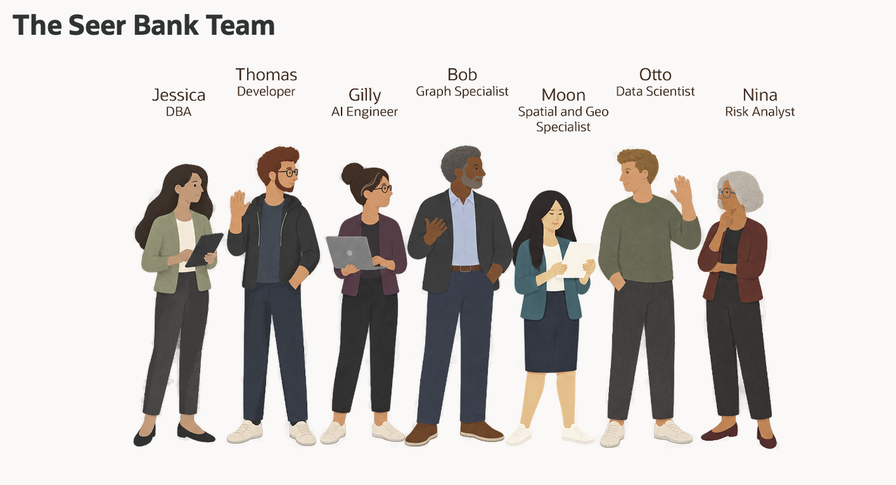

# Build Connected Healthcare Solutions with Oracle AI Database

## Introduction

Jessica Chen is the database administrator at Seer Health Network. Her team is improving care operations, coordinating service requests, investigating quality and capacity signals, routing logistics support, forecasting demand, and adding governed AI to healthcare workflows.

The requests look different, but they share one problem. The data is already in Oracle AI Database, and each team needs to use it in a different way:

- Thomas needs care service requests as JSON for an operational application.
- Gilly needs semantic search that finds related services and signals by meaning, not only matching words.
- Bob needs to follow relationships between conditions, encounters, care gaps, providers, and care teams.
- Moon needs to calculate distances between care sites and active logistics locations.
- Otto needs to train and score a healthcare demand-risk model.
- Nina needs to ask healthcare operations questions in plain language and use governed tools to investigate the answers.

Jessica's job is to help each team meet its requirement without creating another copy of healthcare data or a separate security model for every capability. She uses Oracle AI Database as the shared foundation: relational tables remain the governed source, while JSON, vectors, graphs, spatial analysis, machine learning, and AI services work with those same records.

This workshop follows Jessica and her colleagues as they solve these problems and help Seer Health improve care operations. Each lab focuses on one business requirement, but the database remains the common thread. You will see how the teams use different data types and database capabilities together, and how Jessica keeps access, SQL, results, and AI-assisted actions visible.

### What the team builds

| Team member                   | Healthcare requirement                                  | What you will see                                                                                                                            |
| ----------------------------- | ------------------------------------------------------- | -------------------------------------------------------------------------------------------------------------------------------------------- |
| Jessica, DBA                  | Build the query behind a care operations dashboard.     | One SQL result combines operational signals, semantic matching, JSON request activity, and logistics distance.                              |
| Thomas, application developer | Provide complete care service requests as JSON.         | JSON columns, JSON collections, and JSON Relational Duality Views provide different ways to serve application data.                         |
| Gilly, AI engineer            | Find related care services and operational signals.     | In-database embeddings support semantic healthcare search where the service and signal data already lives.                                  |
| Bob, graph specialist         | Investigate connected care pathways.                    | A property graph reveals relationships between conditions, encounters, care gaps, providers, and care teams.                               |
| Moon, spatial expert          | Route operational and logistics support.                | Oracle Spatial finds the nearest eligible logistics site, including the Miami Oncology Care Center to Hialeah routing example.              |
| Otto, data scientist          | Identify services that may face future demand pressure. | Oracle Machine Learning trains and scores a healthcare demand-risk model inside the database, close to the operational data.                 |
| Nina, care operations analyst | Ask questions and coordinate governed actions.          | Select AI produces inspectable SQL, while Select AI Agent uses approved tools and records agent activity.                                   |

The point is not to use every capability in every query. The point is that Jessica does not have to move the data into a separate database whenever a requirement changes. The same healthcare records can support:

- An application payload.
- A semantic search.
- A care pathway investigation.
- A logistics-distance calculation.
- A demand-risk score.
- A natural-language question and governed agent action.

<strong>Learn more: What does "converged database" mean?</strong>

> A converged database supports different data types and workloads on one database foundation. In this workshop, that includes relational rows, JSON documents, vectors, graphs, geographic data, machine learning models, and AI-assisted SQL.
>
> The advantage is practical. Teams can use the data in the form their application or analysis needs while keeping the records, privileges, and SQL access connected. They do not need to copy healthcare data into a document store, vector service, graph database, mapping system, or separate scoring service for each requirement.

### Objectives

- Follow Jessica and her team as they solve healthcare application and operational-analysis requirements.
- Use relational SQL, JSON, vectors, graphs, spatial data, Oracle Machine Learning, Select AI, and Select AI Agent in practical tasks.
- See how one Oracle AI Database can support different data types without separate copies of healthcare records.
- Understand how database privileges, restricted AI profiles, approved tools, and execution history keep AI-assisted work visible and controlled.
- Connect the database evidence to the customer-facing Seer Health LiveStack application.

Estimated Workshop Time: **90 minutes**

## Acknowledgements

* **Author** - Linda Foinding, Principal Product Manager, Oracle Database Product Management
* **Last Updated By/Date** - Oracle Database Product Management, September 2026
