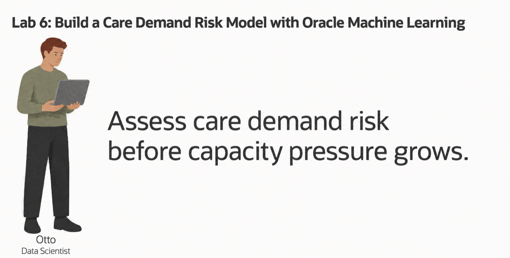
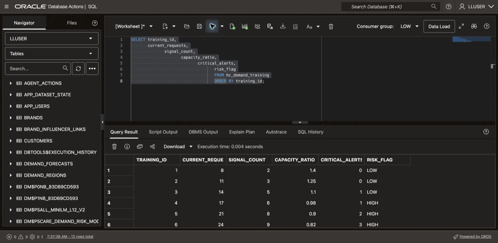
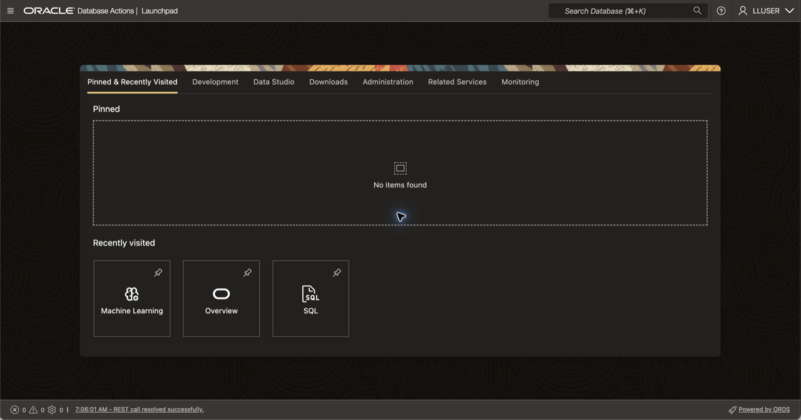
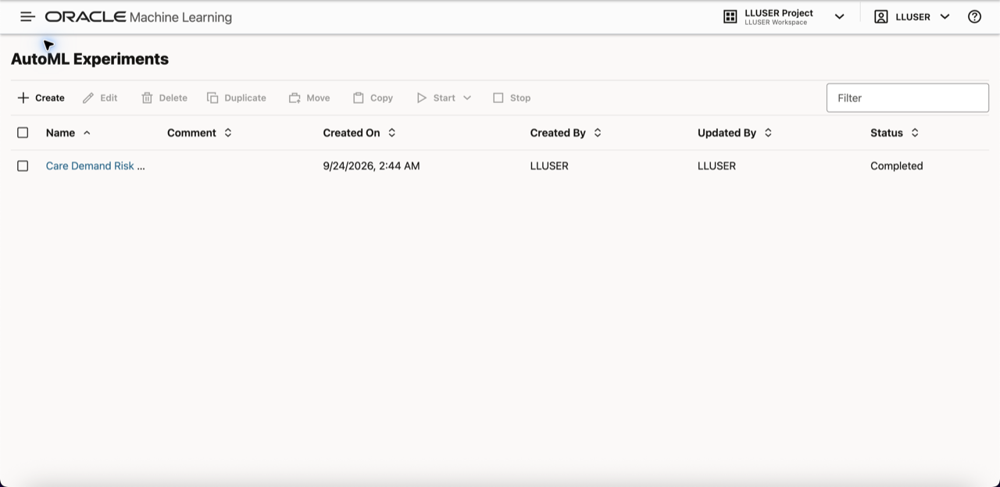
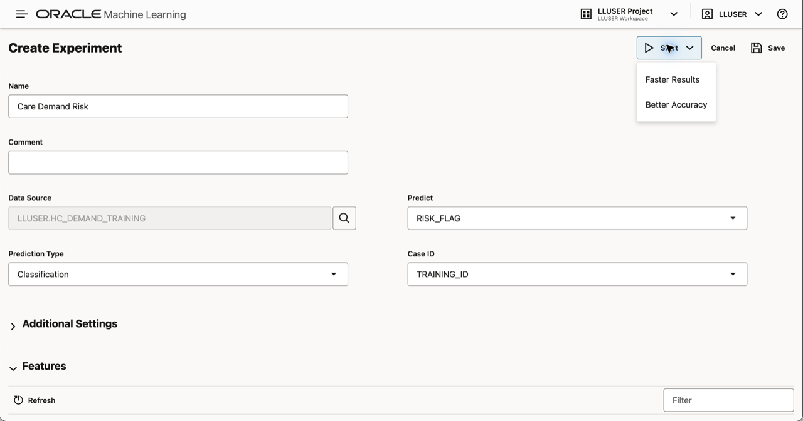
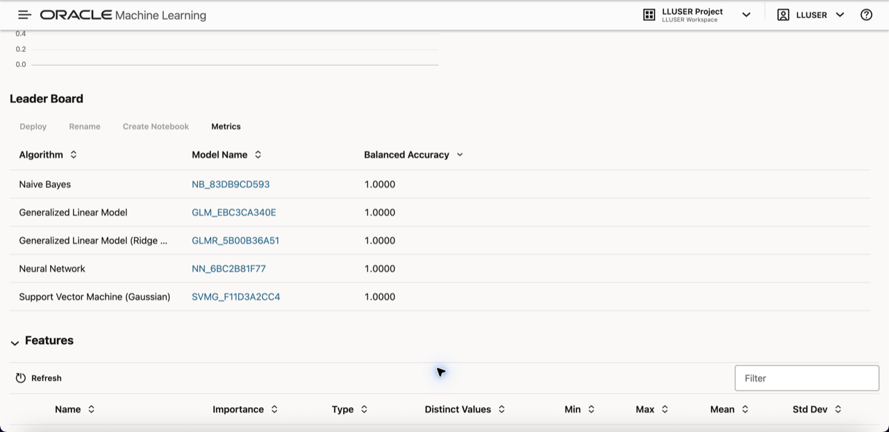
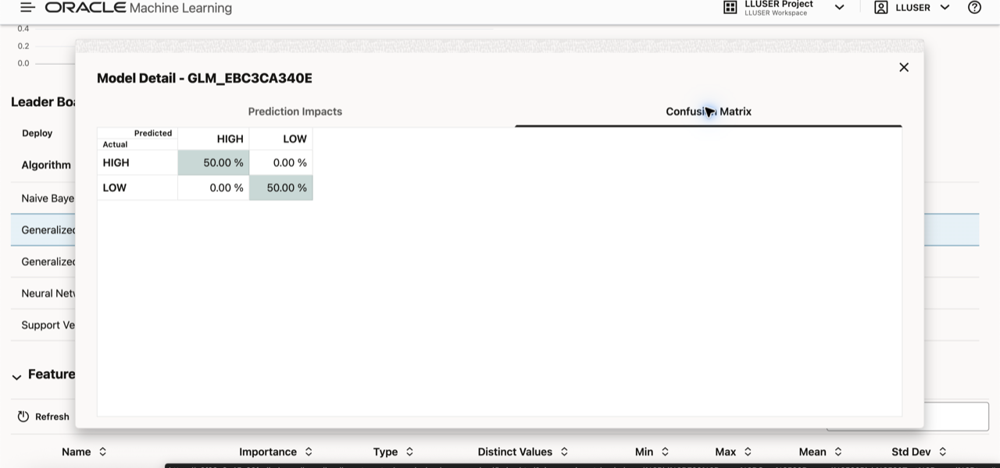
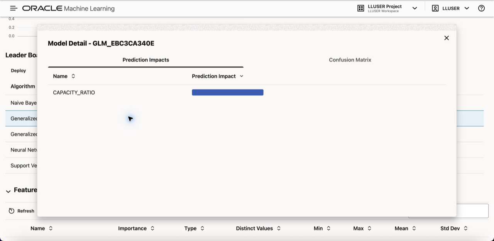
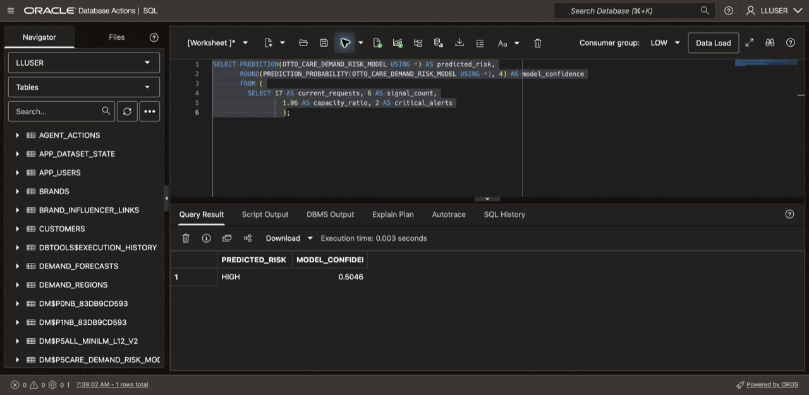

# Build a Care Demand Risk Model with Oracle Machine Learning

## Introduction

Moon Kai has shown care operations which qualified logistics site is closest to a service request. Otto Spencer, Seer Health's data scientist, now looks ahead. If requests, quality signals, and critical alerts keep rising while capacity tightens, where should the network investigate first?

Otto's team supplies predictions used in planning charts and dashboards. The capacity-planning team needs more than a `HIGH` or `LOW` label. It needs to see which operating values shaped the classification, how strongly the model supports the result, and how that result relates to the demand forecast.

Otto could export request, signal, alert, and capacity data to a separate machine learning platform, train a model there, and copy the scores back. That would create another copy of governed healthcare data, another security boundary, and another process for keeping predictions aligned with current operating evidence.

Instead, Otto builds and scores the model in Oracle AI Database. The model uses current requests, connected signals, available capacity, and critical alerts to classify an operating scenario as `HIGH` or `LOW` risk. SQL then places that result beside the stored demand forecast so a planner can review both forms of evidence.

In this lab, you follow Otto from training data through AutoML comparison, model creation, scenario scoring, and careful capacity interpretation.



<details>
<summary><strong>Key terms: model, feature, classification, probability, and in-database machine learning</strong></summary>

> - A **model** is a set of learned rules that turns input data into a prediction.
>
> - A **feature** is an input value used by the model. In this lab, the features are current requests, connected signals, capacity ratio, and critical alerts.
>
> - **Classification** predicts a label. Otto's model predicts either `HIGH` or `LOW` care-demand risk.
>
> - A **probability** is the model's numerical support for a classification. In this lab, it helps Otto see whether a result is strong or close to the model's decision boundary. It does not represent certainty.
>
> - **In-database machine learning** means the model is trained or scored where the source data already lives. The SQL result can include the prediction and the data used to explain it.

</details>


### Objectives

- Inspect the care-demand training data and identify the model target.
- Optionally compare classification models and review their results in AutoML.
- Create and confirm a Generalized Linear Model inside Oracle AI Database.
- Score an operating scenario and interpret it beside the demand forecast.

Estimated Time: **10 minutes**

### Operating Story

| Step | Healthcare focus |
| --- | --- |
| Business Problem | Care operations needs an early, reviewable indication of capacity pressure. |
| Technical Challenge | Otto must train and score a model without exporting governed request, signal, alert, or capacity data. |
| Persona Focus | You follow Otto as he compares models, creates a repeatable baseline, and explains the result to capacity planners. |
| What You Will Prove | Oracle Machine Learning can score care-demand risk in the database and return evidence that planners can inspect. |
| Database Capability | AutoML, `DBMS_DATA_MINING`, `PREDICTION`, and `PREDICTION_PROBABILITY` support machine learning inside Oracle AI Database. |
| Outcome | Capacity planners receive a traceable risk result beside the demand forecast, without treating either result as an automatic decision. |

Persona focus: You review Otto's machine learning workflow and interpret its evidence for the Seer Health capacity-planning team.

> **SQL Worksheet reminder:** Need a reminder on how to open and use the SQL Worksheet? Return to [Getting Started Task 2: Open SQL Worksheet](?lab=getting-started#Task2:OpenSQLWorksheet) for the step-by-step graphic showing where to paste and run SQL statements.

## Task 1: Inspect the care-demand training data

Before Otto creates a model, he checks the data that will teach it. The workshop already provides `HC_DEMAND_TRAINING`, a table with twelve synthetic operating scenarios.

Each row records the current request workload, the number of connected signals, the available-capacity ratio, and the number of critical alerts. `RISK_FLAG` is the known `HIGH` or `LOW` label that the model will learn to predict.

1. Run the training-data query:

    ```sql
    <copy>
    SELECT training_id,
           current_requests,
           signal_count,
           capacity_ratio,
           critical_alerts,
           risk_flag
    FROM hc_demand_training
    ORDER BY training_id;
    </copy>
    ```

2. Identify the parts of each row.

    `CURRENT_REQUESTS`, `SIGNAL_COUNT`, `CAPACITY_RATIO`, and `CRITICAL_ALERTS` are the model inputs. `RISK_FLAG` is the answer the model learns to predict. `TRAINING_ID` identifies the scenario, but it is not an operating condition that should influence the prediction.

    **Expected output: Care-demand training scenarios**

    | Training ID | Current Requests | Signal Count | Capacity Ratio | Critical Alerts | Risk Flag |
    | ---: | ---: | ---: | ---: | ---: | --- |
    | 1 | 8 | 2 | 1.40 | 0 | LOW |
    | 2 | 11 | 3 | 1.25 | 0 | LOW |
    | 3 | 14 | 5 | 1.10 | 1 | LOW |
    | 4 | 17 | 6 | 0.98 | 1 | HIGH |
    | 5 | 21 | 8 | 0.90 | 2 | HIGH |
    | 6 | 24 | 9 | 0.82 | 3 | HIGH |
    | 7 | 7 | 1 | 1.55 | 0 | LOW |
    | 8 | 13 | 4 | 1.18 | 0 | LOW |
    | 9 | 19 | 7 | 0.94 | 2 | HIGH |
    | 10 | 28 | 12 | 0.72 | 4 | HIGH |
    | 11 | 10 | 2 | 1.32 | 0 | LOW |
    | 12 | 23 | 10 | 0.79 | 3 | HIGH |

    

    Compare the `LOW` and `HIGH` rows. Higher workloads, more signals and critical alerts, and smaller capacity cushions give Otto a starting point for understanding the examples presented to the model.

    Otto is checking that the training data already brings together the values he needs. He does not have to export request, signal, and capacity data into separate files before training. These twelve synthetic rows teach the workflow; they do not establish production model accuracy.

## Task 2: Compare care-demand models with AutoML (optional)

Otto first uses the Oracle Machine Learning AutoML interface to compare candidate models. AutoML can select algorithms, tune them, and show how well each model identifies the two labels.

This shows how a data scientist chooses a model: the leaderboard is a starting point, but Otto also checks whether a model identifies both `HIGH` and `LOW`. A model that misses the risk class the capacity-planning team needs to review is not useful simply because it has a strong overall score.

This task is optional. AutoML can take several minutes to complete, so you can continue with Task 3 if you want to focus on creating and using the model in SQL Developer Web.

1. Open **Machine Learning** from Database Actions.

    Open **Database Actions**, select **Machine Learning**. Use the username and password you can find on the **View Login Info screen**.
    
    
    
2. Click **AutoML**.

     

3. Create a new experiment with these settings:
  
    | Setting         | Value                    |
    | ----------------| ------------------------ |
    | Experiment name | `Care Demand Risk Test`  |
    | Data source     | `HC_DEMAND_TRAINING`     |
    | Predict         | `RISK_FLAG`              |
    | Prediction type | `Classification`         |
    | Case ID         | `TRAINING_ID`            |
  
    Start the experiment and wait for the model leaderboard (this can take between 5-10 minutes).

    

4. Review the leaderboard and model details.

    
  
    The leaderboard may rank several algorithms differently. Otto does not choose from one score alone. Open the model details and inspect the confusion matrix. Check whether each model identifies both `HIGH` and `LOW`, and note which errors could cause the capacity-planning team to overlook pressure or review a scenario unnecessarily.

    AutoML results can vary with the database version and experiment settings. The twelve-row workshop dataset is intentionally small, so treat the comparison as a demonstration of the selection process rather than a production evaluation.

    For the repeatable SQL exercise in Task 3, Otto uses the Generalized Linear Model configured for this workshop. If your leaderboard ranks another algorithm first, continue with the workshop model so that your SQL results match the tested example.

    Here is an example of the confusion matrix for the Generalized Linear Model:

    

    The model details also show prediction impact. In the captured Generalized Linear Model run, AutoML retained `CAPACITY_RATIO` as the displayed predictor. Review the values shown in your experiment because AutoML results can vary. Prediction impact gives Otto a starting point for explaining the result to the capacity-planning team, but it does not prove that one condition caused demand pressure.

    Here is the captured example:

    

    This is Otto's decision: **use the Generalized Linear Model as the workshop's repeatable baseline, then examine its result before it reaches a planner**. The model supports review; it does not make a staffing, supply, logistics, or clinical decision.

## Task 3: Create the care-demand risk model in SQL Developer Web

AutoML helped Otto compare models. He now moves to SQL Developer Web to create a named model that a SQL query can call repeatedly. The model is stored in Oracle AI Database under the name `OTTO_CARE_DEMAND_RISK_MODEL`.

The `HC_MODEL_SETTINGS` table tells Oracle to use the **Generalized Linear Model** and automatic data preparation. `HC_DEMAND_TRAINING` supplies the training rows, `TRAINING_ID` identifies each case, and `RISK_FLAG` is the target.

If you skipped the optional AutoML task, continue with this tested workshop configuration.

1. Create the learner model from the training data:

    ```sql
    <copy>
    DECLARE
      l_model_count NUMBER;
    BEGIN
      SELECT COUNT(*)
      INTO l_model_count
      FROM user_mining_models
      WHERE model_name = 'OTTO_CARE_DEMAND_RISK_MODEL';

      IF l_model_count > 0 THEN
        DBMS_DATA_MINING.DROP_MODEL('OTTO_CARE_DEMAND_RISK_MODEL');
      END IF;
    END;
    /

    BEGIN
      DBMS_DATA_MINING.CREATE_MODEL(
        model_name           => 'OTTO_CARE_DEMAND_RISK_MODEL',
        mining_function      => DBMS_DATA_MINING.CLASSIFICATION,
        data_table_name      => 'HC_DEMAND_TRAINING',
        case_id_column_name  => 'TRAINING_ID',
        target_column_name   => 'RISK_FLAG',
        settings_table_name  => 'HC_MODEL_SETTINGS'
      );
    END;
    /
    </copy>
    ```

    The first PL/SQL block drops Otto's learner model when it already exists, which makes the exercise safe to rerun. The second block trains the model from `HC_DEMAND_TRAINING` and stores it in Oracle AI Database. No request, signal, or capacity data leaves the database during training.

2. Confirm that Oracle created the model:

    ```sql
    <copy>
    SELECT model_name,
           mining_function,
           algorithm
    FROM user_mining_models
    WHERE model_name = 'OTTO_CARE_DEMAND_RISK_MODEL';
    </copy>
    ```

    **Expected output: Otto's care-demand model**

    | Model Name | Mining Function | Algorithm |
    | --- | --- | --- |
    | OTTO\_CARE\_DEMAND\_RISK\_MODEL | CLASSIFICATION | GENERALIZED\_LINEAR\_MODEL |

    Otto has confirmed both the mining function and algorithm. He now has a database model that SQL can call repeatedly.

## Task 4: Score an operating scenario and review the demand forecast

Otto now receives an operating scenario for the next planning period. The model was trained with the synthetic examples in `HC_DEMAND_TRAINING`; it will now score a new combination of request, signal, capacity, and alert values.

1. Score the new operating scenario:

    ```sql
    <copy>
    SELECT PREDICTION(
             OTTO_CARE_DEMAND_RISK_MODEL
             USING *
           ) AS predicted_risk,
           ROUND(
             PREDICTION_PROBABILITY(
               OTTO_CARE_DEMAND_RISK_MODEL
               USING *
             ),
             4
           ) AS model_confidence
    FROM (
      SELECT 17   AS current_requests,
             6    AS signal_count,
             1.06 AS capacity_ratio,
             2    AS critical_alerts
    );
    </copy>
    ```

    The scenario contains 17 current requests, six connected signals, a capacity ratio of `1.06`, and two critical alerts. A capacity ratio of `1.00` means capacity and expected demand are equal, so `1.06` represents a small six-percent cushion.

    **Expected output: Operating-scenario risk**

    | Predicted Risk | Model Confidence |
    | --- | ---: |
    | HIGH | 0.5046 |

2. Interpret the prediction.

    The model returns `HIGH`, but its confidence is only slightly above `0.50`. The scenario sits near the model's decision boundary, so Otto presents it as a reason to investigate, not as a certain shortage or an automatic capacity decision.

    A planner can review current staffing, supplies, schedules, logistics capacity, and recent operating changes before deciding what action, if any, is appropriate.

3. Review the demand forecast:

    ```sql
    <copy>
    SELECT service_name,
           region,
           predicted_demand,
           demand_risk_factor
    FROM care_demand_forecasts_v
    ORDER BY predicted_demand DESC,
             service_name,
             region
    FETCH FIRST 5 ROWS ONLY;
    </copy>
    ```

    `CARE_DEMAND_FORECASTS_V` contains the planning forecast. The query puts the services and regions with the largest predicted demand first.

    **Expected output: Highest demand forecasts**

    | Service | Region | Predicted Demand | Risk Factor |
    | --- | --- | ---: | ---: |
    | mRNA LNP Clinical Batch | Northeast Corridor | 2578 | 2.06 |
    | mRNA LNP Clinical Batch | New York Metro | 2310 | 1.94 |
    | mRNA LNP Clinical Batch | Los Angeles Basin | 2140 | 1.82 |
    | mRNA LNP Clinical Batch | Bay Area (SF) | 1980 | 1.74 |
    | Bed Capacity Surge Playbook | New York Metro | 1810 | 1.68 |

4. Read the evidence as a capacity planner.

    Otto now has two complementary results. The classification model describes the risk in one operating scenario. The forecast view shows which services and regions have the highest stored demand forecasts. The forecast rows were not produced by `OTTO_CARE_DEMAND_RISK_MODEL`, so Otto does not present them as one combined model result.

    This is the value of in-database machine learning. Otto can train and score a model where the governed operating data already lives, then review its output beside related planning evidence. The capacity-planning team receives a traceable reason to investigate without treating the model as an automatic decision.

    

## Conclusion: Put the Prediction Beside the Planning Evidence

Otto used AutoML to compare classification models, selected the Generalized Linear Model as the workshop's repeatable baseline, recreated it in SQL Developer Web, and scored a new operating scenario. He then reviewed that classification beside the stored demand forecast without claiming that the two results came from the same model.

This is the business benefit of in-database machine learning. The training data, model, prediction, and related planning evidence stay in Oracle AI Database. Otto does not have to copy governed healthcare data to a separate machine learning platform or reconcile scores from one system with current operating data from another.

The capacity-planning team receives a traceable reason to investigate. It can inspect the inputs, model confidence, and forecast context before deciding whether staffing, supplies, schedules, or logistics capacity need further review.

## Acknowledgements

* **Author** - Linda Foinding, Principal Product Manager, Oracle Database Product Management
* **Last Updated By/Date** - Oracle Database Product Management, September 2026
