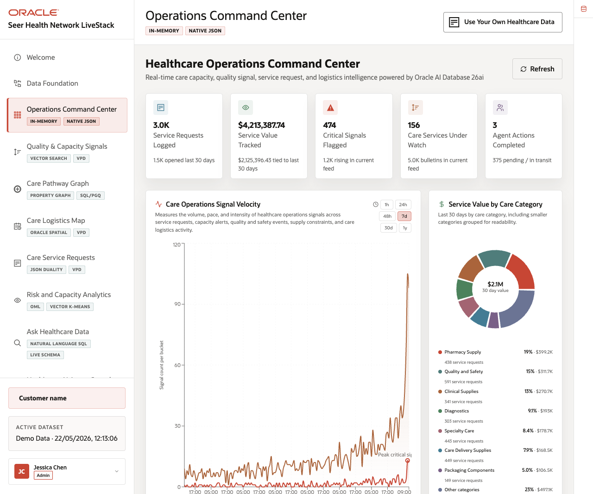

# Build a Converged Care Operations Dashboard Query

## Introduction

Jessica Chen is the database administrator responsible for keeping Seer Health Network's operational data reliable, governed, and useful. Each morning, the care operations team asks a practical question: **which care services need attention first, and what evidence should guide the response?**

The answer crosses several forms of data. Quality and capacity signals are relational records. Active service requests are available as JSON documents. Stored vector embeddings describe care services by meaning. Care sites and logistics locations are represented with spatial coordinates. The data is connected by the operational decision, but that does not automatically make the investigation easy to query.

In the past, Jessica might have had to maintain reporting extracts, coordinate a separate search index, ask an application team for service-request data, and reconcile information from a separate logistics or mapping system. That creates more copies of sensitive healthcare data, more security boundaries, and more opportunities for the dashboard result and the operational detail to disagree. Her challenge is not simply finding another database feature. It is giving the care operations team one answer they can trace back to the same governed data.

Jessica sees an opportunity in Oracle AI Database's converged architecture. A converged database lets one governed database support different data models and workloads together. Relational tables and views remain the foundation, while JSON documents, vectors, and spatial geometry can be queried alongside them. Across the broader workshop, the same foundation also supports property graphs, machine learning, Select AI, and governed agent actions. This means Jessica can answer questions that cross these capabilities without complex and expensive integration across separate systems.

In this lab, you take Jessica's role as the DBA and build the converged SQL query behind the Care Operations Dashboard. Relational SQL identifies care services with critical or high-priority signals. AI Vector Search ranks those services against the investigation question. JSON Relational Duality exposes active request activity without duplicating the relational data. Oracle Spatial adds a logistics-routing reference by calculating the distance between the Miami Oncology Care Center and the active Hialeah site supporting the qPCR Respiratory Panel.


### Objectives

- Explain what Oracle AI Database convergence means in a healthcare operations workflow.
- Run one query that combines relational, vector, JSON, and spatial database capabilities.
- Change the semantic investigation question and explain how the ranked services change.

Estimated Time: **10 minutes**

### Hands-on Scenario

| Step | Healthcare focus |
| --- | --- |
| Business Problem | Care operations teams need to identify services under pressure and review the supporting operational evidence. |
| Technical Challenge | The answer crosses quality and capacity signals, service meaning, JSON request activity, and logistics geography. |
| Persona Focus | Jessica Chen, the DBA, builds the governed query behind the Care Operations Dashboard. |
| What You Will Do | Run one SQL statement that combines four database data models, then change the investigation question. |
| Database Capability | Relational SQL, AI Vector Search, JSON Relational Duality, and Oracle Spatial work together. |
| Outcome | The learner can explain how a converged database produces one traceable healthcare operations result without separate data copies. |

Persona focus: You are Jessica Chen, the DBA. Your job is to give care operations teams one governed view of service pressure, request activity, semantic relevance, and logistics context.

> **SQL Worksheet reminder:** Need a reminder on how to open and use the SQL Worksheet? Return to [Getting Started Task 2: Open SQL Worksheet](?lab=getting-started#Task2:OpenSQLWorksheet) for the step-by-step guide showing how to run SQL statements.

## Task 1: Run a converged care operations investigation

The dashboard is a starting point for the decision, not the decision itself. Run the query below to produce a compact investigation view for care services with critical or high-priority operational signals.

The query intentionally crosses four data models:

- **Relational:** `QUALITY_CAPACITY_SIGNALS_V` and `CARE_SERVICES_V` identify services with critical or high-priority signals.
- **Vector:** Stored service embeddings and `VECTOR_DISTANCE` rank care services by their meaning relative to the investigation phrase.
- **JSON:** `CARE_SERVICE_REQUESTS_DV` is read as a document, and `JSON_TABLE` projects nested line items into rows so active request activity can be counted.
- **Spatial:** `SDO_GEOM.SDO_DISTANCE` finds the nearest active logistics site that supports the qPCR Respiratory Panel from the Miami Oncology Care Center.

    These are four operations in one investigation. Every row combines care-service pressure with request activity, semantic relevance, and logistics-routing context.

1. Open SQL Worksheet as `LLUSER`. 

2. Run the query (note the comments that help to locate the specific use of different data types):

    ```sql
    <copy>
    -- RELATIONAL DATA: aggregate critical and high-priority operational
    -- signals for each governed care service.
    WITH service_pressure AS (
        SELECT cs.service_id,
               cs.service_name,
               cs.provider_network,
               cs.category,
               COUNT(DISTINCT qs.signal_id) AS high_priority_signals,
               SUM(CASE WHEN qs.criticality = 'CRITICAL' THEN 1 ELSE 0 END)
                   AS critical_signals,
               SUM(CASE WHEN qs.criticality = 'HIGH' THEN 1 ELSE 0 END)
                   AS high_signals,
               MAX(qs.posted_at) AS latest_signal_date
        FROM quality_capacity_signals_v qs
        JOIN care_services_v cs
          ON cs.service_id = qs.service_id
        WHERE qs.criticality IN ('CRITICAL', 'HIGH')
        GROUP BY cs.service_id,
                 cs.service_name,
                 cs.provider_network,
                 cs.category
    ),
    -- VECTOR DATA: embed the investigation question once and compare it
    -- with the stored service embeddings.
    query_vector AS (
        SELECT VECTOR_EMBEDDING(
                   ADMIN.ALL_MINILM_L12_V2
                   USING
                       'care services facing quality or capacity pressure requiring operational review'
                       AS DATA
               ) AS embedding
        FROM dual
    ),
    semantic_match AS (
        SELECT cs.service_id,
               ROUND(
                   1 - VECTOR_DISTANCE(
                       cs.service_embedding,
                       q.embedding,
                       COSINE
                   ),
                   4
               ) AS semantic_similarity
        FROM care_services_v cs
        CROSS JOIN query_vector q
    ),
    -- JSON DATA: project nested request line items from the duality view
    -- into rows and aggregate active request activity by care service.
    request_activity AS (
        SELECT jt.service_id,
               COUNT(DISTINCT jt.request_id) AS active_service_requests,
               SUM(jt.quantity) AS requested_units
        FROM care_service_requests_dv csr
        CROSS APPLY JSON_TABLE(
            csr.data,
            '$'
            COLUMNS (
                request_id NUMBER PATH '$._id',
                request_status VARCHAR2(30) PATH '$.requestStatus',
                NESTED PATH '$.lineItems[*]'
                COLUMNS (
                    service_id NUMBER PATH '$.serviceSupplyId',
                    quantity NUMBER PATH '$.quantity'
                )
            )
        ) jt
        WHERE jt.request_status IN ('PENDING', 'CONFIRMED', 'PROCESSING')
        GROUP BY jt.service_id
    ),
    -- SPATIAL DATA: find the nearest active logistics site that supports
    -- the qPCR Respiratory Panel from the Miami Oncology Care Center.
    nearest_logistics_site AS (
        SELECT cs.care_site_name,
               cs.city AS care_site_city,
               ls.logistics_site_id,
               ls.logistics_name,
               ls.city AS logistics_city,
               ls.state_code AS logistics_state,
               ls.service_supported,
               ls.capacity_units,
               ls.pending_requests,
               ls.active_alerts,
               ls.current_load_pct,
               ROUND(
                   MDSYS.SDO_GEOM.SDO_DISTANCE(
                       cs.location,
                       ls.location,
                       0.005,
                       'unit=MILE'
                   ),
                   2
               ) AS distance_miles
        FROM hc_care_sites cs
        CROSS JOIN care_logistics_sites_v ls
        WHERE cs.care_site_id = 1001
          AND ls.site_status = 'ACTIVE'
          AND ls.service_supported = 'qPCR Respiratory Panel'
        ORDER BY MDSYS.SDO_GEOM.SDO_DISTANCE(
                     cs.location,
                     ls.location,
                     0.005,
                     'unit=MILE'
                 ),
                 ls.logistics_site_id
        FETCH FIRST 1 ROW ONLY
    )
    -- CONVERGED RESULT: join the relational, vector, JSON, and spatial
    -- operations into one care-operations investigation result.
    SELECT sp.service_name,
           sp.provider_network,
           sp.category,
           sp.high_priority_signals,
           sp.critical_signals,
           sp.high_signals,
           TO_CHAR(sp.latest_signal_date, 'YYYY-MM-DD') AS latest_signal_date,
           sm.semantic_similarity,
           NVL(ra.active_service_requests, 0) AS active_service_requests,
           NVL(ra.requested_units, 0) AS requested_units,
           nls.logistics_name AS nearest_logistics_site,
           nls.logistics_city || ', ' || nls.logistics_state
               AS logistics_site_location,
           nls.service_supported,
           nls.capacity_units,
           nls.pending_requests,
           nls.active_alerts,
           nls.current_load_pct,
           nls.distance_miles
    FROM service_pressure sp
    LEFT JOIN semantic_match sm
      ON sm.service_id = sp.service_id
    LEFT JOIN request_activity ra
      ON ra.service_id = sp.service_id
    CROSS JOIN nearest_logistics_site nls
    -- Put services closest to the investigation question first.
    -- High-priority signal count breaks ties.
    ORDER BY sm.semantic_similarity DESC NULLS LAST,
             sp.high_priority_signals DESC
    FETCH FIRST 10 ROWS ONLY;
    </copy>
    ```

    **Expected output: Converged care operations result**

    The query returns up to ten care services ranked by semantic similarity. The validated result begins with the following care-service and logistics evidence:

    | Care service | High-priority signals | Active requests | Nearest logistics site | Distance |
    | --- | ---: | ---: | --- | ---: |
    | Bed Capacity Surge Playbook | 4 | 1 | Hialeah Import Compliance Site | 8.51 miles |

3. Review the result as the care-service data behind Jessica's dashboard. Each row combines operational signals, semantic relevance, request activity, and logistics context. This gives the dashboard a ranked service table and the details an operations user needs when deciding what to review.

    

    Your numbers may be different if the demo data has changed. Each row should include all four types of data.

    If you return to this query after Lab 2, the active-request values can reflect request `990001`. This demonstrates that both labs use the same governed healthcare data.

Use the first row to understand the business takeaway: the signal and request values show why the care service needs attention, the semantic match explains why it fits the question, and the logistics location shows where operational follow-up could begin. Jessica now has the query behind the dashboard's ranked service table and detail view, combining relational signals, vector search, JSON request data, and spatial distance in one result that an operations user can inspect.

With separate systems, Jessica would need complex and expensive integration across a quality system, search service, document store, and mapping system before the dashboard could show this view. Oracle AI Database keeps these data types together, so she can build the dashboard with SQL. KPI cards and other dashboard components can use additional SQL over the same database.

## Task 2: Change the investigation question

Jessica meets with a care operations analyst to review the results at the data level before she builds the dashboard. They start with services related to **care services facing quality or capacity pressure requiring operational review**. Change the embedded investigation phrase to:


```text
diagnostic service demand and regional logistics capacity
```

Run the query again and compare the top rows.

1. Which care services moved into or out of the top ten?
2. Which services still have several high-priority signals but a lower semantic similarity to the new question?
3. Does the active request activity make you more or less concerned about the operational impact?

The result is ordered by semantic similarity first, so changing the question changes the review queue. High-priority signal count breaks ties. The same governed query can answer a different business question without rebuilding a search index or moving the care-service data.


## Next Steps

Next, use JSON Relational Duality to expose the same care service request data as JSON for an application while keeping SQL access for the database team.

## Acknowledgements

* **Author** - Linda Foinding, Principal Product Manager, Oracle Database Product Management
* **Last Updated By/Date** - Oracle Database Product Management, September 2026
