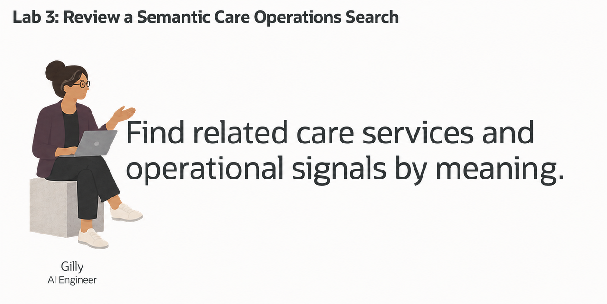
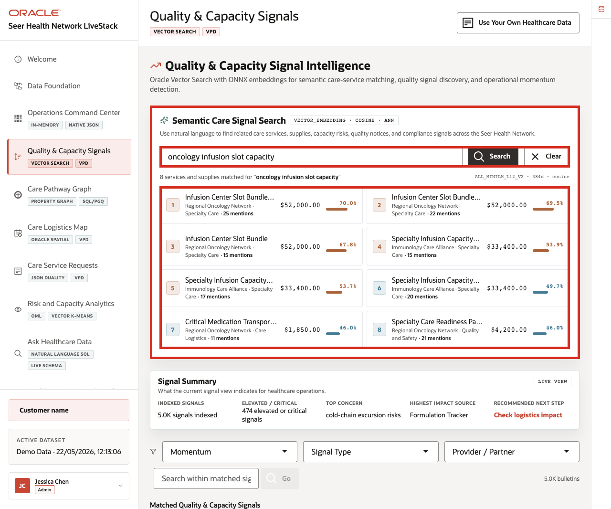

# Review a Semantic Care Operations Search

## Introduction

Gilly Bourne is an AI engineer at Seer Health Network. Her team has built a semantic search feature for the care operations application. A user can enter a question such as **which care services and operational signals relate to more appointment room for cancer treatments?** The application should find the relevant services first, then show the quality and capacity signals that may deserve review.

Gilly already has care-service descriptions, operational signals, and their vectors in Oracle AI Database. Her design problem is connecting a plain-language question to those existing rows. Care teams may ask for "more appointment room," while the stored descriptions refer to "chair availability," "oncology capacity," or "expanded treatment schedules." A useful result must show more than a similarity score. It must retain the signal's criticality, source, network impact, and next step so the operations team can decide what to review.

Gilly could export the healthcare text and embeddings to a separate vector service. That would add another copy of sensitive healthcare language, another index to refresh, and another set of access rules to manage. It would also create another place where search results could drift from the governed service and signal records. Gilly wants the search to run where the underlying rows already live, so one SQL statement can compare meaning and return the operational context beside each match.

In this lab, you review Gilly's implementation from the in-database embedding model to the final signal list. You inspect the stored vectors, rank care services by cosine distance and similarity, and find related quality and capacity signals. You see why Oracle AI Database fits the job: vector search and operational SQL work with the same governed healthcare data.





*Figure 1: The care operations application ranks services and signals by meaning.*

<details>
<summary><strong>Key terms: embedding, vector, vector distance, similarity, and semantic search</strong></summary>

> - An **embedding** is a numerical profile of what text means. In this lab, service descriptions and signal text are embedded so related healthcare ideas sit near each other mathematically, even when the wording is different.
>
> - An **ONNX embedding model** is a portable machine-learning model saved in the Open Neural Network Exchange (ONNX) format. It turns text into a vector of numbers that captures meaning. Oracle AI Database can load and run this model inside the database, close to the healthcare rows.
>
> - A **vector** is the stored numerical form of an embedding. Oracle Database stores each vector beside the service or signal it describes, so the search stays connected to service names, criticality, network impact, and other operational columns.
>
> - **Vector distance** measures how close two vectors are. A smaller cosine distance means the meanings are more similar; a larger distance means they are farther apart.
>
> - **Similarity** is calculated in this lab as `1 - cosine distance`. A higher value means a closer semantic match. It ranks evidence for review, but it does not prove urgency, correctness, or a clinical outcome.
>
> - **Semantic search** means searching by meaning instead of exact words. A search for "more appointment room for cancer treatments" can find infusion-capacity services even when their names and descriptions use different wording.

</details>

Gilly has already built the semantic search for the care operations application. In this lab, you review how it connects an ordinary-language capacity question to ranked care services and related operational signals. The final result keeps the criticality, source, network impact, and next step beside each semantic match.

### Objectives

- Check the embedding model used for semantic search.
- Review the stored healthcare vectors.
- Rank care services by meaning.
- Find related quality and capacity signals.
- Explain why vector search stays beside governed healthcare data.

Estimated Time: **10 minutes**

### Hands-on Scenario

| Step | Healthcare focus |
| --- | --- |
| Business Problem | Care teams may use different words for the same quality or capacity need. |
| Technical Challenge | Gilly must search by meaning while keeping vectors connected to governed service and signal records. |
| Persona Focus | You review Gilly's implementation while Jessica evaluates the operational evidence. |
| What You Will See | Vector search ranks care services, then returns related signals with decision context. |
| Database Capability | `VECTOR_EMBEDDING`, native vector columns, vector metadata functions, and `VECTOR_DISTANCE` run inside Oracle AI Database. |
| Outcome | Care operations teams can find relevant services and signals without a separate vector database or copied healthcare text. |

Persona focus: You are reviewing the semantic healthcare search Gilly built for care operations.


> **SQL Worksheet reminder:** Need a reminder on how to open and use the SQL Worksheet? Return to [Getting Started Task 2: Open SQL Worksheet](?lab=getting-started#Task2:OpenSQLWorksheet) for the step-by-step guide showing how to run SQL statements.


## Task 1: Check the embedding model

Start with Gilly's first design question: **what does similarity search need?** It needs vectors for the text being searched and an embedding model that converts a question into a vector.

Jessica has made the `ALL_MINILM_L12_V2` ONNX model available in Oracle AI Database. The database can run the model where the healthcare data already lives, so the application does not have to send sensitive text to a separate embedding service and bring the vector back.

1. Run the following query to see which embedding models are available:

    ```sql
    <copy>
    SELECT owner,
           model_name,
           algorithm,
           mining_function
    FROM all_mining_models
    WHERE mining_function = 'EMBEDDING'
    ORDER BY owner, model_name;
    </copy>
    ```

    **Expected output: Available embedding model**

    | Owner | Model | Algorithm | Function |
    | --- | --- | --- | --- |
    | ADMIN | ALL_MINILM_L12_V2 | ONNX | EMBEDDING |

    Additional embedding models may appear if the database contains models for other workloads. This lab uses `ADMIN.ALL_MINILM_L12_V2`.

    The result should include an embedding model owned by `ADMIN`, such as `ALL_MINILM_L12_V2`. This compact model turns text into 384-number vectors. The `EMBEDDING` value confirms that the model can turn text into vectors for similarity search.

2. Review what this means for Gilly's application.

    Gilly can call the model from SQL with `VECTOR_EMBEDDING(...)`. Jessica manages the model inside the database, while Gilly uses it in the search query. The healthcare text, vectors, and access controls stay in the same database.

    > **Note:** The embedding model runs inside the database, so Gilly does not need a separate service or a data pipeline to move healthcare text between systems.

## Task 2: Review the stored healthcare vectors

The care-service descriptions and quality-signal text already have stored vectors. Gilly first reviews the source text, then confirms which columns hold the vectors and whether the search covers every row.

1. Review the service descriptions used for the stored embeddings:

    ```sql
    <copy>
    SELECT service_id,
           service_name,
           category,
           provider_network,
           description AS embedding_text
    FROM care_services_v
    ORDER BY service_id
    FETCH FIRST 5 ROWS ONLY;
    </copy>
    ```

    **Expected output: Service descriptions**

    | Service ID | Service | Category | Provider network | Embedding text |
    | ---: | --- | --- | --- | --- |
    | 1 | Infusion Center Slot Bundle - Continuity Lot 2 | Specialty Care | Regional Oncology Network | Oncology infusion center slot capacity with continuity scheduling and staffing coverage. |
    | 2 | Infusion Center Slot Bundle - Continuity Lot 3 | Specialty Care | Regional Oncology Network | Oncology infusion capacity package for expanded treatment schedules and chair availability. |
    | 3 | Infusion Center Slot Bundle | Specialty Care | Regional Oncology Network | Standard infusion center scheduling capacity for oncology service lines. |
    | 4 | qPCR Respiratory Panel | Diagnostics | BioPure Diagnostics | Rapid respiratory diagnostics panel used by care sites during seasonal demand peaks. |
    | 5 | mRNA LNP Clinical Batch | Specialty Care | NorthStar Health System | Clinical batch requiring cold-chain capacity, quality monitoring, and coordinated delivery. |

    The `DESCRIPTION` value captures what each service provides. That text gives the model useful meaning without adding prices, dates, or identifiers that do not describe the service.

2. Confirm the existing vector columns:

    ```sql
    <copy>
    SELECT table_name,
           column_name,
           data_type
    FROM user_tab_columns
    WHERE (table_name = 'HC_CARE_SERVICES'
           AND column_name = 'SERVICE_EMBEDDING')
       OR (table_name = 'HC_QUALITY_SIGNALS'
           AND column_name = 'SIGNAL_EMBEDDING')
    ORDER BY table_name, column_name;
    </copy>
    ```

    **Expected output: Vector columns**

    | Table | Column | Data type |
    | --- | --- | --- |
    | HC_CARE_SERVICES | SERVICE_EMBEDDING | VECTOR |
    | HC_QUALITY_SIGNALS | SIGNAL_EMBEDDING | VECTOR |

    The vectors stay in the same base tables as the service and signal records. The learner-facing views expose those vectors together with their operational columns.

3. Review vector coverage across the two search sources:

    ```sql
    <copy>
    SELECT 'CARE SERVICES' AS vector_source,
           COUNT(*) AS total_rows,
           SUM(CASE WHEN service_embedding IS NOT NULL THEN 1 ELSE 0 END) AS embedded_rows
    FROM care_services_v
    UNION ALL
    SELECT 'QUALITY SIGNALS',
           COUNT(*),
           SUM(CASE WHEN signal_embedding IS NOT NULL THEN 1 ELSE 0 END)
    FROM quality_capacity_signals_v;
    </copy>
    ```

    **Expected output: Vector coverage**

    | Vector source | Total rows | Embedded rows |
    | --- | ---: | ---: |
    | CARE SERVICES | 187 | 187 |
    | QUALITY SIGNALS | 5000 | 5000 |

    Every service and signal can participate in the semantic search. This establishes the search scope without creating or updating any data.

4. Inspect the service-vector dimensions and storage format:

    ```sql
    <copy>
    SELECT service_id,
           service_name,
           VECTOR_DIMENSION_COUNT(service_embedding) AS dimensions,
           VECTOR_DIMENSION_FORMAT(service_embedding) AS vector_format
    FROM care_services_v
    ORDER BY service_id
    FETCH FIRST 3 ROWS ONLY;
    </copy>
    ```

    **Expected output: Vector characteristics**

    | Service ID | Service | Dimensions | Format |
    | ---: | --- | ---: | --- |
    | 1 | Infusion Center Slot Bundle - Continuity Lot 2 | 384 | FLOAT32 |
    | 2 | Infusion Center Slot Bundle - Continuity Lot 3 | 384 | FLOAT32 |
    | 3 | Infusion Center Slot Bundle | 384 | FLOAT32 |

    `ALL_MINILM_L12_V2` produces 384-dimensional vectors. `FLOAT32` provides the numeric format used for each dimension.

    > **Note:** Chunking is not needed here. Each row contains one short service description or operational signal. Chunking becomes useful for long documents, where separate sections may answer different questions.

## Task 3: Search care services by meaning

Gilly tests the service vectors with the phrase `more appointment room for cancer treatments`. The phrase intentionally avoids the word `infusion`, so the ranking demonstrates meaning-based matching instead of an exact keyword match.

1. Run the following query:

    The SQL creates an embedding for the question, compares it with `SERVICE_EMBEDDING`, and returns the cosine distance. A smaller distance means the two vectors are closer in meaning, so the query orders the smallest value first.

    <details>
    <summary><strong>Why this matters to Gilly</strong></summary>

    > Gilly could export the descriptions to an external embedding pipeline or search service. That would create another copy of healthcare text and make it harder to show which governed records the application searched.
    >
    > Oracle AI Vector Search keeps the service data, vectors, SQL query, and distance calculation together. Gilly can inspect the result and use it in the application without adding another data store.

    </details>

    ```sql
    <copy>
    WITH query_vector AS (
      SELECT VECTOR_EMBEDDING(
               ADMIN.ALL_MINILM_L12_V2
               USING 'more appointment room for cancer treatments' AS DATA
             ) AS embedding
    )
    SELECT s.service_name,
           s.category,
           s.provider_network,
           ROUND(
             VECTOR_DISTANCE(
               s.service_embedding,
               q.embedding,
               COSINE
             ),
             4
           ) AS vector_distance
    FROM care_services_v s
    CROSS JOIN query_vector q
    ORDER BY vector_distance
    FETCH FIRST 5 ROWS ONLY;
    </copy>
    ```

    **Expected output: Care services ranked by distance**

    | Service | Category | Provider network | Distance |
    | --- | --- | --- | ---: |
    | Infusion Center Slot Bundle - Continuity Lot 3 | Specialty Care | Regional Oncology Network | 0.3967 |
    | Infusion Center Slot Bundle - Continuity Lot 2 | Specialty Care | Regional Oncology Network | 0.4659 |
    | Infusion Center Slot Bundle | Specialty Care | Regional Oncology Network | 0.5193 |
    | Bed Capacity Surge Playbook | Care Operations | CarePath Clinics | 0.5804 |
    | Digital Pathology Slide Batch | Diagnostics | Community Health Partners | 0.6217 |

2. Review the ranked services.

    The three infusion services rank first even though the question does not contain the word `infusion`. The closest result describes expanded treatment schedules and chair availability, which closely matches the idea of more appointment room.

3. Show the result as a similarity score:

    Vector distance is useful for checking the search, but business users may not know what a cosine distance means. Gilly changes the display to a similarity score. She subtracts the distance from `1`, so a higher score means a closer match, and rounds the result to four decimal places.

    ```sql
    <copy>
    WITH query_vector AS (
      SELECT VECTOR_EMBEDDING(
               ADMIN.ALL_MINILM_L12_V2
               USING 'more appointment room for cancer treatments' AS DATA
             ) AS embedding
    )
    SELECT s.service_name,
           s.category,
           s.provider_network,
           ROUND(
             1 - VECTOR_DISTANCE(
                   s.service_embedding,
                   q.embedding,
                   COSINE
                 ),
             4
           ) AS similarity
    FROM care_services_v s
    CROSS JOIN query_vector q
    ORDER BY similarity DESC
    FETCH FIRST 5 ROWS ONLY;
    </copy>
    ```

    **Expected output: Care services ranked by similarity**

    | Service | Category | Provider network | Similarity |
    | --- | --- | --- | ---: |
    | Infusion Center Slot Bundle - Continuity Lot 3 | Specialty Care | Regional Oncology Network | 0.6033 |
    | Infusion Center Slot Bundle - Continuity Lot 2 | Specialty Care | Regional Oncology Network | 0.5341 |
    | Infusion Center Slot Bundle | Specialty Care | Regional Oncology Network | 0.4807 |
    | Bed Capacity Surge Playbook | Care Operations | CarePath Clinics | 0.4196 |
    | Digital Pathology Slide Batch | Diagnostics | Community Health Partners | 0.3783 |

    The query uses the same vectors and cosine calculation. It changes only the presentation: higher similarity values now represent closer matches.

    Similarity values may change slightly if the embedding model or source text is rebuilt. Focus on the ranking and the healthcare meaning of the results.

## Task 4: Search quality and capacity signals by meaning

Gilly now applies the same question to quality and capacity signals. The final result keeps semantic similarity beside criticality, source, network impact, and the recommended next step. Similarity finds related meaning; the operational columns help Jessica decide what deserves attention.

1. Run the signal search for `more appointment room for cancer treatments`:

    ```sql
    <copy>
    WITH query_vector AS (
      SELECT VECTOR_EMBEDDING(
               ADMIN.ALL_MINILM_L12_V2
               USING 'more appointment room for cancer treatments' AS DATA
             ) AS embedding
    )
    SELECT s.signal_id,
           s.criticality,
           s.signal_type,
           s.source_name,
           s.service_name,
           s.network_impact,
           s.next_step,
           ROUND(
             1 - VECTOR_DISTANCE(
                   s.signal_embedding,
                   q.embedding,
                   COSINE
                 ),
             4
           ) AS similarity
    FROM quality_capacity_signals_v s
    CROSS JOIN query_vector q
    ORDER BY similarity DESC
    FETCH FIRST 5 ROWS ONLY;
    </copy>
    ```

    **Expected output: Related quality and capacity signals**

    | Signal | Priority | Type | Source | Service | Impact | Next step | Similarity |
    | ---: | --- | --- | --- | --- | --- | --- | ---: |
    | 101 | CRITICAL | Capacity Alert | Oncology Capacity Desk | Infusion Center Slot Bundle - Continuity Lot 2 | HIGH | Review care-site capacity | 0.4776 |
    | 102 | HIGH | Capacity Alert | Regional Oncology Network | Infusion Center Slot Bundle - Continuity Lot 3 | HIGH | Route capacity follow-up | 0.4091 |
    | 107 | MEDIUM | Specialty Review | Community Health Partners | Digital Pathology Slide Batch | MEDIUM | Review diagnostic queue | 0.3881 |
    | 105 | MEDIUM | Diagnostic Capacity | BioPure Diagnostics | qPCR Respiratory Panel | MEDIUM | Check regional supply | 0.3314 |
    | 106 | HIGH | Patient Flow Alert | CarePath Clinics | Bed Capacity Surge Playbook | HIGH | Review surge playbook | 0.2527 |

    Signal `101` is both the closest semantic match and a `CRITICAL` capacity alert. It is a strong first item for Jessica to review. Similarity alone does not prove urgency or a healthcare outcome; it organizes related evidence for human review.

2. Try a different diagnostic-capacity question.

    In the query above, change only the phrase inside `USING` to:

    ```text
    respiratory diagnostic testing capacity
    ```

    Run the revised query and compare the ranking with the first result.

    **Expected output: Diagnostic-capacity signal matches**

    | Signal | Priority | Type | Service | Similarity |
    | ---: | --- | --- | --- | ---: |
    | 105 | MEDIUM | Diagnostic Capacity | qPCR Respiratory Panel | 0.4261 |
    | 107 | MEDIUM | Specialty Review | Digital Pathology Slide Batch | 0.4108 |
    | 103 | CRITICAL | Cold Chain Bulletin | mRNA LNP Clinical Batch | 0.2756 |
    | 101 | CRITICAL | Capacity Alert | Infusion Center Slot Bundle - Continuity Lot 2 | 0.2735 |
    | 102 | HIGH | Capacity Alert | Infusion Center Slot Bundle - Continuity Lot 3 | 0.2485 |

    Signal `105` is the strongest semantic match for the diagnostic-capacity question, while signal `103` carries the higher `CRITICAL` label. Jessica should review direct relevance and operational priority together. The two values answer different questions.

## Conclusion

Gilly has connected a plain-language capacity question to governed healthcare evidence. Oracle AI Vector Search ranks care services by meaning, then applies the same idea to quality and capacity signals while preserving the criticality, source, impact, and next step Jessica needs for review. The text, vectors, operational columns, model, and SQL remain in Oracle AI Database.

## Next Steps

Next, use Property Graph to investigate relationships across the care pathway and understand how connected conditions, encounters, care gaps, providers, and care teams affect the operational picture.

## Acknowledgements

* **Author** - Linda Foinding, Principal Product Manager, Oracle Database Product Management
* **Last Updated By/Date** - Oracle Database Product Management, September 2026
