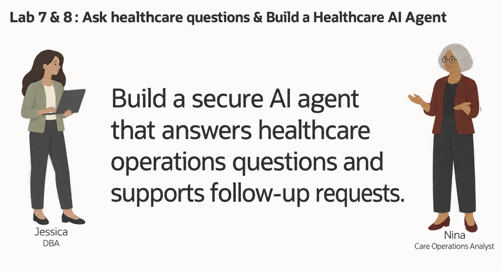
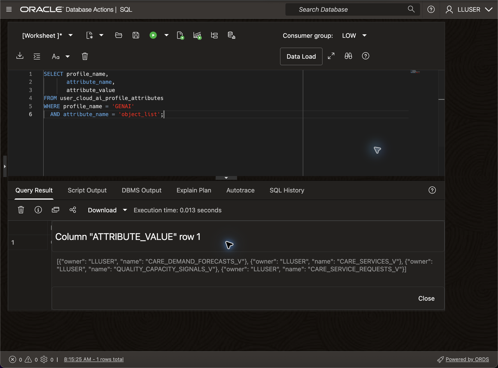

# Ask Healthcare Questions with Select AI

## Introduction

Nina Patel is a care operations analyst at Seer Health Network. In the previous lab, Otto used Oracle Machine Learning to identify care services and regions with elevated demand risk. Nina now needs to explore those results before the operations team prepares its capacity review.

Nina knows the healthcare questions she wants to ask, but she does not want every answer to depend on finding the right view, column, sort order, and row limit first. Jessica, the DBA, has configured a Select AI profile that gives the model focused metadata for the governed healthcare views. Nina can ask a question in ordinary language, then use Select AI to generate SQL, run it, or explain the result.

Nina still reviews the generated SQL. The model can misunderstand a question, choose the wrong field, or return a plausible result that does not answer the operational need. Her working pattern is simple: ask, inspect, run, and refine. The database keeps the question, generated SQL, and governed healthcare data connected, while Nina keeps human review in the process.

In this lab, you check the available profile, add the healthcare views Nina needs, inspect the SQL generated from her question, run the approved query, and refine the prompt to produce a more useful capacity-review result.



<details>
<summary><strong>Key terms: Select AI, AI profile, generated SQL, and natural-language prompt</strong></summary>

> - **Select AI** lets a user work with database information through a natural-language question.
>
> - An **AI profile** connects Select AI to an AI provider and identifies the database objects that may be used for the question.
>
> - **Generated SQL** is the SQL statement created from the question. Nina should inspect it before relying on the result.
>
> - A **natural-language prompt** is the question sent to Select AI, such as `Which five care services have the highest demand risk?`

</details>

### Objectives

- Check the Select AI profile available to `LLUSER`.
- Add the governed healthcare views Nina needs.
- Inspect and run SQL generated from a healthcare question.
- Refine the prompt and compare the explanation with the database result.

Estimated Time: **10 minutes**

### Hands-on Scenario

| Step                | Healthcare focus                                                                             |
| ---------------------| ----------------------------------------------------------------------------------------------|
| Business Problem    | Nina needs to identify care services and regions that warrant a capacity review.              |
| Technical Challenge | The question must become reviewable SQL against a focused set of governed healthcare views.  |
| Persona Focus       | You follow Nina as she checks, reviews, and improves a Select AI question.                   |
| What You Will See   | A natural-language question becomes SQL that can be inspected and run in the database.       |
| Database Capability | Select AI, `DBMS_CLOUD_AI`, AI profiles, and natural-language-to-SQL generation.             |
| Outcome             | Nina gets a repeatable way to ask healthcare questions while keeping SQL review in the process. |

> **SQL Worksheet reminder:** Need a reminder on how to open and use the SQL Worksheet? Return to [Getting Started Task 2: Open SQL Worksheet](?lab=getting-started#Task2:OpenSQLWorksheet) for the step-by-step graphic showing where to paste and run SQL statements.

## Task 1: Check the Select AI profile

Before Nina asks a healthcare question, Jessica shows her the control point behind Select AI. The AI profile identifies the configured AI provider and the database objects Select AI may consider when it translates a question into SQL.

1. List the profiles available to `LLUSER`:

    ```sql
    <copy>
    SELECT profile_name,
           status,
           description
    FROM user_cloud_ai_profiles
    ORDER BY profile_name;
    </copy>
    ```

    **Expected output:** Find the `GENAI` profile and confirm that its status is `ENABLED`. Nina will use this profile for the questions in this lab.

2. Review how the profiles are configured:
  
    ```sql
    <copy>
    SELECT profile_name,
           attribute_name,
           attribute_value
    FROM user_cloud_ai_profile_attributes
    ORDER BY profile_name, attribute_name;
    </copy>
    ```

    The attributes identify the provider, model, region, and database objects associated with each profile. Do not copy credential values. In the next task, Jessica changes only the `object_list` that controls the schema context for Nina's questions.

    **Expected output:** Review the rows for `GENAI`. You should see the configured provider, model, region, and other profile attributes. The exact provider values depend on the workshop environment.

## Task 2: Add the healthcare views to the profile

Nina wants to ask about care demand, services, quality and capacity signals, and service requests. Jessica narrows the `GENAI` profile to four governed healthcare views that present those facts with business-friendly names.

1. Add the healthcare views to the profile:

    ```sql
    <copy>
    BEGIN
      DBMS_CLOUD_AI.SET_ATTRIBUTE(
        profile_name    => 'genai',
        attribute_name  => 'object_list',
        attribute_value => '[{"owner": "' || USER || '", "name": "CARE_DEMAND_FORECASTS_V"}, {"owner": "' || USER || '", "name": "CARE_SERVICES_V"}, {"owner": "' || USER || '", "name": "QUALITY_CAPACITY_SIGNALS_V"}, {"owner": "' || USER || '", "name": "CARE_SERVICE_REQUESTS_V"}]'
      );
    END;
    /
    </copy>
    ```

    **Expected output:** The block completes successfully. It changes only the `object_list` for `GENAI`.

2. Confirm the updated object list:

    ```sql
    <copy>
    SELECT profile_name,
           attribute_name,
           attribute_value
    FROM user_cloud_ai_profile_attributes
    WHERE profile_name = 'GENAI'
      AND attribute_name = 'object_list';
    </copy>
    ```

    **Expected output:** The value lists `CARE_DEMAND_FORECASTS_V`, `CARE_SERVICES_V`, `QUALITY_CAPACITY_SIGNALS_V`, and `CARE_SERVICE_REQUESTS_V`.

    The focused list gives Select AI the healthcare context needed for Nina's questions without exposing unrelated schema objects.
  
    

## Task 3: Ask a question and inspect the SQL

Nina begins with the demand signal from the previous lab. She wants to know which five care services have the highest demand risk, but she first asks Select AI to show the proposed SQL without running it.

Database Actions does not support the `SELECT AI` keyword. In SQL Worksheet, use `DBMS_CLOUD_AI.GENERATE` and provide the profile name directly.

1. Ask the question with the `showsql` action:

    ```sql
    <copy>
    SELECT DBMS_CLOUD_AI.GENERATE(
             prompt       => 'Which five care services have the highest demand risk?',
             profile_name => 'genai',
             action       => 'showsql'
           ) AS generated_sql;
    </copy>
    ```
2. Review the generated SQL before running it.

    **Expected result:** The statement should query `CARE_DEMAND_FORECASTS_V`, rank the records by demand risk, and limit the result to five rows. The exact SQL can vary by model.

    Nina checks the selected columns, sort order, and row limit. This review lets her catch a plausible SQL statement that does not match the business question before it runs.

## Task 4: Run the question in the database

The proposed SQL matches Nina's question, so she asks Select AI to run it against the healthcare views.

1. Run the same question with the `runsql` action:

    ```sql
    <copy>
    SELECT DBMS_CLOUD_AI.GENERATE(
             prompt       => 'Which five care services have the highest demand risk?',
             profile_name => 'genai',
             action       => 'runsql'
           ) AS answer;
    </copy>
      ```
2. Compare the returned rows with the SQL you inspected in Task 3.

    **Expected result:** The answer returns five service and region combinations. `mRNA LNP Clinical Batch` in the `Northeast Corridor` should appear first, with predicted demand `2578` and a demand risk factor of `2.06`.

    The query runs under the current database user's privileges, and the answer comes from the healthcare data in Oracle AI Database.

    > **Note:** Select AI can generate incorrect SQL or misunderstand a question. Use `showsql` when the exact query matters, and treat the generated answer as a starting point for review.

## Task 5: Improve the business question

The first answer identifies the highest-risk services, but Nina needs enough context to prepare a capacity review. She refines the question to request the service name, category, region, predicted demand, and demand risk factor.

1. Use `showsql` to inspect this revised prompt:

    ```sql
    <copy>
    SELECT DBMS_CLOUD_AI.GENERATE(
             prompt       => 'Show the five care services with the highest demand risk. Include the service name, category, region, predicted demand, and demand risk factor.',
             profile_name => 'genai',
             action       => 'showsql'
           ) AS generated_sql;
    </copy>
    ```
2. Review the generated SQL, then run the revised question with `runsql`:

    ```sql
    <copy>
    SELECT DBMS_CLOUD_AI.GENERATE(
             prompt       => 'Show the five care services with the highest demand risk. Include the service name, category, region, predicted demand, and demand risk factor.',
             profile_name => 'genai',
             action       => 'runsql'
           ) AS answer;
    </copy>
    ```
3. Compare the first and refined questions.

    **Expected result:** The refined answer keeps the five-row ranking and adds the details Nina needs to compare demand pressure across services and regions.

    Nina did not need to know the view name or write the SQL, but she still inspected the statement and made the required business fields explicit.

## Task 6: Explain the result

Nina has the detailed rows. She now asks for a short explanation that she can use to open a capacity review conversation.

1. Run the revised question with the `narrate` action:

    ```sql
    <copy>
    SELECT DBMS_CLOUD_AI.GENERATE(
             prompt       => 'Show the five care services with the highest demand risk. Include the service name, category, region, predicted demand, and demand risk factor.',
             profile_name => 'genai',
             action       => 'narrate'
           ) AS explanation;
    </copy>
    ```
2. Compare the explanation with the SQL result from Task 5.

    **Expected result:** The explanation should identify the highest-demand-risk service and summarize the service and region combinations that need attention. Its wording can vary by model.

    Nina checks every service name and metric against the tabular result. The narrative helps her communicate the finding, while the SQL result remains the repeatable evidence.

    > **Note:** The `narrate` action sends the query result to the AI provider configured in the profile. Use it only for data approved for that provider.

## Conclusion: Ask, Inspect, and Refine

Nina used Select AI to turn a healthcare operations question into SQL, reviewed the generated statement, ran it in Oracle AI Database, and refined the question when the first result lacked the details she needed. Select AI reduces the amount of SQL a business user has to write, while SQL review keeps the database operation visible.

This is the practical value of Select AI in Oracle AI Database. The question, generated SQL, and result stay connected to the governed healthcare views. Nina can ask in ordinary language without giving up database access controls or the ability to inspect the query behind the answer.

Select AI does not replace judgment. A good workflow is to show the SQL, check the tables and filters, run the statement, and compare the answer with the business question.

## Next Steps

For the full list of Select AI actions, profile attributes, and supported providers, see the [Oracle AI Database 26ai Select AI documentation](https://docs.oracle.com/en/database/oracle/oracle-database/26/selai/).

## Acknowledgements

* **Author** - Linda Foinding, Principal Product Manager, Oracle Database Product Management
* **Last Updated By/Date** - Oracle Database Product Management, September 2026
