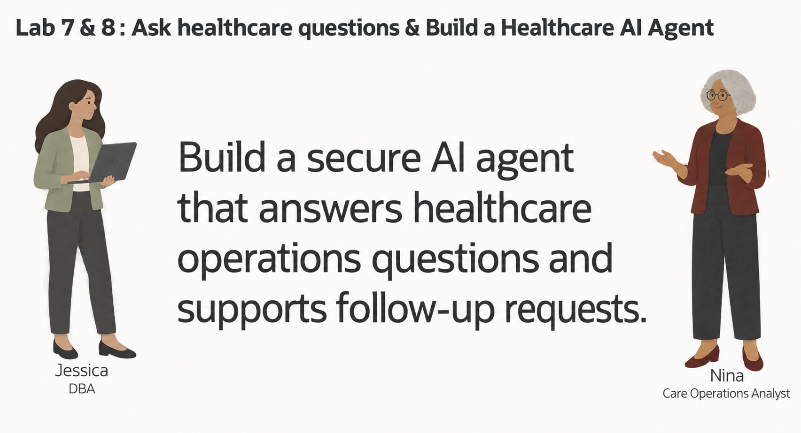
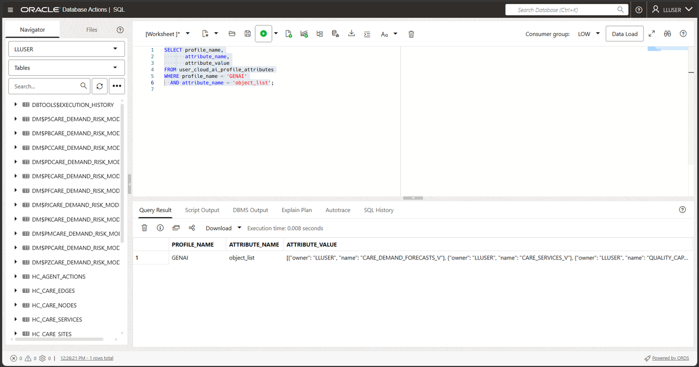

# Ask Healthcare Questions with Select AI

## Introduction

Nina Patel is a care operations analyst at Seer Health Network. In the previous lab, Otto reviewed an operating-risk classification alongside the stored demand forecasts. Nina now needs to explore those forecasts before the operations team prepares its capacity review.

Jessica configures Select AI so Nina can ask healthcare questions in ordinary language instead of writing each query. Nina reviews the generated SQL and checks the results before using them in her capacity review.

In this lab, you check and configure the available profile, add the healthcare views Nina needs, inspect the SQL generated from her question, and run healthcare demand queries. You then refine the prompt to include regional details and compare a written summary with the returned rows.



<details>
<summary><strong>Key terms: Select AI, AI profile, generated SQL, and natural-language prompt</strong></summary>

> - **Select AI** lets a user work with database information through a natural-language question.
>
> - An **AI profile** connects Select AI to an AI provider and identifies the database objects to consider when generating SQL.
>
> - **Generated SQL** is the SQL statement created from the question. Nina should inspect it before relying on the result.
>
> - A **natural-language prompt** is the question sent to Select AI, such as `Which five care services have the highest demand risk?`

</details>

### Objectives

- Check the Select AI profile available to `LLUSER`.
- Add the governed healthcare views Nina needs.
- Inspect and run SQL generated from a healthcare question.
- Refine the prompt and compare the explanation with the database result.

Estimated Time: **10 minutes**

### Hands-on Scenario

| Step | Healthcare focus |
| --- | --- |
| Business Problem | Nina needs to identify care services and regions that warrant a capacity review. |
| Technical Challenge | The question must become reviewable SQL against a focused set of governed healthcare views. |
| Persona Focus | You follow Nina as she checks, reviews, and improves a Select AI question. |
| What You Will See | A natural-language question becomes SQL that can be inspected and run in the database. |
| Database Capability | Select AI, `DBMS_CLOUD_AI`, AI profiles, and natural-language-to-SQL generation. |
| Outcome | Nina gets a repeatable way to ask healthcare questions while keeping SQL review in the process. |

> **SQL Worksheet:** See [Getting Started, Task 2](?lab=getting-started#Task2:OpenSQLWorksheet) for instructions on opening the worksheet.

## Task 1: Check the Select AI profile

Before Nina asks a healthcare question, Jessica shows her the settings behind Select AI. The AI profile identifies the configured provider and the database objects Select AI may consider when it translates a question into SQL. Jessica checks and configures `GENAI` before Nina uses it for the questions in this lab.

1. List the profiles available to `LLUSER`:

    ```sql
    <copy>
    SELECT profile_name,
           status,
           description
    FROM user_cloud_ai_profiles
    ORDER BY profile_name;
    </copy>
    ```

    **Expected output:** A row for `GENAI` with status `ENABLED`.

2. Review how the profiles are configured:
  
    ```sql
    <copy>
    SELECT profile_name,
           attribute_name,
           attribute_value
    FROM user_cloud_ai_profile_attributes
    ORDER BY profile_name, attribute_name;
    </copy>
    ```

    **Expected output:** The rows for `GENAI` list its connection settings and database objects. Keep credential details private.

3. Configure the profile for this lab:

    ```sql
    <copy>
    BEGIN
      DBMS_CLOUD_AI.SET_ATTRIBUTE(
        profile_name    => 'GENAI',
        attribute_name  => 'model',
        attribute_value => 'xai.grok-4.3'
      );
    END;
    /
    </copy>
    ```

    **Expected output:** `PL/SQL procedure successfully completed.`

4. Confirm the setting with **Run Statement**:

    ```sql
    <copy>
    SELECT profile_name,
           attribute_name,
           attribute_value
    FROM user_cloud_ai_profile_attributes
    WHERE profile_name = 'GENAI'
      AND attribute_name = 'model';
    </copy>
    ```

    **Expected output:** One row with `GENAI`, `model`, and `xai.grok-4.3`.

5. Send a short request with **Run Statement**:

    ```sql
    <copy>
    SELECT DBMS_CLOUD_AI.GENERATE(
             prompt       => 'Reply with READY only.',
             profile_name => 'genai',
             action       => 'chat',
             attributes   => '{"model":"xai.grok-4.3"}'
           ) AS connection_check;
    </copy>
    ```

    **Expected output:** A response containing `READY`.

## Task 2: Add the healthcare views to the profile

Nina wants to ask about care demand, services, quality and capacity signals, and service requests. Jessica narrows the `GENAI` profile to four governed healthcare views that present those facts with business-friendly names.

1. Add the healthcare views to the profile:

    ```sql
    <copy>
    BEGIN
      DBMS_CLOUD_AI.SET_ATTRIBUTE(
        profile_name    => 'genai',
        attribute_name  => 'object_list',
        attribute_value => '[{"owner": "' || USER || '", "name": "CARE_DEMAND_FORECASTS_V"}, {"owner": "' || USER || '", "name": "CARE_SERVICES_V"}, {"owner": "' || USER || '", "name": "QUALITY_CAPACITY_SIGNALS_V"}, {"owner": "' || USER || '", "name": "CARE_SERVICE_REQUESTS_V"}]'
      );
    END;
    /
    </copy>
    ```

    **Expected output:** The block completes successfully. It changes only the `object_list` for `GENAI`.

2. Confirm the updated object list:

    ```sql
    <copy>
    SELECT profile_name,
           attribute_name,
           attribute_value
    FROM user_cloud_ai_profile_attributes
    WHERE profile_name = 'GENAI'
      AND attribute_name = 'object_list';
    </copy>
    ```

    **Expected output:** The value lists `CARE_DEMAND_FORECASTS_V`, `CARE_SERVICES_V`, `QUALITY_CAPACITY_SIGNALS_V`, and `CARE_SERVICE_REQUESTS_V`.

    The focused `object_list` gives Select AI the schema context needed for Nina's healthcare questions. It guides SQL generation; it does not grant access to the data. Database privileges still control which objects and rows the current user can read.
  
    

## Task 3: Ask a question and inspect the SQL

Nina begins with a broad demand-risk question: which five care services have the highest demand risk? Before running a query, she uses `showsql` to see how Select AI translates her question. This gives her a chance to inspect the proposed SQL without executing it.

In SQL Worksheet, call `DBMS_CLOUD_AI.GENERATE` with the profile name and action.

1. Ask the question with the `showsql` action:

    ```sql
    <copy>
    SELECT DBMS_CLOUD_AI.GENERATE(
             prompt       => 'Which five care services have the highest demand risk?',
             profile_name => 'genai',
             action       => 'showsql',
             attributes   => '{"model":"xai.grok-4.3"}'
           ) AS generated_sql;
    </copy>
    ```

2. Review the generated SQL before running it.

    **Expected output:** SQL that reads `CARE_DEMAND_FORECASTS_V`, sorts by demand risk, and returns five rows. Check whether it groups by service or ranks individual service-region forecasts.

    Nina checks the selected columns, grouping, sort order, and row limit. This review lets her catch a plausible SQL statement that does not match the business question. In particular, she checks whether the statement ranks distinct services or individual service-region forecasts.

## Task 4: Run the question in the database

Nina has inspected how Select AI interprets her question. She now uses `runsql` to generate and execute a query for the same question against the healthcare views. This call generates a new statement; it does not execute the SQL displayed in Task 3. To run that exact reviewed statement instead, copy it into the worksheet and run it directly.

1. Run the same question with the `runsql` action:

    ```sql
    <copy>
    SELECT DBMS_CLOUD_AI.GENERATE(
             prompt       => 'Which five care services have the highest demand risk?',
             profile_name => 'genai',
             action       => 'runsql',
             attributes   => '{"model":"xai.grok-4.3"}'
           ) AS answer;
    </copy>
    ```

2. Compare the returned rows with the SQL you inspected in Task 3.

    **Expected output:** Five distinct services or five service-region forecasts, with `mRNA LNP Clinical Batch` highest at `2.06`. This question does not request region or predicted demand. Task 5 adds those fields.

    The query runs under the current database user's privileges, and the answer comes from the healthcare data in Oracle AI Database. Nina compares the returned columns and grouping with her question before deciding whether the answer contains enough detail for the capacity review.

## Task 5: Improve the business question

The first answer identifies the highest-risk services, but Nina needs enough context to prepare a capacity review. She refines the question to request the service name, category, region, predicted demand, and demand risk factor. Naming those fields makes clear that she needs service-region forecasts, not just a list of services.

1. Use `showsql` to inspect this revised prompt:

    ```sql
    <copy>
    SELECT DBMS_CLOUD_AI.GENERATE(
             prompt       => 'Show the five care services with the highest demand risk. Include the service name, category, region, predicted demand, and demand risk factor.',
             profile_name => 'genai',
             action       => 'showsql',
             attributes   => '{"model":"xai.grok-4.3"}'
           ) AS generated_sql;
    </copy>
    ```

    **Expected output:** SQL that selects all five requested fields and sorts by demand risk in descending order.

2. Review the SQL, then generate and run a query for the revised question:

    ```sql
    <copy>
    SELECT DBMS_CLOUD_AI.GENERATE(
             prompt       => 'Show the five care services with the highest demand risk. Include the service name, category, region, predicted demand, and demand risk factor.',
             profile_name => 'genai',
             action       => 'runsql',
             attributes   => '{"model":"xai.grok-4.3"}'
           ) AS answer;
    </copy>
    ```

3. Compare the first and refined questions.

    **Expected output:** Five service-region forecasts with all requested fields. A service can appear in several regions, unlike a result grouped only by service.

    Compare the returned values with this table:

    | Service | Category | Region | Predicted demand | Risk factor |
    | --- | --- | --- | --- | --- |
    | mRNA LNP Clinical Batch | Specialty Care | Northeast Corridor | 2578 | 2.06 |
    | mRNA LNP Clinical Batch | Specialty Care | New York Metro | 2310 | 1.94 |
    | mRNA LNP Clinical Batch | Specialty Care | Los Angeles Basin | 2140 | 1.82 |
    | mRNA LNP Clinical Batch | Specialty Care | Bay Area (SF) | 1980 | 1.74 |
    | Bed Capacity Surge Playbook | Care Operations | New York Metro | 1810 | 1.68 |

    Nina did not need to know the view name or write the SQL, but she still inspected the statement and made the required business fields explicit. The regional detail now shows where each service faces demand pressure, giving the operations team specific service-region forecasts to review.

## Task 6: Explain the result

Nina has the detailed rows. She now asks for a short explanation that she can use to open a capacity review conversation. She will compare the explanation with the table from Task 5 before sharing the findings.

1. Use `narrate` to generate a new query, run it, and summarize its result:

    ```sql
    <copy>
    SELECT DBMS_CLOUD_AI.GENERATE(
             prompt       => 'Show the five care services with the highest demand risk. Include the service name, category, region, predicted demand, and demand risk factor.',
             profile_name => 'genai',
             action       => 'narrate',
             attributes   => '{"model":"xai.grok-4.3"}'
           ) AS explanation;
    </copy>
    ```

2. Compare the explanation with the SQL result from Task 5.

    **Expected output:** A summary of the five service-region forecasts, led by `mRNA LNP Clinical Batch` in the `Northeast Corridor`.

    Nina checks every service name, region, and metric against the table in Task 5. The narrative helps her communicate the finding, while the tabular result gives her the values to check. She uses the summary only after confirming that it describes the same service-region forecasts.

    > **Data sharing:** `narrate` sends query results to the configured provider. Use it only with approved data.

## Conclusion: Ask, Inspect, and Refine

Congratulations on completing this lab! You configured a Select AI profile, generated and reviewed SQL, and ran healthcare demand queries. You refined Nina's question to include regional details and checked a written summary against the returned data.

Nina now has the service, region, and demand figures needed for her capacity review. You also practiced a repeatable workflow: ask, inspect, run, and refine. In the next lab, you will build an agent that answers healthcare questions through a SQL tool.

## Next Steps

For the full list of Select AI actions, profile attributes, and supported providers, see the [Oracle AI Database 26ai Select AI documentation](https://docs.oracle.com/en/database/oracle/oracle-database/26/selai/).

## Acknowledgements

* **Author** - Linda Foinding, Principal Product Manager, Oracle Database Product Management
* **Last Updated By/Date** - Oracle Database Product Management, September 2026
