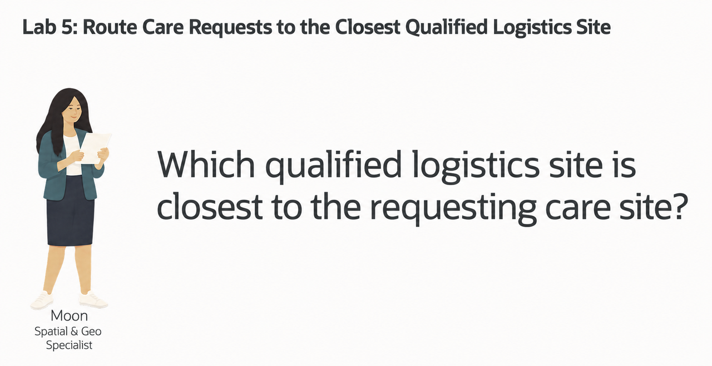

# Route Care Requests to the Closest Qualified Logistics Site

## Introduction

Moon Kai is Seer Health Network's spatial specialist. Care operations teams ask Moon for help when location affects a service decision: which logistics site is close enough to support a care request, and does that site have the right service and operating capacity?

The required data already lives in Oracle AI Database. Care sites and logistics sites are stored as spatial points. Service requests identify what a care site needs, while logistics records describe service support, operating status, capacity, and current load.

Request `170101` comes from Miami Oncology Care Center and includes three units of the qPCR Respiratory Panel. Moon wants care operations users to answer one practical question with SQL:

> **Which active logistics site supports the requested service, passes the load rule, and is closest to the requesting care site?**

In this lab, you follow Moon's approach. You inspect the requesting care site as a spatial point, rank active logistics sites by distance, and finish with a routing result that combines geography with service, status, load, and capacity evidence.



<details>
<summary><strong>Key terms: geometry, point, SRID, distance, GeoJSON, capacity, and load</strong></summary>

> - A **geometry** is a database value that represents a real-world location or shape. Oracle Spatial stores the healthcare locations in this lab as `SDO_GEOMETRY` values.
>
> - A **point** is one location represented by a coordinate pair. The care site and logistics sites in this lab are stored as points, with longitude first and latitude second.
>
> - An **SRID**, or spatial reference system identifier, tells Oracle how to interpret the coordinates. These locations use SRID `4326`, the WGS84 coordinate system.
>
> - **Distance** measures the separation between two geometries. Here, it shows how many miles separate the requesting care site from each logistics site.
>
> - **GeoJSON** is a JSON format for map locations and shapes. `SDO_UTIL.TO_GEOJSON` lets an application display the same database location on a map.
>
> - **Capacity** describes the total work a logistics site can support in this synthetic scenario. **Current load** records the percentage already in use. The lab combines them to estimate the remaining capacity available for review.
>
</details>

Distance narrows Moon's search, but it does not complete the decision. A nearby logistics site must also support the requested service, be active, and remain below the workshop load threshold. Oracle Spatial and relational SQL evaluate those requirements together.


*Figure 1: Spatial distance identifies nearby sites; service, status, and capacity evidence determine whether a site qualifies.*

### Objectives

- Inspect a healthcare location stored as a spatial point.
- Rank active logistics sites by distance.
- Apply service, status, load, and capacity rules.
- Produce a traceable routing recommendation.

Estimated Time: **10 minutes**

### Operating Story

| Step | Healthcare focus |
| --- | --- |
| Business Problem | A care site needs a qualified logistics location for a requested diagnostic service. |
| Technical Challenge | Geographic proximity alone does not establish service support, active status, or available capacity. |
| Persona Focus | You review Moon's spatial approach and interpret the routing evidence for care operations. |
| What You Will Prove | Oracle Spatial can rank locations while SQL applies service and operating rules. |
| Database Capability | `SDO_GEOMETRY`, `SDO_GEOM.SDO_DISTANCE`, GeoJSON conversion, relational joins, and deterministic ranking support the analysis. |
| Outcome | Care operations receives a traceable recommendation for the closest qualified logistics site. |

Persona focus: You are reviewing Moon's routing analysis. Your job is to explain why the selected logistics site qualifies, not merely why it is nearby.

> **SQL Worksheet reminder:** Need a reminder on how to open and use the SQL Worksheet? Return to [Getting Started Task 2: Open SQL Worksheet](?lab=getting-started#Task2:OpenSQLWorksheet) for the step-by-step graphic showing where to paste and run SQL statements.

## Task 1: Inspect the Requesting Care Site as a Spatial Point

Moon starts with the origin of the routing decision: **where is the care site that submitted the request?** Request `170101` comes from Miami Oncology Care Center. Oracle AI Database stores that care site as an `SDO_GEOMETRY` point, while the application can use the same point as GeoJSON.

An `SDO_GEOMETRY` point is Oracle Spatial's structured representation of one location. Miami Oncology Care Center uses the WGS84 coordinate system and the coordinate pair longitude `-80.1918` and latitude `25.7617`. The spatial reference system identifier, or SRID, is `4326`. Because Oracle stores the location as geometry, Spatial functions can calculate distance instead of treating longitude and latitude as unrelated numbers.

`SDO_UTIL.TO_GEOJSON` converts that geometry into a standard JSON map object: `{ "type": "Point", "coordinates": [-80.1918, 25.7617] }`. GeoJSON lists longitude first and latitude second. The application can send this object to a map without maintaining a second location format or a separate conversion service. Oracle uses the same stored geometry for SQL analysis and application display.

That is the Oracle AI Database advantage in this lab: one location supports spatial calculations, relational joins, and JSON map output without copying the data between systems.

1. Run this query:

    ```sql
    <copy>
    SELECT cs.care_site_id,
           cs.care_site_name,
           cs.city,
           cs.state_code,
           cs.location.sdo_point.x AS longitude,
           cs.location.sdo_point.y AS latitude,
           cs.location.sdo_srid AS srid,
           DBMS_LOB.SUBSTR(
             SDO_UTIL.TO_GEOJSON(cs.location),
             160,
             1
           ) AS location_geojson
    FROM hc_care_sites cs
    WHERE cs.care_site_id = 1001;
    </copy>
    ```

    `LOCATION` is the database point. `LATITUDE` and `LONGITUDE` make the value easy to read, `SRID` identifies the coordinate system, and `LOCATION_GEOJSON` gives an application a map-ready representation of the same point. `SDO_UTIL.TO_GEOJSON` returns a CLOB, so `DBMS_LOB.SUBSTR` limits the displayed text to 160 characters; it does not change the stored geometry.

    **Expected output: Requesting care-site point**

    | Care Site ID | Care Site | City | State | Longitude | Latitude | SRID |
    | ---: | --- | --- | --- | ---: | ---: | ---: |
    | 1001 | Miami Oncology Care Center | Miami | FL | -80.1918 | 25.7617 | 4326 |

2. Review the point data.

    Moon has not created a second map database. The point used by the application and the point used by SQL are the same value. The database can calculate from it, and the application can display it.

    This is the converged-database advantage. Moon can keep the care site's location beside the request and service data. SQL can calculate distance from that point, while `SDO_UTIL.TO_GEOJSON` gives the application the same location for a map. The team does not have to copy coordinates into a separate mapping system and keep the copies synchronized.

## Task 2: Rank the Nearest Active Logistics Sites

Moon now compares Miami Oncology Care Center with every active logistics site. This first ranking answers the geographic question: **which active sites are closest to the requesting care site?** It does not yet decide whether a site supports the requested service or has acceptable operating load.

1. Run the distance query:

    ```sql
    <copy>
    WITH origin AS (
      SELECT care_site_id,
             care_site_name,
             location
      FROM hc_care_sites
      WHERE care_site_id = 1001
    )
    SELECT o.care_site_name,
           ls.logistics_site_id,
           ls.logistics_name,
           ls.city,
           ls.state_code,
           ls.service_supported,
           ls.site_status,
           ROUND(
             SDO_GEOM.SDO_DISTANCE(
               o.location,
               ls.location,
               0.005,
               'unit=MILE'
             ),
             1
           ) AS distance_miles
    FROM origin o
    CROSS JOIN care_logistics_sites_v ls
    WHERE ls.site_status = 'ACTIVE'
    ORDER BY SDO_GEOM.SDO_DISTANCE(
               o.location,
               ls.location,
               0.005,
               'unit=MILE'
             ),
             ls.logistics_site_id
    FETCH FIRST 3 ROWS ONLY;
    </copy>
    ```

    `SDO_GEOM.SDO_DISTANCE` compares the care-site point with each logistics-site point and returns the distance between them.

    The four arguments in this query have simple roles:

    - `o.location` is the first geometry: Miami Oncology Care Center.
    - `ls.location` is the second geometry: an active logistics site.
    - `0.005` is the tolerance used when Oracle compares the geometries. It helps Oracle handle small differences in the stored coordinates.
    - `'unit=MILE'` tells Oracle to return the distance in miles.

    The `ROUND(..., 1)` around the function result formats the answer to one decimal place. It does not change the spatial calculation. `LOGISTICS_SITE_ID` breaks a tie deterministically if two sites have the same distance.

    **Expected output: Nearest active logistics sites**

    | Logistics Site | City | Service Supported | Status | Distance |
    | --- | --- | --- | --- | ---: |
    | Hialeah Import Compliance Site | Hialeah | qPCR Respiratory Panel | ACTIVE | 8.5 miles |
    | Concord Southeast Micro Site | Concord | Infusion Center Slot Bundle | ACTIVE | 665.0 miles |
    | Etna Midwest Specialty Warehouse | Lebanon | Digital Pathology Slide Batch | ACTIVE | 805.1 miles |

2. Review the distance result.

    Hialeah is only 8.5 miles from the requesting care site. The other two active sites are hundreds of miles away. That makes Hialeah the first site Moon should inspect, but distance alone does not prove that it can fulfill request `170101`.

    Moon still needs to confirm that the site supports the requested diagnostic service and passes the operating-load rule.

## Task 3: Route the Request to the Closest Qualified Site

Moon now needs a result that a care operations application can use. Request `170101` comes from Miami Oncology Care Center and includes three units of the qPCR Respiratory Panel. The selected logistics site must be active, support that service, remain below the workshop load threshold, and be the closest site that passes those rules.

1. Run the qualified routing query:

    ```sql
    <copy>
    WITH request_requirement AS (
      SELECT r.request_id,
             r.request_status,
             cs.care_site_id,
             cs.care_site_name,
             cs.city AS care_site_city,
             cs.state_code AS care_site_state,
             cs.location AS care_site_location,
             svc.service_id,
             svc.service_name,
             ri.quantity
      FROM hc_service_requests r
      JOIN hc_care_sites cs
        ON cs.care_site_id = r.care_site_id
      JOIN hc_request_items ri
        ON ri.request_id = r.request_id
      JOIN care_services_v svc
        ON svc.service_id = ri.service_id
      WHERE r.request_id = 170101
    ),
    qualified_sites AS (
      SELECT rr.request_id,
             rr.request_status,
             rr.care_site_name,
             rr.care_site_city,
             rr.care_site_state,
             rr.service_name,
             rr.quantity,
             ls.logistics_site_id,
             ls.logistics_name,
             ls.city AS logistics_city,
             ls.state_code AS logistics_state,
             ls.site_status,
             ls.capacity_units,
             ls.current_load_pct,
             ROUND(
               ls.capacity_units * (1 - ls.current_load_pct / 100)
             ) AS estimated_available_units,
             ROUND(
               SDO_GEOM.SDO_DISTANCE(
                 rr.care_site_location,
                 ls.location,
                 0.005,
                 'unit=MILE'
               ),
               1
             ) AS distance_miles
      FROM request_requirement rr
      CROSS JOIN care_logistics_sites_v ls
      WHERE ls.site_status = 'ACTIVE'
        AND ls.service_supported = rr.service_name
        AND ls.current_load_pct < 80
    )
    SELECT request_id,
           request_status,
           care_site_name,
           care_site_city || ', ' || care_site_state AS care_site_location,
           service_name,
           quantity,
           logistics_site_id,
           logistics_name,
           logistics_city || ', ' || logistics_state AS logistics_site_location,
           site_status,
           capacity_units,
           current_load_pct,
           estimated_available_units,
           distance_miles
    FROM qualified_sites
    ORDER BY distance_miles,
             logistics_site_id
    FETCH FIRST 1 ROW ONLY;
    </copy>
    ```

    Read the query in three parts:

    1. `request_requirement` joins the request, care site, line item, and care service so Moon does not have to hard-code the requested service.
    2. `qualified_sites` keeps active logistics sites that support the requested service and have a current load below 80 percent. It also calculates estimated available units as `capacity × (1 - current load percentage)` and measures the distance from the requesting care site.
    3. The final query orders the qualified sites by distance and uses `LOGISTICS_SITE_ID` as a deterministic tie-breaker before returning the closest one.

    **Expected output: Qualified routing decision**

    | Request | Status | Care Site | Service | Quantity | Qualified Site | Capacity | Load | Estimated Available Units | Distance |
    | ---: | --- | --- | --- | ---: | --- | ---: | ---: | ---: | ---: |
    | 170101 | PROCESSING | Miami Oncology Care Center | qPCR Respiratory Panel | 3 | Hialeah Import Compliance Site | 250,000 | 61.5% | 96,250 | 8.5 miles |

2. Review the result as an operations decision.

    The result gives a care operations user the request, requested service, qualified logistics site, capacity, current load, estimated available units, and distance in one row.

    Hialeah is not selected merely because it is nearby. It is selected because it is active, supports the requested diagnostic service, remains below the load threshold, and is the closest site that passes those rules.

    This is the business outcome. Moon turns location into a routing recommendation that another reviewer can trace back to the same governed request, service, logistics, capacity, and spatial data.

## Conclusion: Turn Location into a Service Decision

Moon's analysis moves from the requesting care-site point, to a distance ranking, to a qualified routing decision. The first query exposes the Miami origin in both spatial and GeoJSON form. The second identifies the closest active logistics sites. The final query reads request `170101`, derives its requested service, applies the service and load rules, and selects Hialeah as the nearest site that qualifies.

This shows why Spatial in Oracle AI Database matters. Moon can calculate distance and combine it with governed request, service, status, capacity, and load data in SQL. Care operations receives a recommendation it can trace without reconciling a separate map, request system, and logistics report.

## Next Steps

You used Oracle Spatial to turn stored points, measured distance, and operating evidence into a routing decision. For a deeper hands-on workshop focused on Oracle Spatial, open the [Oracle Spatial LiveLabs workshop](https://livelabs.oracle.com/ords/r/dbpm/livelabs/view-workshop?clear=RR,180&wid=800).

## Acknowledgements

* **Author** - Linda Foinding, Principal Product Manager, Oracle Database Product Management
* **Last Updated By/Date** - Oracle Database Product Management, September 2026
