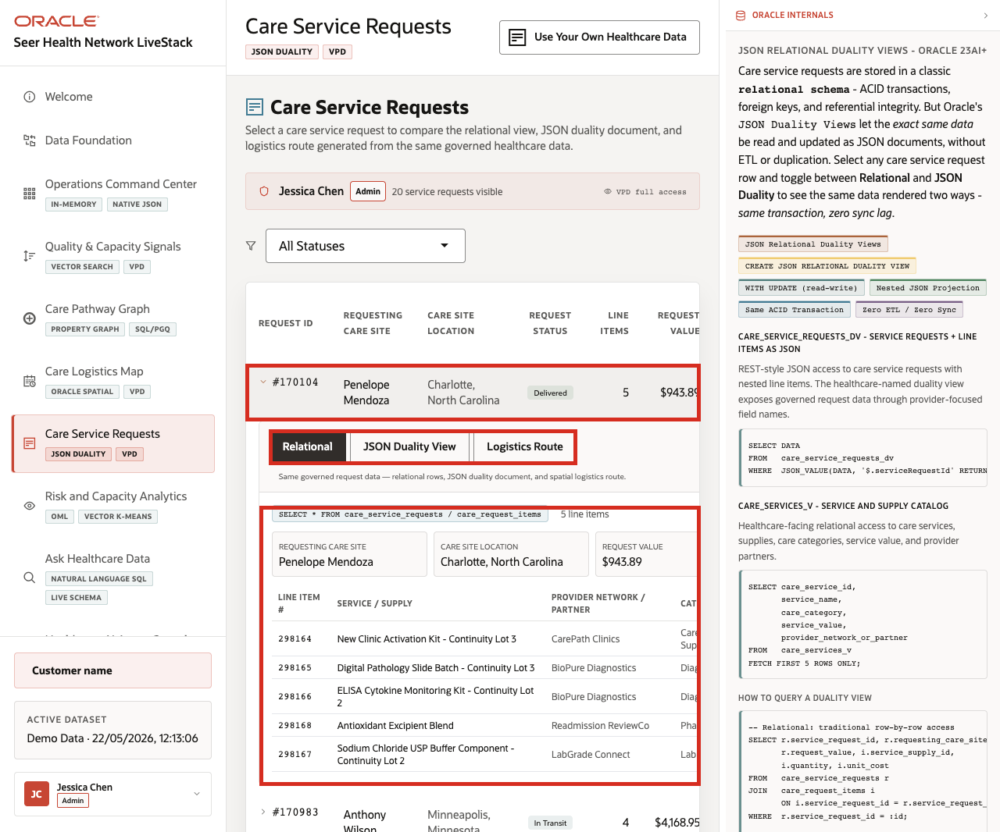

# Build a JSON Care Service Request Model

## Introduction

Thomas Brune is an application developer at Seer Health Network. His team is building an operational application that helps care coordinators review service requests, logistics assignments, costs, demand indicators, and requested services. The team wants a faster experience with fewer round trips and payloads that match the screens and services they are building.

Thomas needs each care service request as one JSON payload that the application can consume directly. One document can group the request status, care site, logistics site, operational values, and nested line items. The data already lives in Oracle AI Database, so his challenge is to provide an application-friendly document without giving up relational keys, constraints, joins, transactions, and database controls.

Thomas asks Jessica Chen, the DBA, to compare three ways to work with JSON in Oracle AI Database. They begin with a JSON value in a relational table, continue with an application-owned JSON collection, and then use a JSON Relational Duality View over the existing healthcare request tables. The goal is to choose the right approach for each application feature without creating a second copy of governed healthcare data.


<details>
<summary><strong>Key terms: JSON columns, JSON collections, and JSON Relational Duality</strong></summary>

> - A **JSON column** stores a JSON value in a relational table alongside typed columns, keys, and constraints. Thomas can use it for optional application attributes that may change independently of the core request schema.
>
> - A **JSON collection** stores application-owned documents in a `JSON`-typed `DATA` column. Each document has a string `_id`, and an ETAG can help an application detect conflicting updates.
>
> - **JSON Relational Duality** exposes existing relational rows as application-ready JSON documents without creating a second copy. The application works with a complete request document while the database retains normalized request and line-item rows.

</details>

Thomas's application needs a payload with the request and its line items together, such as this example from the provided healthcare data:

```json
{
  "_id": 170104,
  "requestingCareSiteId": 1002,
  "requestStatus": "DELIVERED",
  "lineItems": [
    {
      "lineItemId": 4,
      "serviceSupplyId": 8,
      "quantity": 1,
      "unitCost": 310
    }
  ]
}
```

The application uses this document shape, while Oracle Database keeps the request and its line items in relational form. In this lab, you work with application JSON in three ways and decide which approach fits each requirement.



### Objectives

- Store flexible application attributes as JSON.
- Create and query a JSON Collection Table.
- Read, create, and update a care service request through `CARE_SERVICE_REQUESTS_DV`.
- Compare the three JSON approaches.

Estimated Time: **20 minutes**

### Hands-on Scenario

| Step | Healthcare focus |
| --- | --- |
| Business Problem | A care operations application and database users need the same service request in different shapes. |
| Technical Challenge | A separate document copy could drift from the governed request and line-item rows. |
| Persona Focus | Thomas builds the application document while Jessica protects the relational model and write contract. |
| What You Will See | One Oracle AI Database supports three JSON patterns over healthcare application data. |
| Database Capability | Native JSON, JSON Collection Tables, SQL/JSON, and JSON Relational Duality work together. |
| Outcome | The application receives a complete JSON request while operations teams retain SQL access to the same governed facts. |

Persona focus: You are Thomas Brune, working with Jessica Chen to decide how the care operations application should store, assemble, and update service-request documents.

### Thomas's three JSON choices

Thomas does not need one JSON pattern for every feature. A JSON column holds optional application attributes beside a relational request key. A JSON Collection Table stores documents owned by the application. A duality view assembles a document from existing relational request and item tables.

This keeps the request in one database and avoids complex and expensive integration between separate systems. Thomas gets the document shape his application needs, while Jessica keeps the relational rows, SQL access, constraints, transactions, and database controls.

> **SQL Worksheet reminder:** Need a reminder on how to open and use the SQL Worksheet? Return to [Getting Started Task 2: Open SQL Worksheet](?lab=getting-started#Task2:OpenSQLWorksheet) for the step-by-step guide on how to run SQL statements.

## Task 1: Store flexible application data as JSON

Thomas starts with settings that belong to the application but do not need dedicated columns in the core request table. He creates a small relational table with a native `JSON` column and links its payload to existing request `170104`.

1. Create the application-data table and add one settings payload.

    `DROP TABLE IF EXISTS` makes this demonstration object safe to recreate when you repeat the lab. It does not alter the provided healthcare tables.

    ```sql
    <copy>
    DROP TABLE IF EXISTS thomas_care_app_data PURGE;

    CREATE TABLE thomas_care_app_data (
        request_id NUMBER PRIMARY KEY,
        app_data   JSON NOT NULL
    );

    INSERT INTO thomas_care_app_data (request_id, app_data)
    SELECT request_id,
           JSON_OBJECT(
               'screen'            VALUE 'care-request-detail',
               'showLogisticsCost' VALUE 'true' FORMAT JSON,
               'features'          VALUE JSON_ARRAY(
                   'live-status',
                   'capacity-context'
               )
               RETURNING JSON
           )
    FROM hc_service_requests
    WHERE request_id = 170104;

    COMMIT;
    </copy>
    ```

    **Expected output: Application data created**

    Oracle creates `THOMAS_CARE_APP_DATA`, inserts one settings payload for request `170104`, and commits the transaction.

2. Read the relational key and selected JSON values.

    ```sql
    <copy>
    SELECT request_id,
           JSON_VALUE(app_data, '$.screen') AS screen_name,
           JSON_VALUE(
               app_data,
               '$.showLogisticsCost' RETURNING BOOLEAN
           ) AS show_logistics_cost,
           JSON_QUERY(app_data, '$.features') AS app_features
    FROM thomas_care_app_data;
    </copy>
    ```

    **Expected output: Application settings**

    | Request ID | Screen | Show Logistics Cost | Features |
    | ---: | --- | --- | --- |
    | 170104 | care-request-detail | true | ["live-status","capacity-context"] |

`REQUEST_ID` remains a relational key. The JSON payload can evolve as the application changes.

## Task 2: Create a JSON Collection Table

Thomas now compares the JSON column with an application-owned collection. The collection stores complete documents in `DATA`, uses a string `_id`, and adds an ETAG that changes with the document.

1. Create the collection and populate it from existing request `170104`.

    The scalar subquery constructs one JSON value before inserting it into the collection. The request, logistics, and line-item values come from `HC_SERVICE_REQUESTS` and `HC_REQUEST_ITEMS`.

    ```sql
    <copy>
    DROP TABLE IF EXISTS thomas_care_request_docs PURGE;

    CREATE JSON COLLECTION TABLE thomas_care_request_docs
    WITH ETAG;

    INSERT INTO thomas_care_request_docs (data)
    VALUES ((
      SELECT JSON_OBJECT(
               '_id'                  VALUE TO_CHAR(r.request_id),
               'requestingCareSiteId' VALUE r.care_site_id,
               'logisticsSiteId'      VALUE r.logistics_site_id,
               'requestStatus'        VALUE r.request_status,
               'requestValue'         VALUE r.request_value,
               'logisticsCost'        VALUE r.logistics_cost,
               'demandScore'          VALUE r.demand_score,
               'createdAt'            VALUE TO_CHAR(
                   r.created_at,
                   'YYYY-MM-DD"T"HH24:MI:SS'
               ),
               'lineItems' VALUE (
                   SELECT JSON_ARRAYAGG(
                              JSON_OBJECT(
                                  'lineItemId'      VALUE i.item_id,
                                  'serviceSupplyId' VALUE i.service_id,
                                  'quantity'        VALUE i.quantity,
                                  'unitCost'        VALUE i.unit_cost,
                                  'lineValue'       VALUE i.line_value
                                  RETURNING JSON
                              )
                              ORDER BY i.item_id
                              RETURNING JSON
                          )
                   FROM hc_request_items i
                   WHERE i.request_id = r.request_id
               ) FORMAT JSON
               RETURNING JSON
           )
      FROM hc_service_requests r
      WHERE r.request_id = 170104
    ));

    COMMIT;
    </copy>
    ```

    **Expected output: Collection document created**

    Oracle creates `THOMAS_CARE_REQUEST_DOCS`, inserts one document for request `170104`, and commits the transaction.

2. Query the application-owned document.

    ```sql
    <copy>
    SELECT JSON_SERIALIZE(data PRETTY) AS request_document
    FROM thomas_care_request_docs
    WHERE JSON_VALUE(data, '$._id') = '170104';
    </copy>
    ```

    **Expected output: Collection document**

    The result contains `_id` `"170104"`, request status `DELIVERED`, logistics site ID `204`, five line items, and an `_metadata.etag` value generated by Oracle. The formatted document begins with values like these:

    ```json
    {
      "_id" : "170104",
      "_metadata" : {
        "etag" : "<generated value>"
      },
      "requestingCareSiteId" : 1002,
      "logisticsSiteId" : 204,
      "requestStatus" : "DELIVERED",
      "lineItems" : [
        {
          "lineItemId" : 4,
          "serviceSupplyId" : 8,
          "quantity" : 1,
          "unitCost" : 310
        }
      ]
    }
    ```

    The complete output includes all five line items and collection metadata.

The collection stores its own document. It is useful when the application owns the document lifecycle. The next task uses a duality view because the operational request already belongs in relational tables.

## Task 3: Read a care service request from relational data

`CARE_SERVICE_REQUESTS_DV` exposes existing request and item rows as one JSON document. No synchronization job or second request store is required.

1. Read existing request `170104`.

    ```sql
    <copy>
    SELECT JSON_SERIALIZE(data PRETTY) AS request_document
    FROM care_service_requests_dv
    WHERE JSON_VALUE(data, '$._id' RETURNING NUMBER) = 170104;
    </copy>
    ```

    **Expected output: Duality-view request document**

    | Field | Expected value |
    | --- | --- |
    | `_id` | 170104 |
    | `requestingCareSiteId` | 1002 |
    | `requestStatus` | DELIVERED |
    | `requestValue` | 943.89 |
    | `logisticsCost` | 82.5 |
    | `demandScore` | 64 |
    | `lineItems` | Five items |

The application receives one nested document. Jessica can still query the normalized request and item rows with SQL.

## Task 4: Enable document inserts

The provided duality view starts with a controlled contract: applications can update existing request documents, but they cannot insert or delete them. Thomas restores that starting state before inspecting the contract. This makes the exercise repeatable if request `990001` already exists from an earlier run.

1. Reset the reserved exercise request and restore the starting contract.

    The cleanup affects only reserved request ID `990001`. It does not change the existing healthcare requests used elsewhere in the workshop.

    ```sql
    <copy>
    DELETE FROM hc_request_items
    WHERE request_id = 990001;

    DELETE FROM hc_service_requests
    WHERE request_id = 990001;

    COMMIT;

    CREATE OR REPLACE JSON RELATIONAL DUALITY VIEW care_service_requests_dv AS
    SELECT JSON {
      '_id'                  : r.request_id,
      'requestingCareSiteId' : r.care_site_id,
      'requestStatus'        : r.request_status,
      'requestValue'         : r.request_value,
      'logisticsCost'        : r.logistics_cost,
      'demandScore'          : r.demand_score,
      'createdAt'            : r.created_at,
      'lineItems' : [
        SELECT JSON {
          'lineItemId'      : i.item_id,
          'serviceSupplyId' : i.service_id,
          'quantity'        : i.quantity,
          'unitCost'        : i.unit_cost,
          'lineValue'       : i.line_value
        }
        FROM hc_request_items i WITH UPDATE
        WHERE i.request_id = r.request_id
      ]
    }
    FROM hc_service_requests r WITH UPDATE;
    </copy>
    ```

    **Expected output: Exercise state reset**

    Oracle removes reserved request `990001` if it exists and restores the update-only duality-view contract. A first run may report that zero request rows were deleted.

2. Check the current document capabilities.

    ```sql
    <copy>
    SELECT view_name,
           allow_insert,
           allow_update,
           allow_delete
    FROM user_json_duality_views
    WHERE view_name = 'CARE_SERVICE_REQUESTS_DV';
    </copy>
    ```

    **Expected output: Current document capabilities**

    | View Name | Allow Insert | Allow Update | Allow Delete |
    | --- | --- | --- | --- |
    | CARE\_SERVICE\_REQUESTS\_DV | false | true | false |

3. Enable inserts while preserving updates for the request and its nested line items.

    The revised contract adds `logisticsSiteId`, which supplies the required logistics-site foreign key when an application creates a request. Delete remains disabled.

    ```sql
    <copy>
    CREATE OR REPLACE JSON RELATIONAL DUALITY VIEW care_service_requests_dv AS
    SELECT JSON {
      '_id'                  : r.request_id,
      'requestingCareSiteId' : r.care_site_id,
      'logisticsSiteId'      : r.logistics_site_id,
      'requestStatus'        : r.request_status,
      'requestValue'         : r.request_value,
      'logisticsCost'        : r.logistics_cost,
      'demandScore'          : r.demand_score,
      'createdAt'            : r.created_at,
      'lineItems' : [
        SELECT JSON {
          'lineItemId'      : i.item_id,
          'serviceSupplyId' : i.service_id,
          'quantity'        : i.quantity,
          'unitCost'        : i.unit_cost,
          'lineValue'       : i.line_value
        }
        FROM hc_request_items i WITH INSERT UPDATE
        WHERE i.request_id = r.request_id
      ]
    }
    FROM hc_service_requests r WITH INSERT UPDATE;
    </copy>
    ```

    **Expected output: Document contract updated**

    Oracle creates or replaces `CARE_SERVICE_REQUESTS_DV`. Existing request and item rows remain in place.

4. Verify the enabled capabilities.

    ```sql
    <copy>
    SELECT view_name,
           allow_insert,
           allow_update,
           allow_delete
    FROM user_json_duality_views
    WHERE view_name = 'CARE_SERVICE_REQUESTS_DV';
    </copy>
    ```

    **Expected output: Enabled document capabilities**

    | View Name | Allow Insert | Allow Update | Allow Delete |
    | --- | --- | --- | --- |
    | CARE\_SERVICE\_REQUESTS\_DV | true | true | false |

## Task 5: Create and update a JSON care service request

Thomas now submits a complete request document with two line items. Oracle applies the write to the normalized request and item tables.

1. Insert request `990001` through the duality view.

    The supplied care-site, logistics-site, and service identifiers already exist in the provided healthcare data. The two line values total `495.00`. Task 4 removes the reserved exercise request before this insert, while the `NOT EXISTS` condition provides an additional duplicate check.

    ```sql
    <copy>
    INSERT INTO care_service_requests_dv (data)
    SELECT JSON(
      '{
        "_id": 990001,
        "requestingCareSiteId": 1002,
        "logisticsSiteId": 204,
        "requestStatus": "PENDING",
        "requestValue": 495.00,
        "logisticsCost": 58.00,
        "demandScore": 72.00,
        "createdAt": "2026-06-01T00:00:00",
        "lineItems": [
          {
            "lineItemId": 990001,
            "serviceSupplyId": 4,
            "quantity": 1,
            "unitCost": 185.00
          },
          {
            "lineItemId": 990002,
            "serviceSupplyId": 8,
            "quantity": 1,
            "unitCost": 310.00
          }
        ]
      }'
    )
    FROM dual
    WHERE NOT EXISTS (
      SELECT 1
      FROM hc_service_requests
      WHERE request_id = 990001
    );

    COMMIT;
    </copy>
    ```

    **Expected output: Request document created**

    Oracle inserts one document on a fresh run and commits the transaction. A repeated insert affects zero rows because request `990001` already exists.

2. Retrieve the JSON write as relational evidence.

    ```sql
    <copy>
    SELECT r.request_id,
           r.request_status,
           cs.care_site_name,
           ls.logistics_name,
           i.item_id,
           s.service_name,
           i.quantity,
           i.unit_cost,
           i.line_value
    FROM hc_service_requests r
    JOIN hc_care_sites cs
      ON cs.care_site_id = r.care_site_id
    JOIN hc_logistics_sites ls
      ON ls.logistics_site_id = r.logistics_site_id
    JOIN hc_request_items i
      ON i.request_id = r.request_id
    JOIN hc_care_services s
      ON s.service_id = i.service_id
    WHERE r.request_id = 990001
    ORDER BY i.item_id;
    </copy>
    ```

    **Expected output: Relational request rows**

    | Request ID | Status | Care Site | Logistics Site | Item ID | Service | Quantity | Unit Cost | Line Value |
    | ---: | --- | --- | --- | ---: | --- | ---: | ---: | ---: |
    | 990001 | PENDING | Penelope Mendoza | Etna Midwest Specialty Warehouse | 990001 | qPCR Respiratory Panel | 1 | 185.00 | 185.00 |
    | 990001 | PENDING | Penelope Mendoza | Etna Midwest Specialty Warehouse | 990002 | Digital Pathology Slide Batch | 1 | 310.00 | 310.00 |

    One document insert created one request row and two related item rows.

3. Update only the request status through JSON.

    ```sql
    <copy>
    UPDATE care_service_requests_dv
    SET data = JSON_TRANSFORM(
                 data,
                 SET '$.requestStatus' = 'CONFIRMED'
               )
    WHERE JSON_VALUE(data, '$._id' RETURNING NUMBER) = 990001;

    COMMIT;
    </copy>
    ```

    **Expected output: Request status updated**

    Oracle updates one document and commits the change.

4. Verify the relational effect.

    ```sql
    <copy>
    SELECT r.request_id,
           r.request_status,
           i.item_id,
           s.service_name,
           i.quantity,
           i.unit_cost,
           i.line_value
    FROM hc_service_requests r
    JOIN hc_request_items i
      ON i.request_id = r.request_id
    JOIN hc_care_services s
      ON s.service_id = i.service_id
    WHERE r.request_id = 990001
    ORDER BY i.item_id;
    </copy>
    ```

    **Expected output: Updated root with unchanged line items**

    | Request ID | Status | Item ID | Service | Quantity | Unit Cost | Line Value |
    | ---: | --- | ---: | --- | ---: | ---: | ---: |
    | 990001 | CONFIRMED | 990001 | qPCR Respiratory Panel | 1 | 185.00 | 185.00 |
    | 990001 | CONFIRMED | 990002 | Digital Pathology Slide Batch | 1 | 310.00 | 310.00 |

Only `HC_SERVICE_REQUESTS.REQUEST_STATUS` changed. The two `HC_REQUEST_ITEMS` rows stayed intact because the application changed only `requestStatus`.

## Task 6: Project JSON fields with SQL

Thomas has confirmed that the application can display and update the document. Jessica now compares a SQL/JSON projection with a direct relational query.

1. Project document fields and join them to governed names.

    ```sql
    <copy>
    SELECT JSON_VALUE(d.data, '$._id' RETURNING NUMBER) AS request_id,
           JSON_VALUE(d.data, '$.requestStatus') AS request_status,
           cs.care_site_name,
           ls.logistics_name
    FROM care_service_requests_dv d
    JOIN hc_care_sites cs
      ON cs.care_site_id = JSON_VALUE(
           d.data,
           '$.requestingCareSiteId' RETURNING NUMBER
         )
    JOIN hc_logistics_sites ls
      ON ls.logistics_site_id = JSON_VALUE(
           d.data,
           '$.logisticsSiteId' RETURNING NUMBER
         )
    WHERE JSON_VALUE(d.data, '$._id' RETURNING NUMBER) = 990001;
    </copy>
    ```

    **Expected output: JSON field projection**

    | Request ID | Status | Care Site | Logistics Site |
    | ---: | --- | --- | --- |
    | 990001 | CONFIRMED | Penelope Mendoza | Etna Midwest Specialty Warehouse |

2. Run the equivalent query against the relational tables.

    ```sql
    <copy>
    SELECT r.request_id,
           r.request_status,
           cs.care_site_name,
           ls.logistics_name
    FROM hc_service_requests r
    JOIN hc_care_sites cs
      ON cs.care_site_id = r.care_site_id
    JOIN hc_logistics_sites ls
      ON ls.logistics_site_id = r.logistics_site_id
    WHERE r.request_id = 990001;
    </copy>
    ```

    **Expected output: Relational field projection**

    | Request ID | Status | Care Site | Logistics Site |
    | ---: | --- | --- | --- |
    | 990001 | CONFIRMED | Penelope Mendoza | Etna Midwest Specialty Warehouse |

    The relational query returns the same request ID, status, care site, and logistics site as the SQL/JSON projection. The application document and relational query are two access paths to the same governed request.

## Conclusion: Choose the right JSON approach

Thomas does not have to choose one JSON model for the entire application. He can choose based on who owns the data and whether the application needs a document over existing relational rows.

| Approach | Use it when | Healthcare example | Where the data lives |
| --- | --- | --- | --- |
| JSON column in a relational table | A relational record needs optional or changing application attributes. | Store screen settings and feature flags beside a request key. | A normal relational table with a native `JSON` column. |
| JSON Collection Table | The application owns a collection of independent documents. | Store application-managed care coordination drafts with ETAG-based change detection. | A JSON Collection Table with one document in each `DATA` row. |
| JSON Relational Duality View | Governed data already belongs in relational tables, but the application needs one JSON document. | Read, create, or update a care service request with nested line items. | `HC_SERVICE_REQUESTS` and `HC_REQUEST_ITEMS`; the duality view defines the application shape. |

For the operational request feature, `CARE_SERVICE_REQUESTS_DV` is the right choice because the request and line items already belong in the relational healthcare model. Thomas gets an application-ready document while Jessica retains SQL, constraints, transactions, and controlled access to the same data.

## Next Steps

Next, use AI Vector Search to find care services and operational signals by meaning while keeping the semantic result connected to governed healthcare rows.

## Acknowledgements

* **Author** - Linda Foinding, Principal Product Manager, Oracle Database Product Management
* **Last Updated By/Date** - Oracle Database Product Management, September 2026
