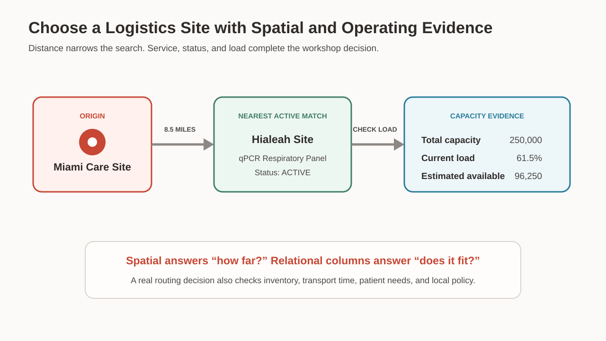
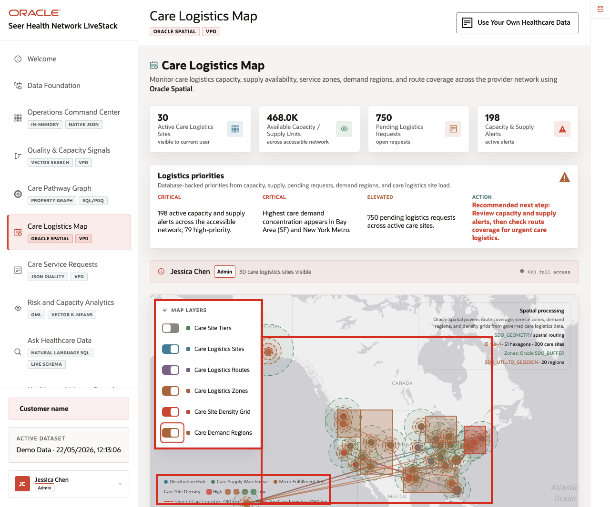

# Care Logistics with Oracle Spatial

## Introduction

The relationship map helps Jessica understand the care story, but request `170104` still needs a physical service in Miami. A logistics planner must identify a nearby active site. That site must support the diagnostic panel and have enough room in its workload.

Choosing the nearest site resembles choosing a store for an urgent purchase. The closest store is useless after closing, when it lacks the item, or when stock runs out. A dependable choice combines geography with operating facts that show whether the location can meet the need.

**Oracle Spatial** stores care and logistics locations as database geometry objects. Marcus can measure distance with SQL and combine it with service, status, capacity, and load columns. The final route follows visible rules that another person can review.

<details>
<summary><strong>Key terms: geometry, point, SRID, distance, capacity, and load</strong></summary>

> - A **geometry** is a database value that represents a real-world location or shape. Examples include a point, road, service area, or boundary. Oracle stores coordinates with information that lets SQL interpret and calculate with them.
> - A **point** is the simplest geometry because it represents one coordinate pair. In this lab’s WGS84 data, Oracle reads longitude first and latitude second. Many global mapping tools use this same reference system.
> - An **SRID**, or spatial reference system identifier, tells Oracle how to interpret the coordinates. The value `4326` identifies WGS84. Without a shared reference, similar-looking numbers might describe locations under different rules.
> - **Distance** is the measured separation between two geometries, returned here in miles. It answers only the geographic part of the routing question. It does not reveal service support, status, or available capacity.
> - **Capacity units** describe the total work a site can handle in this synthetic scenario. The measure becomes useful when everyone shares its definition and compares it with committed work.
> - **Current load percent** shows the share of total capacity already in use. The query converts the remaining percentage into estimated available units. This result gives Marcus more context than total capacity or load percentage alone.

</details>



*Figure 1: The routing decision combines location, service fit, status, and available capacity.*



*Figure 2: The application compares care sites and logistics locations.*

### Objectives

- Measure distance from the Miami care site.
- Rank the nearest active logistics sites.
- Filter for the requested diagnostic service.
- Estimate available capacity from total capacity and current load.

Estimated Time: **10 minutes**

### Business Scenario

| Step | Healthcare focus |
| --- | --- |
| Business Problem | A Miami care site needs a nearby logistics site for a requested diagnostic panel. |
| Technical Challenge | City names alone do not show distance, service fit, status, or remaining capacity. |
| Persona Focus | A care logistics planner compares measurable routing evidence. |
| What You Will See | Spatial distance and relational operating columns work in the same SQL query. |
| Database Capability | `SDO_GEOMETRY` stores points and `SDO_GEOM.SDO_DISTANCE` measures distance. |
| Outcome | The planner identifies the closest active site that supports the service and passes the load rule. |
{: title="Care logistics scenario"}

**Persona focus:** You help a logistics planner combine distance with operating evidence. The choice uses service, status, and capacity instead of a guess from a map.

## Task 1: Rank the nearest active sites

Start with location and status.

1. Run the distance query.

    > **SQL Worksheet reminder:** Return to [Getting Started Task 2: Open SQL Worksheet](?lab=getting-started#Task2:OpenSQLWorksheet) if you need help running SQL.

    Read the query in four parts.

    1. The `origin` common table expression finds the stored point for Miami Oncology Care Center.
    2. `CROSS JOIN` makes that one origin point available to every logistics row.
    3. `SDO_GEOM.SDO_DISTANCE` measures miles between each site and Miami.
    4. `WHERE` keeps active sites, and `ORDER BY` places the nearest first.

    <details>
    <summary><strong>Why this matters: location and operations stay connected</strong></summary>

    > A separate mapping tool may show distance but not current service and capacity data.
    >
    > Oracle Spatial lets one query combine the map point with status, service, and load. The location result stays connected to operational evidence.

    </details>

    ```sql
    <copy>WITH origin AS (
      SELECT location
      FROM hc_care_sites
      WHERE care_site_name = 'Miami Oncology Care Center'
    )
    SELECT l.logistics_name,
           l.city,
           l.service_supported,
           l.site_status,
           ROUND(
             SDO_GEOM.SDO_DISTANCE(
               l.location,
               o.location,
               0.005,
               'unit=MILE'
             ),
             1
           ) AS distance_miles
    FROM hc_logistics_sites l
    CROSS JOIN origin o
    WHERE l.site_status = 'ACTIVE'
    ORDER BY distance_miles
    FETCH FIRST 3 ROWS ONLY;</copy>
    ```

    **Expected output: Nearby logistics sites**

    | Logistics Site | City | Service | Status | Miles |
    | --- | --- | --- | --- | ---: |
    | Hialeah Import Compliance Site | Hialeah | qPCR Respiratory Panel | ACTIVE | 8.5 |
    | Concord Southeast Micro Site | Concord | Infusion Center Slot Bundle | ACTIVE | 665.0 |
    | Etna Midwest Specialty Warehouse | Lebanon | Digital Pathology Slide Batch | ACTIVE | 805.1 |
    {: title="Nearby logistics sites"}

2. Review the distance result.

    Hialeah is 8.5 miles from the Miami origin. The next two active sites are hundreds of miles away.

    Distance makes Hialeah the first site to inspect. It does not finish the decision. The site must also support the requested service and have acceptable load.

## Task 2: Add service and capacity rules

1. Run the service and load query.

    The query keeps only active sites that support `qPCR Respiratory Panel`. It also requires `CURRENT_LOAD_PCT` below 80.

    `ESTIMATED_AVAILABLE_UNITS` applies a simple workshop calculation:

    `capacity units × (1 - current load percent)`

    This estimate gives the planner more context than total capacity alone.

    ```sql
    <copy>WITH origin AS (
      SELECT location
      FROM hc_care_sites
      WHERE care_site_name = 'Miami Oncology Care Center'
    )
    SELECT l.logistics_name,
           l.service_supported,
           l.capacity_units,
           l.current_load_pct,
           ROUND(
             l.capacity_units * (1 - l.current_load_pct / 100)
           ) AS estimated_available_units,
           ROUND(
             SDO_GEOM.SDO_DISTANCE(
               l.location,
               o.location,
               0.005,
               'unit=MILE'
             ),
             1
           ) AS distance_miles
    FROM hc_logistics_sites l
    CROSS JOIN origin o
    WHERE l.site_status = 'ACTIVE'
      AND l.service_supported = 'qPCR Respiratory Panel'
      AND l.current_load_pct < 80
    ORDER BY distance_miles;</copy>
    ```

    **Expected output: Qualified diagnostic site**

    | Logistics Site | Service | Capacity Units | Current Load Pct | Estimated Available Units | Miles |
    | --- | --- | ---: | ---: | ---: | ---: |
    | Hialeah Import Compliance Site | qPCR Respiratory Panel | 250000 | 61.5 | 96250 | 8.5 |
    {: title="Qualified logistics site"}

2. Explain the routing evidence.

    Hialeah is active, supports the requested panel, is below the workshop load limit, and is only 8.5 miles away. The simple calculation estimates 96,250 available units.

    This is synthetic workshop data. A real routing decision would also use current inventory, transport time, service rules, patient needs, and local operating policy.

    The important database pattern is clear: Spatial supplies distance, while relational columns supply the service and operating rules.

## Next Steps

You used Oracle Spatial to combine healthcare location and operating evidence. For a deeper workshop about Oracle Spatial, open the [Oracle Spatial LiveLabs workshop](https://livelabs.oracle.com/ords/r/dbpm/livelabs/view-workshop?clear=RR,180&wid=800).

## Acknowledgements

* **Author** - Linda Foinding, Principal Database Product Manager
* **Last Updated By/Date** - Linda Foinding, Principal Database Product Manager, August 2026
