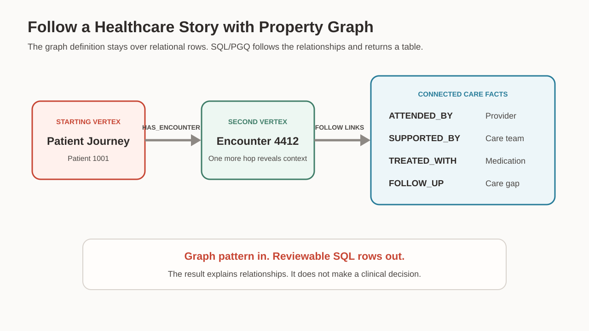
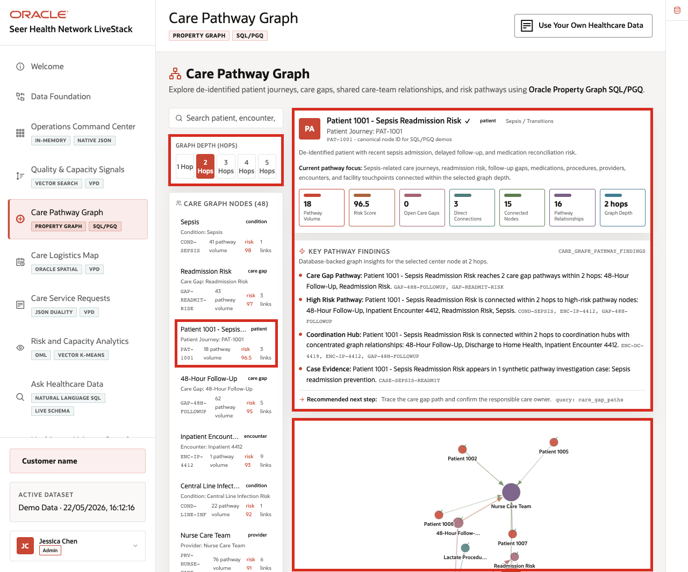

# Care Pathway with Property Graph

## Introduction

The quality analyst's vector search found records with related language, but Jessica's next question concerns connections. How do people, events, conditions, treatments, and follow-up steps come together around one journey? Similar words can point toward useful records, while relationships explain why those records belong together.

This kind of problem is not unique to healthcare. A traveler follows connected train stations, while an investigator links people to events. A customer-service team traces an order through payment, warehouse, carrier, and delivery. In every case, the individual records matter, but the links reveal the path.

**Oracle Property Graph** lets a care coordinator query those links with SQL Property Graph Queries, also called SQL/PGQ. The graph definition uses relational tables as its source, so the coordinator can start with one journey, follow named relationships, and return connected facts without copying pathway data.

<details>
<summary><strong>Key terms: vertex, edge, property graph, and SQL/PGQ</strong></summary>

> - A **vertex** represents something that can participate in a relationship. A journey, encounter, condition, provider, or care team can become a vertex. It can also carry properties such as a name or type.
> - An **edge** represents a named relationship between two vertices and can also carry its own properties. `HAS_CONDITION` explains why a condition connects to a journey, while `SUPPORTED_BY` explains how a care team connects to an encounter.
> - A **property graph** defines which rows become vertices and which rows become edges. It also selects the columns that become descriptive properties. This definition makes relationship questions easier to express than a long chain of joins.
> - **SQL/PGQ** is the SQL standard syntax for describing and matching graph patterns. `GRAPH_TABLE` turns matched vertices, edges, and properties into a normal table result. SQL can then filter, sort, join, or display those rows.
>
> A transit map is useful because a station list cannot explain a route by itself. The lines show which stations connect and which direction a traveler can move. The original station records still remain the source of truth.

</details>



*Figure 1: The graph follows connected care facts without copying them into a separate graph store.*



*Figure 2: The application shows connected facts around a patient-care journey.*

### Objectives

- Follow one-hop relationships from a patient-care journey.
- Follow a two-hop path through an encounter.
- Explain how `GRAPH_TABLE` turns a graph match into SQL rows.
- Keep the result in the correct healthcare context.

Estimated Time: **12 minutes**

### Business Scenario

| Step | Healthcare focus |
| --- | --- |
| Business Problem | A care reviewer needs a connected view of a patient journey. |
| Technical Challenge | Important facts sit in several related records and are hard to explain as isolated rows. |
| Persona Focus | A care coordinator follows the journey while a database developer explains the graph pattern. |
| What You Will See | One-hop and two-hop graph queries expose the people, events, and follow-up around the journey. |
| Database Capability | `CARE_PATHWAY_GRAPH` and `GRAPH_TABLE` support SQL/PGQ pattern matching. |
| Outcome | The reviewer can explain which care facts connect and why each link matters. |

**Persona focus:** You help a care coordinator follow the relationship path. You also keep the result separate from any clinical recommendation.

## Task 1: Follow the first circle of care facts

Start with the patient journey and follow each outgoing relationship so the first circle of care facts is visible as reviewable rows:

1. Run the one-hop graph query.

    > **SQL Worksheet reminder:** Return to [Getting Started Task 2: Open SQL Worksheet](?lab=getting-started#Task2:OpenSQLWorksheet) if you need help running SQL.

    Read the graph pattern from left to right:

    1. `(j IS care_node)` is the starting journey vertex.
    2. `-[r IS care_relationship]->` follows one directed edge.
    3. `(n IS care_node)` is the connected vertex.
    4. The `WHERE` clause selects one named patient journey.
    5. `COLUMNS` returns graph properties as normal SQL columns.

    <details>
    <summary><strong>Why this matters: relationship logic stays close to the data</strong></summary>

    > A relational version can use joins, but each added hop needs more aliases and join conditions.
    >
    > SQL/PGQ lets the query describe the relationship shape directly. The underlying rows remain in Oracle Database, and the result still returns as a table.

    </details>

    ```sql
    <copy>SELECT journey,
           relationship_type,
           connected_node,
           evidence_score
    FROM GRAPH_TABLE (
      care_pathway_graph
      MATCH (j IS care_node)-[r IS care_relationship]->(n IS care_node)
      WHERE j.node_label = 'Patient 1001 - Sepsis Readmission Risk'
      COLUMNS (
        j.node_label AS journey,
        r.relationship_type AS relationship_type,
        n.node_label AS connected_node,
        r.evidence_score AS evidence_score
      )
    )
    ORDER BY evidence_score DESC;</copy>
    ```

    **Expected output: Patient Journey Connections**

    | Journey | Relationship | Connected Care Fact | Evidence Score |
    | --- | --- | --- | ---: |
    | Patient 1001 - Sepsis Readmission Risk | HAS\_ENCOUNTER | Inpatient Encounter 4412 | 0.99 |
    | Patient 1001 - Sepsis Readmission Risk | HAS\_CONDITION | Sepsis | 0.96 |
    | Patient 1001 - Sepsis Readmission Risk | HAS\_CARE\_GAP | Readmission Risk | 0.94 |

2. Read the first relationship circle.

    The journey connects to an inpatient encounter, a condition, and a recorded care gap. The relationship name explains why each fact appears.

    `EVIDENCE_SCORE` is synthetic workshop data stored on each edge. It helps sort the demo relationships. It is not a clinical probability, diagnosis, or recommendation.

## Task 2: Look around the encounter

Next, follow a second hop through the encounter so the team can see care-team and follow-up facts connected to the same journey:

1. Run the two-hop query.

    The first hop moves from the patient journey to an encounter. The second hop moves from that encounter to other connected care facts.

    `encounter.node_type = 'ENCOUNTER'` makes the middle point explicit. The query then returns only the second relationship and destination.

    ```sql
    <copy>SELECT relationship_type,
           connected_node,
           node_type,
           evidence_score
    FROM GRAPH_TABLE (
      care_pathway_graph
      MATCH (j IS care_node)-[first_hop IS care_relationship]->
            (encounter IS care_node)-[r IS care_relationship]->(n IS care_node)
      WHERE j.node_label = 'Patient 1001 - Sepsis Readmission Risk'
        AND encounter.node_type = 'ENCOUNTER'
      COLUMNS (
        r.relationship_type AS relationship_type,
        n.node_label AS connected_node,
        n.node_type AS node_type,
        r.evidence_score AS evidence_score
      )
    )
    ORDER BY evidence_score DESC;</copy>
    ```

    **Expected output: Encounter Care Team and Follow-Up**

    | Relationship | Connected Care Fact | Type | Evidence Score |
    | --- | --- | --- | ---: |
    | ATTENDED\_BY | Dr. Hannah Lee - Hospitalist | PROVIDER | 0.95 |
    | SUPPORTED\_BY | Nurse Care Team | CARE\_TEAM | 0.91 |
    | REQUIRES\_FOLLOW\_UP | 48-Hour Follow-Up | CARE\_GAP | 0.88 |
    | TREATED\_WITH | Piperacillin/Tazobactam | MEDICATION | 0.87 |

2. Turn the rows into a relationship story.

    The encounter connects to a provider, a nurse team, a follow-up record, and a medication record. The graph makes those links visible in one result.

    This workshop uses synthetic data to teach the SQL pattern. The result supports operational review only. It does not replace medical records, clinical judgment, or patient-care policy.

## Next Steps

You used SQL/PGQ to move from one journey to connected healthcare evidence. For a deeper workshop about Property Graph, open the [Property Graph LiveLabs workshop](https://livelabs.oracle.com/ords/r/dbpm/livelabs/view-workshop?clear=RR,180&wid=3978).

## Acknowledgements

* **Author** - Oracle Database Product Management
* **Contributor** - Linda Foinding, Principal Database Product Manager
* **Last Updated By/Date** - Oracle Database Product Management, July 2026
