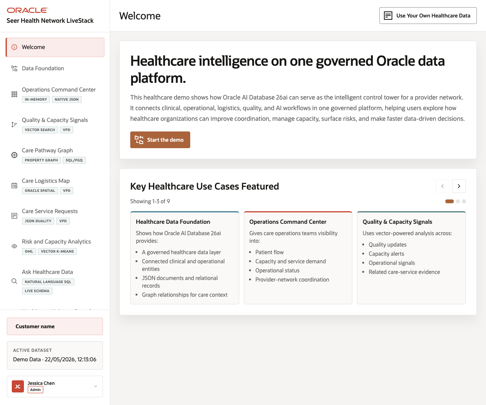

# Final Quiz

```quiz-config
passing: 75
badge: images/healthcare-badge.png
```

## Introduction

Jessica’s investigation succeeded because each result remained connected to evidence that another person could review. This scored quiz asks you to retrace her decision path. You will match each Seer Health outcome to the Oracle Database capability that supported it.

### Objectives

- Review the main healthcare questions.
- Match each outcome to the right Oracle Database capability.
- Check that you understand the limits of search, graph, spatial, and model evidence.
- Earn the healthcare completion badge.

Estimated Time: **5 minutes**

## Task 1: Answer the quiz questions

1. Complete the scored quiz.

    ```quiz score
    Q: Why does the workshop begin with the healthcare data foundation?
    - To move each healthcare data type into a different system.
    * To map the shared data and objects used by the later labs.
    - To replace the application with database catalog pages.
    - To prove that every database object has the same type.
    > The foundation lab shows the views, duality view, vectors, graph, spatial layers, model, and records used throughout the healthcare journey.

    Q: What is the main value of rebuilding command-center KPIs with SQL?
    - It makes the dashboard image the final source of truth.
    - It hides the detailed signal rows from the reviewer.
    * It connects summary numbers to reviewable healthcare evidence.
    - It removes the need for governed database views.
    > The KPI query returns the summary. The next queries show the five elevated signals and the service categories behind that summary.

    Q: What does JSON Relational Duality provide for request 170104?
    - A separate JSON copy that requires an hourly synchronization job.
    * A JSON document and relational SQL access over the same source facts.
    - A graph that replaces the request and item tables.
    - A map layer for the logistics assignment.
    > The application reads a request document while analysts can query the request, site, logistics, and item rows with SQL.

    Q: Why does the vector lab calculate similarity from cosine distance?
    * A higher similarity value makes the closest meaning easier to recognize.
    - It proves that the highest result is clinically correct.
    - It changes every service description into the same text.
    - It counts how many signals belong to each category.
    > The query uses 1 minus cosine distance. Higher similarity means the stored text is closer to the search phrase, but a person still reviews the result.

    Q: What does the property graph add to the patient-journey review?
    - It predicts future patient treatment.
    - It stores a second copy of every medical record.
    * It shows how journey, encounter, provider, team, medication, and follow-up facts connect.
    - It replaces healthcare policy with an evidence score.
    > SQL/PGQ matches relationship patterns and returns the connected facts as SQL rows. The synthetic evidence score is not a clinical probability.

    Q: Why does the logistics decision use more than distance?
    - The nearest city name always proves a site is ready.
    - Spatial distance includes service and load automatically.
    - Total capacity alone shows how many units remain.
    * The site must also be active, support the service, and pass the load rule.
    > The query combines Spatial distance with service, status, current load, and estimated available capacity.

    Q: What does the OML model inventory tell the planner?
    - The model will always make the correct decision.
    * Which stored model, mining function, and algorithm produce the score.
    - Which logistics site is closest to Miami.
    - How Oracle assembles the JSON request.
    > A model result is easier to review when the team can identify the stored classification model that produced it.

    Q: What does a prediction probability of 0.5046 mean in the new scenario?
    - The HIGH label is certain.
    - The model is 100 percent accurate on future data.
    - The value is the current capacity ratio.
    * The result is near the model boundary and needs careful review.
    > Probability shows how strongly the model supports its returned label. A value near 0.5 is weak evidence, not certainty.

    Q: Why is the training-row agreement check not a production accuracy test?
    - It uses a spatial index instead of an OML model.
    - It compares JSON fields rather than model labels.
    * It scores the same small synthetic data used to train the model.
    - It returns both HIGH and LOW labels.
    > Training agreement confirms that the workshop model uses the expected data. Production evaluation needs separate test data, monitoring, governance, and business review.

    Q: What is the main advantage of the converged Oracle AI Database foundation?
    - Each healthcare capability must use a separate data store.
    - Application screenshots replace the need for SQL evidence.
    * Relational, JSON, vector, graph, spatial, and OML evidence stay connected.
    - Model output replaces human review.
    > The workshop uses the right capability for each healthcare question while keeping the evidence connected to one governed data foundation.
    ```

2. Review your healthcare completion badge.

    

## Acknowledgements

* **Author** - Oracle Database Product Management
* **Contributor** - Linda Foinding, Principal Database Product Manager
* **Last Updated By/Date** - Oracle Database Product Management, July 2026
