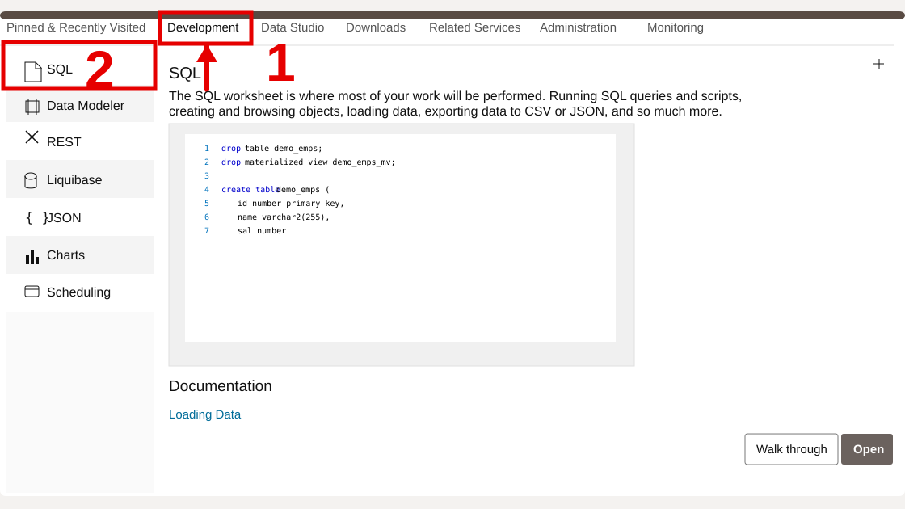
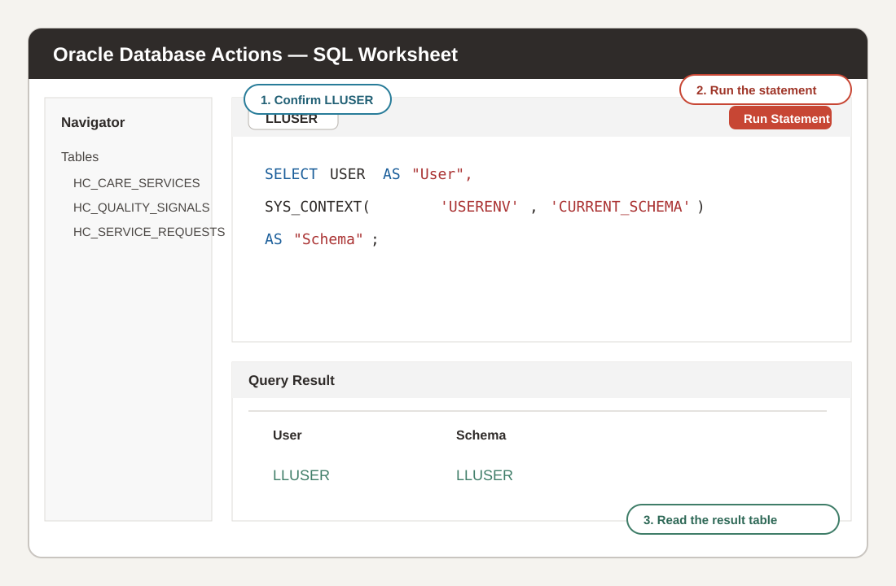

# Getting Started

## Introduction

Before Jessica's team can investigate the dashboard warning, they need to enter the correct workspace and use the shared Seer Health facts. This setup resembles arriving at a new workplace: the building, security badge, desk, and tools must match the job before the work can begin.

In this lab, you open the LiveLabs reservation and sign in to the provided **Autonomous Database 26ai** environment. You then prepare **SQL Worksheet** for the investigation. Every later query runs as `LLUSER` and returns results from the prepared Seer Health schema.

<details>
<summary><strong>Key terms: Database Actions, SQL Worksheet, and LLUSER</strong></summary>

> - **Database Actions** is Oracle’s browser-based workspace for working with a database. It gathers SQL Worksheet, object browsing, and data loading in one place. Think of it as an office portal that gives an employee access to daily tools.
> - **SQL Worksheet** is the area where you write and run SQL statements. The upper area holds the query, while the lower area shows returned rows, messages, or errors. Keeping both areas visible helps you connect each question with the database answer.
> - `LLUSER` is the workshop database user and owner of the prepared Seer Health schema. Oracle checks this identity when deciding which database objects are available. Signing in as `LLUSER` gives you the tables, views, vectors, graph, spatial objects, and machine learning model used here.

</details>

### Objectives

- Launch the LiveLabs environment.
- Open Database Actions from the reservation information.
- Sign in as `LLUSER`.
- Confirm that SQL Worksheet is using the healthcare schema.

Estimated Time: **5 minutes**

## Task 1: Launch the LiveLabs environment

Start from the LiveLabs reservation so you use the database, application links, and sign-in details prepared for this workshop:

1. Sign in to [LiveLabs](https://livelabs.oracle.com) with your Oracle account.

2. Open this workshop, select **Start**, and select **Run on LiveLabs Sandbox**.

3. In **My Reservations**, select **Launch Workshop**.

4. Select **View Login Info**.

    

    *Figure 1: Reservation Information provides the `LLUSER` login, password, and Database Actions URL.*

## Task 2: Open SQL Worksheet

Next, open **SQL Worksheet** as `LLUSER` so every later healthcare query runs against the prepared Seer Health schema.

1. Confirm that **1 - Login** shows `LLUSER`.

2. Select **Copy** beside **2 - Password**.

    

    *Figure 2: Copy the password supplied for `LLUSER`.*

3. Select **Open Link** beside **3 - Login URL**.

    

    *Figure 3: Open the Database Actions sign-in page.*

4. Confirm that the username is `LLUSER`, paste the password, and select **Sign in**.

    

    *Figure 4: Sign in to Database Actions as `LLUSER`.*

5. Select **Development**, and then select **SQL**.

    

    *Figure 5: Open SQL Worksheet from the Development tools.*

6. Use this same pattern throughout the workshop.

    

    *Figure 6: Paste a query, run it, and read the result table.*

    - Confirm the user shows `LLUSER`.
    - Paste one workshop SQL block into the editor.
    - Select **Run Statement** or press **Ctrl+Enter**.
    - Read the result in **Query Result**.
    - Use **Navigator** only when you want to inspect database objects.

7. Run this connection check.

    `USER` shows who signed in. `CURRENT_SCHEMA` shows where unqualified table names resolve. Both values should be `LLUSER`.

    ```sql
    <copy>SELECT USER AS "User",
           SYS_CONTEXT('USERENV', 'CURRENT_SCHEMA') AS "Schema",
           SYSTIMESTAMP AS "Checked At";</copy>
    ```

    **Expected output: Connected SQL Worksheet Session**

    | User | Schema | Checked At |
    | --- | --- | --- |
    | LLUSER | LLUSER | Current SQL Worksheet timestamp |

8. Confirm that both **User** and **Schema** show `LLUSER`.

    You are now ready to query the Seer Health data foundation.

## Acknowledgements

* **Author** - Oracle Database Product Management
* **Contributor** - Linda Foinding, Principal Database Product Manager
* **Last Updated By/Date** - Oracle Database Product Management, July 2026
