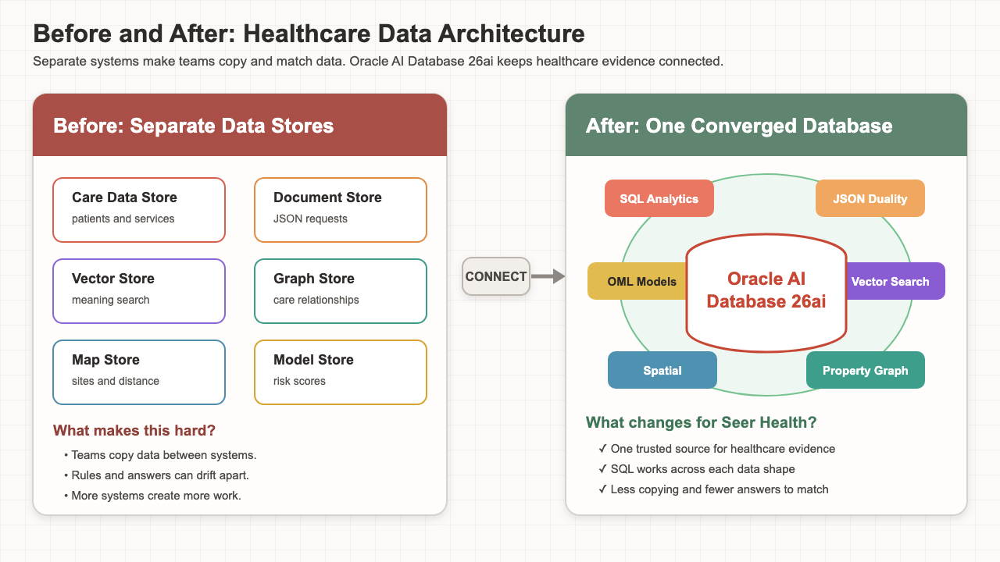
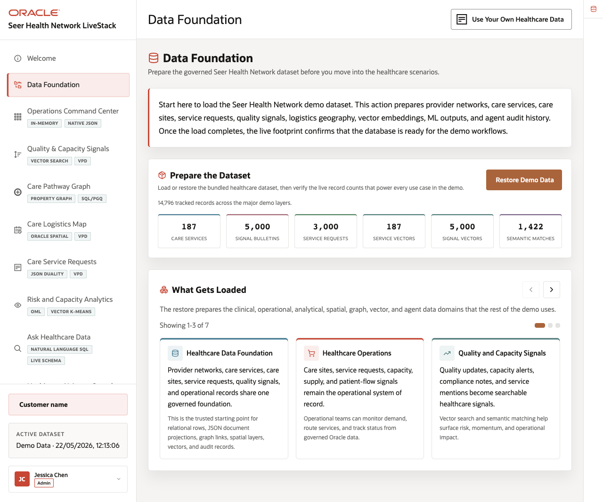

# Healthcare Data Foundation

## Introduction

Jessica’s dashboard warning raises an immediate question: where did the number come from? Before trusting any result, the team must identify the database objects that hold the evidence. They must also confirm that those objects belong to the same working environment.

A database developer begins by mapping the Seer Health foundation. The developer inventories the application views, JSON duality view, vector columns, property graph, spatial layers, and Oracle Machine Learning model. The next query counts the records that later tasks will use. This resembles checking shelves, an index, and inventory records before investigating a store’s missing-item report.

The purpose is not to memorize Oracle catalog names. Instead, you will see how **Oracle AI Database 26ai** keeps different data shapes close to governed facts. That shared foundation lets the team trace each later answer to a known source.



*Figure 1: A converged database reduces the need to copy healthcare data into separate specialist stores.*

<details>
<summary><strong>Key terms: schema, view, vector, graph, spatial layer, and OML model</strong></summary>

> - A **schema** is a named collection of database objects owned by one user. Think of it as a secured project room. `LLUSER` owns this workshop’s objects, while another user may own a different collection in the same database.
> - A **view** is a saved SQL query that presents data through a reusable set of columns. It acts like a prepared window into source tables. Applications and analysts can share its logic without rebuilding the same joins and calculations.
> - A **vector** is an ordered list of numbers that represents features of an item, such as text meaning. Related words and sentences often produce vectors that sit near one another mathematically. The database uses that closeness to rank services even when their wording differs.
> - A **property graph** represents things as vertices and their relationships as edges. Descriptive properties can belong to either one. A transit map offers a useful comparison because stations matter, but the connecting lines reveal possible routes.
> - A **spatial layer** contains stored locations or shapes that use a shared coordinate system. Once Oracle understands the coordinates, SQL can measure distance or test whether a location falls inside an area. The query can also combine geography with ordinary business rules.
> - An **Oracle Machine Learning model** is a mathematical pattern learned from training data and stored in Oracle Database. SQL can give the model a new row and receive a prediction. The source data and scoring process stay close enough for a reviewer to inspect.

</details>



*Figure 2: The application groups services, requests, signals, care paths, locations, and forecasts.*

### Objectives

- Inventory the healthcare object families.
- Count the healthcare data groups.
- Connect each object family to a later business question.

Estimated Time: **10 minutes**

### Business Scenario

| Step | Healthcare focus |
| --- | --- |
| Business Problem | Care, quality, logistics, and planning teams need a shared view of the facts they use. |
| Technical Challenge | Each question uses a different data shape, but teams must still trace results to one governed source. |
| Persona Focus | A database developer maps the foundation used by healthcare business teams. |
| What You Will See | One schema supports relational views, JSON, vectors, graphs, spatial data, and OML. |
| Database Capability | Oracle catalog views and healthcare views expose the current object and data inventory. |
| Outcome | Teams can trace each later result to the same healthcare foundation. |
{: title="Data foundation scenario"}

**Persona focus:** You work with a database developer to show Jessica where the evidence lives. Together, you connect each later question to this shared foundation.

## Task 1: Inventory the healthcare object families

Start with a capability map. This query asks Oracle Database which object families are available in `LLUSER`.

1. Run the inventory query.

    > **SQL Worksheet reminder:** Return to [Getting Started Task 2: Open SQL Worksheet](?lab=getting-started#Task2:OpenSQLWorksheet) if you need help pasting and running SQL.

    Read the query in six parts.

    1. `USER_VIEWS` counts the business-facing healthcare views.
    2. `USER_JSON_DUALITY_VIEWS` confirms the request duality view.
    3. `USER_PROPERTY_GRAPHS` confirms the care-path graph.
    4. `USER_TAB_COLS` counts the stored vector columns.
    5. `USER_SDO_GEOM_METADATA` counts the registered spatial layers.
    6. `USER_MINING_MODELS` confirms the OML model.

    `UNION ALL` stacks those counts into one readable result.

    <details>
    <summary><strong>Why this matters: one catalog instead of six systems</strong></summary>

    > In a fractured design, teams may inspect one system for JSON, another for vector search, another for graphs, another for maps, and another for machine learning.
    >
    > Oracle Database exposes these object families through one governed catalog. A platform team can see what is available before a business team depends on it.

    </details>

    ```sql
    <copy>SELECT 'Healthcare relational views' AS area, COUNT(*) AS object_count
    FROM user_views
    WHERE view_name IN (
      'CARE_SERVICES_V',
      'QUALITY_CAPACITY_SIGNALS_V',
      'CARE_LOGISTICS_SITES_V',
      'CARE_SERVICE_REQUESTS_V',
      'CARE_DEMAND_FORECASTS_V',
      'HEALTHCARE_AGENT_ACTIONS_V',
      'HEALTHCARE_COMMAND_CENTER_V'
    )
    UNION ALL
    SELECT 'JSON duality views', COUNT(*)
    FROM user_json_duality_views
    WHERE view_name = 'CARE_SERVICE_REQUESTS_DV'
    UNION ALL
    SELECT 'Healthcare property graphs', COUNT(*)
    FROM user_property_graphs
    WHERE graph_name = 'CARE_PATHWAY_GRAPH'
    UNION ALL
    SELECT 'MiniLM vector columns', COUNT(*)
    FROM user_tab_cols
    WHERE data_type = 'VECTOR'
      AND table_name IN ('HC_CARE_SERVICES', 'HC_QUALITY_SIGNALS')
    UNION ALL
    SELECT 'Spatial metadata layers', COUNT(*)
    FROM user_sdo_geom_metadata
    WHERE table_name IN ('HC_CARE_SITES', 'HC_LOGISTICS_SITES')
    UNION ALL
    SELECT 'OML mining models', COUNT(*)
    FROM user_mining_models
    WHERE model_name = 'CARE_DEMAND_RISK_MODEL';</copy>
    ```

    **Expected output: Available capabilities**

    | Area | Object Count |
    | --- | ---: |
    | Healthcare relational views | 7 |
    | JSON duality views | 1 |
    | Healthcare property graphs | 1 |
    | MiniLM vector columns | 2 |
    | Spatial metadata layers | 2 |
    | OML mining models | 1 |
    {: title="Database capabilities"}

2. Read the result as a capability checklist.

    The seven relational views give the application, dashboard, and agent-action history stable business shapes. The duality view serves a request as JSON. Two vector columns support meaning-based search. The property graph follows care relationships. The spatial layers describe stored locations. The OML model scores demand risk.

    Each row points to a later lab. Together, they show that Seer Health does not need a different data store for every question.

## Task 2: Confirm the healthcare dataset scale

The Data Foundation page reports **14,796 tracked records**. That number is not the size of one table. It adds six major layers used by the demo: source services, source signals, source requests, service vectors, signal vectors, and stored semantic matches. The next query rebuilds that total from the loaded `LLUSER` objects.

1. Run the count query.

    The `layer_counts` common table expression counts each layer once. A vector count includes only rows whose embedding was created successfully. The last branch adds the six counts so you can compare the database result with the Data Foundation page.

    Care sites, logistics sites, forecasts, and graph records also support the workshop. They are not included in this application KPI, so the total remains comparable with the page rather than mixing two definitions.

    ```sql
    <copy>WITH layer_counts (display_order, data_layer, records) AS (
      SELECT 1, 'Care services', COUNT(*)
      FROM hc_care_services
      UNION ALL
      SELECT 2, 'Signal bulletins', COUNT(*)
      FROM hc_quality_signals
      UNION ALL
      SELECT 3, 'Service requests', COUNT(*)
      FROM hc_service_requests
      UNION ALL
      SELECT 4, 'Service vectors', COUNT(*)
      FROM hc_care_services
      WHERE service_embedding IS NOT NULL
      UNION ALL
      SELECT 5, 'Signal vectors', COUNT(*)
      FROM hc_quality_signals
      WHERE signal_embedding IS NOT NULL
      UNION ALL
      SELECT 6, 'Semantic matches', COUNT(*)
      FROM hc_semantic_matches
    )
    SELECT data_layer, records
    FROM (
      SELECT display_order, data_layer, records
      FROM layer_counts
      UNION ALL
      SELECT 7, 'Total tracked records', SUM(records)
      FROM layer_counts
    )
    ORDER BY display_order;</copy>
    ```

    **Expected output: Dataset record layers**

    | Data Layer | Records |
    | --- | ---: |
    | Care services | 187 |
    | Signal bulletins | 5,000 |
    | Service requests | 3,000 |
    | Service vectors | 187 |
    | Signal vectors | 5,000 |
    | Semantic matches | 1,422 |
    | Total tracked records | 14,796 |
    {: title="Healthcare record layers"}

2. Use the counts as the baseline for later analysis.

    The 187 care services describe what the network offers, and 5,000 signal bulletins describe possible quality, capacity, access, and supply concerns. The 3,000 requests show the work moving through the network. Service and signal vectors are counted as analytical layers because the application can search them by meaning. The 1,422 semantic-match rows record service-to-signal relationships prepared for the experience.

    A later query may return one request, three vector matches, or five forecasts, but those focused results now come from the full documented baseline rather than a six-row sample dataset.

## Acknowledgements

* **Author** - Linda Foinding, Principal Database Product Manager
* **Last Updated By/Date** - Linda Foinding, Principal Database Product Manager, August 2026
