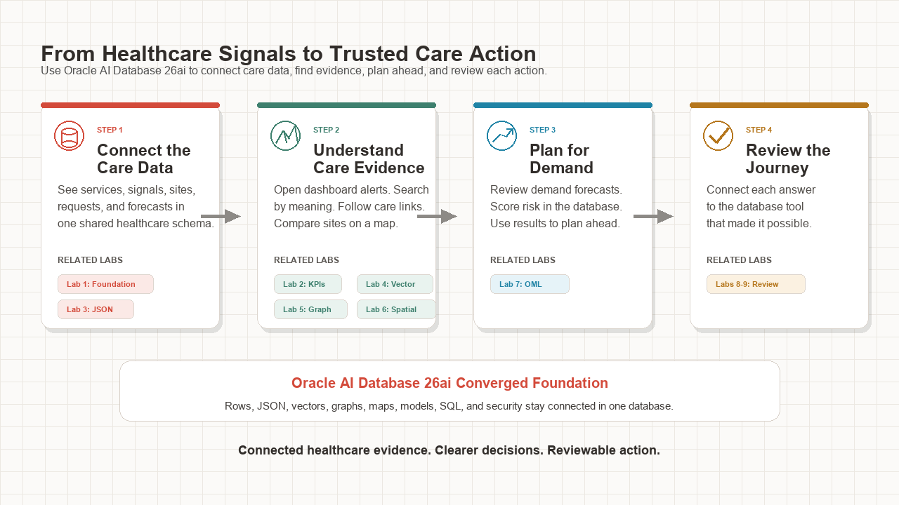
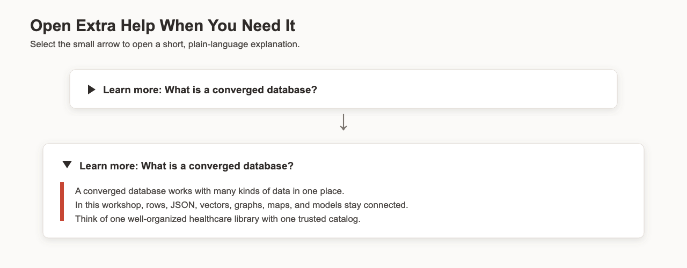
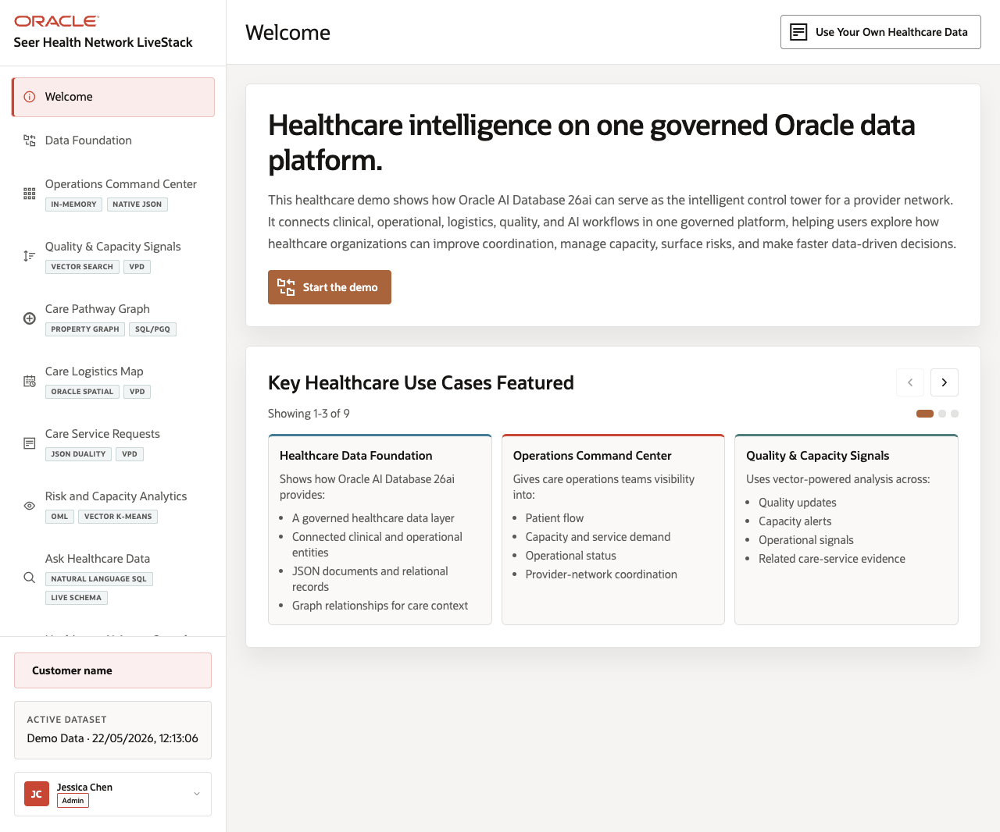

# Coordinate Healthcare Operations with Oracle AI Database 26ai

## Introduction

Imagine arriving on Monday morning and seeing a red warning on a shared operations dashboard. The number looks urgent, but it does not explain what changed, which requests are affected, where help is available, or what may happen next. This problem feels familiar in a hospital, delivery company, school, or busy store: people need a quick answer, but they also need enough evidence to trust it.

At **Seer Health Network**, active demo user Jessica Chen faces that problem when the command center reports elevated service signals. Jessica asks, "What is behind this number?" and several coworkers help her find the answer. An application developer opens the request, a quality analyst searches related notes, a care coordinator follows connected events, a logistics planner checks nearby capacity, and a capacity planner studies future demand. Each person views the problem from a different angle, but they all need the same evidence path.

During this workshop, you follow Jessica's investigation through **Oracle AI Database 26ai**. Relational rows hold dependable records, JSON presents a complete request to an application, vectors find text with similar meaning, a property graph reveals relationships, spatial data measures distance, and an in-database machine learning model scores future operating risk. Together, these capabilities form one connected evidence path rather than a collection of unrelated demonstrations.

*Figure 1: The workshop moves from connected healthcare data to evidence, planning, and review.*

The investigation begins with Jessica’s dashboard warning and moves steadily toward a planning decision. At each stage, SQL reveals another part of the story. Expandable explanations provide extra background when a database term or feature is new to you.

*Figure 2: Open a Learn more section when you want extra context.*

<strong>Learn more: What is a converged database?</strong>

> A **converged database** supports several ways to store, find, connect, and analyze information within one database platform. It does not force every fact into the same shape. Each kind of data can use a suitable shape while security, transactions, and management remain close to the source.
>
> A familiar comparison is a well-run library. Books, maps, photographs, and recordings use different formats. One catalog and one set of borrowing rules still help people find and connect them. Oracle Database follows the same idea across rows, JSON, vectors, graphs, locations, and machine learning models.
>
> Separate specialist systems often require copied data and extra synchronization jobs. Copies can become old, use different access rules, or produce answers that do not agree. A converged design reduces those handoffs. It helps a reviewer trace a dashboard number, search result, route, or prediction to supporting facts.

Jessica’s investigation follows one connected decision flow. She first learns which data and database objects are available. Next, she traces the command-center warning to named signals. The team then opens one request as JSON and relational rows, searches related language, and follows care relationships. Finally, they compare logistics locations and review future demand with Oracle Machine Learning.

The same flow appears in many industries. A retailer might begin with a low-stock warning and inspect the related order. The team could then search supplier notices, trace product relationships, choose a warehouse, and forecast demand. The nouns change, but the need stays the same. People must move from a summary signal to evidence, context, options, and a reviewable decision.

*Figure 3: Seer Health brings healthcare operations and database evidence into one experience.*

### Objectives

- Query the Seer Health data foundation.
- Explain command-center results with reviewable SQL.
- Read one service request as both JSON and relational rows.
- Search healthcare text by meaning with AI Vector Search.
- Follow care relationships with Property Graph and SQL/PGQ.
- Compare care logistics locations with Oracle Spatial.
- Review forecasts and score a demand-risk model with Oracle Machine Learning.
- Explain why connected evidence matters for healthcare operations.

Estimated Workshop Time: **95 minutes**

### Business Scenario

| Step | Healthcare focus |
| --- | --- |
| Business Problem | Seer Health needs faster care, quality, logistics, and capacity decisions without losing the evidence behind them. |
| Technical Challenge | Separate data stores can create copies, extra pipelines, different security rules, and results that are hard to reconcile. |
| Persona Focus | Care leaders, application developers, quality analysts, care coordinators, logistics planners, and capacity planners share one evidence path. |
| What You Will See | One Oracle AI Database 26ai foundation supports the healthcare decision flow from awareness to planning. |
| Database Capability | Relational SQL, JSON Relational Duality, vectors, property graphs, Spatial, and Oracle Machine Learning work together. |
| Outcome | Healthcare teams can observe, investigate, plan, and review decisions with database-backed evidence. |

**Persona focus:** You join Jessica and her coworkers as their database guide. You connect each operating question to facts that another person can review and reproduce.

## Acknowledgements

* **Author** - Oracle Database Product Management
* **Contributor** - Linda Foinding, Principal Database Product Manager
* **Last Updated By/Date** - Oracle Database Product Management, July 2026
