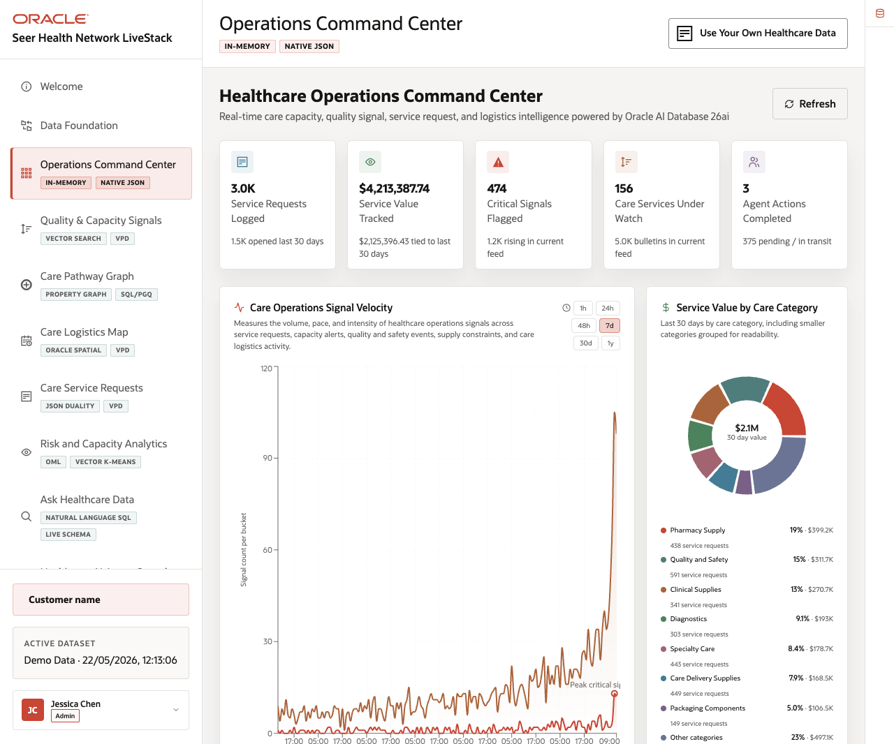

# Operations Command Center

## Introduction

When Jessica opens the Seer Health command center, one number demands attention: five signals have **CRITICAL** or **HIGH** priority. The summary helps her notice a problem quickly, but it cannot identify the affected services, explain why each signal matters, or show which team should respond first.

This situation is familiar outside healthcare. A car dashboard may show a warning light, while a school portal may show several absences. A store dashboard may show five delayed orders. Each summary earns attention, while the records behind it explain what happened and what someone can do next.

In this lab, you rebuild the command-center measures with SQL and open the five elevated signals. Then you group those signals by service category so Jessica can move from one KPI to named records, affected services, and suggested follow-up.

<details>
<summary><strong>Key terms: KPI, signal, criticality, and watched service</strong></summary>

> - A **KPI**, or key performance indicator, summarizes an important part of operations in one number. Leaders can scan it quickly and notice change. Its definition and supporting records still matter because the number alone rarely explains the cause.
> - A **signal** is a recorded alert, bulletin, or observation that may deserve attention. Like a phone notification, it points to something the team should review. It does not prove that harm occurred or tell a person what decision to make.
> - **Criticality** is the priority label assigned to a signal so people can sort a long list by urgency. This workshop uses `CRITICAL`, `HIGH`, `MEDIUM`, and `LOW`; those labels organize the review queue rather than replacing professional judgment.
> - A **watched service** is a service linked to at least one quality or capacity signal. The label tells Jessica that related evidence exists. The signal rows explain the concern and the recorded next step.
>
> A helpful comparison is a warning light on a car dashboard. The light gets the driver’s attention. A mechanic still reads the diagnostic details before deciding what work the car needs.

</details>



*Figure 1: The command center summarizes requests, value, signals, and watched services.*

### Objectives

- Rebuild the command-center KPIs with SQL.
- Trace the elevated-signal count to named healthcare records.
- Find which service categories carry the most elevated signals.

Estimated Time: **12 minutes**

### Business Scenario

| Step | Healthcare focus |
| --- | --- |
| Business Problem | Leaders need to know where care operations may need attention first. |
| Technical Challenge | A dashboard number can hide the records and definitions behind it. |
| Persona Focus | A care operations leader reviews requests, value, signals, and service pressure. |
| What You Will See | SQL reproduces each KPI and opens its supporting rows. |
| Database Capability | A governed command-center view and signal view provide the summary and detail. |
| Outcome | Leaders can move from a warning number to the healthcare facts behind it. |

**Persona focus:** You support Jessica Chen, the active demo user, as she studies the summary. Together, you turn it into a reviewable list of signals, affected services, and next steps.

## Task 1: Calculate the command-center KPIs

Start with the headline numbers shown at the top of the operating view so the dashboard warning becomes reviewable SQL evidence:

1. Run the KPI query.

    > **SQL Worksheet reminder:** Return to [Getting Started Task 2: Open SQL Worksheet](?lab=getting-started#Task2:OpenSQLWorksheet) if you need help running SQL.

    `HEALTHCARE_COMMAND_CENTER_V` is a saved view. It gives the dashboard one governed definition for four measures:

    1. the number of service requests,
    2. the value tracked by those requests,
    3. the number of `CRITICAL` or `HIGH` signals, and
    4. the number of services linked to signals.

    The view keeps the KPI logic in the database instead of rebuilding it in each application screen.

    <details>
    <summary><strong>Why this matters: one definition for the dashboard</strong></summary>

    > If an application, spreadsheet, and report each calculate the same KPI in a different place, the results can drift apart.
    >
    > A governed database view gives those tools the same definition. People can also query the view directly when they need to explain a number.

    </details>

    ```sql
    <copy>SELECT service_requests,
           tracked_service_value,
           elevated_signals,
           watched_services
    FROM healthcare_command_center_v;</copy>
    ```

    **Expected output: Command-Center KPI Summary**

    | Service Requests | Tracked Service Value | Elevated Signals | Watched Services |
    | ---: | ---: | ---: | ---: |
    | 6 | 6103.89 | 5 | 8 |

2. Interpret the KPI row.

    Seer Health tracks six requests worth 6,103.89 in this workshop data. Five signals have `CRITICAL` or `HIGH` priority. Eight services appear in the signal data.

    The number **5** is the next clue. You will now open those five signal rows.

## Task 2: Review the elevated signals

Next, review the elevated signal rows so the KPI becomes a prioritized list of services, priorities, and recorded next steps:

1. Run the signal query.

    The `WHERE` clause keeps only `CRITICAL` and `HIGH` signals. The `CASE` expression places critical items first. `SIGNAL_ID` gives the result a stable order inside each priority.

    The result returns more than a count. It shows the affected service and the recorded next step.

    ```sql
    <copy>SELECT signal_id,
           criticality,
           signal_type,
           service_name,
           next_step
    FROM quality_capacity_signals_v
    WHERE criticality IN ('CRITICAL', 'HIGH')
    ORDER BY CASE criticality WHEN 'CRITICAL' THEN 1 ELSE 2 END,
             signal_id;</copy>
    ```

    **Expected output: Elevated Healthcare Signals**

    | Signal Id | Priority | Signal Type | Service | Next Step |
    | ---: | --- | --- | --- | --- |
    | 101 | CRITICAL | Capacity Alert | Infusion Center Slot Bundle - Continuity Lot 2 | Review care-site capacity |
    | 103 | CRITICAL | Cold Chain Bulletin | mRNA LNP Clinical Batch | Check logistics impact |
    | 102 | HIGH | Capacity Alert | Infusion Center Slot Bundle - Continuity Lot 3 | Route capacity follow-up |
    | 104 | HIGH | Supply Quality Notice | Tamper-Evident Carton Batch | Open quality review |
    | 106 | HIGH | Patient Flow Alert | Bed Capacity Surge Playbook | Review surge playbook |

2. Connect the rows to the KPI.

    The query returns five rows. That matches **Elevated Signals** from Task 1.

    Two signals are critical. Three are high. Each row names a service and a next step. The dashboard warning now has evidence that a person can review and route.

## Task 3: Find the categories with the most elevated signals

Finally, group the elevated signals by service category so the team can see where operational pressure is concentrated:

1. Run the category query.

    `COUNT(*)` counts all watched signals in each category. The `CASE` expression counts only elevated signals. `COUNT(DISTINCT service_id)` shows how many different services appear.

    ```sql
    <copy>SELECT category,
           COUNT(*) AS watched_signals,
           SUM(CASE WHEN criticality IN ('CRITICAL', 'HIGH') THEN 1 ELSE 0 END) AS elevated_signals,
           COUNT(DISTINCT service_id) AS watched_services
    FROM quality_capacity_signals_v
    GROUP BY category
    ORDER BY elevated_signals DESC, watched_signals DESC, category;</copy>
    ```

    **Expected output: Signal Pressure by Service Category**

    | Category | Watched Signals | Elevated Signals | Watched Services |
    | --- | ---: | ---: | ---: |
    | Specialty Care | 4 | 3 | 4 |
    | Care Operations | 1 | 1 | 1 |
    | Quality and Safety | 1 | 1 | 1 |
    | Diagnostics | 2 | 0 | 2 |

2. Use the summary to set a review order.

    Specialty Care has the most watched signals and the most elevated signals. That makes it the first category to review in this small workshop scenario.

    This is a priority clue, not a clinical decision. Leaders still need to inspect staffing, patient needs, service rules, and current operations before acting.

## Acknowledgements

* **Author** - Oracle Database Product Management
* **Contributor** - Linda Foinding, Principal Database Product Manager
* **Last Updated By/Date** - Oracle Database Product Management, July 2026
