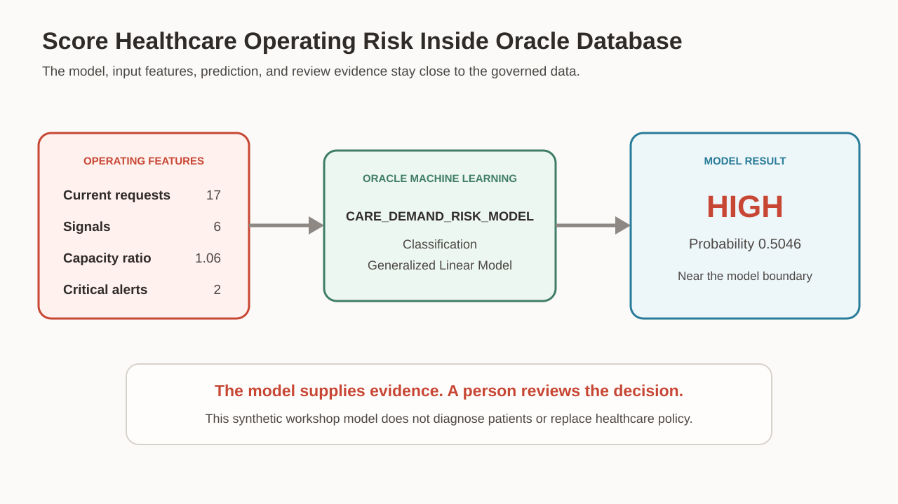
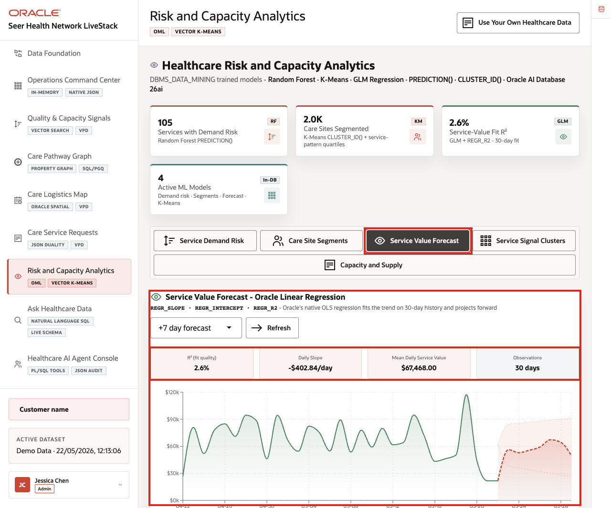

# Risk and Capacity Analytics with Oracle Machine Learning

## Introduction

Jessica now understands the warning, request, related signals, connected facts, and nearest workable site. Her final question looks ahead. If requests and critical alerts keep rising, should Seer Health prepare capacity before today’s pressure becomes tomorrow’s shortage?

People make similar choices when a store orders inventory or a school schedules staff. A delivery company also prepares vehicles for a busy week. Historical patterns help, but a responsible planner still examines the model, its inputs, and the strength of its result.

**Oracle Machine Learning (OML)** stores and scores models inside Oracle Database. A capacity planner can use SQL without exporting governed records to another prediction store. The planner inventories the model, ranks forecasts, checks training-row agreement, and scores a scenario near the decision boundary.

<details>
<summary><strong>Key terms: model, feature, classification, prediction, probability, and forecast</strong></summary>

> - A **model** is a mathematical pattern learned from example data and saved for evaluating new rows. It summarizes relationships found during training. Its usefulness depends on the quality, coverage, and continued relevance of those examples.
> - A **feature** is one input value used when the model calculates a score. This lab supplies request count, signal count, capacity ratio, and critical-alert count. A weather model follows the same idea with temperature, pressure, and wind.
> - **Classification** is a machine learning task that chooses from a defined set of labels. This model returns `HIGH` or `LOW`. The label organizes a planning review but does not make an automatic decision.
> - A **prediction** is the label returned for one new set of feature values. It reflects patterns learned from the training data. A person should interpret it beside current facts and known limits.
> - **Prediction probability** measures the model’s numerical support for its returned label. A value near `0.50` sits close to the decision boundary. A larger value shows stronger support, but neither value represents certainty.
> - A **forecast** estimates future demand for a service, place, and time period. Forecast rows help planners compare where pressure may rise. They still require review against recent events and operating knowledge.

</details>



*Figure 1: Oracle Machine Learning scores operating inputs in the database, then a person reviews the result.*



*Figure 2: The application helps planners compare forecasts and model evidence.*

### Objectives

- Confirm which OML model is available.
- Rank the highest demand forecasts.
- Review a simple training-data agreement check.
- Score a new operating scenario and interpret its probability carefully.

Estimated Time: **15 minutes**

### Business Scenario

| Step | Healthcare focus |
| --- | --- |
| Business Problem | Planners need to prepare before service demand becomes operating pressure. |
| Technical Challenge | Teams need reviewable model results without exporting governed healthcare data. |
| Persona Focus | A capacity planner uses the result while a database developer explains the model and SQL. |
| What You Will See | SQL inventories and scores a stored classification model. |
| Database Capability | `USER_MINING_MODELS`, `PREDICTION`, and `PREDICTION_PROBABILITY` support in-database scoring. |
| Outcome | The planner can connect a risk label to its model, input features, and probability. |
{: title="Risk analytics scenario"}

**Persona focus:** You help a capacity planner interpret a forecast and model score. The planner uses them as evidence rather than an automatic decision.

## Task 1: Review the model and demand forecast

Begin by confirming the model that will score the operating scenario.

1. Run the model inventory query.

    > **SQL Worksheet reminder:** Return to [Getting Started Task 2: Open SQL Worksheet](?lab=getting-started#Task2:OpenSQLWorksheet) if you need help running SQL.

    `USER_MINING_MODELS` is the OML catalog for models owned by `LLUSER`.

    `MINING_FUNCTION` shows that this is a classification model. `ALGORITHM` shows that it uses a generalized linear model.

    <details>
    <summary><strong>Why this matters: know the model before using the score</strong></summary>

    > A prediction is easier to review when the team knows which stored model produced it.
    >
    > Oracle Machine Learning keeps the model catalog, scoring SQL, input data, and output close together in Oracle Database.

    </details>

    ```sql
    <copy>SELECT model_name,
           mining_function,
           algorithm
    FROM user_mining_models
    WHERE model_name = 'CARE_DEMAND_RISK_MODEL';</copy>
    ```

    **Expected output: Stored OML model**

    | Model Name | Mining Function | Algorithm |
    | --- | --- | --- |
    | CARE\_DEMAND\_RISK\_MODEL | CLASSIFICATION | GENERALIZED\_LINEAR\_MODEL |
    {: title="Demand-risk model"}

2. Run the forecast query.

    The forecast view joins stored forecast rows to readable service names. `ORDER BY predicted_demand DESC` puts the largest forecast first.

    The forecast is planning data. It is separate from the OML score you will run later.

    ```sql
    <copy>SELECT service_name,
           region,
           predicted_demand,
           demand_risk_factor
    FROM care_demand_forecasts_v
    ORDER BY predicted_demand DESC
    FETCH FIRST 5 ROWS ONLY;</copy>
    ```

    **Expected output: Top demand forecasts**

    | Service | Region | Predicted Demand | Risk Factor |
    | --- | --- | ---: | ---: |
    | mRNA LNP Clinical Batch | Northeast Corridor | 2578 | 2.06 |
    | mRNA LNP Clinical Batch | New York Metro | 2310 | 1.94 |
    | mRNA LNP Clinical Batch | Los Angeles Basin | 2140 | 1.82 |
    | mRNA LNP Clinical Batch | Bay Area (SF) | 1980 | 1.74 |
    | Bed Capacity Surge Playbook | New York Metro | 1810 | 1.68 |
    {: title="Demand forecasts"}

3. Read the planning clue.

    The Northeast Corridor row has the largest predicted demand and risk factor in this workshop data. That makes it a sensible first row for a planner to inspect.

    A forecast does not make a capacity decision. It tells the team where to check staffing, supply, schedules, and current demand.

## Task 2: Check and score the model

Before scoring new input, look at a simple training-data agreement check.

1. Run the agreement query.

    The inner query compares the stored training label with the model prediction for the same row. The outer query counts each actual and predicted pair.

    Matching labels show that the model fits these twelve training rows. This is not a production accuracy test because the query uses the same small synthetic data used to train the model.

    ```sql
    <copy>SELECT actual_label,
           predicted_label,
           COUNT(*) AS scenario_count
    FROM (
      SELECT risk_flag AS actual_label,
             PREDICTION(CARE_DEMAND_RISK_MODEL USING *) AS predicted_label
      FROM hc_demand_training
    )
    GROUP BY actual_label, predicted_label
    ORDER BY actual_label, predicted_label;</copy>
    ```

    **Expected output: Training-label comparison**

    | Actual Label | Predicted Label | Scenario Count |
    | --- | --- | ---: |
    | HIGH | HIGH | 6 |
    | LOW | LOW | 6 |
    {: title="Training comparison"}

2. Interpret the check carefully.

    The model matches all twelve synthetic training rows. That confirms the workshop model uses the expected features.

    It does not prove that the model will perform the same way on real healthcare operations. A production evaluation needs separate test data, business review, monitoring, and governance.

3. Score a new scenario near the model boundary.

    The new row describes one planning period with four features:

    - **17 current requests** is the amount of active work waiting for service or fulfillment. A larger number can add pressure because more work is competing for the same people, time, and supplies.
    - **6 signals** means six quality, access, supply, or capacity bulletins are connected to that operating period. Signals do not prove a problem, but several at once can give the planner more reasons to review conditions.
    - **A capacity ratio of 1.06** compares available capacity with expected demand. A value of `1.00` means they are equal, so `1.06` represents about six percent more capacity than demand. That is a small cushion, not a large reserve.
    - **2 critical alerts** counts the most urgent signals inside the larger group of six. The model treats that concentration of urgent evidence as a separate input.

    Together, the values describe a network that still has a little room but is carrying meaningful workload and alert pressure. The model compares this combination with the patterns in its synthetic training rows.

    `PREDICTION` returns the label. `PREDICTION_PROBABILITY` returns the probability for that predicted label.

    ```sql
    <copy>SELECT PREDICTION(
             CARE_DEMAND_RISK_MODEL
             USING *
           ) AS predicted_risk,
           ROUND(
             PREDICTION_PROBABILITY(
               CARE_DEMAND_RISK_MODEL
               USING *
             ),
             4
           ) AS model_confidence
    FROM (
      SELECT 17   AS current_requests,
             6    AS signal_count,
             1.06 AS capacity_ratio,
             2    AS critical_alerts
    );</copy>
    ```

    **Expected output: Scenario risk score**

    | Predicted Risk | Model Confidence |
    | --- | ---: |
    | HIGH | 0.5046 |
    {: title="Scenario risk"}

4. Explain the score.

    The model returns `HIGH`, but the probability is close to `0.5`. That means the combination of 17 requests, six signals, a small six-percent capacity cushion, and two critical alerts sits near the model’s boundary between `LOW` and `HIGH`.

    This is more useful than treating every model label as certain. The planner can see the label, the input features, and the strength of the result.

    The model is a synthetic teaching example for operating demand. It does not diagnose a patient, recommend treatment, or replace healthcare policy and human judgment.

## Next Steps

You inventoried and scored an OML model with SQL. For a deeper workshop about Oracle Machine Learning, open the [Oracle Machine Learning LiveLabs workshop](https://livelabs.oracle.com/ords/r/dbpm/livelabs/view-workshop?clear=RR,180&wid=922).

## Acknowledgements

* **Author** - Linda Foinding, Principal Database Product Manager
* **Last Updated By/Date** - Linda Foinding, Principal Database Product Manager, August 2026
