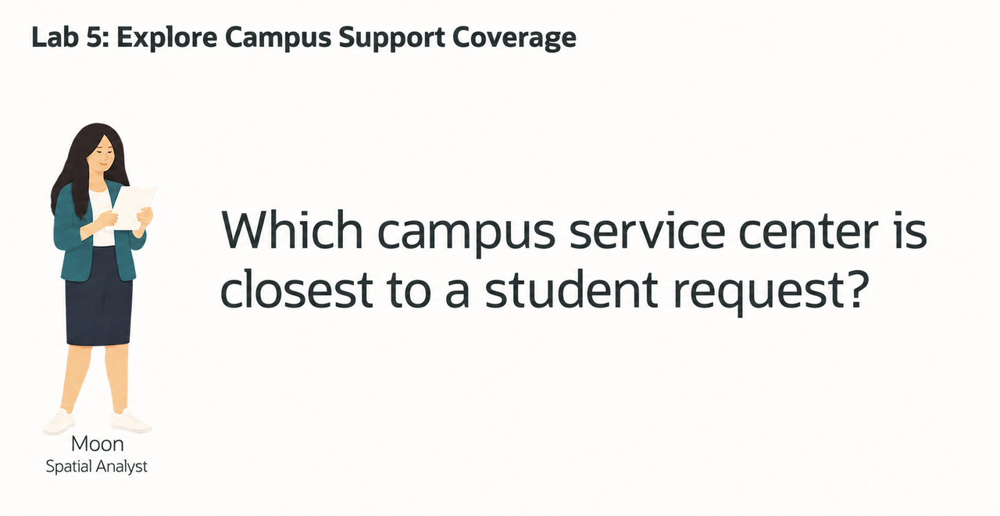
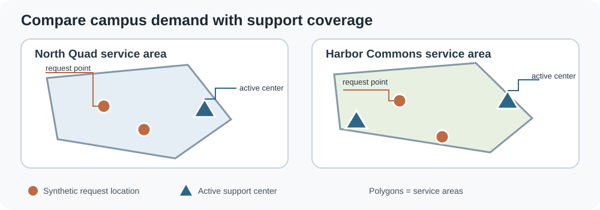
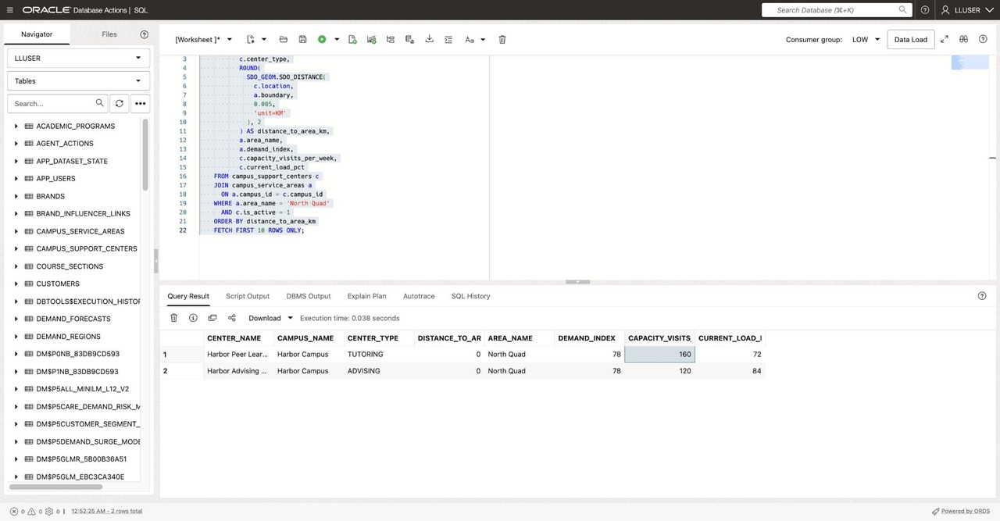

# Plan Campus Support with Oracle Spatial

## Introduction



Moon Kai is a spatial analyst at Seer Higher Education. Campus planners need to understand which support centers are near high-demand areas and which center is closest to a student's selected campus service location.

The workshop uses synthetic campus points and service-area polygons. Request locations represent campus service locations chosen for the demonstration; they are not student home addresses. Oracle Spatial can compare these shapes directly while SQL adds center capacity and workload.



<details>
<summary><strong>Key terms: point, polygon, distance, and GeoJSON</strong></summary>

> - A **point** represents one location, such as a campus support center.
> - A **polygon** represents an area, such as a campus service zone.
> - **Distance** measures the separation between two spatial objects. A zero distance means a point is inside or touching a region.
> - A **spatial relationship** tests how two geometries relate. Oracle Spatial functions can test whether a point interacts with a polygon.
> - **GeoJSON** is a JSON format for map locations. `SDO_UTIL.TO_GEOJSON` converts a database geometry to a map-friendly value.

</details>

### Objectives

- Inspect campus locations stored as `SDO_GEOMETRY` points.
- Convert a point to GeoJSON.
- Find support centers nearest to a campus service area.
- Match open requests in an area to the closest active center.

Estimated Time: **10 minutes**

### Hands-on Scenario

| Step | Higher Education focus |
| --- | --- |
| Business Problem | Planners need to match campus demand with available advising and tutoring locations. |
| Technical Challenge | Moon must combine points, service-area polygons, and center capacity. |
| Persona Focus | You review Moon's spatial approach and its operational result. |
| What You Will See | Oracle Spatial turns campus locations into distance and routing results. |
| Database Capability | `SDO_GEOMETRY`, `SDO_GEOM.SDO_DISTANCE`, `SDO_GEOM.RELATE`, and GeoJSON conversion. |
| Outcome | A planner can review demand area, nearest center, distance, and current load together. |

> **SQL Worksheet reminder:** Run the statements as `LLUSER`.

## Task 1: Inspect campus support-center points

Each active center has a location stored as an `SDO_GEOMETRY` point. The same value can be converted to GeoJSON for a campus map.

```sql
<copy>
SELECT center_id,
       center_name,
       campus_name,
       center_type,
       latitude,
       longitude,
       DBMS_LOB.SUBSTR(
         SDO_UTIL.TO_GEOJSON(location), 120, 1
       ) AS location_geojson
FROM campus_support_centers
WHERE is_active = 1
ORDER BY center_id
FETCH FIRST 5 ROWS ONLY;
</copy>
```

The coordinate system and geometry are stored together. Spatial functions can use the geometry for distance and relationship tests; the application can use the GeoJSON for display.

## Task 2: Find centers near a service area

1. Compare each support-center point with the North Quad service-area polygon:

    ```sql
    <copy>
    SELECT c.center_name,
           c.campus_name,
           c.center_type,
           ROUND(
             SDO_GEOM.SDO_DISTANCE(
               c.location,
               a.boundary,
               0.005,
               'unit=KM'
             ), 2
           ) AS distance_to_area_km,
           a.area_name,
           a.demand_index,
           c.capacity_visits_per_week,
           c.current_load_pct
    FROM campus_support_centers c
    JOIN campus_service_areas a
      ON a.campus_id = c.campus_id
    WHERE a.area_name = 'North Quad'
      AND c.is_active = 1
    ORDER BY distance_to_area_km
    FETCH FIRST 10 ROWS ONLY;
    </copy>
    ```

    

2. Review the distance and demand together. A distance of zero means the center is inside or touching the area. `0.005` is the comparison tolerance, and `'unit=KM'` requests kilometers.

3. Change the area name to `Harbor Commons` and run the query again. Compare the closest centers and current loads.

## Task 3: Match requests in an area to the closest center

This query finds open requests whose synthetic campus-service point is inside North Quad. It then ranks active centers on the same campus for each request.

```sql
<copy>
WITH area_requests AS (
    SELECT a.area_name,
           a.demand_index,
           a.campus_id,
           a.campus_name,
           r.request_id,
           r.student_id,
           s.student_key,
           r.request_type,
           r.origin_location
    FROM student_support_requests r
    JOIN students s
      ON s.student_id = r.student_id
    JOIN campus_service_areas a
      ON a.campus_id = r.campus_id
    WHERE a.area_name = 'North Quad'
      AND r.request_status = 'OPEN'
      AND SDO_GEOM.RELATE(
            a.boundary,
            'ANYINTERACT',
            r.origin_location,
            0.005
          ) = 'TRUE'
), ranked_centers AS (
    SELECT ar.area_name,
           ar.demand_index,
           ar.campus_id,
           ar.campus_name,
           ar.request_id,
           ar.student_key,
           ar.request_type,
           c.center_name,
           c.center_type,
           c.capacity_visits_per_week,
           c.current_load_pct,
           ROUND(
             SDO_GEOM.SDO_DISTANCE(
               ar.origin_location,
               c.location,
               0.005,
               'unit=KM'
             ), 2
           ) AS request_center_distance_km,
           ROW_NUMBER() OVER (
             PARTITION BY ar.request_id
             ORDER BY SDO_GEOM.SDO_DISTANCE(
                        ar.origin_location,
                        c.location,
                        0.005,
                        'unit=KM'
                      ), c.center_id
           ) AS center_rank
    FROM area_requests ar
    JOIN campus_support_centers c
      ON c.campus_id = ar.campus_id
     AND c.is_active = 1
)
SELECT area_name,
       demand_index,
       request_id,
       student_key,
       request_type,
       center_name,
       center_type,
       capacity_visits_per_week,
       current_load_pct,
       request_center_distance_km
FROM ranked_centers
WHERE center_rank = 1
ORDER BY request_center_distance_km, request_id
FETCH FIRST 25 ROWS ONLY;
</copy>
```

`SDO_GEOM.RELATE` filters requests to the area. `SDO_GEOM.SDO_DISTANCE` measures distance to each active center, and `ROW_NUMBER` keeps the nearest center for each request. The output uses a synthetic student key rather than a name or home address.

Change `North Quad` to `Harbor Commons` and compare the assignments. A planner should review the center's current load before routing work.

## Conclusion: Use location as one part of the service decision

Moon's queries move from points, to area distance, to request routing. The result connects campus location with center capacity and workload in SQL, so planners can use one view to decide where to review service coverage.

## Acknowledgements

* **Author** - Linda Foinding
* **Contributor** - Teodor Constantin Nechita
* **Last Updated By/Date** - Teodor Constantin Nechita, October 2026
