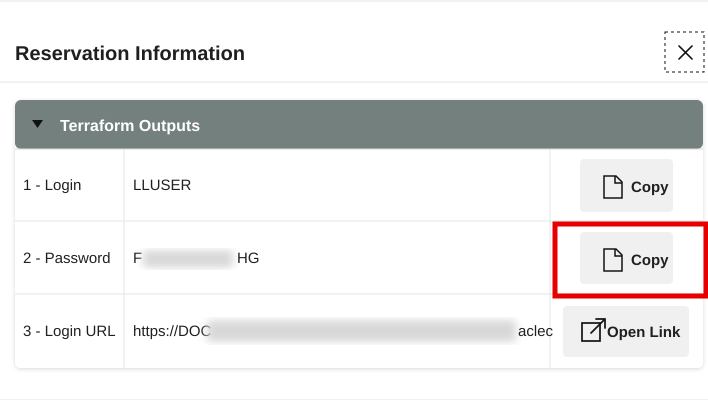
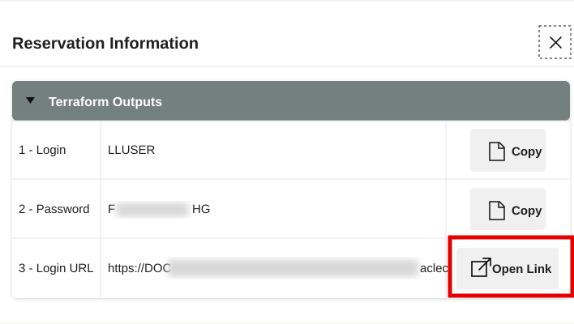
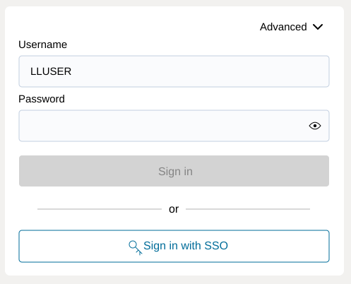

# Getting Started

<!-- markdownlint-configure-file
{
  "MD033": {
    "allowed_elements": [
      "details",
      "summary",
      "strong"
    ]
  }
}
-->

## Introduction

Use this lab to open the LiveLabs reservation, access the provisioned
**Autonomous Database 26ai** instance, and prepare SQL Worksheet for the Higher
Education exercises. The workshop database contains synthetic Seer Higher
Education data and the supporting objects used by the labs.

<details>
<summary><strong>Key terms: Database Actions, SQL Worksheet, and LLUSER</strong></summary>

> * **Database Actions** is the browser-based Oracle Database workspace used in
>   this workshop. It includes SQL Worksheet and tools for working with database
>   objects.
> * **SQL Worksheet** is where you paste and run SQL statements. It shows query
>   results, script output, and errors.
> * `LLUSER` is the workshop account used for the hands-on database objects.
>   Confirm the signed-in user before running a lab.

</details>

Estimated Time: **5 minutes**

### Objectives

* Launch the LiveLabs workshop environment.
* Open Database Actions using the reservation details.
* Open SQL Worksheet and confirm the workshop account.

## Task 1: Launch the LiveLabs environment

1. Sign in to [LiveLabs](https://livelabs.oracle.com) with your Oracle account.
2. Open this workshop, select **Start**, and select **Run on LiveLabs Sandbox**.
3. In **My Reservations**, select **Launch Workshop**.
4. Select **View Login Info** and keep the database credentials available for
    the next task.

    

## Task 2: Open SQL Worksheet

1. In the **Reservation Information** dialog, confirm that **1 - Login** shows `LLUSER`.
2. Select **Copy** for **2 - Password**.

    

3. Select **Open Link** for **3 - Login URL**.

    

4. On the Database Actions sign-in page, confirm that **Username** shows
    `LLUSER`, paste the reservation password, and select **Sign in**.

    

5. Select **Development**, then select **SQL** from the tools menu.

    

6. Run this check in SQL Worksheet:

    ```sql
    <copy>
    SELECT USER AS "User",
           SYS_CONTEXT('USERENV', 'CURRENT_SCHEMA') AS "Schema",
           SYSTIMESTAMP AS "Checked At";
    </copy>
    ```

    Confirm that both **User** and **Schema** show `LLUSER` before continuing.

    

    | User | Schema | Checked At |
    | --- | --- | --- |
    | LLUSER | LLUSER | Current SQL Worksheet timestamp |

7. Paste each lab’s SQL block into the editor. For a single query, select **Run
    Statement** or press **Ctrl+Enter**. When a task specifies **Run Script
    (F5)**, use it for the complete block and review **Script Output**.

You are ready to begin the Higher Education labs.

## Acknowledgements

* **Author** - Linda Foinding
* **Contributor** - Teodor Constantin Nechita
* **Last Updated By/Date** - Teodor Constantin Nechita, October 2026
