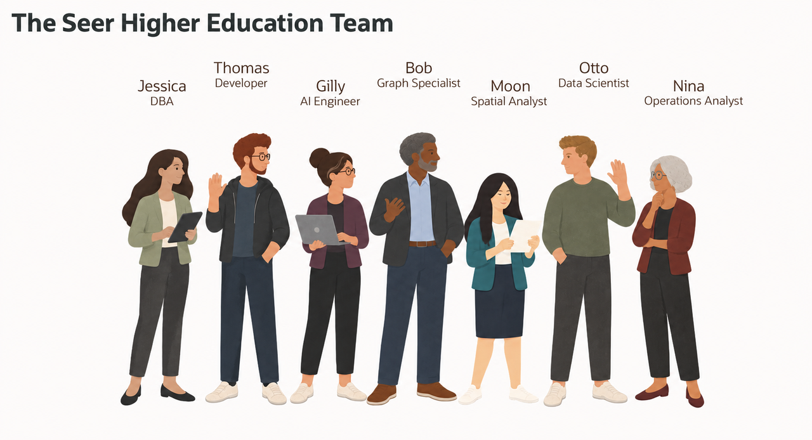
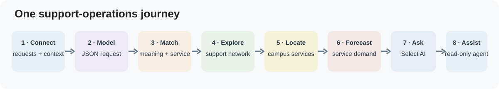

# Connected Student Support with Oracle AI Database

<!-- markdownlint-configure-file
{
  "MD013": {
    "code_blocks": false,
    "tables": false
  },
  "MD033": {
    "allowed_elements": [
      "details",
      "summary",
      "strong"
    ]
  }
}
-->

## Introduction

Jessica Chan is the database administrator at **Seer Higher Education**, a
fictional institution coordinating advising, tutoring, and student-support
services across its Harbor and Riverside campuses. Each team asks for a
different view of the same work: an application needs a flexible request
document, advisors need to find relevant services, planners need to see
connected support relationships and campus locations, and operations leaders
need to anticipate service demand.

The underlying information belongs together. Student and program records are
relational. Support requests also have flexible details, natural-language
descriptions, service locations, and relationships between students, courses,
advisors, and resources. If every team exports its own copy, staff must
reconcile records and permissions before they can act.

Jessica's team uses Oracle AI Database as a shared foundation. The labs show how
relational SQL, JSON, AI Vector Search, property graphs, Oracle Spatial, Oracle
Machine Learning, Select AI, and Select AI Agent work with connected Higher
Education data. The examples use fictional, synthetic records. They focus on
service operations and capacity planning rather than making academic or
admissions decisions about individual students.

### What the team builds

| Team member | Requirement | What you will see |
| --- | --- | --- |
| Jessica Chan, DBA | Give the student-support team one operational view. | A converged SQL query combines relational requests, semantic matches, JSON details, and campus location. |
| Thomas Brune, application developer | Support changing application requirements for student requests. | JSON columns, JSON collections, and JSON Relational Duality expose different application patterns over database records. |
| Gilly Bourne, AI engineer | Match a request to useful support resources. | An in-database embedding model ranks support resources by meaning; SQL links them to open requests. |
| Bob Green, graph specialist | Explore how students, courses, advisors, and services connect. | A property graph and SQL/PGQ show paths and shared support relationships. |
| Moon Kai, spatial analyst | Help planners understand campus service coverage. | Oracle Spatial finds support sites near campus demand areas and request locations. |
| Otto Spencer, data scientist | Anticipate changes in service workload. | Oracle Machine Learning trains and scores a support-demand model inside the database. |
| Nina Patel, student-success operations analyst | Ask questions about program and campus capacity. | Select AI generates SQL that can be inspected; a read-only agent adds a controlled tool and activity history. |

Follow a request through the workshop: combine its data, model it as JSON, find
relevant services, explore relationships and locations, review demand
predictions, and ask questions about support operations.

<strong>Learn more: What does a converged database mean?</strong>

> A converged database supports multiple data types and workloads on one
> database foundation. In this workshop, relational records, JSON documents,
> vectors, property graphs, geographic data, machine-learning models, and
> AI-assisted SQL work with the same governed information.
>
> Teams can use the data in the form an application or analysis needs while
> keeping records, privileges, and SQL access connected. They do not need a
> separate store and synchronization path for every new requirement.

### Objectives

* Follow Seer Higher Education teams as they coordinate student-support operations.
* Use relational SQL, JSON, AI Vector Search, property graphs, Oracle Spatial,
  Oracle Machine Learning, Select AI, and Select AI Agent.
* Explain how one Oracle AI Database can support these workloads without
  disconnected copies of the same records.
* Review generated SQL, database privileges, approved tools, and execution history.
* Keep operational planning separate from decisions about an individual
  student's academic outcome.

Estimated Workshop Time: **103 minutes**, based on the individual setup, lab,
and quiz estimates. The optional AutoML run may take additional time.

## Acknowledgements

* **Author** - Linda Foinding
* **Last Updated** - October 2026
