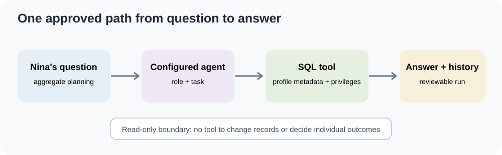
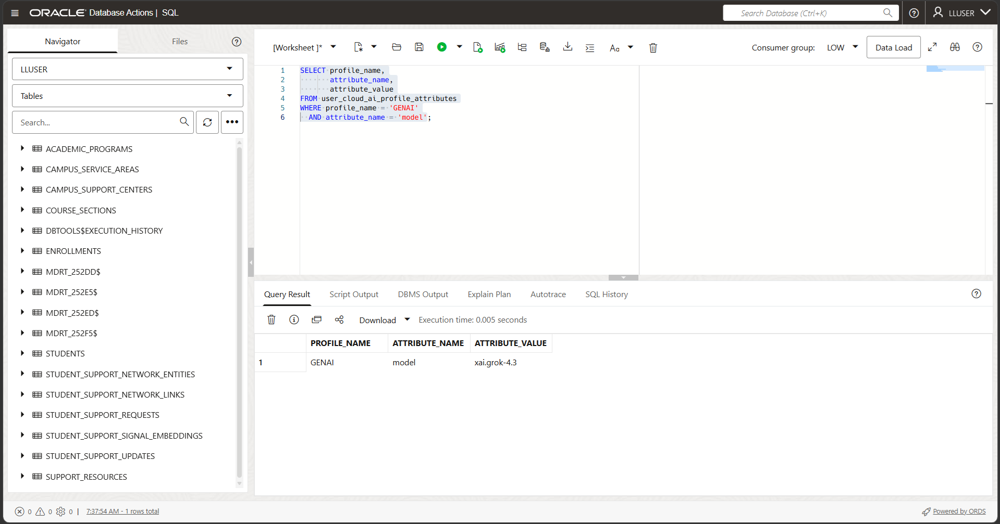
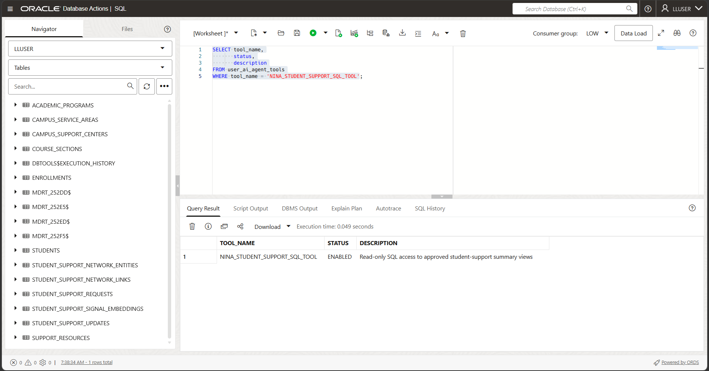
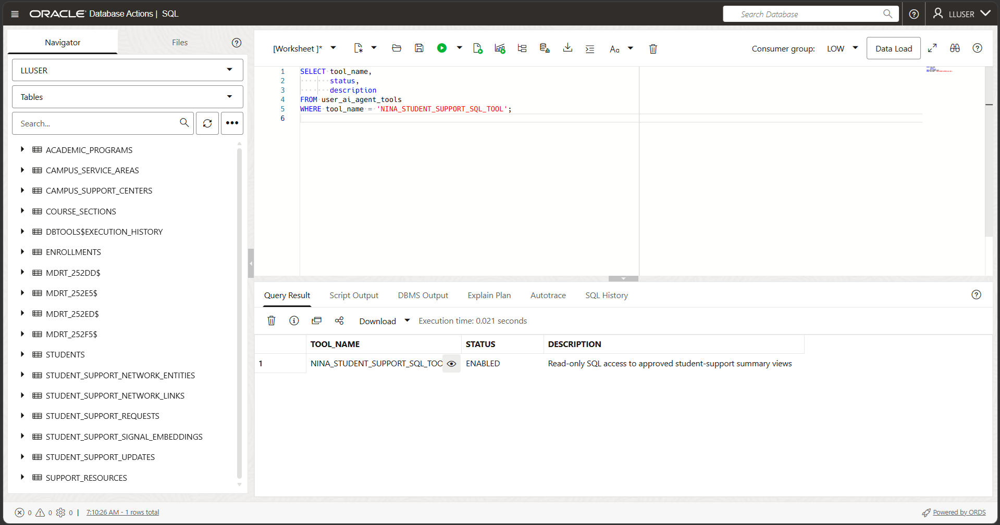
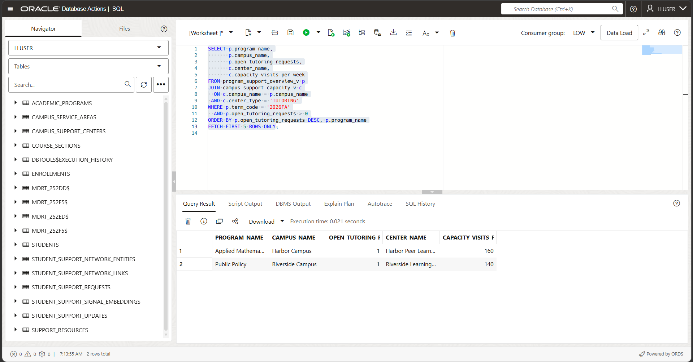
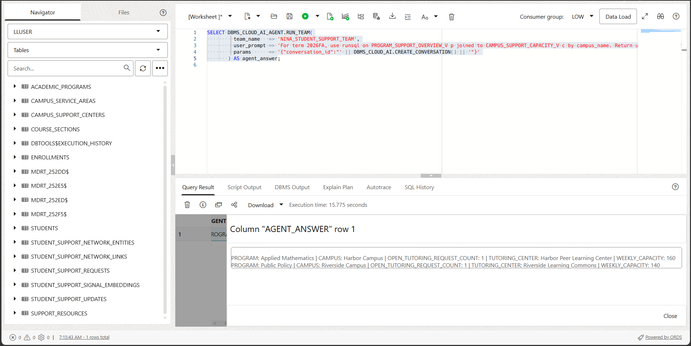
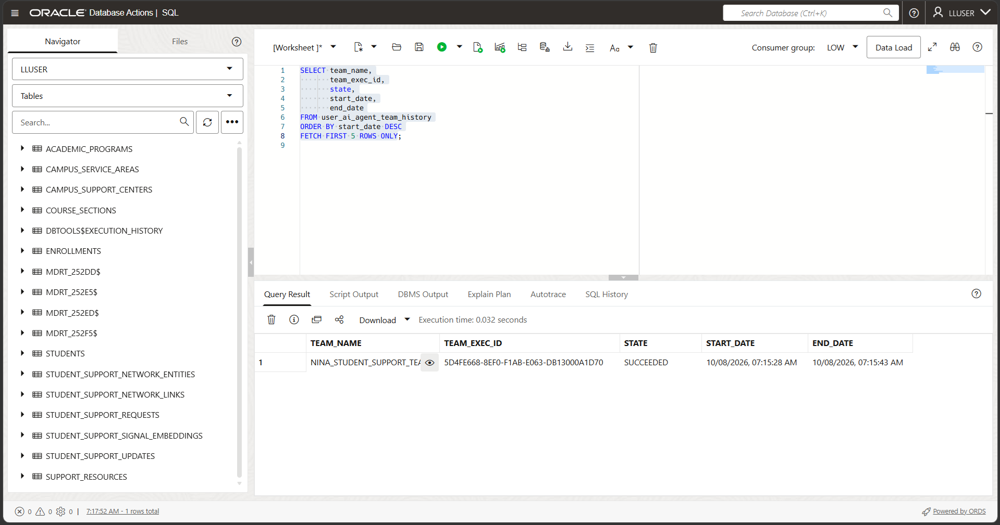
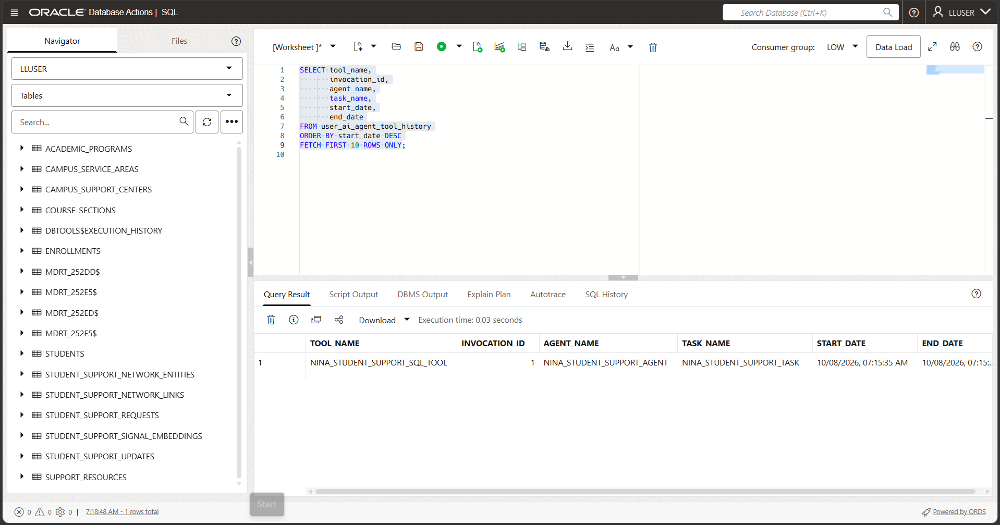
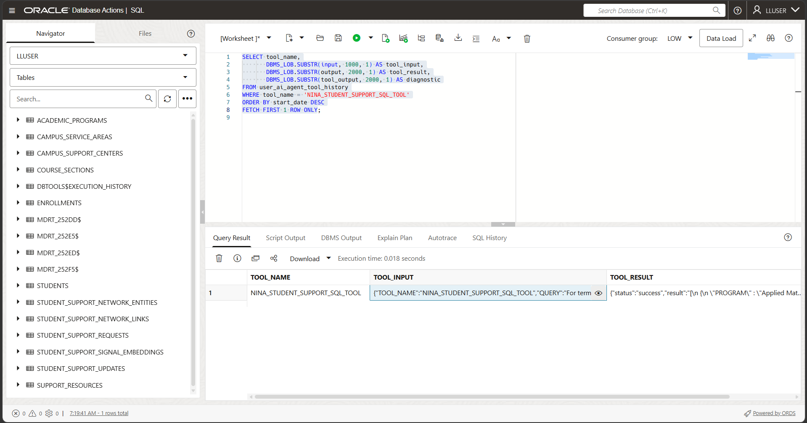

# Build a Student-Support Agent with Select AI Agent

## Introduction


Nina Patel has used Select AI to ask one student-support operations question at a time. She now wants a repeatable assistant for questions about aggregate campus workload and service capacity.

Jessica gives the agent one approved tool: a SQL tool that uses the `GENAI` profile and its allow-list of summary views. The tool is read-only. The agent cannot update requests, make admissions decisions, or determine what an individual student should receive.



<details>
<summary><strong>Key terms: agent, tool, task, and team</strong></summary>

> * An **agent** follows a configured role when it handles a request.
> * A **tool** is a capability the agent is allowed to call. This lab uses one
>   SQL tool.
> * A **task** tells the agent what to do and which tools it may use.
> * A **team** connects an agent and task so a SQL session or application can
>   run them together.

</details>

### Objectives

* Confirm that the `GENAI` profile and its view allow-list are available.
* Register a read-only SQL tool.
* Create an agent, task, and team with `DBMS_CLOUD_AI_AGENT`.
* Run an aggregate Higher Education operations question.
* Review team and tool history.

Estimated Time: **15 minutes**

### Hands-on Scenario

| Step | Higher Education focus |
| --- | --- |
| Business Problem | Nina needs repeatable answers about support operations and campus capacity. |
| Technical Challenge | The agent needs a narrow, reviewable way to query database information. |
| Persona Focus | You configure Nina's assistant with Jessica's access boundary. |
| What You Will See | An agent calls one SQL tool and records the execution history. |
| Database Capability | Select AI Agent, `DBMS_CLOUD_AI_AGENT`, profiles, and a built-in SQL tool. |
| Outcome | Nina has a controlled assistant for aggregate service-planning questions. |

> **Prerequisite:** Complete [Lab 7: Ask Student-Success Questions with Select AI](?lab=selectai). This lab uses the `GENAI` profile and its `object_list`.

## Task 1: Check the profile and approved views

1. Confirm that the profile is enabled:

    ```sql
    <copy>
    SELECT profile_name,
           status
    FROM user_cloud_ai_profiles
    WHERE profile_name = 'GENAI';
    </copy>
    ```

  

2. Review its object list by using **Run Script (F5)**:

    ```sql
    <copy>
    SELECT profile_name,
           attribute_name,
           attribute_value
    FROM user_cloud_ai_profile_attributes
    WHERE profile_name = 'GENAI'
      AND attribute_name = 'object_list';
    </copy>
    ```

    The list should contain only `PROGRAM_SUPPORT_OVERVIEW_V`, `CAMPUS_SUPPORT_CAPACITY_V`, and `COURSE_SECTION_CAPACITY_V` for the workshop schema.

3. Check existing agent definitions:

    ```sql
    <copy>
    SELECT agent_name, status
    FROM user_ai_agents
    WHERE agent_name LIKE 'NINA_STUDENT_SUPPORT_%'
    ORDER BY agent_name;
    </copy>
    ```

On your first pass through this lab, **No data found** is expected because you create Nina’s agent in Task 3. If `NINA_STUDENT_SUPPORT_AGENT` already exists, use the optional reset appendix before recreating the lab objects.

## Task 2: Register the approved SQL tool

1. Set the model used by Nina’s agent before registering the SQL tool. Then create the tool against the existing `GENAI` profile:

    ```sql
    <copy>
    BEGIN
      DBMS_CLOUD_AI.SET_ATTRIBUTE(
        profile_name    => 'GENAI',
        attribute_name  => 'model',
        attribute_value => 'xai.grok-4.3'
      );

      DBMS_CLOUD_AI_AGENT.CREATE_TOOL(
        tool_name   => 'NINA_STUDENT_SUPPORT_SQL_TOOL',
        attributes  => '{"tool_type":"SQL","tool_params":{"profile_name":"GENAI"},"instruction":"Use the runsql action to execute a read-only query against the approved summary views. Return the actual rows. If SQL fails or returns no rows, report that result; never supply example or invented values."}',
        description => 'Read-only SQL access to approved student-support summary views'
      );
    END;
    /
    </copy>
    ```

2. Confirm the model:

    ```sql
    <copy>
    SELECT profile_name,
           attribute_name,
           attribute_value
    FROM user_cloud_ai_profile_attributes
    WHERE profile_name = 'GENAI'
      AND attribute_name = 'model';
    </copy>
    ```

  

    The model value should be `xai.grok-4.3` before you run the team.

3. Confirm the tool definition:

    ```sql
    <copy>
    SELECT tool_name,
           status,
           description
    FROM user_ai_agent_tools
    WHERE tool_name = 'NINA_STUDENT_SUPPORT_SQL_TOOL';
    </copy>
    ```
  

The tool provides a named query capability. The profile's object list guides SQL generation, and the database user's privileges still control the objects the SQL can read.

## Task 3: Create Nina's agent, task, and team

1. Create the agent with a role that limits it to operational summaries:

    ```sql
    <copy>
    BEGIN
      DBMS_CLOUD_AI_AGENT.CREATE_AGENT(
        agent_name  => 'NINA_STUDENT_SUPPORT_AGENT',
        attributes  => '{"profile_name":"GENAI","role":"You are Nina Patel''s read-only student-support operations assistant at Seer Higher Education. Use only the approved SQL tool and actual database rows. Answer questions about aggregate campus service demand, program workload, and course-section capacity. If the tool fails or returns no rows, say so. Do not make admissions, disciplinary, eligibility, or individual academic outcome decisions. Do not invent values or change database records."}',
        description => 'Read-only student-support operations assistant'
      );
    END;
    /
    </copy>
    ```

2. Create a task that instructs the agent to invoke the approved tool once. Check the tool history after the run to confirm what it did:

    ```sql
    <copy>
    BEGIN
      DBMS_CLOUD_AI_AGENT.CREATE_TASK(
        task_name  => 'NINA_STUDENT_SUPPORT_TASK',
        attributes => '{"instruction":"Answer this student-support operations question: {query}. Use NINA_STUDENT_SUPPORT_SQL_TOOL with runsql once to retrieve aggregate rows. Return only values present in the tool output. If the tool fails or provides no rows, state that no verified answer is available. Do not repeat the tool call, invent values, change records, or decide outcomes for individual students.","tools":["NINA_STUDENT_SUPPORT_SQL_TOOL"],"enable_human_tool":"false"}',
        description => 'Answer read-only program and campus capacity questions'
      );
    END;
    /
    </copy>
    ```

3. Connect the agent and task in a team:

    ```sql
    <copy>
    BEGIN
      DBMS_CLOUD_AI_AGENT.CREATE_TEAM(
        team_name  => 'NINA_STUDENT_SUPPORT_TEAM',
        attributes => '{"agents":[{"name":"NINA_STUDENT_SUPPORT_AGENT","task":"NINA_STUDENT_SUPPORT_TASK"}],"process":"sequential"}',
        description => 'Read-only student-support planning team'
      );
    END;
    /
    </copy>
    ```

  

The team is the runnable unit. It connects Nina's assistant, task instructions, and approved SQL tool.

## Task 4: Run an operations question

1. Run this SQL first to see the database answer. The workshop seed data has fewer than five programs with open tutoring requests; return only the rows that exist.

    ```sql
    <copy>
    SELECT p.program_name,
           p.campus_name,
           p.open_tutoring_requests,
           c.center_name,
           c.capacity_visits_per_week
    FROM program_support_overview_v p
    JOIN campus_support_capacity_v c
      ON c.campus_name = p.campus_name
     AND c.center_type = 'TUTORING'
    WHERE p.term_code = '2026FA'
      AND p.open_tutoring_requests > 0
    ORDER BY p.open_tutoring_requests DESC, p.program_name
    FETCH FIRST 5 ROWS ONLY;
    </copy>
    ```

  

2. Ask the team for the same aggregate service-planning result:

    ```sql
    <copy>
    SELECT DBMS_CLOUD_AI_AGENT.RUN_TEAM(
             team_name   => 'NINA_STUDENT_SUPPORT_TEAM',
             user_prompt => 'For term 2026FA, use runsql on PROGRAM_SUPPORT_OVERVIEW_V p joined to CAMPUS_SUPPORT_CAPACITY_V c by campus_name. Return up to five programs where p.open_tutoring_requests > 0. Include only tutoring centers: filter c.center_type = ''TUTORING''. Include program, campus, open tutoring request count, tutoring center, and weekly capacity. Return only actual SQL tool rows, even if fewer than five exist. If the tool fails or returns no rows, say no verified answer is available. Do not include student names or example values.',
             params      => '{"conversation_id":"' || DBMS_CLOUD_AI.CREATE_CONVERSATION() || '"}'
           ) AS agent_answer;
    </copy>
    ```

  

Compare the response with the SQL rows from step 1. If the agent reports no tool data, or gives values that do not match the SQL, do not treat its answer as a result. Inspect the tool output in Task 5 and rerun after the model or profile issue is resolved. Wording may vary by provider; the SQL rows remain the evidence.

The SQL tool is read-only. The task gives the agent no tool for inserting, updating, or deleting records.

## Task 5: Inspect the agent history

1. Review the most recent team runs:

    ```sql
    <copy>
    SELECT team_name,
           team_exec_id,
           state,
           start_date,
           end_date
    FROM user_ai_agent_team_history
    ORDER BY start_date DESC
    FETCH FIRST 5 ROWS ONLY;
    </copy>
    ```

  

2. Review the most recent tool calls:

    ```sql
    <copy>
    SELECT tool_name,
           invocation_id,
           agent_name,
           task_name,
           start_date,
           end_date
    FROM user_ai_agent_tool_history
    ORDER BY start_date DESC
    FETCH FIRST 10 ROWS ONLY;
    </copy>
    ```
  

    The tool history should include `NINA_STUDENT_SUPPORT_SQL_TOOL`. Match the agent, task, and timestamps to the run you just started; these queries return recent activity without filtering to this team. Check the team’s `STATE` before treating the run as successful.

3. Inspect what the SQL tool actually returned:

    ```sql
    <copy>
    SELECT tool_name,
           DBMS_LOB.SUBSTR(input, 1000, 1) AS tool_input,
           DBMS_LOB.SUBSTR(output, 2000, 1) AS tool_result,
           DBMS_LOB.SUBSTR(tool_output, 2000, 1) AS diagnostic
    FROM user_ai_agent_tool_history
    WHERE tool_name = 'NINA_STUDENT_SUPPORT_SQL_TOOL'
    ORDER BY start_date DESC
    FETCH FIRST 1 ROW ONLY;
    </copy>
    ```

  

    If this returns no row, the team did not call the SQL tool. If `TOOL_RESULT` has no database rows or `DIAGNOSTIC` reports an error, the agent answer is not verified.

## Conclusion: Give the agent one controlled way to work

Nina's team combines a defined role, a narrow task, an approved SQL tool, and
execution history. The profile, object list, and database privileges help keep
the data boundary clear. The example stays read-only and focused on service
planning.

## Appendix: Reset the workshop agent objects

Run this block only if you want to remove the four objects created by this lab
before recreating them. It does not remove workshop data or profile settings.

```sql
<copy>
BEGIN
  DBMS_CLOUD_AI_AGENT.DROP_TEAM('NINA_STUDENT_SUPPORT_TEAM', TRUE);
  DBMS_CLOUD_AI_AGENT.DROP_TASK('NINA_STUDENT_SUPPORT_TASK', TRUE);
  DBMS_CLOUD_AI_AGENT.DROP_AGENT('NINA_STUDENT_SUPPORT_AGENT', TRUE);
  DBMS_CLOUD_AI_AGENT.DROP_TOOL('NINA_STUDENT_SUPPORT_SQL_TOOL', TRUE);
END;
/
</copy>
```

## Acknowledgements

* **Author** - Linda Foinding
* **Contributor** - Teodor Constantin Nechita
* **Last Updated By/Date** - Teodor Constantin Nechita, October 2026
