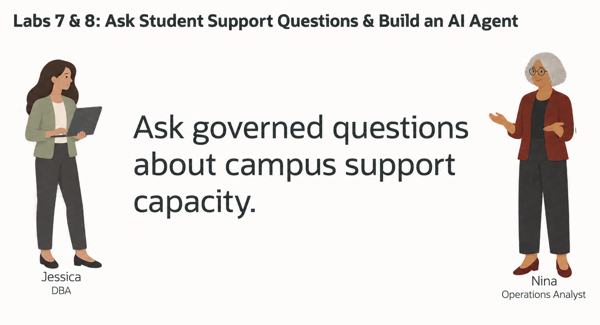
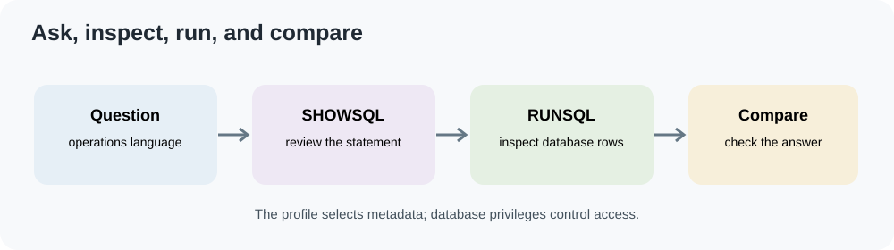

# Ask Student-Success Questions with Select AI

## Introduction



Nina Patel is a student-success operations analyst at Seer Higher Education. She needs clear answers about program and campus service capacity, but she does not want every question to start with finding table names and writing joins.

Jessica has prepared the `GENAI` Select AI profile for a small set of aggregate Higher Education views. Nina can ask a question in ordinary language, inspect the SQL Select AI generates, and run it after checking that it matches the question.



<details>
<summary><strong>Key terms: Select AI, AI profile, and generated SQL</strong></summary>

> - **Select AI** lets a database user ask natural-language questions about approved database objects.
> - An **AI profile** identifies the provider and the schema objects available for those questions.
> - **Generated SQL** is the statement Select AI creates from a question. Review it before relying on its result.

</details>

### Objectives

- Check the Select AI profile available to the workshop schema.
- Limit the profile to approved aggregate views.
- Generate SQL from a Higher Education operations question and inspect it.
- Run and refine a question with `DBMS_CLOUD_AI.GENERATE`.
- Explain why a generated answer still needs review.

Estimated Time: **10 minutes**

### Hands-on Scenario

| Step | Higher Education focus |
| --- | --- |
| Business Problem | Nina needs answers about student-support workload and campus capacity. |
| Technical Challenge | Natural-language questions must map to a narrow, governed set of views. |
| Persona Focus | You follow Nina as she checks, reviews, and improves a question. |
| What You Will See | A question becomes SQL that can be inspected and run in the database. |
| Database Capability | Select AI, `DBMS_CLOUD_AI`, AI profiles, and natural-language-to-SQL generation. |
| Outcome | Nina can ask operational questions while keeping the generated SQL visible. |

> **SQL Worksheet reminder:** Run the statements as `LLUSER`. The workshop setup provides an enabled `GENAI` profile.

## Task 1: Check the Select AI profile

1. Check the profile status:

    ```sql
    <copy>
    SELECT profile_name,
           status,
           description
    FROM user_cloud_ai_profiles
    ORDER BY profile_name;
    </copy>
    ```

2. Review profile attributes without displaying or copying credentials:

    ```sql
    <copy>
    SELECT profile_name,
           attribute_name
    FROM user_cloud_ai_profile_attributes
    WHERE profile_name = 'GENAI'
    ORDER BY attribute_name;
    </copy>
    ```

The profile should be enabled. The workshop setup restricts its `object_list` to approved summary views. In the next task, reapply and inspect that boundary.

## Task 2: Limit the profile to approved views

Nina's questions are about aggregate support workload and campus capacity. The profile uses three summary views rather than student-level records. Reapplying the same list lets you verify which objects Select AI can use.

1. Set the profile's object list:

    ```sql
    <copy>
    BEGIN
      DBMS_CLOUD_AI.SET_ATTRIBUTE(
        profile_name    => 'GENAI',
        attribute_name  => 'object_list',
        attribute_value => '[{"owner":"' || USER || '","name":"PROGRAM_SUPPORT_OVERVIEW_V"},' ||
                           '{"owner":"' || USER || '","name":"CAMPUS_SUPPORT_CAPACITY_V"},' ||
                           '{"owner":"' || USER || '","name":"COURSE_SECTION_CAPACITY_V"}]'
      );
    END;
    /
    </copy>
    ```

2. Confirm the approved object list:

    ```sql
    <copy>
    SELECT profile_name,
           attribute_name,
           attribute_value
    FROM user_cloud_ai_profile_attributes
    WHERE profile_name = 'GENAI'
      AND attribute_name = 'object_list';
    </copy>
    ```

The profile helps Select AI choose relevant metadata. Database privileges remain the control over which objects the session can read.

## Task 3: Ask a question and inspect the SQL

Nina asks which programs have the most open tutoring requests. She starts with `showsql` so she can review the generated statement before it runs.

```sql
<copy>
SELECT DBMS_CLOUD_AI.GENERATE(
         prompt       => 'Which five programs have the most open tutoring requests this term? Include the campus, program, term, and request count.',
         profile_name => 'GENAI',
         action       => 'showsql'
       ) AS generated_sql;
</copy>
```

Check that the SQL uses the approved aggregate view, filters open tutoring requests for the intended term, and returns the requested columns. A valid-looking query can still misread the question.

## Task 4: Run the reviewed question

After reviewing the generated SQL, Nina asks Select AI to run the same question:

```sql
<copy>
SELECT DBMS_CLOUD_AI.GENERATE(
         prompt       => 'Which five programs have the most open tutoring requests this term? Include the campus, program, term, and request count.',
         profile_name => 'GENAI',
         action       => 'runsql'
       ) AS answer;
</copy>
```

Compare the answer with a direct SQL result from the approved view:

```sql
<copy>
SELECT campus_name,
       program_name,
       term_code,
       open_tutoring_requests
FROM program_support_overview_v
ORDER BY open_tutoring_requests DESC, program_name
FETCH FIRST 5 ROWS ONLY;
</copy>
```

The database result is the evidence Nina can inspect. The generated response is useful only when it answers the question and matches the view data.

## Task 5: Refine the question

Nina also wants a campus-capacity view. Use `showsql` for this question:

```sql
<copy>
SELECT DBMS_CLOUD_AI.GENERATE(
         prompt       => 'At Harbor Campus, which support centers are above 80 percent of current load? Include center type, current load, weekly capacity, and open requests.',
         profile_name => 'GENAI',
         action       => 'showsql'
       ) AS generated_sql;
</copy>
```

Review the generated SQL, then run the question with `runsql`:

```sql
<copy>
SELECT DBMS_CLOUD_AI.GENERATE(
         prompt       => 'At Harbor Campus, which support centers are above 80 percent of current load? Include center type, current load, weekly capacity, and open requests.',
         profile_name => 'GENAI',
         action       => 'runsql'
       ) AS answer;
</copy>
```

A more specific question names the campus, threshold, and fields Nina needs. She still checks the SQL and compares the result with `CAMPUS_SUPPORT_CAPACITY_V`.

## Task 6: Explain the result

Select AI can ask the configured provider to summarize a query result. Use this only for data approved for that provider.

```sql
<copy>
SELECT DBMS_CLOUD_AI.GENERATE(
         prompt       => 'Summarize the five programs with the most open tutoring requests this term. State the request count and campus for each program.',
         profile_name => 'GENAI',
         action       => 'narrate'
       ) AS explanation;
</copy>
```

Check the explanation against the SQL result. The narrative is a convenience; the database rows and reviewed SQL remain the evidence.

## Conclusion: Ask, inspect, and refine

Nina used Select AI to turn an operations question into SQL, inspect the statement, run it, and refine the requested details. The profile limits the metadata available to the generation step, and the SQL remains visible for review.

## Acknowledgements

* **Author** - Linda Foinding
* **Last Updated** - October 2026
